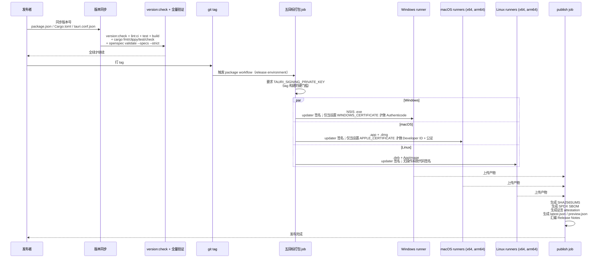

# 发布

打包目标、签名凭据、版本同步与 updater 产物。

测试分层见[测试](testing.md)。

> **适用范围**：当前稳定线（v1.5.0）与 `main`。下文的签名状态是 `.github/workflows/package.yml` **当前**强制执行的状态；计划中的操作系统签名阶段单独放在文末,避免把将来时读成现在的保证。

## 发布流程

发布是一次跨三个操作系统、五个矩阵目标的同步打包。版本号在 `package.json`、`src-tauri/Cargo.toml`、`src-tauri/tauri.conf.json` 三处必须一致,由 `version:check` 守护。

发布要点：

- **版本同步**：`package.json`、`src-tauri/Cargo.toml`、`src-tauri/tauri.conf.json` 三处版本号必须一致；`scripts/check-version-sync.mjs` 做交叉校验,`version:unit:test` 是其单元测试。
- **全量验证先行**：打 tag 前必须跑通 `AGENTS.md` 末尾的全部校验命令,外加 `version:check`。
- **实际发布的产物矩阵**：Windows x64（NSIS `.exe`）、macOS x64 与 arm64（`.dmg`,updater 载荷为 `.app.tar.gz`）、Linux x64 与 arm64（`.deb` 与 AppImage）。不发布 `.msi`、`.rpm`,也**不发布 Windows ARM64 包**;`package.json` 为何仍有 Windows ARM64 辅助脚本见[发布相关脚本](#发布相关脚本)。
- **publish 产物清单**：`SHA256SUMS`（逐文件 sha256,并校验无重复哈希）、SPDX SBOM、GitHub 构建溯源与 SBOM 证言、updater 清单（稳定版 `latest.json`,预览版 `preview.json`）、Release Notes。
- **updater 签名是唯一的签名硬门槛**：tag 构建中 `TAURI_SIGNING_PRIVATE_KEY` 为空时 workflow 直接失败。密钥属于受保护的 `release` environment,绝不放入仓库配置或截图。手动（非 tag）演练运行改为在 runner 上生成临时密钥,该路径不产生可分发的更新签名。
- **签名凭据隔离**：签名凭据只在 CI 受保护环境注入,正常本地打包命令不含 `desktop-e2e` feature,也不接触签名密钥。

## 当前签名状态（updater-only 第一阶段）

| 证据 | Windows x64 | macOS x64 / arm64 | Linux x64 / arm64 |
| --- | --- | --- | --- |
| Tauri updater 签名（`.sig`） | 必需 | 必需（签在 `.app.tar.gz` 上） | 必需 |
| `SHA256SUMS`、SPDX SBOM、GitHub 证言 | 发布 | 发布 | 发布 |
| 操作系统代码签名 | **未做 Authenticode 签名** | **未做 Developer ID 签名、未公证、未 staple** | 不适用 |
| 用户侧表现 | SmartScreen 可能告警 | 清除 quarantine 属性前 Gatekeeper 可能提示"已损坏" | 无 |

workflow 里已经有两条与提供商无关的操作系统签名步骤（Windows 走 `Import-PfxCertificate` + `signtool`,macOS 走 `codesign --verify` + `stapler validate` + `spctl --assess`）,但分别以 `env.WINDOWS_CERTIFICATE != ''` 与 `env.APPLE_CERTIFICATE != ''` 守卫。这些 secret 尚未在 `release` environment 上配置,因此步骤被跳过,非预发布 tag 会改为打印显式的未签名声明。校验和、SBOM 与证言证明完整性与来源,不能替代操作系统信任。

稳定版 Release Notes（`.github/STABLE_RELEASE_NOTES.md`）与三份 README 陈述同一状态;`scripts/release-policy.node-test.mjs` 与 `scripts/docs-facts.node-test.mjs` 会在任一表面与 workflow 漂移时失败。

打包与签名细节见 `src-tauri/ARCHITECTURE.md` 与 [发布签名指南](../../../release-signing.md);CI 编排见 `.github/workflows/ci.yml` 与 `.github/workflows/package.yml`。

## 发布相关脚本

- **本地打包辅助脚本**：`package.json` 定义了 6 个：`package:windows:{x64,arm64}`、`package:macos:{x64,arm64}`、`package:linux:{x64,arm64}`,每个先执行 `sidecar:prepare -- --release --target=...`。它们是本地便利脚本,**不是**发布矩阵：`package.yml` 的 GitHub Actions 矩阵是 5 项（Windows x64、macOS x64、macOS arm64、Linux x64、Linux arm64）,v1.5.0 的 Release 资产与这 5 项一致。`package:windows:arm64` 只用于本地实验;要把 Windows ARM64 列为发布目标,须先补 workflow 矩阵项、冒烟验证、Release Notes 与资产校验。
- **版本同步**：`scripts/check-version-sync.mjs` 要求三处（package.json/Cargo.toml/tauri.conf.json）版本一致,`version:unit:test` 是其单元测试。
- **签名凭据**：受保护的 `release` environment 由 `github.ref_type=='tag'?'release':'build-preview'` 选定。updater 用 `TAURI_SIGNING_PRIVATE_KEY`（及其密码）生成 `createUpdaterArtifacts`,公钥内嵌 tauri.conf.json。Windows（`WINDOWS_CERTIFICATE`、`WINDOWS_CERTIFICATE_PASSWORD`、`WINDOWS_SIGNER_SUBJECT`）与 Apple（`APPLE_CERTIFICATE`、`APPLE_CERTIFICATE_PASSWORD`、`APPLE_SIGNING_IDENTITY`、`APPLE_ID`、`APPLE_PASSWORD`、`APPLE_TEAM_ID`）凭据只在存在时转发,当前不是必需项;完整分组见发布签名指南的 secret 清单。
- **发布策略测试**：`npm run release:unit:test`（`scripts/release-policy.node-test.mjs`）对照 workflow 文件断言五目标矩阵、updater 密钥缺失即失败,以及稳定版 Notes 的签名声明。

## 第二阶段（计划中）：操作系统签名

该阶段**尚未**落地。启用时的计划如下：

- Windows：配置托管证书或 key-vault 提供商,设置三个 `WINDOWS_*` secret,把现有 `signtool` 步骤与发布者/时间戳校验变为非预发布 tag 的硬门槛。
- macOS：配置 Developer ID 凭据与 app 专用密码,设置六个 `APPLE_*` secret,由 Tauri bundler 完成签名与公证,并把 `stapler validate` 与 `spctl --assess` 变为硬门槛。
- 在同一次变更中更新 `.github/STABLE_RELEASE_NOTES.md`、README 签名段、发布签名指南与 `scripts/release-policy.node-test.mjs`,确保没有任何表面在 workflow 强制之前宣称已签名。
