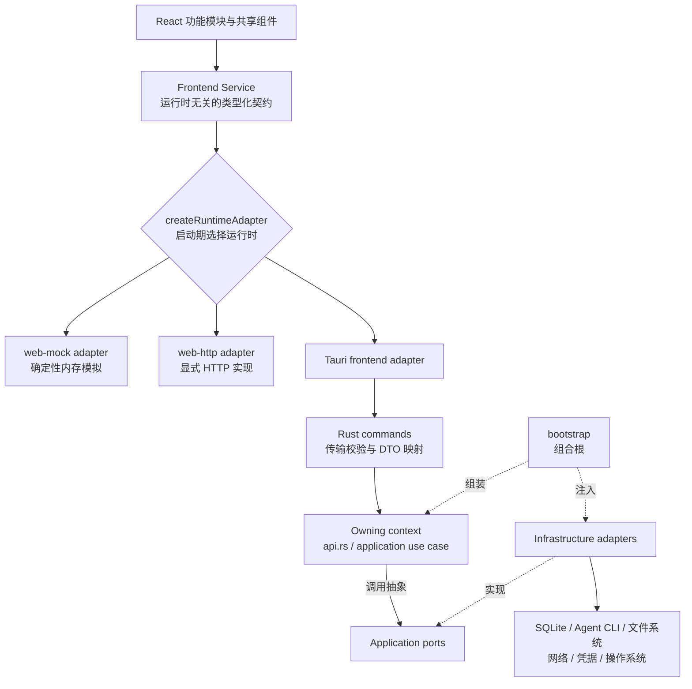
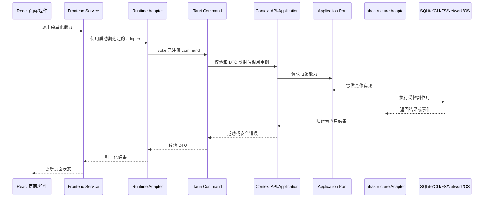

# 仓库结构与模块导览

VaneHub AI 是一个以桌面端为主的 AI 编程 Agent 工作台。它使用同一套 React 界面承载多个前端运行时，并由 Tauri 2 + Rust 提供本地进程、SQLite、文件系统、网络与桌面生命周期能力。

本章只解决三个问题：

1. 第一次进入仓库应该先看哪里；
2. 一项改动应该放到哪个目录和边界；
3. 如何从 React 页面一路追踪到 Rust、SQLite、Agent CLI 或其他外部能力。

完整的运行时选择规则见[运行时与服务边界](runtime-boundaries.md)，完整的 Native 上下文所有权见[Native 限界上下文](native-contexts.md)。本章不重复维护易漂移的上下文数量、命令清单和内建项数量。

## 权威来源与阅读顺序

仓库中不同文档承担不同职责。发生冲突时，按下表判断应该以谁为准。

| 要回答的问题 | 权威来源 |
| --- | --- |
| 贡献规则、禁止事项、提交前校验命令 | [`AGENTS.md`](../../../../AGENTS.md) |
| 强制架构规则、完整 bounded context 清单 | [`openspec/project.md`](../../../../openspec/project.md) |
| 已实现的 Native 模块清单、迁移状态与 ADR | [`src-tauri/ARCHITECTURE.md`](../../reference/native-architecture.md) |
| 已确认的产品行为 | `openspec/specs/` |
| 尚在实施的变更设计与任务证据 | `openspec/changes/<change-name>/` |
| 帮助贡献者理解代码的解释性材料 | 本开发者指南 |
| 最终实现细节 | 源码、测试与生成的 [Native API 参考](native-api-reference.md) |

第一次参与开发时，建议按以下顺序阅读：

1. 本章：先建立仓库坐标；
2. [运行时与服务边界](runtime-boundaries.md)：理解 `tauri`、`web-http` 与 `web-mock`；
3. [Native 限界上下文](native-contexts.md)：确认业务所有权；
4. 涉及数据时再读[持久化所有权](persistence-ownership.md)；
5. 开始实现前阅读 [OpenSpec 工作流](openspec-workflow.md)与根目录 `AGENTS.md`。

## 一分钟理解总体架构



需要先记住四条边界：

- React 组件可以依赖其他组件、Hook、类型和工具，但访问运行时副作用时必须经过 frontend service，不能直接调用 Tauri `invoke()`。
- 前端运行时由 `createRuntimeAdapter` 在启动路径选择；`web-mock` 不能伪装成本地进程、SQLite 或操作系统动作已经发生。
- Tauri command 是入站传输适配器，不是业务服务；业务规则归拥有该能力的 bounded context。
- 跨 context 调用只能经过对方发布的 `api.rs` facade、不可变契约或显式事件，不能导入对方的 repository 或 infrastructure。

## 仓库根目录

```text
vanehub-ai/
├─ src/                              # React 前端
├─ src-tauri/                        # Tauri 主应用与 Rust Native runtime
├─ crates/vanehub-permission-hook/   # Claude Code PreToolUse hook sidecar
├─ openspec/                         # 主规范、变更包与归档证据
├─ docs/                             # 用户指南、开发者指南与技术参考
├─ tests/                            # 跨层 E2E、桌面、文档与 fixture
├─ scripts/                          # 构建、生成、校验、测试与发布脚本
├─ public/                           # 前端静态资源
├─ .github/                          # CI、发布和仓库自动化
├─ AGENTS.md                         # 统一贡献入口与校验命令真源
├─ package.json                      # Node、前端、文档和测试脚本入口
└─ Cargo.toml                        # Rust workspace 根配置
```

| 路径 | 主要职责 | 通常在什么情况下进入 |
| --- | --- | --- |
| `src/` | React 页面、功能模块、共享 UI、frontend service 与运行时适配器 | 页面、交互、前端契约或 adapter 发生变化 |
| `src-tauri/` | 主 Tauri 应用、Rust modular monolith、Tauri 配置与桌面资源 | SQLite、CLI、文件、网络、系统集成或 Native 业务逻辑发生变化 |
| `crates/vanehub-permission-hook/` | 独立 Rust 二进制，桥接 Claude Code `PreToolUse` 权限请求 | 修改 Claude Code Hook 输入输出协议或 sidecar 打包链路 |
| `openspec/specs/` | 已确认行为的唯一规范来源 | 查询当前必须满足的行为 |
| `openspec/changes/` | proposal、design、delta specs、tasks 与归档 | 新功能、架构调整或行为变更 |
| `docs/` | 面向用户、贡献者和 Agent Infra 学习者的文档 | 行为、操作步骤、架构说明发生变化 |
| `tests/` | 需要跨模块或真实运行时才能验证的测试 | Web E2E、桌面 E2E、文档和专项场景 |
| `scripts/` | 生成器、架构检查、桌面测试编排、文档构建与发布辅助 | 不要在业务代码里复制已有工程流程 |
| `.github/` | CI、平台矩阵、发布与安全自动化 | 本地与 CI 行为不一致，或修改发布流程 |

根目录中的 `.claude/`、`.codex/skills/`、`.superpowers/` 等目录服务于仓库级 AI 编程工作流，不属于 VaneHub AI 产品运行时。

## 前端代码地图

### 启动入口与页面组织

| 路径 | 职责 |
| --- | --- |
| `src/main.tsx` | React 启动入口；选择主窗口、浮动助手或区域截图 surface，并处理启动失败上报 |
| `src/App.tsx` | 顶层 Provider、路由和主应用壳层 |
| `src/main-layout/` | 主窗口布局、导航与工作区路由 |
| `src/session-workspace/` | 会话工作区及其主要交互面 |
| `src/settings/` | 设置壳层和各设置页面 |
| `src/loop-center/`、`src/goal-center/`、`src/work-board/` | Loop、目标和任务看板功能切片 |
| `src/evaluation-center/`、`src/mission-control/`、`src/system-activity/` | 评测、运行控制和系统活动功能切片 |
| `src/floating-assistant/`、`src/region-capture/` | 独立桌面 surface |
| `src/notifications/` | 通知状态、桥接与展示 |

功能目录按用户能力组织，不等同于 Native bounded context。一个设置页面可能同时调用 `desktop`、`tooling`、`permissions` 等多个 Native context；代码所有权不能仅凭页面名称判断。

### 共享层与运行时边界

| 路径 | 职责 |
| --- | --- |
| `src/components/` | 可复用 UI 与通用展示组件 |
| `src/hooks/` | 共享 React Hook |
| `src/theme/`、`src/styles.css` | 主题、语义样式 token 与全局样式 |
| `src/i18n/` | 语言注册、资源加载与翻译一致性 |
| `src/types/`、`src/contracts/` | 跨功能复用的 TypeScript 类型与稳定契约 |
| `src/services/` | frontend service 契约、service factory，以及多数 Tauri/Web 运行时 client |
| `src/adapters/` | 从 service 中拆出的专用前端适配器；当前主要承载 Skill Curator 相关实现 |
| `src/generated/` | 生成的前端工件；修改前先定位对应生成器或权威输入 |
| `src/test/`、`src/testing/` | 前端测试辅助设施和共享 fixture |

`src/services/` 是组件访问运行时能力的边界，而不是组件唯一可以导入的目录。组件仍然可以依赖共享组件、Hook、类型与纯函数；禁止的是绕过 service 边界直接触发宿主副作用。

### 如何追踪一条前端调用

按下面的顺序查找，通常可以快速定位完整链路：

1. 从 `src/App.tsx`、路由或具体功能目录找到页面和事件处理器；
2. 查看组件导入的 `*Service`、`runtime-*-client` 或 service factory；
3. 在 `src/services/runtime-adapter.ts` 确认运行时选择；
4. 分别检查 `tauri`、`web-http` 和 `web-mock` 实现是否保持同一契约；
5. Tauri 路径继续搜索 adapter 中的 command 名称；
6. Web 路径确认它是真实 HTTP 调用还是明确的确定性模拟；
7. 检查同目录单元测试和 adapter conformance/parity 测试。

## Native 代码地图

VaneHub AI 的主 Tauri runtime 是一个按领域拆分的 Rust modular monolith。根 `Cargo.toml` 同时把主应用和权限 Hook sidecar 组织成 Cargo workspace。

```text
src-tauri/src/
├─ main.rs               # 极薄的二进制入口
├─ lib.rs                # 模块暴露并委托 bootstrap::run()
├─ bootstrap/            # 唯一组合根：选择并注入具体实现
├─ commands/             # Tauri 入站适配器与 command registry
├─ contexts/             # bounded contexts：领域、应用与自有基础设施
├─ platform/             # 可复用的外层技术适配器
├─ test_support/         # Native 测试辅助设施
└─ *_tests.rs            # 跨模块契约、迁移和生命周期测试
```

| 路径 | 可以做什么 | 不应该做什么 |
| --- | --- | --- |
| `main.rs`、`lib.rs` | 启动委托与模块暴露 | 放业务规则、SQL、进程构造或用例编排 |
| `bootstrap/` | 创建 repository、gateway、service，按显式顺序装配依赖 | 充当业务服务或被 domain/application 反向依赖 |
| `commands/` | 校验传输输入、映射 DTO、调用已装配 API、映射安全错误、发送接口级事件 | 写 SQL、启动进程、决定领域策略 |
| `contexts/<context>/domain/` | 实体、值对象、不变量、领域错误与领域事件 | 依赖 Tauri、SQLite、文件系统、网络或其他 context 私有实现 |
| `contexts/<context>/application/` | 用例编排、输入输出模型与消费侧 ports | 依赖具体 I/O adapter 或 Tauri state |
| `contexts/<context>/infrastructure/` | 实现 SQLite、进程、文件、网络、凭据等 application port | 定义业务不变量 |
| `contexts/<context>/api.rs` | 发布窄而稳定的进程内 facade | 暴露 repository、数据库行或基础设施实现 |
| `platform/` | 数据库连接与迁移编排、进程安全、文件系统、网络、凭据、时钟、ID、日志落盘等通用技术能力 | 承担某个业务 context 的领域所有权 |

典型 context 结构如下，但空层不会为了形式完整而提前创建：

```text
contexts/<context>/
├─ domain/
├─ application/
│  └─ ports/
├─ infrastructure/
└─ api.rs
```

完整 context 清单及职责只在[Native 限界上下文](native-contexts.md)与 `openspec/project.md` 维护。本章故意不复制清单，避免新增 context 后出现第二份过期地图。

## Tauri 配置与非源码目录

| 路径 | 职责 |
| --- | --- |
| `src-tauri/capabilities/` | Tauri capability 与权限边界 |
| `src-tauri/resources/` | 随桌面应用分发的资源和 sidecar 相关工件 |
| `src-tauri/evaluation-fixtures/` | Native 评测 fixture |
| `src-tauri/gen/schemas/` | Tauri 生成的 schema |
| `src-tauri/tests/` | 独立 Native 集成测试 |
| `src-tauri/tauri.conf.json` | 常规桌面构建配置 |
| `src-tauri/tauri.sidecar.conf.json` | 包含 sidecar 的开发和打包配置 |
| `src-tauri/tauri.desktop-e2e.conf.json` | 仅用于真实桌面 E2E 的测试配置 |

修改这些目录时，需要同时检查打包脚本、平台矩阵和对应测试，不能只验证当前操作系统。

## 规范、文档、测试与工程自动化

### OpenSpec

```text
openspec/
├─ project.md                         # 项目级强制规则
├─ specs/                             # 已确认的主规范
└─ changes/
   ├─ <active-change>/                # 活跃变更包
   └─ archive/                        # 已完成且不可直接修改的历史证据
```

新功能或架构调整应先确认现有主规范，再创建或更新 change package。具体流程见 [OpenSpec 工作流](openspec-workflow.md)。

### 文档

| 路径 | 面向对象 |
| --- | --- |
| `docs/user-guide/` | 产品使用者 |
| `docs/developer-guide/` | 贡献者与维护者 |
| `docs/agent-infrastructure/` | Agent Infra 技术学习与参考 |
| `docs/provider-sdk/` | Provider SDK 集成者 |

解释性文档不应复制易变化的命令数量、context 数量、内建 Skill 数量或测试层数量。需要完整清单时，应链接到被源码或 CI 校验的权威文件。

### 测试

测试既与源码共置，也存在于根 `tests/`：

| 位置 | 主要覆盖 |
| --- | --- |
| `src/**/*.test.ts(x)` | TypeScript 契约、纯逻辑、组件与 adapter 一致性 |
| `src-tauri/src/**/*tests*.rs` | domain、application、infrastructure、command、架构与迁移 |
| `tests/e2e/` | Playwright Web/mock 用户路径 |
| `tests/desktop/` | 真实 Tauri 桌面运行时 |
| `tests/e2e-local-media/` | 本地媒体专项 E2E |
| `tests/docs/` | 文档构建与页面行为 |
| `tests/fixtures/` | 跨测试共享 fixture |

测试层级、适用范围和平台证据规则见[测试](testing.md)。校验命令不要在本章再抄一份，始终以根目录 `AGENTS.md` 为准。

### Scripts 与 CI

`scripts/` 包含架构检查、代码生成、OpenSpec 索引、文档构建、桌面测试编排、覆盖率、迁移检查和发布辅助工具；`.github/workflows/` 负责在 CI 中组合这些入口。

遇到“本地通过但 CI 失败”时，应先比较 `package.json`、根 `Cargo.toml`、`AGENTS.md` 与对应 workflow，而不是新增一条绕过脚本。

## 一项改动应该放在哪里

| 需求类型 | 首要位置 | 通常还要同步检查 |
| --- | --- | --- |
| 只改变页面展示或交互 | 对应 `src/<feature>/` | `src/components/`、`src/i18n/`、共置测试、Playwright |
| 新增前端运行时能力 | `src/services/` 的类型化契约 | Tauri、Web/mock，以及适用时的 Web/HTTP adapter 与 conformance 测试 |
| 新增 Native 业务规则 | 拥有该能力的 `contexts/<context>/domain` 或 `application` | `api.rs`、command DTO、测试、OpenSpec |
| 新增 Tauri command | `src-tauri/src/commands/<context>/` | command registry、frontend Tauri adapter、DTO 映射测试 |
| 新增 SQLite 表或字段 | owning context 的 infrastructure/migration | 全局迁移顺序、升级 fixture、事务边界、持久化所有权文档 |
| 调用进程、网络、文件或凭据 | application port + infrastructure adapter | `platform/` 是否已有可复用安全实现、超时、取消、脱敏日志 |
| 跨 context 协作 | 消费对方发布的 `api.rs`、不可变契约或事件 | 禁止导入对方 repository/infrastructure；在 bootstrap 装配 |
| 长耗时操作 | owning context application + `operations` 契约 | 稳定 operation id、进度、终态、取消、日志关联和 Web/mock 异步语义 |
| 新增 bounded context | `openspec/project.md` 与 `src-tauri/src/contexts/` | `native-contexts.md`、架构检查、bootstrap、命令和持久化所有权 |
| 修改 Claude Code 权限 Hook | `permissions` context 与 `crates/vanehub-permission-hook/` | sidecar 构建、Tauri 资源、Hook 协议测试与打包 |
| 修改文档 | 对应 `docs/` 章节 | 链接、截图、生成参考与文档测试 |

## 从页面追踪到 Native 的实用路径

以一个需要真实本地能力的操作为例，推荐按下面的顺序追踪：



具体排查步骤：

1. 在页面事件处理器中找到调用的 service 方法；
2. 在 service factory 中确认当前 runtime adapter；
3. Tauri 路径搜索 command 字符串，并在 `commands/registry.rs` 确认注册；
4. 打开对应 command 文件，确认它只做校验、映射和调用；
5. 沿 context 的 `api.rs` 进入 application use case；
6. 查看 use case 依赖的 port，再从 `bootstrap/` 找到具体 infrastructure 实现；
7. 涉及持久化时，确认表和迁移归 owning context；
8. 涉及长耗时执行时，确认 operation、日志、取消和终态证据；
9. 回到前端检查 Web/mock 与 Web/HTTP 是否保持契约或明确 fail-closed；
10. 最后按[测试](testing.md)选择能够证明该边界的最小测试，再执行 `AGENTS.md` 的完整校验。

## 常见错误方向

- 在 React 组件中直接导入 `@tauri-apps/api/core` 并调用 `invoke()`；
- 把 SQL、进程启动或权限决策写进 Tauri command；
- 让 application 依赖具体 repository、Tauri state 或平台实现；
- 从一个 context 导入另一个 context 的 `infrastructure`、repository 或私有 aggregate；
- 让 Web/mock 返回“CLI 已执行”“数据库已写入”之类的虚假成功；
- 为了少改一个 adapter 而破坏 frontend service 契约一致性；
- 在本章复制完整 context、command、内建项或测试层清单，形成第二个漂移源；
- 只运行当前平台测试，就把结果外推为 Windows、macOS 与 Linux 全部通过。

## 继续阅读

| 接下来要理解的内容 | 章节 |
| --- | --- |
| 三种前端运行时如何选择，adapter 如何保持一致 | [运行时与服务边界](runtime-boundaries.md) |
| 每个 Native context 拥有什么，如何跨 context 调用 | [Native 限界上下文](native-contexts.md) |
| SQLite、迁移、连接池和表所有权 | [持久化所有权](persistence-ownership.md) |
| Agent、provider、generation 生命周期 | [Agent 生命周期与 provider 运行时](agent-lifecycle.md) |
| 测试层级、桌面证据与平台适用范围 | [测试](testing.md) |
| proposal、design、delta specs、tasks 与归档 | [OpenSpec 工作流](openspec-workflow.md) |
| 完整 Native facade 与模块参考 | [Native API 参考](native-api-reference.md) |
