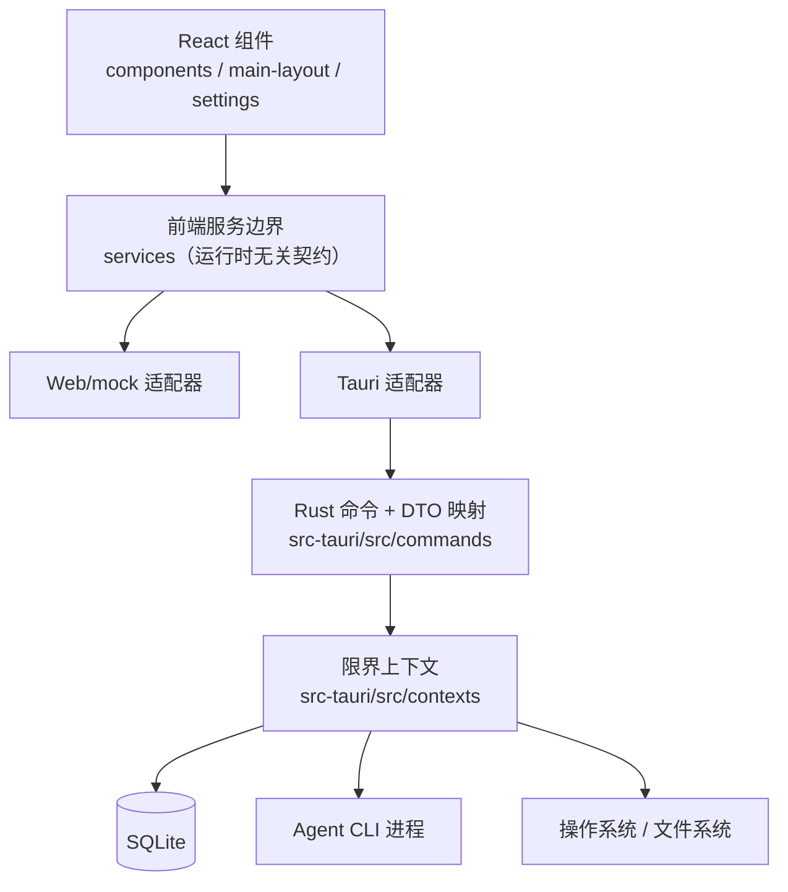
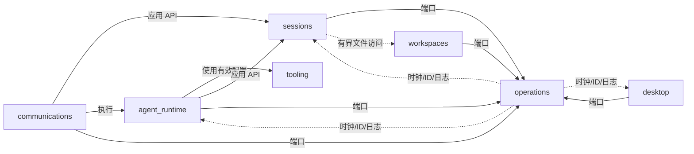
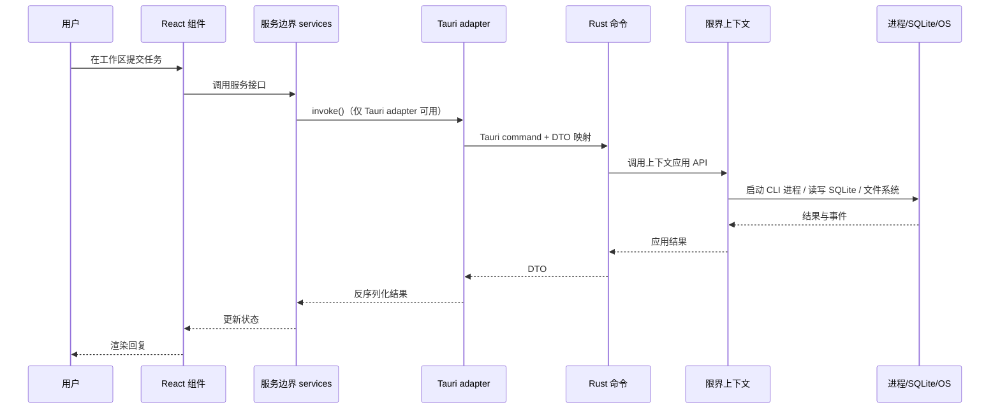

# 仓库结构与模块导览

VaneHub AI 是一套 React 应用，运行在两个运行时适配器之后——桌面端（Tauri）和浏览器预览（Web/mock）。前端通过服务边界与 native 解耦，native 则按限界上下文（bounded context）切分。本章把仓库布局、各模块职责与调用关系讲清楚。

## 总体分层

**关键约束**：React 组件只依赖 `src/services/` 的服务接口，**禁止直接调用 Tauri `invoke()`**。Tauri 专属调用只出现在 frontend Tauri adapter；SQLite、CLI 进程、文件系统访问与桌面生命周期行为都位于 Rust 侧。

## 重要根目录

| 路径 | 职责 |
| --- | --- |
| `src/components`, `src/main-layout`, `src/settings` | React 展示与交互层 |
| `src/services` | 前端运行时无关的契约与适配器（组件唯一允许依赖的一层） |
| `src/hooks` | 自定义 React hook |
| `src/types`, `src/contracts` | 与传输无关的 TypeScript 契约 |
| `src/i18n` | 界面多语言资源与加载 |
| `src-tauri/src/commands` | 薄的 Tauri 命令与 DTO 映射边界，按功能域分组 |
| `src-tauri/src/contexts` | native 领域、应用与基础设施归属（限界上下文） |
| `src-tauri/src/platform` | 共享的平台适配器：数据库、进程、日志、时钟、ID |
| `src-tauri/src/bootstrap` | 组合根：Tauri builder、app-data 解析、上下文装配顺序 |
| `openspec/specs` | 已确认的行为需求（规范唯一真源） |
| `openspec/changes` | 活跃与已归档的变更证据 |
| `tests/e2e` | Playwright 用户可见的回归路径 |

> 从 `AGENTS.md` 和 `openspec/project.md` 开始。它们是规范性贡献者规则，优先于本指南中的解释性示例。

## Native 限界上下文

native 侧按核心限界上下文切分,下图展示主要的七个上下文;`retrieval` 同样是核心上下文(见 [Native bounded context](native-contexts.md))。仓库还包含后续扩展的上下文,如 `code_intelligence`、`permissions`、`execution_observability`、`artifacts`、`goals`、`task_orchestration`、`work_board`、`ssh_connections`、`browser_automation`、`cli_delegation`、`code_execution`、`web_research` 等(完整清单见 `src-tauri/src/contexts/mod.rs` 与 [`src-tauri/ARCHITECTURE.md`](../../reference/native-architecture.md))。**跨上下文调用默认走同步的应用 API**;只有当一个已完成的动作需要独立处理下游反应时才用显式事件。**任何上下文都不得直接伸手到另一上下文的存储或基础设施**。

实线箭头是上下文间的依赖方向，虚线表示 `operations` 为所有上下文提供共享的时钟、ID 与统一日志能力。

| 上下文 | 发布的职责 | 上游依赖 | 下游消费者 |
| --- | --- | --- | --- |
| `agent_runtime` | Agent 目录、工作流选择、就绪判定、provider 调用、生成生命周期 | `tooling` 的有效 CLI/提示词配置、`sessions` 应用 API、`operations` 端口 | Tauri 命令、`communications` 入站执行 |
| `sessions` | 会话/消息/分类/配置生命周期、导出、维护、用量读模型 | `operations` 端口、有界的 `workspaces` 文件访问 | Tauri 命令、`agent_runtime`、`communications` |
| `workspaces` | 项目、远程工作区、worktree、文件/Git 检查、PTY shell | `operations` 端口 | Tauri 命令、`sessions` 有界文件读取 |
| `tooling` | CLI、MCP、SDK、扩展、插件、Skill、Prompt Hook 子域 | `operations` 端口与平台适配器 | Tauri 命令、`agent_runtime` 发布的配置 API |
| `communications` | IM 配置、凭据、传输、路由、授权、投递 | `sessions` 与 `agent_runtime` 发布的 API、`operations` 端口 | Tauri 命令与连接器传输 |
| `desktop` | 设置、路径、启动、网络代理偏好、窗口/托盘/浮动助手生命周期 | `operations` 端口与平台适配器 | Tauri bootstrap 与命令 |
| `operations` | 可观测任务、统一诊断/操作日志契约 | 平台时钟/ID 与统一日志实现 | 每个上下文 |

### agent_runtime

**Agent 运行时**——native 侧最核心的上下文。负责 Agent 目录与可用性、工作流选择与会话就绪、provider 调用、生成（generation）的生命周期管理。

- `domain`：Agent 身份/目录、启动元数据、交互模式、可用性评估、工作流选择/就绪/生命周期、生成流转不变量
- `application`：Agent 注册/查询/选择/就绪/会话详情/启动/消息/停止等用例
- `infrastructure`：Agent/模式/能力与工作流的 SQLite 行映射、稳定的注册表种子、SDK/可执行文件可用性事实、provider 命令构造与输出事件解析、每会话的生成预约与子进程所有权监控
- `api.rs`：发布应用外观（Agent 查询、工作流、就绪、启动、消息、停止），供命令层与 `communications` 调用，**不暴露仓储或基础设施**

### sessions

**会话**上下文。管理会话、消息、分类、配置的生命周期，以及导出、维护和用量读模型。

- `domain`：会话/消息/分类身份与聚合、所有权/激活、生命周期/置顶/归档规则、有界文件引用、聊天配置不变量
- `application`：会话创建/管理、查询/搜索、分类/配置、消息/文件引用、导出、维护、用量等用例
- `infrastructure`：会话/消息/分类/配置/用量的 SQLite 行映射、多表事务协调、CLI 配置默认值
- `api.rs`：会话创建、当前/归档/搜索/激活查询、切换、重命名、置顶/归档/删除、分类、聊天配置、消息持久化/组合、导出、用量、维护的外观

### workspaces

**工作区**上下文。决定 Agent 能看到哪些文件、命令在哪里执行。

- `domain`：项目/远程/worktree/路径规则、有界终端尺寸、平台安全的工作区重置命令
- `application`：项目/历史/worktree、有界查询、shell 生命周期用例
- `infrastructure`：既有表的 SQLite 投影、有界文件系统/Git/日志查询、portable-PTY 生命周期、Tauri 对话框/事件
- `api.rs`：工作区外观，供命令层、生产会话/聊天文件读取、会话清理使用

### tooling

**工具**上下文，是子域最多的一块，覆盖 CLI、MCP、SDK、扩展、插件、Skill、Prompt Hook：

- `cli_parameters`：CLI 参数目录、校验、持久化 API、启动参数投影（被 sessions 与 agent_runtime 消费）
- `mcp/`：MCP 身份、配置不变量、连接语义、管理/连接测试用例、rmcp 进程/网络连接
- `sdk/`：SDK 身份、目录、状态/版本/更新规则、生命周期计划
- `extensions/`：扩展的白名单目录、宿主兼容性、安装漂移、健康对账、启停与移除
- `plugin_integrations/`：内置身份/目录、就绪计划、生命周期状态、认证/缺失/错误分类
- `skills/`：作用域身份、校验的元数据/来源、六个内建、有界挂载路径、绑定/启用计划、漂移分类
- `prompt_hooks/`：Hook 身份/清单、稳定分类/阶段/来源值、确定性排序、托管 CLI 绑定、纯模板插值、七个内建

### communications

**IM 通信**上下文。管理 IM 配置、凭据、传输、路由、授权与投递。

- `domain`：连接器身份/配置、生命周期状态、路由/绑定/去重/检查点身份、QR 授权状态、入站/最终投递策略
- `application`：连接器查询/变更/运行时用例、入站认领/路由编排
- `infrastructure`：附加式 SQLite 迁移、凭据适配器（平台钥匙串）、五种传输适配器（飞书、钉钉、Telegram、企微、微信）、运行时管理与生命周期事件
- `api.rs`：连接器管理、运行时、路由、绑定、去重、微信授权的外观

### desktop

**桌面**上下文。负责设置、路径、启动、网络代理偏好、窗口/托盘/浮动助手生命周期。

- `domain`：强类型设置、浮动助手平台启用、锚点校验、显示器放置、界面过渡、关闭可见性规则
- `application`：设置/环境、浮动助手、托盘初始化、优雅退出等用例
- `infrastructure`：SQLite 设置/浮动仓储、Tauri 窗口/托盘/生命周期、网络代理、日志目录、开机自启等适配器
- `api.rs`：设置/环境、浮动助手、生命周期外观，仅供命令层、bootstrap、生命周期边界调用

### operations

**操作**上下文——所有上下文共享的基础设施。提供可观测任务、统一诊断/操作日志契约，依赖平台时钟/ID 与统一日志实现，**被每个上下文消费**。

## 请求如何穿过各层

一次用户提交从界面到 native 的完整路径：

Web/mock 适配器在同一服务接口下用确定性模拟数据替代 native 调用——**不会启动进程、不写数据库、不碰文件系统**。

## 详细的 native 模块清单

完整的 native 模块清单维护在 [`src-tauri/ARCHITECTURE.md`](../../reference/native-architecture.md) 与仓库源码中。组装好的指南将该已签入的 Markdown 作为参考副本复制，因此它不会与仓库文件发生漂移。
