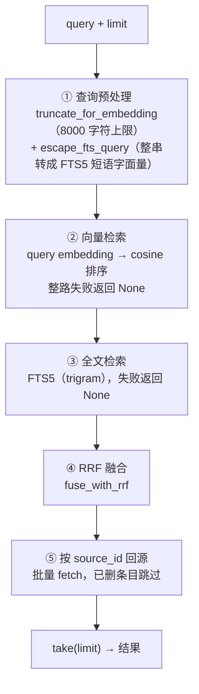

# 检索与向量搜索

`retrieval` 限界上下文拥有**两条相互独立的检索链路**：跨会话记忆召回（`recall` 工具）与工作区代码检索（`search_code` 工具）。两者共享融合算法与降级理念，但数据源、作用域、可用条件与隐私边界完全不同，本章分开描述。共同的铁律：**检索失败绝不导致生成失败**——工具层把不可用转成成功的软结果。

## 两条链路对照

| | 记忆召回（`recall`） | 代码检索（`search_code`） |
| --- | --- | --- |
| 数据源 | `personalization` 兼容视图（active + global + 全 Agent 受众的记忆） | 按工作区划分的代码索引（Tree-sitter 代码块，见 [Tree-sitter 代码索引](tree-sitter-code-indexing.md)） |
| 索引 | 向量 + FTS5，主机级单池 | FTS5 必有，向量仅 semantic 模式确认后 |
| 作用域 | 主机级；收窄过的记忆整体不在池内（见[跨会话记忆](cross-session-memory.md)） | 当前会话的 workspace，由可信运行时隐式确定 |
| 可用条件 | 已配置向量嵌入（否则工具不进目录） | 该工作区索引已启用且 phase 非 `Unavailable` |
| 隐私边界 | 已删记忆在回源时被丢弃，绝不外泄 | 索引与结果全为脱敏后文本 |
| 降级 | `keyword_only` / `vector_only` / 软性"暂不可用" | 同左；local 模式无向量且**不算降级** |

## 记忆召回链路

### 查询流程：五个阶段，顺序执行

`SearchService::search`（`retrieval/application/search_service.rs`）是召回的统一入口。**两条检索路是顺序调用，不是并行执行**——先向量路后关键词路，各自失败互不影响，但它们发生在同一线程上先后进行：

- **① 预处理**：8 000 字符截断**同时作用于两路**——截断后的文本既送嵌入也送 FTS（FTS 侧因整串裹引号会多两个字符）。query 是模型自撰的，不截断会让超长 query 直接压垮嵌入调用；FTS 转义把 `OR`/`NEAR`/`*` 等查询语法全部字面化，防止语义跑偏或语句报错。
- **②③**：每路 over-fetch 至 `limit × 4`；`None` 表示"这一路整体不可用"，空 `Vec` 表示"可用但没命中"——两者语义不同。
- **④**：Reciprocal Rank Fusion 合并两路排序。
- **⑤ 回源**：只按融合后的候选 id 批量回查权威源（绝不做全表快照——有测试钉死这一点），**源记录已删除的 hit 直接丢弃**，这保证已删记忆永不从残留索引行外泄；`take(limit)` 发生在丢弃**之后**，所以已删条目不白占名额。**最终结果数仍可能少于 limit**：候选本身不足，或多条候选的源已消失。

### 降级与错误边界

| 情形 | 类型层 | Agent 工具层 |
| --- | --- | --- |
| 向量路失败（嵌入不可达等） | `degraded = KeywordOnly`，关键词结果兜底 | 成功结果 + `degraded: keyword_only` |
| 关键词路失败 | `degraded = VectorOnly` | 成功结果 + `degraded: vector_only` |
| 两路都可用但都没命中 | `Ok`，空列表，无降级 | 成功结果，空 `results` |
| 两路都失败 | `Err(RetrievalError::Unavailable)` | **成功**结果："Memory search is temporarily unavailable. Continue without it." |
| 未配置嵌入 | `Err(NotConfigured)` | 不会走到——工具根本不在目录里 |

底层用类型化错误区分"搜不了"与"没有"；工具层（`execute_recall`）把除空 query 外的一切错误软化为成功结果——模型绝不能把"搜索失败"误读为"不存在这条记忆"。

### 工具契约与可用性

- `recall` 输入恰好 `query` + `limit`（默认 5，钳制 1–20），无 agent、folder、scope 参数——作用域收窄由存储侧的兼容视图完成，不暴露给模型。
- **嵌入未配置时 `recall` 不注册进工具目录**（`resolve_tool_catalog` 按 `is_configured()` 条件注入），模型看不到它；**基于新近度的普通记忆注入不依赖检索配置，此时仍照常工作**。
- 返回给模型的每条命中只有 `content`、`created_at`、`matched_via`（vector/keyword/both）；`source_id` 与分数是内部字段，刻意不给——对模型没有决策价值，给了反而是幻觉原料。

### 索引维护：后台对账，不在查询路径上

**"查询时自动修补两侧索引"是错的。** 保存记忆不双写检索索引（避免"入队失败→永远搜不到"的静默漏洞）；一个后台 worker 负责把检索索引与权威源对账（`IndexingService::reconcile`：取权威快照、对差集补齐缺失、移除源已不存在的孤儿行），新记忆最多延迟一个周期可搜，历史存量顺带回填。

worker 的节奏是**事件驱动为主**：保存配置、重建等操作通过 `notify()` 立即唤醒它；`RECONCILE_POLL_INTERVAL_SECONDS = 300` 只是**没有唤醒信号到达时的兜底等待**（`recv_timeout(300s)`），不是"每 300 秒常规轮询"的主机制。退避等待期间同样监听唤醒。

- `content_hash` 的作用是**同一条目的内容变更判断**：upsert 时内容哈希未变则保留 `indexed` 状态，避免无谓重嵌入。它**不是**跨来源的全局去重。
- 嵌入批量 `EMBEDDING_BATCH_SIZE = 32`，单条最多 `MAX_EMBEDDING_ATTEMPTS = 5` 次，退避 `[1, 4, 15, 60, 300]` 秒。
- **只有同模型才可比**：向量存储记录嵌入模型身份；更换模型时 `requeue_stale_model` 把旧向量重新入队按新模型重生成，绝不与旧向量混排。
- 权威源不可读时索引源报存储不可用而**不是**空快照——空快照会被对账当成"全删了"，把整个索引静默清空。

### 日志边界

召回查询路径**当前不产生任何统一日志记录**——原始查询与召回正文自然不落盘，也没有哈希/耗时类查询指标。worker 侧的批处理与对账日志只含计数、耗时与错误**类别**（错误载荷可能带存储层原文，设计规定只落类别）。如未来为查询路径补日志，边界是只记查询哈希、长度、耗时、结果数与降级状态，不记原文。

## 工作区代码检索链路

`CodeSearchService` 检索当前工作区的代码索引，流程同样是双路 RRF 融合加按 id 回源，差异在于：

- **作用域**：按 workspace 划分；workspace 由可信运行时从会话隐式确定，模型不能指定。
- **local 模式**：只有 FTS 路，**跳过向量路且不标记 `degraded`**——本地无嵌入配置是预期状态，不是降级。
- **semantic 模式但嵌入确认未通过/已作废**：本地 FTS 索引照常可用，语义通道处于前端派生的 `unconfigured`/`awaiting_confirmation` 等状态，检索降级为 `keyword_only`；向量运行失败同样落 `keyword_only`。
- 索引构建、准入、脱敏与嵌入确认的全部细节见 [Tree-sitter 代码索引](tree-sitter-code-indexing.md)。

## 设计所在

权威需求位于 spec；本章描述当前实现。

- [openspec/specs/retrieval-vector-search](../../../../openspec/specs/retrieval-vector-search/spec.md) —— 记忆召回、降级、回源丢弃。
- [openspec/specs/workspace-code-indexing](../../../../openspec/specs/workspace-code-indexing/spec.md) —— 代码索引、对账、嵌入确认。

`retrieval` 限界上下文见 [Native 限界上下文](native-contexts.md)；记忆的产生、治理与注入见[跨会话记忆](cross-session-memory.md)。
