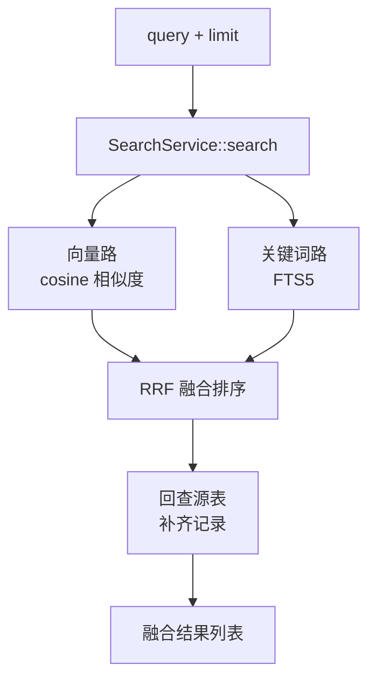
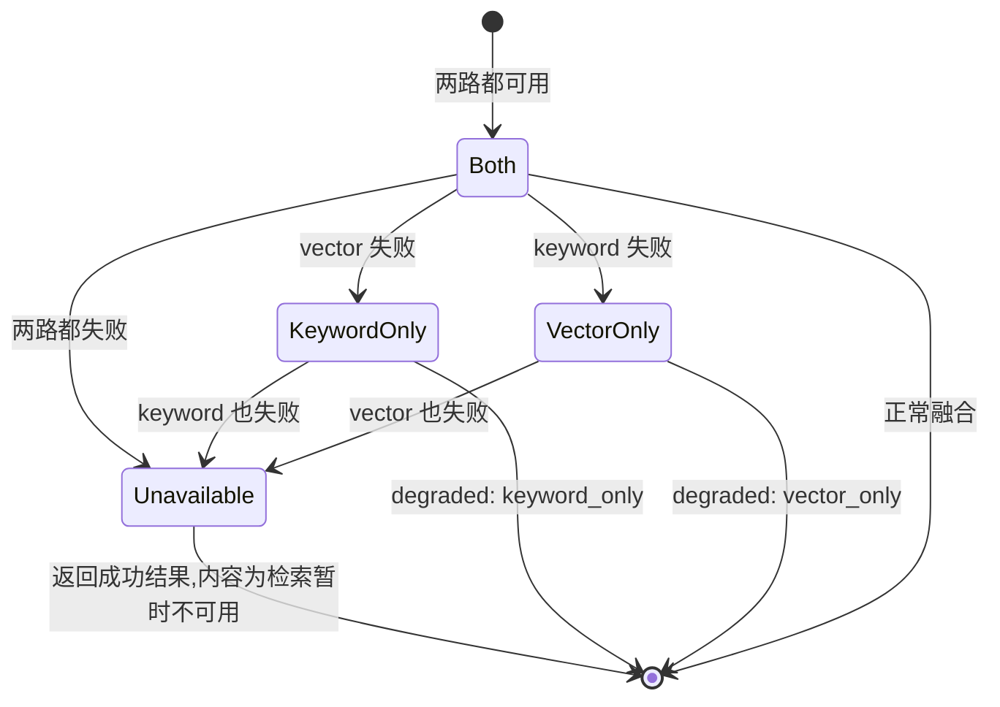

# 检索与向量搜索

`retrieval` 限界上下文拥有两套相互独立的搜索:一个宿主级跨会话**内存**池(向量 + FTS),以及一个按工作区划分的**代码索引**(Tree-sitter + FTS + 向量)。两者都会优雅降级,绝不会因为搜索错误而导致一次生成失败。

## 共享的宿主级内存池

检索搜索的宿主级内存池,与基于新近度的内存注入所取用的池相同(`agent-memory-shared-pool`)。召回**不**受 agent id 或工作区文件夹限制。agent id 与工作区文件夹仅作为来源元数据记录在索引行上,不作为召回工具的输入暴露:

- 在另一个 agent 下保存的内存,可从任意 agent 的会话中召回。
- 召回绝不会返回内存注入已放入系统提示的严格子集。
- 召回工具的输入 schema 恰好只暴露 `query` 和 `limit`——没有 agent id、文件夹或作用域参数,因为共享池没有可供模型指名的切片。

## 优雅降级

检索失败绝不会导致一次生成失败。工具返回一个描述不可用状态的成功结果:

- 搜索期间嵌入 provider 不可达 → 仅关键词结果,标记为 `degraded: keyword_only`。
- FTS5 查询失败 → 仅向量结果,标记为 `degraded: vector_only`。
- 两条路径都执行且都没有命中 → 返回空结果列表,而非错误。

## 工作区代码索引

持久化的代码索引按工作区划分作用域:工作区身份、文件清单、代码块、符号、向量与有界的本地审计记录。native worker 执行元数据优先的对账,仅读取或解析新增或变更的文件。Tree-sitter 语法、分块查询与脱敏策略共享一个版本标记。工作区代码嵌入受一个绑定到工作区 id、generation、provider 配置与模型的显式确认门控。FTS 保持按工作区划分作用域,并在确认之前可用;来自其他工作区或模型的向量永远不会成为候选。

## 检索流程与降级

`SearchService::search` 是召回的统一入口。它并行执行两条相互独立的检索路径——向量路基于 cosine 相似度,关键词路基于 FTS5——再用 Reciprocal Rank Fusion(RRF)把两路的结果融合成单一排序,最后回查源表补齐完整记录。两条路径互不依赖,任一路径失败都不影响另一条。

降级由哪条路径失败决定。下面的状态图枚举了所有组合及其对工具结果的影响。值得注意的一种是两路都失败:它仍然返回一个**成功**的工具结果,内容为"检索暂时不可用",而不是让生成收到一个工具错误。

几条容易误解的实现约束:

- **差集协调(reconcile)而非双写保存**:两条路径之间不维护"写了一份就同步写另一份"的约定,而是在检索时做差集协调——只对一边存在的条目补齐另一边,而不是在保存阶段强求双写。这避免了写入路径上的强一致耦合。
- **只有同模型才可比**:向量相似度只有在同一 embedding 模型下才有意义。一旦工作区或全局更换 embedding 模型,旧的向量会被重新入队(requeue),按新模型重新生成,而不会与旧向量混排。
- **后台 worker 的节奏**:embedding 后台任务按 `EMBEDDING_BATCH_SIZE=32` 批量处理,单条最多重试 `MAX_EMBEDDING_ATTEMPTS=5` 次,worker 以约 300s 的间隔轮询待嵌入队列。这些参数只影响后台入库速度,不影响检索路径本身的可用性。

## 关键类型与常量

### SearchService::search 流程

`SearchService::search` 是召回的统一入口,固定四步:`truncate_for_embedding` 把 query 截到 8000 字符上限(超出部分不进嵌入)→ 向量路 `vector_ranking` 做 cosine 相似度排序 → 关键词路 `keyword` 走 FTS5 → `fuse_with_rrf` 用 Reciprocal Rank Fusion 合并两路(`smoothing=60`)→ 回查源表补齐完整记录。

### Degradation 降级

降级枚举 `Degradation` 覆盖三态:`None`/`KeywordOnly`/`VectorOnly`。两路都失败时返回 `Err(Unavailable)`,工具结果不报错,而是一个内容为"检索暂时不可用"的成功结果。

### 索引与去重

差集协调 `reconcile` 在检索时按差集补齐缺失的一边,而非在保存阶段强求双写;`content_hash` 用于同内容条目去重;源表已不存在但仍残留在索引中的条目由 orphan 清理移除。

### 常量

- `EMBEDDING_BATCH_SIZE=32` —— 后台嵌入批量大小;
- `MAX_EMBEDDING_ATTEMPTS=5` —— 单条最多重试次数;
- `RETRY_BACKOFF_SECONDS=[1, 4, 15, 60, 300]` —— 每次重试的退避间隔;
- `RECONCILE_POLL_INTERVAL_SECONDS=300` —— worker 轮询待嵌入队列的间隔。

### 模型一致性

向量相似度只有在同一 embedding 模型下才有意义。向量存储记录其 model 身份;一旦工作区或全局更换 embedding 模型,`requeue_stale_model` 会把旧向量重新入队,按新模型重新生成,绝不与旧向量混排。

### 工具分离

`recall` 工具仅检索记忆池,`search_code` 工具仅检索当前工作区代码索引,两者分离。`CodeSearchService` 在 local 模式下跳过向量路,且不标记 `degraded`(本地无嵌入配置是预期状态,不是降级)。无嵌入配置时 `recall` 工具不进 tool catalog,模型根本看不到它。

## 设计所在之处

本章用于为贡献者定位。权威需求位于规范之中。

- [openspec/specs/retrieval-vector-search](../../../../openspec/specs/retrieval-vector-search/spec.md) —— 共享内存池、召回工具、降级。
- [openspec/specs/workspace-code-indexing](../../../../openspec/specs/workspace-code-indexing/spec.md) —— 工作区代码索引、对账、嵌入确认。

`retrieval` 限界上下文在 [Native 限界上下文](native-contexts.md)中描述。
