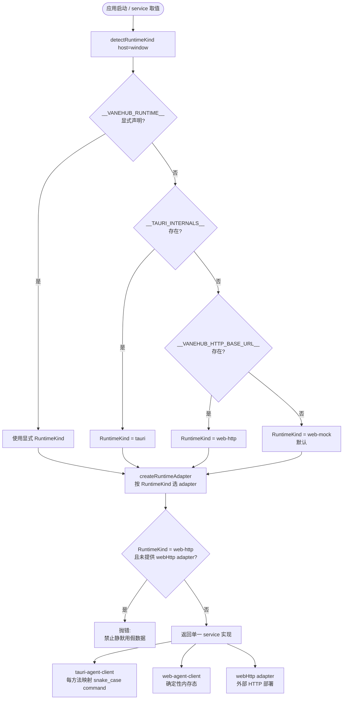

# 运行时与服务边界

React 组件依赖带类型的 frontend service。它们禁止直接导入 Tauri `invoke()`、打开 SQLite、启动 CLI 或直接访问本地文件系统。

## 桌面路径

1. 组件调用一个 service 接口。
2. Tauri frontend adapter 将请求映射到一个已声明的 command。
3. 薄薄的 Rust command 校验并映射 transport DTO。
4. 拥有该能力的 native application service 通过注入的 port 执行用例。
5. Infrastructure adapter 执行 SQLite、进程、文件系统、网络或 OS 相关工作。

可能较慢的工作会在完成前返回一个操作标识，并通过 operations 边界暴露进度。

## Web/mock 路径

Web adapter 以确定性的内存态实现同一套 frontend 契约。它可以为 UI 开发模拟执行与时序，但禁止声称本地进程已运行、SQLite 已变更或某个操作系统动作已发生。

## 新增能力

- 先扩展与运行时无关的 service 接口。
- 当 UI 消费该能力时，同时实现 Tauri adapter 和 Web/mock adapter。
- 将 provider 特定的启动行为保留在 Agent Runtime infrastructure 之后。
- 对用户可见的错误保持本地化，native 诊断写入统一的脱敏日志管道。

TypeScript 模型契约生成的决策（`ts-rs`）记录为 `src-tauri/ARCHITECTURE.md` 中的 ADR-005。早期的单 CLI chat 运行时叙事已被多 Agent group chat 运行时（`openspec/specs/multi-agent-group-chat/`）取代。

## 运行时选择与适配器

前端不直接嗅探宿主环境。每个 service 都通过 `createRuntimeAdapter` 在启动期一次性选定一个实现，之后整条调用链都走这个被选中的 adapter。`detectRuntimeKind` 是这条分派的唯一决策点，顺序如下：先看 `__VANEHUB_RUNTIME__` 显式声明（测试与调试覆盖用），其次看 `__TAURI_INTERNALS__` 是否存在以判定桌面 Tauri 运行时，再看 `__VANEHUB_HTTP_BASE_URL__` 是否存在以判定 web-http 部署，最后回退到默认的 web-mock。web-http 分支要求调用方为该 service 注册一个 `webHttp` adapter；缺失时 `createRuntimeAdapter` 直接抛错，而不是静默落到 web-mock ——在已声明是真实部署的宿主上用假数据继续运行，会把静默的错误伪装成业务成功。

`AgentService` 是一个超大的聚合接口，覆盖 Agent 生命周期、会话、MCP、工具、IM、扩展、权限、工作板、SDK、SSH 连接等子域。每个子域都有一个对应的 `runtime-*-client.ts` 文件，内部各自调用 `createRuntimeAdapter`，传入成对的 Tauri 实现与 Web/mock 实现。两条实现必须保持接口一致——新增能力要同时改 `tauri-agent-client.ts`（每个方法映射到一个 snake_case 的 Tauri command）与 `web-agent-client.ts`（用确定性内存态模拟同一语义）。

约束要点：

- **单例 `agentService`** 在前端模块图解析期构造一次，组件不自行 `new`。
- **组件经 hooks 依赖**：React 组件只依赖 `src/hooks/` 暴露的 hook 与 `src/services/agent-service.ts` 的接口，不直接 import `tauri-agent-client` 或 `web-agent-client`，也不直接调用 `invoke()`。
- **desktop 就绪埋点无条件标记**:`main.tsx` 在所有运行时(Tauri、web-mock、web-http)渲染完成后都会无条件设置 `root.dataset.vanehubBootstrap="ready"`;唯一桌面相关的条件分支是 `if(import.meta.env.VITE_DESKTOP_E2E==="1")`,在该分支下才加载 `@wdio/tauri-plugin` 并注册 `vanehubFatalError` 监听。没有 `desktop_ready`/`report_desktop` 之类的 native 命令——"就绪"只是一个 dataset 标记,不向 native 上报。
- **web-http 无 adapter 必抛错**：这是防止生产部署静默退化到假数据的关键闸门。新增 service 在 web-http 部署下没有真实后端时，应让该 service 在 web-http 分支抛错，而不是回退到 web-mock。

## 关键文件与契约

### 运行时探测

`detectRuntimeKind()` 是运行时分派的唯一决策点，按固定顺序判定：先看 `__VANEHUB_RUNTIME__` 显式声明(测试与调试覆盖用)→ 看 `__TAURI_INTERNALS__` 是否存在以判定桌面 Tauri 运行时 → 看 `__VANEHUB_HTTP_BASE_URL__` 是否存在以判定 web-http 部署 → 以上都不命中则回退到默认的 web-mock。

### 适配器

`createRuntimeAdapter()` 按选定的 `RuntimeKind` 绑定三套适配器之一:`tauri`/`webHttp`/`webMock`。`web-http` 分支要求调用方为该 service 注册 `webHttp` adapter,缺失时直接抛错,而不是静默落到 `web-mock`。

### AgentService 聚合接口

`AgentService`(`src/services/agent-service.ts`)是一个超大的聚合接口,覆盖 Agent 生命周期、会话、MCP、工具、IM、扩展、权限、工作板、SDK、SSH 连接等子域。每个子域对应一个 `runtime-*-client.ts` 文件,内部各自调用 `createRuntimeAdapter`,传入成对的实现。

### 成对实现

- `tauri-agent-client.ts` —— 每个方法映射到一个 snake_case 的 Tauri command;
- `web-agent-client.ts` —— 用确定性内存态模拟同一语义。

两份实现必须保持接口一致,新增能力要同时改这两处。

### 单例与依赖路径

单例 `agentService` 在 `runtime-agent-client.ts` 中于模块图解析期构造一次,组件不自行 `new`。React 组件只依赖 `src/hooks/` 暴露的 hook 与 `src/services/agent-service.ts` 的接口,不直接 import `tauri-agent-client` 或 `web-agent-client`,也不直接调用 `invoke()`。

### desktop 就绪埋点

desktop 就绪埋点在 `main.tsx` 中处理:渲染完成后无条件设置 `root.dataset.vanehubBootstrap="ready"`(Tauri、web-mock、web-http 三种运行时都会设置),没有向 native 上报 "desktop 就绪" 的命令。唯一桌面相关的条件分支是 `if(import.meta.env.VITE_DESKTOP_E2E==="1")`,在该分支下加载 `@wdio/tauri-plugin` 并注册 `vanehubFatalError` 监听;这条约束由 `desktop-instrumentation-boundary.test.ts` 验证。

## 子进程通信:Headless 命令与 JSON-RPC over stdio

VaneHub 桌面端作为宿主进程,会 spawn 多个**无头(headless)子进程**——不打开窗口、不渲染 UI,只在后台运行,通过 stdio 或 HTTP 对外通信。这些子进程分两类通信模式,本项目按子系统分别选用。

### 两种模式对比

| 维度 | Headless 命令 + 流式 stdout 解析 | JSON-RPC over stdio |
| --- | --- | --- |
| 形态 | 子进程以 headless 命令运行,父进程解析其原生 stdout 输出流 | 子进程以 headless 运行,父子间走 JSON-RPC 2.0 报文,用 `Content-Length` 头分帧 |
| 协议 | 无协议——按各家 CLI 的原生输出格式逐行/按记录解析 | 有协议——标准 JSON-RPC,method/id/params 结构化 |
| 报文格式 | 各 CLI 自定义文本/JSONL | JSON-RPC body;分帧规则由各自协议规定——LSP 用 `Content-Length` 头,MCP 用换行分隔 |
| stderr 用途 | 可用于诊断日志 | 专用于日志,**不得污染 stdout 协议报文** |
| 适用条件 | 子进程是现成的 CLI、不实现标准协议时 | 子进程实现了 JSON-RPC 协议时(LSP server、MCP server) |

**Headless 模式**指子进程不启动 GUI、完全后台运行,输入输出不走 UI 而走 stdio/网络/IPC——资源占用低、可程序化驱动、适合本地父子进程或服务器部署。

**JSON-RPC over stdio** 指父进程 spawn 一个 headless 子进程,经 stdin 发 JSON-RPC 请求、从 stdout 收响应,stderr 专做日志。

**这是一种传输方式,不是某一个协议的名字。** LSP 与 MCP 各自的规范都定义了自己的 stdio 绑定,分帧规则并不相同:LSP 用 `Content-Length` 头声明后续 JSON 的字节数、`

` 分隔头与内容(`lsp_framing.rs`);MCP 则以**换行分隔**每条消息(`relay_jsonrpc.rs` 的 `read_bounded_frame` 逐字节找 `
`)。按 LSP 那套去实现 MCP 传输会直接失败。

两者共同的关键约束是**业务日志必须走 stderr**——往 stdout print 会破坏分帧。

> 早期版本用 “ACP-stdio” 泛指这一类传输,那是错的。ACP 是 Agent Client Protocol 的名字,指另一套协议;LSP 不是 ACP,MCP 也不是,本项目没有实现 ACP。

### 本项目采用的方案

本项目**按子系统混合采用**两种模式:

| 子系统 | 模式 | 实现 |
| --- | --- | --- |
| CLI Agent(claude-code 等) | **Headless 命令 + 流式 stdout 解析** | 各 CLI 以其 **headless 命令契约**启动(非交互、可程序化驱动、流式输出);`ProviderOutputFramer` 按各家原生输出格式解析 stdout,归一化为 `started`/`token`/`thinking`/`tool_use`/`completed`/`failed`/`cancelled` 等 chat 事件。prompt 优先经 stdin 投递而非命令行参数 |
| LSP 代码智能 | **JSON-RPC over stdio(LSP 绑定)** | LSP server 以 headless 子进程启动,父子间走标准 LSP JSON-RPC;`lsp_framing.rs` 用 `Content-Length: {}\r\n\r\n` 分帧,`json_rpc_actor.rs` 处理请求-响应配对与 `$/cancelRequest` |
| MCP server | **JSON-RPC over stdio(MCP 绑定)** | MCP server 以 headless 子进程(`relay_stdio`/`bounded_stdio`)启动,走 JSON-RPC 2.0(`relay_jsonrpc.rs` 解析 `jsonrpc: "2.0"` 帧);Claude Code/Codex CLI 还经中继(`--vanehub-mcp-relay`)由 VaneHub 代理 |

**为什么 CLI Agent 不用 JSON-RPC over stdio**:各家 Coding CLI(claude-code、codex-cli、gemini-cli 等)都不暴露 JSON-RPC 接口,各自有原生输出格式,无法假定一个标准 JSON-RPC 契约。因此本项目对 CLI Agent 采用 headless 命令 + 按各家 `output_parser_for(agent_id)` 定制解析的方式——尊重每个 CLI 的既有契约,而非强加协议。

**为什么 LSP/MCP 用 JSON-RPC over stdio**:两者都有标准化的 JSON-RPC 协议,且各自的规范都定义了 stdio transport(分帧规则不同,见上)。本地父子进程通信无需端口、无需网络栈,启动销毁简单、进程隔离干净,适合桌面端 Agent 场景。

### 常见坑点

- **stderr/stdout 混淆** —— JSON-RPC over stdio 模式下,业务日志必须走 stderr,写 stdout 会破坏分帧解析。
- **换行符** —— LSP 的协议头须用 `
`,跨平台一致;MCP 以换行分帧,单条消息体内不得出现裸换行。
- **子进程异常退出** —— 父进程须监听子进程 exit,做重启预算(`restart_budget`)与错误上报(LSP 的 `Backoff`/`Failed` 状态机、MCP 的 `RelayFailure`)。
- **缓冲区** —— stdio 行缓冲,跨读分裂的 UTF-8 须用 `take_decodable_utf8` 重组(CLI Agent 终端的处理)。

服务边界与运行时选择的权威定义见 `openspec/specs/frontend-runtime-architecture/spec.md` 与 `src-tauri/ARCHITECTURE.md`。
