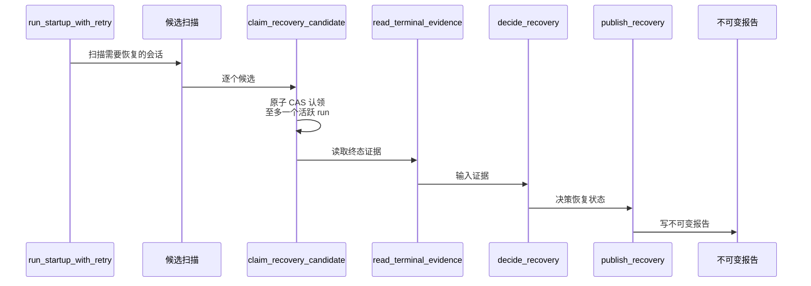
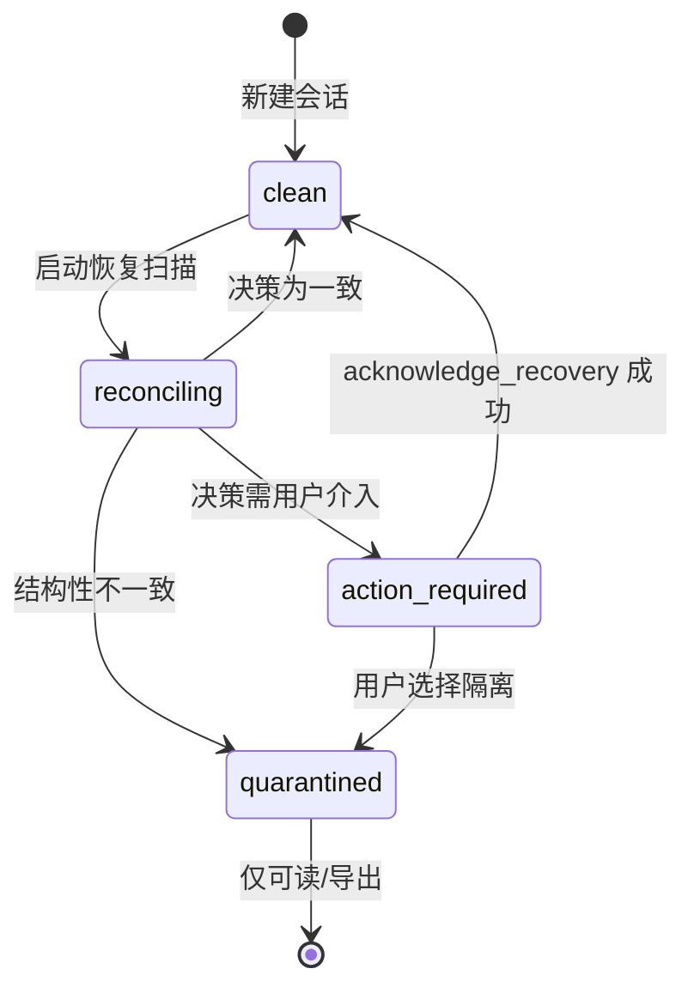
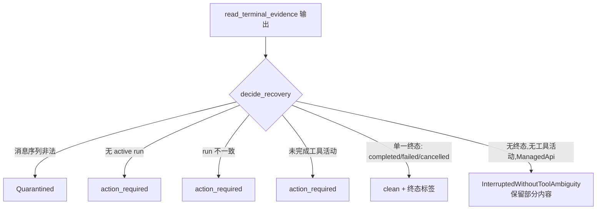

# 会话恢复

受管理的生成是持久的：会话可以在崩溃、中断的 tool-use loop 或结构性不一致之后安全恢复，而不会丢失证据或重复执行工作。恢复状态**独立**于会话的生命周期状态进行追踪。

## 恢复状态与生命周期正交

每一个持久会话都带有一个恢复状态：`clean`、`reconciling`、`action_required` 或 `quarantined`：

- 一个 `failed` 会话，如果恢复状态为 `clean` 且没有活跃的 run，仍然接受新消息。
- 一个 `idle` 会话，如果恢复状态为 `action_required`，则在每一条受管理的提交路径上拒绝新的生成工作，直到某个允许的恢复动作成功为止。
- 一个 `quarantined` 会话——一种稳定的、不冒丢失证据风险就无法对账的结构性不一致——保持可读且可导出，但拒绝任何依赖该不一致状态的生成或变更。

## 持久执行标识与归属

每一个被接受的受管理生成都有一个稳定的 execution run id，与其会话和已持久化的消息相关联。在 provider 或 CLI 执行开始之前，该会话会原子地认领**至多一个**活跃的 execution run。在一个 run 活跃期间发起的竞争认领会被拒绝，且不会启动工作。

## 恢复流程

启动恢复由 `run_startup_with_retry` 驱动,它扫描候选会话、对每个候选做一次原子认领、读取终态证据、决策恢复状态,最后发布恢复结果并写一份不可变报告。整条路径与生成路径解耦:它只清 `active_run`、打标记、写报告,**绝不自动重放**任何工作。

恢复状态本身是一个独立列 `recovery_status`,下面的状态机枚举了所有可达状态:

`decide_recovery` 的关键决策如下。注意单一终态会落到 `clean` 并带上对应的终态标签,而无终态、无工具活动的 ManagedApi 情况会保留部分内容并标记为 `InterruptedWithoutToolAmbiguity`。

为什么恢复与生命周期正交:恢复状态存放在自己的 `recovery_status` 列上,不与会话的 `idle`/`active`/`failed` 等生命周期状态混用。一个 `failed` 但 `recovery_status=clean` 的会话仍可接受新消息;一个 `idle` 但 `recovery_status=action_required` 的会话会在每条受管理提交路径上被拒绝,直到恢复动作成功。

为什么只清不重放:恢复动作最多清掉 `active_run`、打上恢复标记、写一份不可变报告,**绝不重试**任何已发起的生成或工具调用。这避免了在不确定的终态下重复执行副作用——一旦证据不足以判断 run 是否完成,正确的做法是把决策权交回用户,而不是猜一个状态继续跑。

用户确认机制:`acknowledge_recovery` 在确认时要求传入的 revision 与当前会话 revision 匹配,防止在恢复扫描后又发生了新变更的情况下确认一个陈旧状态。确认动作本身**不会**清掉不确定的恢复效果——它只把 `recovery_status` 从 `action_required` 推进到 `clean`,把"是否接受这次恢复的最终效果"的判断显式交给用户。

## 设计所在之处

本章用于引导贡献者。权威需求——恢复状态、持久执行标识与归属，以及允许的恢复动作——位于 spec 中。

- [openspec/specs/session-recovery](../../../../openspec/specs/session-recovery/spec.md)

会话持久性位于 `sessions` 限界上下文中；见 [Native bounded contexts](native-contexts.md)。
