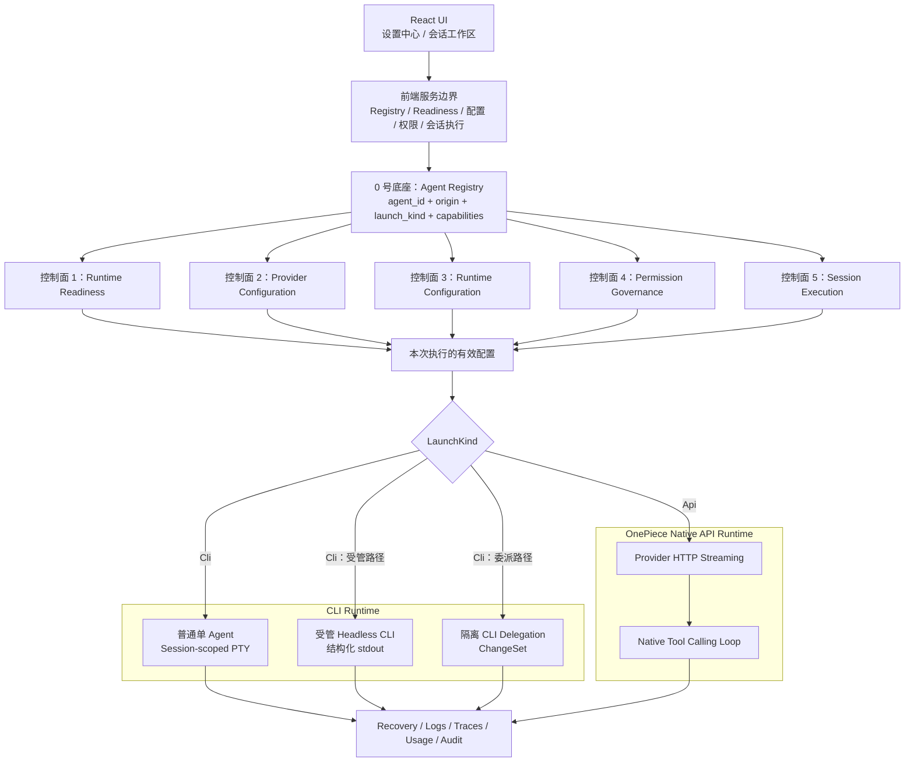

# 单 Agent 治理：五控制面模型

VaneHub AI 的单 Agent 管理不是"给五个 CLI 套一个启动按钮"，而是建立一套统一的治理面，把外部厂商 CLI 和内置 OnePiece Agent 放进同一套 Agent 身份、配置、权限、会话、记忆、观测和恢复体系中。

本章给出理解这套治理体系的分析模型：一个 0 号底座加五个控制面。**它是职责分析模型，不是代码结构**——五个控制面既不对应五个 Rust bounded context，也不对应五个页面；当前代码按业务所有权拆分到 `agent_runtime`、`sessions`、`tooling`、`permissions` 等多个上下文（见 [Native 限界上下文](native-contexts.md)）。

```text
0. Agent Registry
   └── 稳定 agent_id、LaunchKind、Capabilities、Availability

1. Runtime Readiness
   ├── CLI：安装、发现、版本、来源、PATH、冲突
   └── OnePiece：Active Profile、凭据、端点、模型、Provider 可用性

2. Provider Configuration
   ├── CLI：纳管各 CLI 的全局 Provider 配置
   └── OnePiece：应用内 Provider Profile 与凭据生命周期

3. Runtime Configuration
   ├── CLI：类型化 argv、env、Chat/Interactive 参数
   └── OnePiece：HTTP 请求、上下文预算、检索、压缩和生成参数

4. Permission Governance
   ├── CLI：启动参数投影、环境变量、Hook、MCP Relay
   └── OnePiece：应用内逐 Tool Call 的原生判定

5. Session Execution
   ├── 普通单 Agent CLI：会话级 PTY / Agent Terminal
   ├── 受管 CLI：Headless 子进程与结构化输出解析
   └── OnePiece：HTTP Streaming + Native Tool Calling Loop
```

先记住六条核心结论：

1. **OnePiece 不是"第六个 CLI"**。它是 `LaunchKind::Api` 的内置原生 Agent；五个外部工具是 `LaunchKind::Cli`。它们共享上层治理契约，但不共享底层执行机制。
2. **普通单 Agent CLI 会话的主执行形态是会话级 PTY / Agent Terminal**。同一会话再次进入时优先附着到 retained 进程并回放有界终端内容，而不是无条件启动新的 Headless 子进程。
3. **Headless CLI Runtime、普通 PTY 会话和 CLI 委派是三条不同路径**。Headless 路径服务于受管 Chat、多 Agent、Loop 等结构化执行；CLI 委派只面向隔离分析/编辑与 ChangeSet 管线，不能混同为普通单 Agent 会话。
4. **五个控制面是架构分析模型**，会横跨多个 bounded context 与页面。
5. **权限的"统一"是统一决策语义，不是统一执行精度**。OnePiece 可在每次 Tool Call 前做原生判定；Claude Code 同时有启动参数投影和 `PreToolUse` Hook；其他 CLI 主要依赖原生启动参数、环境变量或 MCP 中继，内部行为仍存在黑盒边界。
6. **Provider/模型、普通运行参数、权限参数、Runtime 保留参数必须保持字段所有权隔离**。普通 CLI 参数页面不能生成 Sandbox、Approval、Session ID、Resume、Output Format 等受策略或运行时管理的参数。

## 核心术语

| 术语 | 含义 |
| --- | --- |
| Agent | 稳定身份，使用持久 `agent_id`。显示名称不是 Runtime 路由键 |
| Provider Profile | 决定 Endpoint、Interface Format、模型与凭据引用的配置对象 |
| Runtime Configuration | 决定某次启动或生成行为的普通参数，不负责权限和 Session ID |
| Permission Policy | 把 Agent 对资源的操作解析为 `Allow`、`Deny` 或 `Ask` |
| Session | 长生命周期对话容器，固定绑定一个 Agent 和一个 Workspace |
| ExecutionRun | 某条用户消息触发的一次受管执行，与 Session 是多对一关系 |
| AgentTerminal | 仅 CLI Agent 使用的会话级交互式 PTY。它不是 OnePiece 的运行载体，也不等于 ExecutionRun |
| Provider Runtime Session ID | CLI 自己的会话/线程/Conversation ID，不等于 VaneHub Session ID，不能跨 CLI 使用 |

## 统一架构总览



### 统一什么，不统一什么

应统一：稳定 Agent 身份；Availability 与 Capability 表达；Provider/Profile 配置入口；普通运行参数的 Schema 与来源展示；权限主体与 `Allow/Deny/Ask` 语义；Session、ExecutionRun、Recovery；Skill、MCP、Memory 的治理入口；Logs、Traces、Usage、Audit。

不应强行统一：CLI 的安装来源和 VaneHub 原生 API Runtime；PTY 字节流与 HTTP SSE/JSON Stream；CLI 自身 OAuth 与 OnePiece API Key；CLI 原生 Sandbox/Approval 与 OnePiece 原生 Tool Call；厂商各自的 Resume 语法；每种 Runtime 的可观测保真度。

## 0 号底座：Agent Registry

| Agent | 稳定 `agent_id` | `LaunchKind` | 执行载体 |
| --- | --- | --- | --- |
| OnePiece | `onepiece` | `Api` | 应用内 HTTP + Tool Loop |
| Claude Code | `claude-code` | `Cli` | `claude` CLI |
| Codex CLI | `codex-cli` | `Cli` | `codex` CLI |
| Gemini CLI | `gemini-cli` | `Cli` | `gemini` CLI |
| OpenCode | `opencode` | `Cli` | `opencode` CLI |
| Antigravity CLI | `antigravity-cli` | `Cli` | `agy` CLI |

Agent Registry 负责身份；Provider Registry 负责把稳定 ID 解析成 Runtime 行为。上层 Session 服务不应按显示名分支，也不应在多处重复 `if agent_id == "claude-code"` 式判断；无兼容 Provider 注册时应返回 `unsupported-provider`，而不是悄悄回退到其他 Agent。调用方必须以 Provider 元数据声明的 capability 标签为依据，而不是从 Agent 名称猜测能力。

Availability 状态（`Available`、`NeedsAuthentication`、`Unavailable`、`Unknown`）与 capability 声明的细节见 [Agent 生命周期与 provider 运行时](agent-lifecycle.md)。

## 控制面一：Runtime Readiness / CLI 管理

> 该控制面回答：运行该 Agent 所需的载体是否存在、是否可信、是否可执行？

负责：CLI 安装发现、可执行文件绝对路径、版本与来源、PATH 命中关系、多安装冲突、安装/升级/卸载计划、运行前置状态；对 OnePiece 则是 Active Profile、凭据、Endpoint 与模型就绪度。

不负责：本轮模型覆盖、推理强度、文件写入权限、Session 创建、Resume ID、Tool Calling Loop。

关键不变量（详见 [CLI 生命周期与全局配置](cli-lifecycle.md)）：

- CLI 定义是编译期常量，不是运行期动态插件注册表；
- 发现不递归扫描整块磁盘，区分实际 PATH 命中与后端推荐安装，启动时解析为绝对路径；
- `path_selected_installation_id` 与 `recommended_installation_id` 可能不同，UI 必须同时展示，否则容易"升级了一份，但命令仍命中另一份"；
- 冲突以结构化条目表达，`blocksLaunch` / `blocksMutation` 由后端给出；
- 安装变更必须经过一次性、限时、绑定环境指纹的 Plan，执行后重新检测主机实际状态；
- `changed-but-failed` 终态表示命令失败但主机已变化——不能通过恢复旧数据库记录声称操作系统安装已回滚。

OnePiece 没有 PATH、包管理器或可执行文件，不应放进 CLI 管理卡片伪装成"已安装"。它的 Readiness 检查链是：注册表条目 → Active Provider Profile → Profile 结构有效 → 凭据存在 → Endpoint/Interface Format 合法 → 模型已选择 → Credential Probe。

## 控制面二：Provider Configuration / Agent 配置

> 该控制面回答：该 Agent 默认连接哪个 Provider、Endpoint、接口格式与模型，凭据由谁保管？

必须先分清两种认证路径：

- **厂商订阅登录**：用户在普通终端完成 CLI 自己的 OAuth/浏览器登录，凭据由 CLI/厂商存储，VaneHub 只读取归一化可用性，不接管订阅密码或 OAuth Session。
- **VaneHub 管理的第三方 Provider 配置**：在设置中选择 Provider/Endpoint/Model，API Key 写入操作系统凭据服务，再把 VaneHub 拥有的字段应用到 CLI 配置文件。

CLI 配置写入的核心约束（详见 [`docs/cli-agent-global-configuration.md`](../../../cli-agent-global-configuration.md)）：只替换 VaneHub 拥有的字段；在内存中构建并验证完整结果后原子替换文件；切换 Profile 前回填当前受管字段；外部并发改写时拒绝覆盖并报告 Drift；配置成功后不自动重启运行中的 CLI。hooks、permissions、plugins、MCP server、注释、无关 provider 等非受管内容必须原样保留。

OnePiece 的 Provider Profile 生命周期（目录、Credential Probe、模型发现、原子激活）见 [OnePiece native Agent](onepiece-native-agent.md)。要点：身份与 Profile 分离——切换 Provider 不创建新 Agent，也不改变 Session 的 `agent_id`；同一时刻至多一个 Active Profile；凭据只存操作系统凭据服务，不写 SQLite。

## 控制面三：Runtime Configuration / CLI 参数

> 该控制面回答：Provider 已确定后，本次启动或生成还应带哪些普通行为参数？

参数按所有权分三类，只有第一类出现在 CLI 参数页面：

| Ownership | Owner | 示例 |
| --- | --- | --- |
| `user-editable` | CLI 参数页面 | model、effort、debug、search |
| `policy-governed` | 权限策略 | sandbox、approval、permission mode |
| `runtime-reserved` | Session Runtime | session id、resume、output format |

安全原则：普通参数只能覆盖普通参数；策略层只能产生 policy-governed 参数；Runtime 只能产生 runtime-reserved 参数。消息级覆盖（Message Override）只允许普通字段（模型、推理强度等），永不产生权限或 Runtime 保留参数。

`Inherit` 的准确语义是：**不为该参数生成任何 Token**，让 CLI 使用自己的配置文件或内置默认值——`model = Inherit` 不是 `--model inherit`，而是完全不生成 `--model`。

`interactive`（会话级 Agent Terminal / PTY）与 `chat`（受管 Headless CLI Runtime）是两类 Scope，参数目录可同时支持，但 Runtime 按 Scope 渲染不同参数。

每个 CLI 的完整参数清单由 `catalog.v2.json` 生成，不要手抄——见生成的 [CLI 参数矩阵](../../../agent-infrastructure/cli-parameter-matrix.md)（更新命令 `npm run docs:matrix:generate`）。

OnePiece 不存在 argv，不应出现在 CLI 参数页面；它对应的运行配置是生成参数、上下文预算、检索、压缩与工具目录参数（见 [OnePiece native Agent](onepiece-native-agent.md)与[上下文压缩](context-compaction.md)）。

## 控制面四：Permission Governance

> 该控制面回答：该 Agent 此刻能对哪些资源做什么？

统一决策模型、四档模板、Scope 解析与 Approval Broker 的完整语义见[权限模型](permission-model.md)。本章只强调跨 Agent 的结构差异：

- 权限请求归一化为 `principal + action + resource + context`，principal 是稳定 `agent_id`；结果为 `Allow`、`Deny`、`Ask`，未匹配与内部故障均 fail-closed 为 `Ask`。
- **五个 CLI 全部参与策略模板的启动参数投影**（`POLICY_TEMPLATE_GOVERNED_AGENT_IDS`），Claude Code 在此之外还有 `PreToolUse` Hook 的逐调用桥接——它是"启动参数投影 + Hook"双层实现。
- 权限的执行保真度分层，"权限模板相同"不等于"执行精度相同"：

| 级别 | 含义 | 典型对象 |
| --- | --- | --- |
| Native | 操作在 VaneHub 内被逐次解析和执行 | OnePiece Native Tool |
| Proxied / Hook-Enforced | 调用经 VaneHub Hook/Relay 转发 | Claude Code Hook、MCP Relay |
| Launch-Projected | 只在进程启动时投影参数/环境变量 | 五个 CLI 的模板投影 |
| Inferred | 从输出或行为推断 | 某些 CLI Usage/步骤 |
| Opaque | CLI 内部不可见 | 外部 CLI 未桥接的内部行为 |

- OnePiece 的每次工具调用都经过应用内 Tool Loop，可在执行前进入统一权限管线；Plan 模式是叠加在权限模板之上的能力上限，二者取交集（见 [Loop 运行时与会话 Plan 模式](loop-and-plan-runtime.md)）。

## 控制面五：Session Execution

> 该控制面回答：选定 Agent、配置、参数和权限后，如何创建、运行、恢复、取消和记录一次会话？

必须区分四个对象：`Session`（长生命周期容器，固定绑定 `agent_id` 与 Workspace）、`ExecutionRun`（一次受管执行）、`AgentTerminal`（CLI 专属的会话级 PTY）、`Provider Runtime Session ID`（CLI 自己的会话 ID，按 Agent 类型保存，不能跨 CLI 使用）。

- 普通单 Agent CLI 会话的主形态是会话级 PTY：UI 在会话创建或选中后自动请求 Agent Terminal，Registry 以 `session_id` 为键；已有 retained 进程时 Attach 并回放，否则解析绝对路径、参数、权限与 Resume 后启动。内存回放上限与持久化终端捕获是两套机制，细节见[终端与 PTY 运行时](terminal-runtime.md)。
- OnePiece 不启动 PTY：一次生成是 HTTP Streaming 加多轮 Native Tool Calling Loop，每次 `tool_use` 先过权限判定，细节见 [OnePiece native Agent](onepiece-native-agent.md)与 [Tool registry 与执行](tool-registry.md)。
- Recovery 状态与普通 Session 生命周期正交；启动恢复只读取业务证据，不自动重放中断的 Provider、Tool 或 CLI 工作，对不确定的 CLI 内部副作用进入 `action_required`。见[会话恢复](session-recovery.md)。

## 三类 CLI 执行路径必须分开

**路径 A：普通单 Agent CLI Session** —— Session-scoped Agent Terminal，交互式 CLI，PTY 字节流。长生命周期、可 Attach、用户直接看到终端；CLI 内部状态较黑盒。

**路径 B：受管 Headless CLI Runtime** —— 受管 Chat、多 Agent 群聊、Loop 使用的短期 CLI 子进程，以 Headless/JSON/Stream-JSON 输出经解析器规范化为事件。各 CLI 的 Headless 语法与 Prompt 投递方式由 provider invocation 层维护（`src-tauri/src/contexts/agent_runtime/infrastructure/providers/invocation.rs`）。

**路径 C：CLI Delegation** —— OnePiece/编排器把任务委派给隔离临时 Git 工作区中的外部 CLI，捕获 ChangeSet 后评审、封存、一次性应用。它不是普通 Session 的另一个启动选项，而是安全边界更严格的委派子系统，见 [CLI 委派与 ChangeSet 管线](cli-delegation.md)。

## 配置变更的生效规则

| 修改项 | 运行中的 CLI Terminal | 下一次 CLI Headless | 当前 OnePiece Generation | 下一次 OnePiece Generation |
| --- | --- | --- | --- | --- |
| CLI 安装/版本 | 不自动替换进程 | 使用新检测结果 | 无影响 | 无影响 |
| CLI Provider Profile | 不自动重启 | 使用新应用配置 | 无影响 | 无影响 |
| OnePiece Active Profile | 无影响 | 无影响 | 保持启动快照 | 使用新 Profile |
| 普通 CLI 参数 | 不热改 | 使用新参数 | 无影响 | 无影响 |
| OnePiece Runtime Config | 无影响 | 无影响 | 保持启动快照 | 使用新配置 |
| 权限模板 | Launch Projection 通常需重启；Hook/Relay 可在后续调用生效 | 使用新模板 | 后续 Tool Call 应重新判定 | 使用新模板 |
| Skill/MCP 启停 | 取决于 CLI 注入/Relay | 新执行重新解析 | 未开始 Tool Call 前应重新验证 | 新目录快照 |
| Workspace | 不应在运行中静默切换 | 新执行使用新绑定 | 当前 Run 保持快照 | 新 Run 使用新绑定 |

原则：Provider、Endpoint、Model、普通参数、Workspace 在 Run 开始时冻结；权限、Grant、Plan Mode 应尽可能在每次 Tool Call 前重读；对只能 Launch-Project 的 CLI，权限收紧应提示"重启后完全生效"。

## 结语

VaneHub AI 对五个 CLI 和 OnePiece 的正确统一方式是：统一身份、统一治理、统一权限语义、统一会话与恢复、统一 Skill/MCP/Memory 入口、统一观测与用量口径，同时**保留 Runtime Adapter 差异**。反面模式包括：把 OnePiece 伪装成 CLI；把所有 CLI 当作同一种协议；把普通 PTY、Headless 与 Delegation 混成一条路径；把 VaneHub 当前未纳管误写成上游不支持；把统一模板误写成统一执行保真度。
