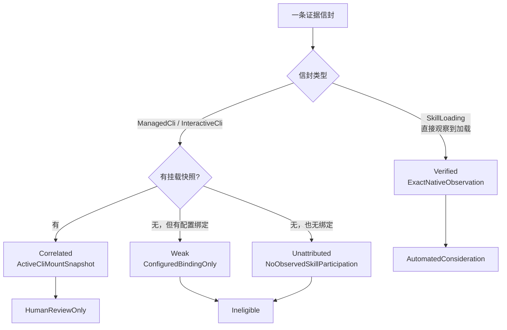

# Skill 演进证据

`skill_evolution_evidence` 上下文收集「某个 Skill 用得怎么样」的证据，用于判断它是否该被改进。

它在整个代码库里是**证据强度声明最严格**的一处——因为它要回答的问题天然容易得出错误结论：**一次失败，到底该不该算在某个 Skill 头上**。

## 为什么归因这么难

会话失败了。当时挂载了三个 Skill。哪一个该负责？

大多数情况下**答案是「不知道」**，而这个上下文没有把「不知道」偷偷变成「大概是它」。它给每条归因标上**依据**与**可用范围**，让下游知道这条证据能拿来干什么。

### 四种归因依据

`AttributionRationale`：

| 依据 | 观察到的事实 |
| --- | --- |
| `ExactNativeObservation` | 运行时直接观察到这个 Skill 的这个修订参与了 |
| `ActiveCliMountSnapshot` | 事发时这个 Skill 确实挂载着，但没看到它被用 |
| `ConfiguredBindingOnly` | 只知道配置上绑了它，连挂载快照都没有 |
| `NoObservedSkillParticipation` | 没有任何 Skill 参与的迹象 |

**四者的信息量是递减的**，对应的 `AttributionStrength` 从 verified 到 correlated 到 weak 到未归因。

### 三档可用范围

`TargetingEligibility` 决定这条证据能进到哪一步：

| 范围 | 含义 |
| --- | --- |
| `AutomatedConsideration` | 强到可以进自动化判断 |
| `HumanReviewOnly` | 只能给人看，不进自动流程 |
| `Ineligible` | 不能用于定位任何 Skill |

**只有直接观察到参与的证据才进自动化流程**。四档强度到可用范围的映射是一一对应的：

| 强度 | 依据 | 可用范围 |
| --- | --- | --- |
| `Verified` | `ExactNativeObservation` | `AutomatedConsideration` |
| `Correlated` | `ActiveCliMountSnapshot` | `HumanReviewOnly` |
| `Weak` | `ConfiguredBindingOnly` | `Ineligible` |
| `Unattributed` | `NoObservedSkillParticipation` | `Ineligible` |

**分界线画得比直觉更靠前**。「挂载着」不等于「用了它」——所以 `Correlated` 只能给人看，进不了自动化。而「配置上绑了它」连挂载快照都没有，**直接判 `Ineligible`**，与「压根没观察到任何 Skill 参与」同级：让一个从未被调用的 Skill 为别人的失败背锅，哪怕只是列进人工复核清单，也是在浪费复核者的注意力。

## 信号分类

证据被抽取成带类别的信号，而不是自由文本。

`OperationClass` 五类：`Generation`、`Tool`、`Permission`、`Provider`、`Process`。

`FailureClass` 八类，且**各自带默认严重度**：

| 失败类别 | 默认严重度 |
| --- | --- |
| `Permission`、`Limit`、`Agent` | Medium |
| `Provider`、`Process`、`Tool`、`Timeout`、`Sandbox` | High |

**权限与限额被降到 Medium 是有道理的**：被权限策略挡下、或触到配额，通常说明护栏在正常工作，而不是出了故障。把它们与沙箱逃逸、进程崩溃同等对待，会让真正的高危信号淹没在正常拦截里。

其余分类还有 `VerificationClass` / `VerificationOutcome`、`UtilityOutcome`、`SignalPolarity`、`SkillLifecycleAnomaly`——**极性单列**，因为证据不只有失败，成功同样是证据。

## 脱敏：12 条规则，先脱敏再落盘

`EVIDENCE_SANITIZER_V1` 有 12 条 `RedactionClass` 规则，覆盖私钥块、token 赋值、`Authorization` 与 `Cookie` 头、口令赋值、URL 内嵌凭据等。

两条设计值得注意：

- **输入上限 `MAX_SANITIZER_INPUT_CHARS = 1000`**。超长输入直接拒绝而不是截断后再脱敏——**截断可能正好把一个密钥切成两半，让后半段逃过规则**。
- **脱敏器带版本号**。规则会演进，落盘的证据记录自己是被哪一版处理过的，所以将来收紧规则时能知道哪些旧记录需要重新处理。

证据的清除路径由 `purge` 模块拥有——**保留期到了要能真的删掉**，而不只是标记为不可见。

> **证据不做应用层加密。** 这里曾经有一处规范与实现的冲突：`openspec/project.md` 把本上下文的所有权写成「encrypted evidence storage」，而实现里没有对应的加密层（`storage_values.rs` 只做枚举与字符串的互转，schema 与仓储都没有加密调用）。冲突已按实现一侧解决——规范措辞改为陈述真实边界，而不是补一层当时并不存在的保护。
>
> 因此证据的机密性依赖的是**写入前脱敏**加上操作系统与磁盘层面的保护，而不是落盘加密。要提升到应用层加密，需要连同密钥管理、既有数据迁移与清除验证一起单独立项，不能只改这段文字。

## 与 Skill 体系的关系

这个上下文**只产出证据，不改 Skill**。

- Skill 的解析与生效见[有效 Skill 运行时](effective-skill-runtime.md)。
- 定制层的治理见 [Skill 覆盖层治理](skill-overlay-governance.md)。
- 管理状态与绑定见 [Skill 管理](skill-management.md)。

证据里出现的 `ObservedSkillRevision` / `MountedSkillRevision` / `CliMountSnapshot` 都带**修订号**：Skill 改过之后，针对旧修订的证据不会被算到新版本头上。

## 与其他上下文的关系

- 证据来自执行过程，与[执行可观测性](execution-observability.md)的链路是两套记录：链路描述「发生了什么」，证据描述「这对某个 Skill 意味着什么」。
- 脱敏原则与[统一日志](unified-logging.md)一致——**落盘前脱敏，而不是读取时过滤**。

## 设计所在

本章用于为贡献者定向，权威需求位于 `openspec/specs` 下对应能力的主规范中。
