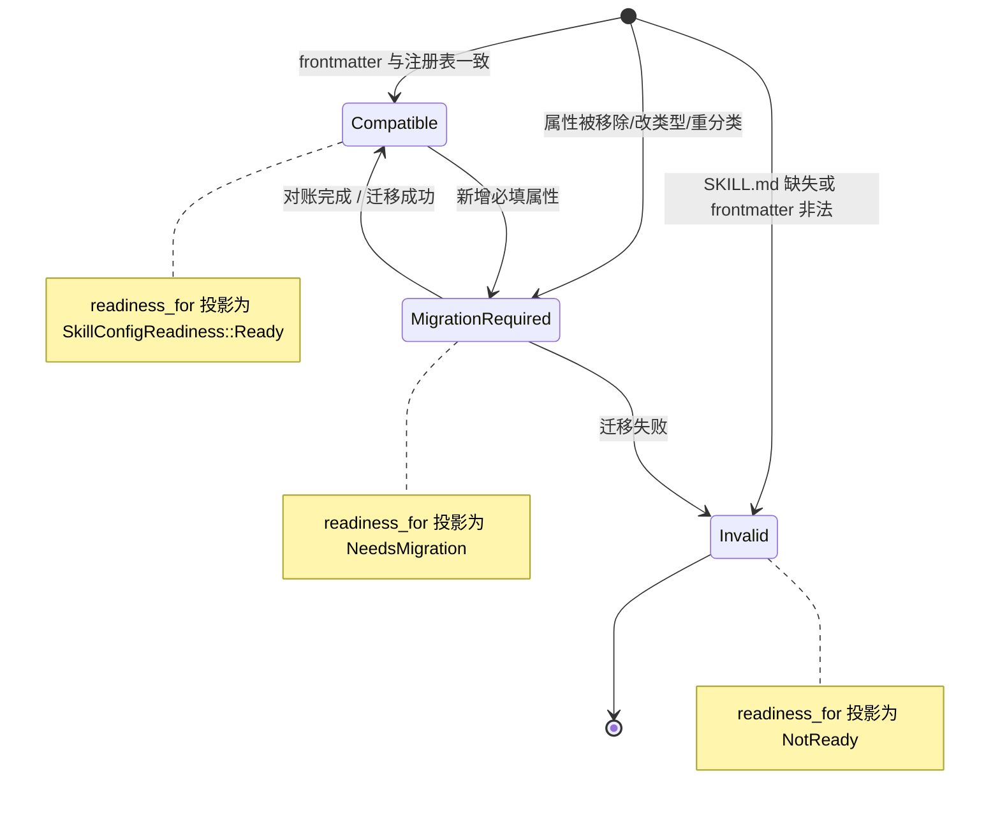

# Skill 管理

Skill 是按需挂载到 Agent 上的能力包。native 侧负责发现、挂载、漂移对账和 Agent 绑定；frontend 不会直接访问文件系统。

## 双重作用域

Skill 在两个相互隔离的作用域中管理：

- **`global`** —— 存放在固定的用户主目录下的 VaneHub Skill 目录中。
- **`workspace`** —— 存放在当前 workspace 目录下的 VaneHub Skill 目录中。

同一个 Skill id 可以在两个作用域中同时存在；它们的启用状态、source path、Agent 绑定、漂移状态和删除各自独立管理。

## SKILL.md 契约

每个 Skill 由一个 `SKILL.md` 文件定义，具有固定的 frontmatter schema：`id`、`name`、`description`、`category`、`version` 和可选的 `triggers`。`id` 在创建后不可变。指向一个没有 `SKILL.md`（或 frontmatter 非法）的目录的注册表记录会被报告为漂移，而不会被视为健康。

## 配置漂移与就绪

每个 Skill 的配置漂移由 `SkillConfigDrift` 描述，并通过 `readiness_for` 投影到 `SkillConfigReadiness`，决定该 Skill 是否可挂载到 Agent。schema 漂移不会被静默忽略——任何与磁盘 `SKILL.md` frontmatter 不一致的注册表记录都会进入以下三种状态之一。

**漂移分类规则**：来自 `classify_drift` 的判定如下。

- 新增可选属性 → `Compatible`(向前兼容)。
- 移除属性、修改属性类型、或将属性重新分类 → `MigrationRequired`。
- secret 字段从凭据存储(credential store)中移出 → `MigrationRequired`(凭据迁移需显式对账)。
- `SKILL.md` 文件缺失、frontmatter 解析失败或 `id` 与注册表不符 → `Invalid`。

**双 scope 协同**：全局与工作区两种作用域各自独立存放 `SKILL.md` 契约(frontmatter)、启用状态、source path 与 Agent 绑定。工作区 scope 的配置覆盖全局 scope 的同 `id` 条目。漂移检测、内置 seeding 与对账(reconciliation)在两个 scope 上分别运行——全局 seeding 不会写入工作区目录，工作区漂移不会污染全局就绪状态。

## 关键类型与生命周期

Skill 配置漂移与就绪投影位于 `tooling/skills/domain/config_state.rs` 与 `config_schema.rs`:

- **`SkillConfigDrift`** —— 由 `classify_drift(schema, stored, stored_secret_keys)` 判定,三值:`Compatible`(向前兼容)、`MigrationRequired`(需显式迁移)、`Invalid`(无效)。
- **`readiness_for(schema, resolved, drift)`** —— 把 drift 投影为 `SkillConfigReadiness`(`Ready` / `NeedsMigration` / `NotReady`)。漂移不静默——schema 变更要么兼容,要么要求显式迁移,绝不静默复用旧值。
- **漂移规则** —— 新增可选属性 → `Compatible`;移除属性、改类型、重分类属性 → `MigrationRequired`;secret 字段从凭据存储移出 → `MigrationRequired`(凭据迁移需显式对账,拒绝复用);`SKILL.md` 缺失、frontmatter 解析失败或 `id` 与注册表不符 → `Invalid`。
- **作用域覆盖语义** —— 工作区 scope 的同 `id` 条目覆盖全局 scope;清除更低作用域的值后,更高作用域的值重新生效(低作用域的覆盖不会被物化进高作用域)。
- **委托类型** `delegation.rs` —— Skill 可声明 `ScopedEdit` 等委托类型,定义 Skill 对工具调用的介入边界。

## 统一架构:CLI Agent 与 OnePiece

Skill 体系是**统一管理**的——同一套 Skill 定义、作用域、漂移检测与覆盖层治理,对内置 CLI Agent(claude-code、codex-cli、gemini-cli、opencode、antigravity-cli)和 OnePiece 原生 Agent 一视同仁。统一体现在:

- **同一套规范 Skill id 与 SKILL.md 契约** —— 不区分消费方是 CLI 还是 OnePiece;绑定引用的是规范 Skill id,而非某个 Agent 的私有格式。
- **同一套双 scope(全局/工作区)** —— 启用状态、绑定、漂移、删除意图在全局与工作区两个作用域管理,工作区覆盖全局同 id 条目。
- **同一套覆盖层治理** —— Overlay(System/User/Project)在基础包选定后重放,产出最终生效视图;所有消费方都拿这个治理后的快照。
- **同一漂移检测与内建播种** —— `classify_drift` 与 `readiness_for` 对所有 Skill 一致;内建 seeding 在两个 scope 分别运行。

差异在**注入机制**(因为 CLI 与 OnePiece 的运行时形态不同):

| 维度 | 内置 CLI Agent | OnePiece 原生 Agent |
| --- | --- | --- |
| Skill 如何生效 | VaneHub 控制启动参数与外部 CLI 进程,Skill 经覆盖层治理后按 CLI 的机制注入(如 system prompt 片段或挂载路径);CLI 内部的工具系统不由 VaneHub 控制 | 经 `AgentSkillPort` 直接消费生效视图:eager Role Skill 注入 system prompt;on-demand 经 `list_skills`/`load_skill`/`read_skill_resource` 三个固定只读工具加载 |
| 工具暴露 | CLI 自身的工具系统 | OnePiece 的 native 工具目录(固定工具 + Skill 工具 + MCP 工具) |
| 可观测性 | CLI 内部是黑盒,链路只到边界 | Skill 加载与工具调用是原生保真度,可在链路中逐层展开 |

**统计管理 Skill** 的能力对两者一致:`list_skills` 返回限界生效元数据(不含指令正文)、`read_skill_resource` 按逻辑 URI 读取资源、漂移与就绪状态统一报告。资源用逻辑标识符(如 `skill://code-review/references/checklist.md`)寻址,模型永不收到宿主路径。详见[生效 Skill 运行时](effective-skill-runtime.md)与[Skill 覆盖层治理](skill-overlay-governance.md)。

## 设计所在之处

本章用于引导贡献者。权威需求——双重作用域、`SKILL.md` schema、漂移、Agent 绑定，以及内置 seeding/对账契约——位于 spec 中。

- [openspec/specs/skill-management](../../../../openspec/specs/skill-management/spec.md)
- [openspec/specs/agent-skill-injection](../../../../openspec/specs/agent-skill-injection/spec.md)

负责此项的 `tooling` 限界上下文见 [Native bounded contexts](native-contexts.md)。
