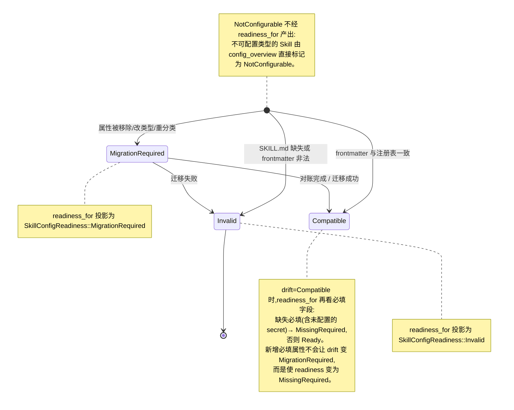

# Skill 管理

Skill 是按需挂载到 Agent 上的能力包。native 侧负责发现、挂载、漂移对账和 Agent 绑定；frontend 不会直接访问文件系统。

## Skill、MCP、Function Calling 三层关系

在理解 Skill 管理之前,先厘清它与 MCP、Function Calling 的边界。三者不是竞争关系,而是**分层协作**:Function Calling 是协议层(怎么调用),MCP 是连接层(调用什么外部系统),Skill 是知识层(什么时候该调用、调用时遵循什么规范)。

| 维度 | Function Calling | MCP | Skill |
| --- | --- | --- | --- |
| **本质** | 底层协议:模型生成结构化参数触发一个函数 | 标准化的"外部连接":把工具/数据源接入模型 | 程序化知识:教模型"怎么把事做对" |
| **类比** | USB 接口的电气规范 | USB-C 接口本身(连接工具和数据) | 说明书 / SOP(标准作业程序) |
| **是否需要服务端** | 否(只是调用约定) | 是,MCP server 是运行中的程序,桥接外部系统 | 否,Skill 是静态指令注入到上下文 |
| **触发方式** | 模型主动调用已注册的 function | 模型主动调用已连接的工具 | 基于 `description` 语义匹配,动态加载指令 |
| **解决的问题** | "怎么把一次调用结构化" | 连接实时数据、执行副作用(查询/fetch/当前状态) | 教会模型如何恰当地思考与行动,而非点哪个按钮或调哪个 API |
| **状态/权限** | 无状态,仅参数传递 | 有状态,需鉴权、维护连接 | 无状态,纯文本,无需权限系统 |
| **可移植性** | 依赖具体实现(各家 API 略有差异) | 开放协议,跨客户端通用 | 已开放为标准 |

### Skill 的核心机制

Skill 本质上是**程序化知识**(procedural knowledge),不是工具或连接。它是一个文件夹,含一个 `SKILL.md`(frontmatter + 指令正文),可选附带脚本/模板/参考资料。

- **渐进式加载**(progressive disclosure):Agent 默认只看到 Skill 的 `name` + `description`(几十 token),任务匹配时才把完整指令正文拉进上下文,避免所有 Skill 常驻消耗上下文窗口。本项目里这由 on-demand Role Skill 的 `list_skills`/`load_skill`/`read_skill_resource` 三个固定只读工具实现。
- **自动触发**:基于 `description` 语义匹配,无需用户显式调用。
- **无需服务端**:Skill 是指令和文件,没有服务器要跑,纯粹是知识注入。
- **单一职责**:一个 Skill 对应一类清晰的工作流;不要把多个不相关能力捆在一个 Skill 里,否则匹配逻辑会模糊。
- **知识是静态的,动作引用外部能力**:Skill 可以写"调用某 MCP 工具""执行某脚本",但 Skill 本身不持有连接状态或凭证——这是与 MCP 的分界线。

### 关系而非竞争

一个判断标准:场景里出现"查询""fetch""当前状态"这类词,说明需要 MCP server 而不是 Skill;如果是"怎么写""按什么规范做""checklist 是什么",那是 Skill 的领域。

在本项目里三者叠加使用:Skill 的指令会告诉 Agent"这一步该用某个 MCP 工具",而 MCP 工具本身经 Function Calling(OnePiece 的 tool-use 循环)被实际触发。详见[工具注册表与执行](tool-registry.md)与[MCP 工具与客户端](mcp-tools.md)。

## 双重作用域

Skill 在两个相互隔离的作用域中管理：

- **`global`** —— 存放在固定的用户主目录下的 VaneHub Skill 目录中。
- **`workspace`** —— 存放在当前 workspace 目录下的 VaneHub Skill 目录中。

同一个 Skill id 可以在两个作用域中同时存在；它们的启用状态、source path、Agent 绑定、漂移状态和删除各自独立管理。

## SKILL.md 契约

每个 Skill 由一个 `SKILL.md` 文件定义，具有固定的 frontmatter schema：`id`、`name`、`description`、`category`、`version` 和可选的 `triggers`。`id` 在创建后不可变。指向一个没有 `SKILL.md`（或 frontmatter 非法）的目录的注册表记录会被报告为漂移，而不会被视为健康。

## 配置漂移与就绪

每个 Skill 的配置漂移由 `SkillConfigDrift` 描述,并通过 `readiness_for` 投影到 `SkillConfigReadiness`,决定该 Skill 是否可挂载到 Agent。`SkillConfigReadiness` 有五个变体:`Ready`、`MissingRequired`、`MigrationRequired`、`Invalid`、`NotConfigurable`。schema 漂移不会被静默忽略——任何与磁盘 `SKILL.md` frontmatter 不一致的注册表记录都会进入以下三种 drift 状态之一,再由 `readiness_for` 投影为对应的 readiness。

**漂移分类规则**：来自 `classify_drift` 的判定如下。

- 新增可选属性 → `Compatible`(向前兼容)。
- 移除属性、修改属性类型、或将属性重新分类 → `MigrationRequired`。
- secret 字段从凭据存储(credential store)中移出 → `MigrationRequired`(凭据迁移需显式对账)。
- `SKILL.md` 文件缺失、frontmatter 解析失败或 `id` 与注册表不符 → `Invalid`。

**双 scope 协同**：全局与工作区两种作用域各自独立存放 `SKILL.md` 契约(frontmatter)、启用状态、source path 与 Agent 绑定。工作区 scope 的配置覆盖全局 scope 的同 `id` 条目。漂移检测、内置 seeding 与对账(reconciliation)在两个 scope 上分别运行——全局 seeding 不会写入工作区目录，工作区漂移不会污染全局就绪状态。

## 关键类型与生命周期

Skill 配置漂移与就绪投影位于 `tooling/skills/domain/config_state.rs` 与 `config_schema.rs`:

- **`SkillConfigDrift`** —— 由 `classify_drift(schema, stored, stored_secret_keys)` 判定,三值:`Compatible`(向前兼容)、`MigrationRequired`(需显式迁移)、`Invalid`(无效)。
- **`readiness_for(schema, resolved, drift)`** —— 把 drift 投影为 `SkillConfigReadiness`（`Ready` / `MissingRequired` / `MigrationRequired` / `Invalid` / `NotConfigurable`）。漂移不静默——schema 变更要么兼容,要么要求显式迁移,绝不静默复用旧值；drift 为 `Compatible` 但缺失必填字段时 readiness 降级为 `MissingRequired`。
- **漂移规则** —— 新增可选属性 → `Compatible`;移除属性、改类型、重分类属性 → `MigrationRequired`;secret 字段从凭据存储移出 → `MigrationRequired`(凭据迁移需显式对账,拒绝复用);`SKILL.md` 缺失、frontmatter 解析失败或 `id` 与注册表不符 → `Invalid`。
- **作用域覆盖语义** —— 配置覆盖由 `SkillConfigScope::{User, Project}` 承载(`User`/`Project` 两个可写作用域,无 System/Remote):`Project` 的同 `id` 条目覆盖 `User`;清除更高作用域的值后,更低作用域的值重新生效(低作用域的覆盖不会被物化进高作用域)。注意这与 Skill 本身的 `SkillScope::{Global, Workspace}` 是不同概念——前者是配置覆盖层,后者是 Skill 存放位置。
- **委托类型** `delegation.rs` —— Skill 可声明 `ScopedEdit` 等委托类型,定义 Skill 对工具调用的介入边界。

## 统一架构:CLI Agent 与 OnePiece

Skill 体系是**统一管理**的——同一套 Skill 定义、作用域、漂移检测与覆盖层治理,对内置 CLI Agent(claude-code、codex-cli、gemini-cli、opencode、antigravity-cli)和 OnePiece 原生 Agent 一视同仁。统一体现在:

- **同一套规范 Skill id 与 SKILL.md 契约** —— 不区分消费方是 CLI 还是 OnePiece;绑定引用的是规范 Skill id,而非某个 Agent 的私有格式。
- **同一套双 scope(全局/工作区)** —— 启用状态、绑定、漂移、删除意图在全局与工作区两个作用域管理,工作区覆盖全局同 id 条目。
- **同一套覆盖层治理** —— Overlay(`SkillLayer` 四层：`Project`/`User`/`Registry`/`System`,优先级 project>user>registry>system)在基础包选定后重放,产出最终生效视图;所有消费方都拿这个治理后的快照。
- **同一漂移检测与内建播种** —— `classify_drift` 与 `readiness_for` 对所有 Skill 一致;内建 seeding 在两个 scope 分别运行。

差异在**注入机制**(因为 CLI 与 OnePiece 的运行时形态不同):

| 维度 | 内置 CLI Agent | OnePiece 原生 Agent |
| --- | --- | --- |
| Skill 如何生效 | VaneHub 控制启动参数与外部 CLI 进程,Skill 经覆盖层治理后按 CLI 的机制注入(如 system prompt 片段或挂载路径);CLI 内部的工具系统不由 VaneHub 控制 | 经 `AgentSkillPort` 直接消费生效视图:eager Role Skill 注入 system prompt;on-demand 经 `list_skills`/`load_skill`/`read_skill_resource` 三个固定只读工具加载 |
| 工具暴露 | CLI 自身的工具系统 | OnePiece 的 native 工具目录(固定工具 + Skill 工具 + MCP 工具) |
| 可观测性 | CLI 内部是黑盒,链路只到边界 | Skill 加载与工具调用是原生保真度,可在链路中逐层展开 |

**统计管理 Skill** 的能力对两者一致:`list_skills` 返回限界生效元数据(不含指令正文)、`read_skill_resource` 按逻辑 URI 读取资源、漂移与就绪状态统一报告。资源用逻辑标识符(如 `skill://code-review/references/checklist.md`)寻址,模型永不收到宿主路径。详见[生效 Skill 运行时](effective-skill-runtime.md)与[Skill 覆盖层治理](skill-overlay-governance.md)。

## 设计所在之处

本章用于引导贡献者。权威需求——双重作用域、`SKILL.md` schema、漂移、Agent 绑定，以及内置 seeding/对账契约——位于 spec 中。

- [openspec/specs/skill-management](../../../../openspec/specs/skill-management/spec.md)
- [openspec/specs/agent-skill-injection](../../../../openspec/specs/agent-skill-injection/spec.md)

负责此项的 `tooling` 限界上下文见 [Native bounded contexts](native-contexts.md)。
