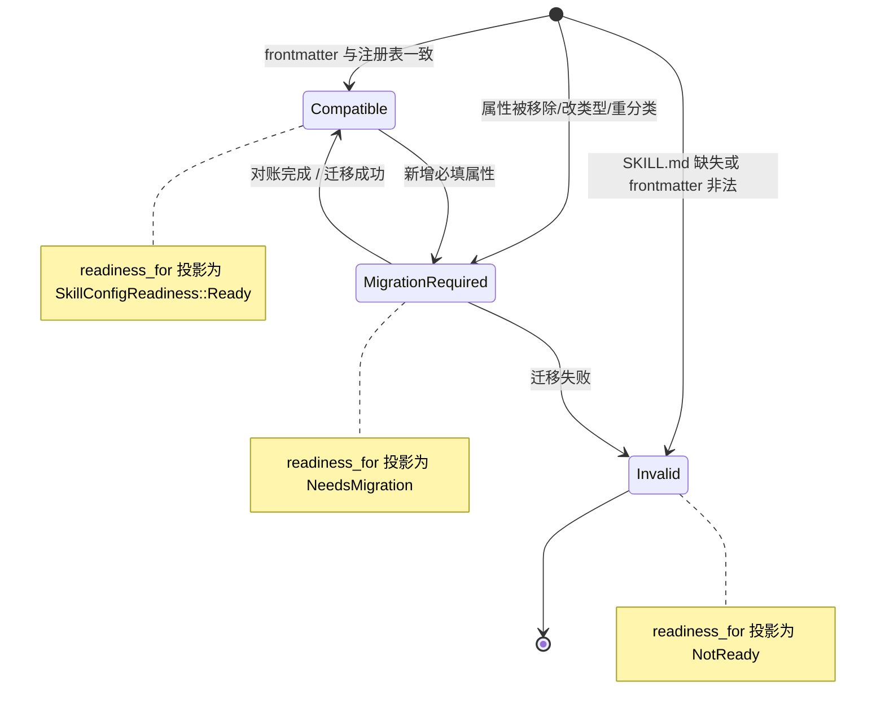

# Skill 管理

Skill 是按需挂载到 Agent 上的能力包。native 侧负责发现、挂载、漂移对账和 Agent 绑定；frontend 不会直接访问文件系统。

## 双重作用域

Skill 在两个相互隔离的作用域中管理：

- **`global`** —— 存放在固定的用户主目录下的 VaneHub Skill 目录中。
- **`workspace`** —— 存放在当前 workspace 目录下的 VaneHub Skill 目录中。

同一个 Skill id 可以在两个作用域中同时存在；它们的启用状态、source path、Agent 绑定、漂移状态和删除各自独立管理。

## SKILL.md 契约

每个 Skill 由一个 `SKILL.md` 文件定义，具有固定的 frontmatter schema：`id`、`name`、`description`、`category`、`version` 和可选的 `triggers`。`id` 在创建后不可变。指向一个没有 `SKILL.md`（或 frontmatter 非法）的目录的注册表记录会被报告为漂移，而不会被视为健康。

## 配置漂移与就绪

每个 Skill 的配置漂移由 `SkillConfigDrift` 描述，并通过 `readiness_for` 投影到 `SkillConfigReadiness`，决定该 Skill 是否可挂载到 Agent。schema 漂移不会被静默忽略——任何与磁盘 `SKILL.md` frontmatter 不一致的注册表记录都会进入以下三种状态之一。

**漂移分类规则**：来自 `classify_drift` 的判定如下。

- 新增可选属性 → `Compatible`(向前兼容)。
- 移除属性、修改属性类型、或将属性重新分类 → `MigrationRequired`。
- secret 字段从凭据存储(credential store)中移出 → `MigrationRequired`(凭据迁移需显式对账)。
- `SKILL.md` 文件缺失、frontmatter 解析失败或 `id` 与注册表不符 → `Invalid`。

**双 scope 协同**：全局与工作区两种作用域各自独立存放 `SKILL.md` 契约(frontmatter)、启用状态、source path 与 Agent 绑定。工作区 scope 的配置覆盖全局 scope 的同 `id` 条目。漂移检测、内置 seeding 与对账(reconciliation)在两个 scope 上分别运行——全局 seeding 不会写入工作区目录，工作区漂移不会污染全局就绪状态。

## 设计所在之处

本章用于引导贡献者。权威需求——双重作用域、`SKILL.md` schema、漂移、Agent 绑定，以及内置 seeding/对账契约——位于 spec 中。

- [openspec/specs/skill-management](../../../../openspec/specs/skill-management/spec.md)
- [openspec/specs/agent-skill-injection](../../../../openspec/specs/agent-skill-injection/spec.md)

负责此项的 `tooling` 限界上下文见 [Native bounded contexts](native-contexts.md)。
