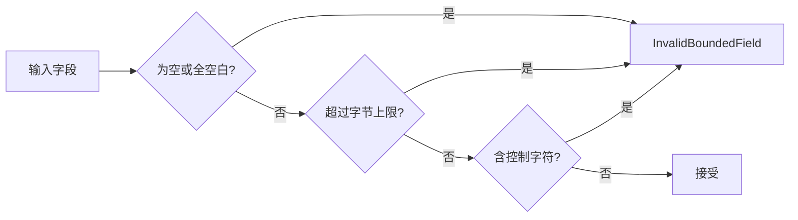

# SSH 连接与远程运行时

`ssh_connections` 上下文拥有连接档案、主机密钥信任、凭据加载与池化的远程运行时。

它和[终端与 PTY 运行时](terminal-runtime.md)的分工是：那一章讲**本地** PTY 的归属模型，这一章讲远端。**两者不是同一套机制**——本地走 `portable-pty` 的 `openpty`，远端走 russh 在 SSH 会话上请求的远程 PTY。

## 主机密钥信任

`HostKeyChallengeKind` 只有两种取值，但两者的含义天差地别：

| 取值 | 含义 | 该怎么处理 |
| --- | --- | --- |
| `FirstSeen` | 第一次连这台主机 | 让用户确认指纹并记住 |
| `Changed` | 指纹与记住的不一致 | **停下来** |

**把这两种分开是整个上下文最重要的一件事**。第一次见到是正常的，指纹变了则可能是服务器重装，**也可能是中间人**。系统不会自动接受变更——把它降级成一次「新主机确认」等于取消了主机密钥这个机制的全部意义。

`HostKeyEvidence` 只有两个字段：`algorithm` 与 `fingerprint`，且都过 `validate_bounded`。

## 有界字段一律拒绝而非截断



| 字段 | 上限 |
| --- | --- |
| 主机名 | **255** 字节 |
| 算法名 | **96** 字节 |
| 指纹 | **160** 字节 |

三道检查里**控制字符那道最容易被忽略**：指纹和算法名会被显示给用户看，让控制字符混进去，界面上呈现的内容就可能与实际记住的值不一致——用户点「确认」时看到的不是他真正批准的东西。

超限时返回 `InvalidBoundedField(field)` 带上是哪个字段，而不是笼统报错。

## 远程通道事件

`RemoteSshChannelEvent` 六种：

| 事件 | 含义 |
| --- | --- |
| `Output` | 标准输出 |
| `ExtendedOutput { stream, content }` | 带流号的扩展输出（stderr 等） |
| `ExitStatus(u32)` | 进程正常退出，带退出码 |
| `ExitSignal(String)` | 进程被信号终止 |
| `Eof` | 对端不再发送 |
| `Closed` | 通道关闭 |

**`ExitStatus` 与 `ExitSignal` 是分开的**：退出码 0 和「被 SIGKILL 打死」都不是「成功」或「失败」能概括的，把信号折叠成一个假的退出码会丢掉进程为何终止这个信息。

**`Eof` 与 `Closed` 也是分开的**：对端说完了、和通道没了，是两回事——前者之后仍可能有退出状态要收。

## 连接池的四个常量

远程终端传输池的限额定义在 `workspaces` 的 `remote_terminal_limits.rs`：

| 常量 | 值 |
| --- | --- |
| `REMOTE_TERMINAL_POOL_CAPACITY` | **8** |
| `REMOTE_TERMINAL_IDLE_TIMEOUT_SECONDS` | **300**（5 分钟） |
| `REMOTE_TERMINAL_CONNECT_TIMEOUT_SECONDS` | **15** |
| `REMOTE_TERMINAL_KEEPALIVE_SECONDS` | **30** |

这些常量之间的关系由测试锁住，不是各调各的：

```text
DRAIN_TIMEOUT   < IDLE_TIMEOUT
KEEPALIVE       < IDLE_TIMEOUT
POOL_CAPACITY  ∈ 1..=32
```

**keepalive 必须小于 idle 超时**，否则保活包永远等不到发出去连接就已经被判定为空闲回收了——两个常量各自看都合理，配错了却让保活形同虚设。**排空超时必须小于空闲超时**同理：留给未读输出的窗口如果比回收间隔还长，那些输出就永远等不到被读走。关闭连接时给未读输出一个短暂窗口，通常正是报错所在。

## 凭据

连接凭据交由操作系统的密钥链保存，上下文只持有引用。这与 [Agent 配置](../../../cli-agent-global-configuration.md)里 CLI provider 凭据的处理一致：**标记为机密的字段保存后不再回显**。

## 远端的能力边界

远端不是本地的完整投影，两条限制来自实现而非疏漏：

- **远端不支持 Git worktree**——只能指向远端已存在的路径。因此依赖 worktree 的持久化 [Loop 运行时](loop-and-plan-runtime.md)不适用于远程工作区。会话 Plan 模式只是只读会话策略，不是 worktree 运行时。
- **本地 PTY 的归属模型不原样延伸到远端**，远程会话走自己的运行时路径。

## 与其他上下文的关系

- 远程终端的池化实现与限额由 `workspaces` 持有，见[终端与 PTY 运行时](terminal-runtime.md)。
- 上下文归属见 [Native 限界上下文](native-contexts.md)。
- 用户侧配置流程见用户指南的远程与 IM 一章。

## 设计所在

本章用于为贡献者定向，权威需求位于 `openspec/specs` 下的 `remote-terminal-runtime` 等主规范中。
