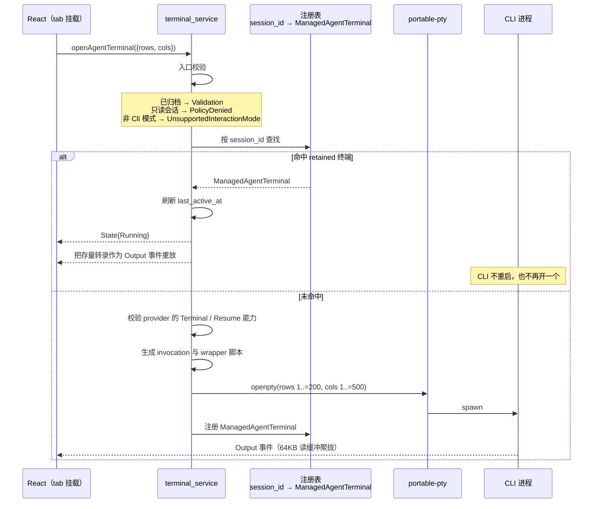

# 终端与 PTY 运行时

单 Agent CLI 会话运行在一个会话级 Agent Terminal 内：这是一个由 native 运行时拥有、以 PTY 为底座的 CLI 进程，通过 frontend Agent service 边界暴露给 React。React 组件绝不直接调用 Tauri command 来管理终端生命周期。

## 会话级、单 Agent

Agent Terminal 面向未归档的单 Agent CLI 会话。对已归档会话发起的终端启动请求会被拒绝，不会启动任何 CLI 进程，并返回一个简洁的、可向用户展示的失败信息。

## 自动启动与附着

当单 Agent 会话被创建或选中后，UI 会自动为该会话请求 Agent Terminal 启动——没有单独的启动按钮。如果选中的会话已经有一个活跃的 retained Agent Terminal 进程，UI 会附着到已有的终端流上，而不是为同一会话再启动一个重复的 CLI 进程。

## 远程终端

远程 SSH workspace 暴露其自身的远程终端运行时路径；本地 PTY 的归属模型不会原样延伸到远程会话。远程 workspace 的工作流见用户指南，`workspaces`/`sessions` 的归属划分见 [Native bounded contexts](native-contexts.md)。

## 本地 PTY 实现

本地 Agent 终端基于 `portable-pty` 库。核心结构 `ManagedAgentTerminal`(`agent_runtime/infrastructure/terminal_process.rs`)持有 `master: Box<dyn MasterPty>`、`writer`、`child` 与一个有界转录缓冲 `BoundedTextBuffer`。注册表以 **session_id 为键**映射到 `ManagedAgentTerminal`,即"会话级单 Agent 终端"的归属。

- **有界转录缓冲** `BoundedTextBuffer` —— `{chunks: VecDeque, bytes, max_bytes}`;`RETAINED_TERMINAL_TRANSCRIPT_BYTES = 1MB`,超限从队头按 **UTF-8 字符边界** 裁切;`snapshot()` 拼接全文供附着时重放。
- **读缓冲** `TERMINAL_READ_BUFFER_BYTES = 64KB` —— 大缓冲聚拢突发输出、减少 IPC 事件数;`take_decodable_utf8` 处理跨读分裂的 UTF-8。
- **Shell 类型** `AgentTerminalShell`(WindowsPowerShell / WindowsCmd / UnixDefault)—— Windows 优先 `powershell.exe`,否则 `cmd.exe`;Unix 用 `$SHELL` 或 `/bin/sh`。
- **wrapper 脚本** `generate_agent_terminal_wrapper` —— 生成 `.ps1`/`.cmd`/`.sh` 包裹脚本,设置 UTF-8、进入会话目录、`exec` 目标 CLI;`validate_token` 拒绝空与 NUL;`redacted_command` 用于日志。
- **终端尺寸** —— rows clamp `1..=200`、cols clamp `1..=500`。

### 本地 PTY 中的自动启动与附着



`open_or_attach` 先查注册表,按 session_id 命中即视为 retained 终端——刷新 `last_active_at`、发 `State{Running}` 事件、把**存量转录作为 Output 事件重放**(不必重启 CLI)。否则走新开流程:校验 provider `Terminal`/`Resume` 能力、生成 invocation 与 wrapper、`openpty`、spawn、注册。

前端在 tab 挂载时即 `openAgentTerminal({rows, cols})`;`sessionActivationKey` 变化且无 terminalId 且状态为 stopped/failed 时自动重连。

### 归档与只读拒绝

`terminal_service.rs` 在 `open_or_attach` 入口拒绝:已归档会话 → `Validation("Archived sessions cannot start Agent terminals.")`;只读(verifier)会话 → `PolicyDenied{action:"open-terminal"}`;非 `Cli` 交互模式 → `UnsupportedInteractionMode`。

### 并发与死锁防护

阻塞 I/O 不在注册表锁内执行。`reap_terminal_without_holding_lock` 用 `try_wait()` 50ms 轮询、短锁持有,避免 reader 线程与 `stop()` 的 kill 互相死锁;`terminate_terminal_child` 锁内 kill、解锁后 reap。独立 usage 轮询线程 250ms tick、5s 间隔,经 `AtomicBool alive` 停止并 join。

### 空闲回收

后台每 60s 调用 `cleanup_idle_agent_terminals`,`AGENT_TERMINAL_IDLE_TIMEOUT_SECONDS = 2 小时` 的空闲 Agent 终端被回收。

## 远程终端(SSH)

远程终端走 **russh 库**在 SSH 会话上请求的远程 PTY,与本地 `portable-pty` openpty 完全不同:`channel_open_session` → `request_pty(true, "xterm-256color", cols, rows, 0, 0, &[])` → `request_shell(true)`。远程 shell 传输池有独立的容量与 idle 限制(`remote_terminal_limits.rs`)。

## retained Session Shell:所有权、准入与有界清理

retained Session Shell 与上文的 Agent Terminal 是两套不同的生命周期:它比打开它的视图活得更久,只有显式关闭才会结束它。因此所有权就是整个设计的核心。下面的一切都源于一个事实:操作系统进程无法加入事务。

### 世代(generation)

每个 worker 事件、路由条目、retained 句柄、容量租约、关闭尝试与 Reaper 工作项都带 `(shell_id, generation)`。Shell id 是 UUID 且永不复用,所以 generation 不是用来区分两个*名字*,而是用来区分两条*生命*。reader 线程、路由条目与 Reaper 尝试都可能比创建它们的 Shell 活得更久,而一条不带 generation 的完成通知无法与当前仍然有效的那条区分开。

### 启动顺序

```text
原子地预留容量 → 把 Shell 注册为 `Opening` → 在启动守卫下调用运行时
→ 仅当没有终止事件抢先到达时才把 `Opening → Running`
```

"运行时返回*之后*再注册"读起来更安全——打开失败就什么都不留下——但它正是丢掉 `echo && exit` 第一行输出的原因:reader 把输出发布到一个从未听说过该 Shell 的 store 里。先注册、失败再回滚,能同时保住这两个性质。处于 `Opening` 的 Shell 可寻址,但刻意不可写。

`LocalShellLaunchGuard` 从第一次成功获取起就拥有子进程、PTY 句柄、writer 与各 worker,因此启动路径上每个 `?` 都会经由有界终止展开,而不是越过一个存活进程直接返回。`RemoteShellLaunchGuard` 只拥有新开的 channel:池化的 SSH 传输属于池,可能同时承载其他 Shell。

### 准入

`ShellCapacityController` 同时预留应用级上限与会话级上限,要么都成功,要么都不成功。它返回的只可移动的 `ShellCapacityLease` 在 Shell 的整个生命周期内都存放在 store 条目中,所以处于 `Closing`、`Reaping` 或 `CloseFailed` 的 Shell 仍占用其名额——它的进程仍然存在,提前释放名额会重新造成超卖。

### 关闭

`SessionShellRuntimePort::close` 返回 `ShellRuntimeCloseOutcome`,而不是 `Result<(), _>`。关闭出错的每一种情形都意味着适配器仍然拥有一个子进程或 channel,所以"它失败了"与"它仍归我所有"是同一个事实——而 `Result` 会诱使人写出 `let _ = close(..)`,把一个存活进程的最后一个引用丢掉。

本地关闭序列,在注入的单调 `ShellCloseBudget` 之下:

```text
停止输入(drop writer) → 观察 → terminate → 观察 → force → 观察 → 完成各 worker
```

没有任何阶段会无上限地等待。只有当 worker 自报完成后才会被 join;`ShellWorker` 通过 drop 守卫设置该标志,因此 panic 的 worker 也会报告完成。

### 状态与处置

| 状态 | 含义 |
| --- | --- |
| `Opening` | 已注册,运行时尚未提交。不可写。 |
| `Closing` | 一次有界关闭尝试进行中。非终态。 |
| `Reaping` | 该次尝试预算耗尽;后续由 Reaper 接管。非终态。 |
| `CloseFailed` | 清理失败并带原因;句柄仍由此处持有。非终态。 |
| `Closed` | 唯一表示"所有持有资源均已确认消失"的状态。 |

`ShellCloseDisposition` 在 API 边界上与之对应:`ClosedConfirmed`、`Reaping`、`CloseFailed`、`AlreadyTerminal`。只有第一个与最后一个是已定局的。

### Reaper

`ShellReaperQueue` 是一个有界的工作*身份*队列,由现有的空闲清扫每次固定数量地排空。它不持有任何句柄:未能关闭某个 Shell 的运行时并没有放手,如果这里再放一个句柄,就成了同一子进程的第二个所有者。这正是队列满时可以安全拒绝的原因——没有任何东西从所有者手里移出,拒绝不会丢掉任何资源,Shell 仍停在 `CloseFailed`,可以手动重试。

### 会话清理

归档、删除、空闲清扫与关机都消费 `SessionShellCleanupReport`,它保留每个 Shell 的身份与处置,而不是一个通过/失败。收尾前的判定谓词是 `is_complete()`,它不等于"没有返回错误":`Reaping` 不是错误,但仍意味着有进程活着。关机会记录残留资源后返回,绝不无上限地等待。

### 本设计不保证的事

清理只对 VaneHub 拥有的子进程有保证。刻意脱离进程组的后代进程不在覆盖范围内,这一点不是设计的规范性保证。

## 终端输出捕获

Agent 终端只保留内存有界转录(1MB);持久化的 Terminal 捕获走 workspaces 的捕获服务,两者分离。

- **有界捕获队列** `BoundedCaptureQueue` —— `TERMINAL_CAPTURE_QUEUE_CHUNKS=256`、`TERMINAL_CAPTURE_CHUNK_BYTES=32KB`、`TERMINAL_CAPTURE_BATCH_CHUNKS=32`;满则 `pop_front` 并置 `dropped=true`。
- **缺口标记** —— `drain_batch` 若曾丢弃,先输出一条 `source: Gap`、`content: "[capture gap]"` 的缺口标记,再排空——不静默丢数据。
- **保留与容量** —— `TERMINAL_CAPTURE_RETENTION_DAYS=30`、`TERMINAL_CAPTURE_CAPACITY_BYTES=512MB`;`enforce_capacity` 按最早块循环删除直到总量 ≤ 容量。
- **持久化表** `terminal_output_chunks` —— `UNIQUE(stream_id, sequence)`,带 FTS5 trigram 全文索引;`source IN ('pty','quick-command','gap')`。
- **单块上限** —— `output_chunk.rs` 超 `32KB` 报 `TooLarge`,并剥离 ESC 控制字符。
- **远程池常量** —— `REMOTE_TERMINAL_POOL_CAPACITY=8`、`REMOTE_TERMINAL_IDLE_TIMEOUT_SECONDS=300`、`CONNECT_TIMEOUT=15s`、`KEEPALIVE=30s`。

## 设计所在之处

本章用于引导贡献者。权威需求位于 spec 中。

- [openspec/specs/agent-terminal-runtime](../../../../openspec/specs/agent-terminal-runtime/spec.md)
- [openspec/specs/remote-terminal-runtime](../../../../openspec/specs/remote-terminal-runtime/spec.md)
- [openspec/specs/session-shell](../../../../openspec/specs/session-shell/spec.md)

PTY 与 shell 运行时位于 `workspaces` 和 `sessions` 限界上下文中；见 [Native bounded contexts](native-contexts.md)。
