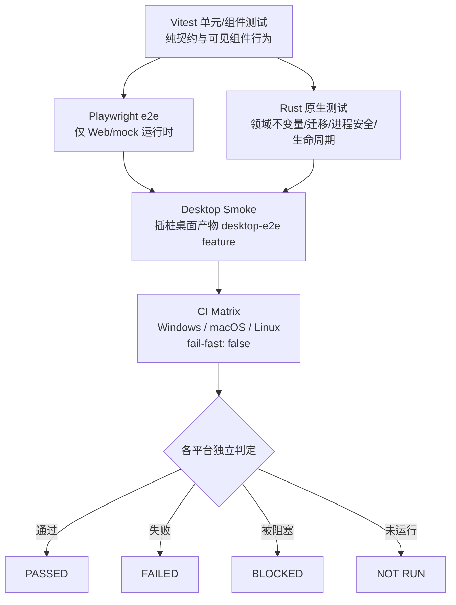

# 测试

**校验命令的唯一真源是仓库根目录的 [`AGENTS.md`](../../../../AGENTS.md)「校验命令」一节。** 本章不再抄一份——两份清单迟早漂移，而漂移的那一半正是 CI 会拦下来的东西。什么时候跑哪一层、每一层覆盖什么、结果能推广到哪里，是本章要讲的。

打包与发布见[发布](release.md)。


前端测试覆盖纯契约与可见的组件行为。Playwright 覆盖浏览器 Web/mock 运行时;通过它并不代表 Tauri 桌面运行时也通过了。native 测试覆盖领域不变量、应用端口编排、持久化/迁移、命令映射、进程安全与生命周期行为。

影响运行时的桌面改动还需额外使用:

```powershell
npm run desktop:unit:test
npm run test:desktop
```

`test:desktop` 会为当前操作系统构建并启动一个带埋点的 native Tauri 产物,等待真实的 React WebView,调用真实的 Rust 后端 `get_settings` 命令,执行一次稳定的导航交互,并请求一次干净的应用关闭。它会设置一个隔离的临时 `VANEHUB_APP_DATA_DIR`;切勿将该变量指向正常的用户数据。

带埋点的产物通过 `desktop-e2e` Cargo feature 和 `src-tauri/tauri.desktop-e2e.conf.json` 启用仅测试可用的 WebDriver 插件与权限。正常的打包命令不包含该 feature。失败证据从截图、驱动输出、进程状态以及既有的已脱敏统一 native 日志写入到 `test-results/desktop/<run-id>/` 之下。

本地结果仅适用于当前平台。CI 在原生 Windows、macOS 与 Linux runner 上独立运行 `Desktop Smoke`,且禁用了矩阵的 fail-fast。逐个平台审查并报告为 `PASSED`、`FAILED`、`BLOCKED` 或 `NOT RUN`;切勿从一个平台推断另一个平台。失败或被阻塞的任务上传带平台标签的证据产物,而成功的任务不保留临时应用数据。

打包通过 Tauri 面向 Windows、macOS 与 Linux。签名凭据属于受保护的发布环境,绝不放入仓库配置或截图。参见已签入的 [发布签名指南](../../reference/release-signing.md)。

## 测试层级

测试金字塔自下而上分为五层,每一层覆盖不同的风险面,且彼此不能互相替代——尤其"Playwright 通过 ≠ desktop 通过"。



层级说明：

- **Vitest**：单元/组件测试，覆盖纯契约与可见的组件行为。覆盖率门槛由 `coverage-policy.json` 强制——前端 `minimumLines = 45.2%`。
- **Playwright e2e**：仅覆盖浏览器 Web/mock 运行时；通过它并不代表 Tauri 桌面运行时也通过了。
- **Rust 原生测试**：覆盖领域不变量、应用端口编排、持久化/迁移、命令映射、进程安全与生命周期行为。整体覆盖率门槛 `minimumLines = 67%`，另有三个 `criticalGroups` 各要求 `minimumLines = 80%`：
  - `sqlite-transactions`：`sessions/infrastructure/transactions.rs`、`platform/database/mod.rs`、`platform/database/migrations/**.rs`；
  - `agent-startup-and-terminal-control`：`agent_runtime/application/terminal_service.rs`；
  - `mcp-routing`：`tooling/mcp/infrastructure/relay.rs`。
- **Desktop Smoke**：插桩桌面产物通过 `desktop-e2e` Cargo feature 与 `src-tauri/tauri.desktop-e2e.conf.json` 启用仅测试可用的 WebDriver 插件与权限；正常打包命令不包含该 feature。它会构建并启动当前操作系统的带埋点 Tauri 产物,等待真实 React WebView,调用真实 Rust 后端 `get_settings` 命令,执行一次稳定导航,并请求干净关闭。本地结果仅适用于当前平台,不得外推。
- **CI Matrix**：`Desktop Smoke` 在原生 Windows、macOS 与 Linux runner 上独立运行,且禁用了矩阵的 `fail-fast`。逐个平台审查并报告为 `PASSED`/`FAILED`/`BLOCKED`/`NOT RUN`；切勿从一个平台推断另一个平台。

补充脚本在改动落到相应区域时必须跑：`npm run test:coverage`(CI 用它取代 `npm run test`)、`npm run coverage:policy:test`、`npm run version:unit:test`、`npm run contracts:check`。UI 行为变更时 `npx playwright test`;运行时/启动链路/IPC 变更时 `npm run desktop:unit:test` 与 `npm run test:desktop`。

## 测试相关脚本与门槛

## 关键脚本与命令

测试与发布链路的核心脚本与门槛:

- **Vitest**:`package.json` `test: "vitest run"`、`test:coverage: "vitest run --coverage --maxWorkers=4 --testTimeout=15000"`;配置在 `vite.config.ts`(排除 `tests/docs/**` 与 `tests/e2e/**`,coverage 输出 `./coverage/frontend`)。
- **Playwright**:`playwright.config.ts` `testDir: "./tests/e2e"`,chromium 单 project,`webServer` 起 `npm run dev --port 5174`。
- **桌面原生测试**:`npm run test:desktop` = `node scripts/test-desktop.mjs all`,分 `test:desktop:build` 与 `test:desktop:smoke`;`test-desktop.mjs` 用 `--features desktop-e2e --config src-tauri/tauri.desktop-e2e.conf.json` 构建插桩 debug 工件,起真实 React WebView → invoke `get_settings` → 导航 → 干净退出;隔离临时 `VANEHUB_APP_DATA_DIR`;失败证据写 `test-results/desktop/<run-id>/`。
- **`desktop:unit:test`** —— 跑 `scripts/desktop-*.node-test.mjs`(自动化边界)。
- **覆盖率门槛** `coverage-policy.json`:frontend `minimumLines: 45.2%`、native `minimumLines: 67%`,三个 `criticalGroups` 各 80 行(`sqlite-transactions`、`agent-startup-and-terminal-control`、`mcp-routing`);检查脚本 `scripts/check-coverage-policy.mjs`。
- **CI Desktop Smoke** `.github/workflows/ci.yml`:`desktop-smoke` job matrix windows/macos/ubuntu,`fail-fast: false`,Linux 用 `xvfb-run -a npm run test:desktop`,失败按平台标注证据。
