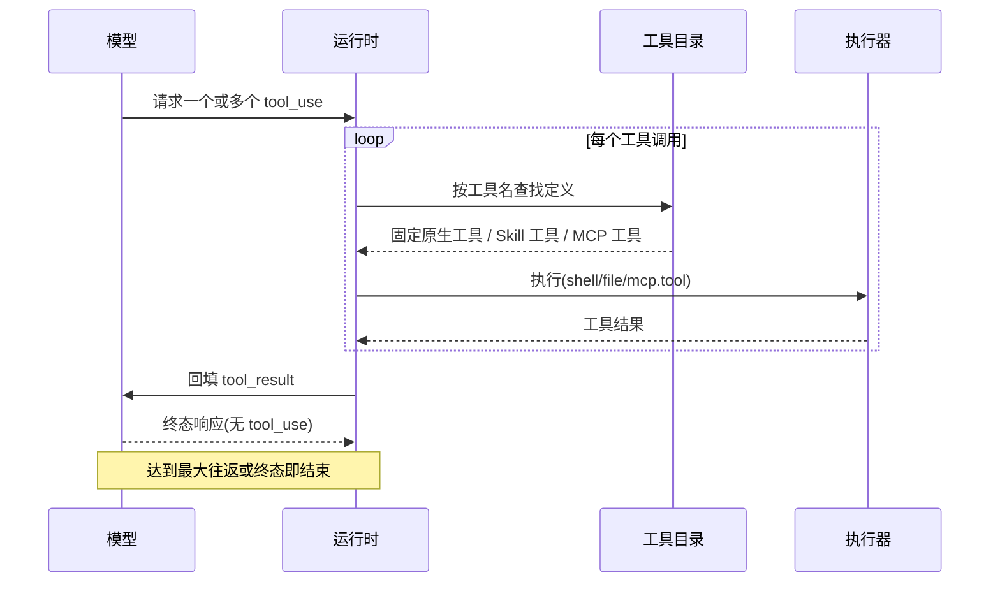

# 工具注册表与执行

Native API Agent(包括 OnePiece)接收一个固定的、与 provider 无关的工具目录,运行时驱动一个多轮 tool-use 循环,直到 provider 返回一个终态响应。来自 MCP 的工具叠加在这个固定目录之上——参见 [MCP 工具与客户端](mcp-tools.md)。

## 固定的 native 工具目录

每次 native API 生成(`launch_kind = api`)都在其发出的 provider 请求中声明同一个固定工具集:

- `shell` —— 命令执行
- `file` —— 读/写
- 内容搜索
- 文件名搜索
- 限定范围的文件编辑
- 跨会话内存

每个工具只定义一次,并按会话 `interface_format` 所要求的请求形态转换:

- `anthropic` → `{name, description, input_schema}`
- `openai-compatible` → `{type: "function", function: {name, description, parameters}}`

## 多轮 tool-use 循环

当 provider 响应请求一个或多个工具调用时,运行时执行这些调用并将其结果作为新的一轮回传,如此重复,直到 provider 返回一个不再包含工具调用的响应。没有工具调用的响应即为该次用户消息的终态响应,等同于一次不带工具的生成。该循环受每条用户消息固定最大往返次数约束;超出该上限会被显式处理,而不是无限循环下去。

## Skill 提供的工具

Skill 可以在固定目录之上贡献自己的工具,这些工具在沙箱中而非宿主进程中执行。相关需求见 [openspec/specs/skill-tool-runtime](../../../../openspec/specs/skill-tool-runtime/spec.md)。

## 工具调用循环

模型每轮可以请求若干工具调用,运行时解析工具名、执行后回填结果,再交给模型进入下一轮,直到模型返回不带工具调用的终态响应。下图展示一次多轮循环的标准时序。

### 循环的终止与边界

- **多轮直到终态** —— 模型返回的响应只要包含 `tool_use`,运行时就执行这些调用并把结果作为新一轮回传;没有工具调用的响应即为该次用户消息的终态响应,等同于一次不带工具的生成。
- **最大往返约束** —— 每条用户消息有固定最大往返次数 `MAX_TOOL_ROUND_TRIPS=25`(见 `contexts/agent_runtime/infrastructure/api_process_adapter.rs`),超出上限会被显式处理,不会形成无限循环。
- **固定目录优先** —— 运行时先在固定原生工具目录中按工具名查找;Skill 工具与 MCP 工具叠加在固定目录之上,不替换它。

## 接口格式翻译

每个工具只定义一次,在发送给 provider 前按会话的 `interface_format` 字段翻译成该 provider 要求的请求形态。`interface_format` 与 provider 绑定,运行时不按显示名推断。

- **`anthropic`** —— 翻译为 `{name, description, input_schema}` 形态。
- **`openai-compatible`** —— 翻译为 `{type: "function", function: {name, description, parameters}}` 形态。

### 工具来源与执行边界

| 工具来源 | 执行位置 | 说明 |
| --- | --- | --- |
| 固定原生工具 | 宿主进程内 | `shell`、`file`(读/写)、内容搜索、文件名搜索、限定范围编辑、跨会话内存 |
| Skill 工具 | 沙箱,非宿主进程 | Skill 在固定目录之上贡献工具,在沙箱中执行而非宿主进程 |
| MCP 工具 | MCP 客户端中继 | 走 MCP 中继调用,叠加在固定目录之上 |

## 固定工具目录与边界

下表汇总固定原生工具的名称映射、接口格式翻译、多轮循环终止与执行边界,供实现时快速查阅。权威语义仍以本节前文与规范为准。

### 固定原生工具清单

每次 native API 生成(`launch_kind = api`)都在 provider 请求中声明同一个固定工具集:

| 工具 | 说明 |
| --- | --- |
| `shell` | 命令执行 |
| `file` | 读/写文件(通过 `operation:"read"`/`"write"` 区分) |
| `grep` | 在文件内容中检索 |
| `glob` | 按文件名检索 |
| `edit` | 限定范围的文件编辑 |
| `remember` | 跨会话内存 |
| `shell_output` | 读取后台 shell 的累积输出 |
| `shell_kill` | 终止后台 shell |
| `todo_write` | 会话级任务列表(整表替换) |
| `notebook` | Jupyter notebook 读写 |

> 上述为 `tool_catalog()` 的固定原生工具(10 个);加上 Skill 的三个只读工具 `list_skills`/`load_skill`/`read_skill_resource`(见下文 [Skill 提供的工具](#skill-提供的工具)),固定目录共 13 个工具。`recall`、`search_code` 等不在此无条件目录中,按条件另行注入。

### interface_format 翻译

每个工具只定义一次,按会话 `interface_format`(两值)翻译为该 provider 要求的请求形态。`interface_format` 与 provider 绑定,运行时不按显示名推断:

- `anthropic` → `{name, description, input_schema}`
- `openai-compatible` → `{type: "function", function: {name, description, parameters}}`

### 多轮 tool-use 循环与终止

模型返回的响应只要包含 `tool_use`,运行时执行这些调用并把结果作为 `tool_result` 新一轮回传;没有工具调用的响应即为终态响应,等同于一次不带工具的生成。

- **最大往返约束** —— 每条用户消息有固定最大往返次数 `MAX_TOOL_ROUND_TRIPS=25`(见 `contexts/agent_runtime/infrastructure/api_process_adapter.rs`),超出上限会被显式处理,不会形成无限循环。
- **固定目录优先** —— 运行时先在固定原生工具目录中按工具名查找;Skill 工具与 MCP 工具叠加在固定目录之上,不替换它。

### 工具来源与执行边界

| 工具来源 | 执行位置 | 说明 |
| --- | --- | --- |
| 固定原生工具 | 宿主进程内 | `shell`、`file`(读/写)、`grep`、`glob`、`edit`、`remember`、`shell_output`、`shell_kill`、`todo_write`、`notebook` |
| Skill 工具 | 沙箱,非宿主进程 | Skill 在固定目录之上贡献工具,在沙箱中执行而非宿主进程(见 `skill-tool-runtime` 安全需求) |
| MCP 工具 | MCP 客户端中继 | 走 MCP 中继调用,叠加在固定目录之上 |

## 设计所在之处

本章用于为贡献者定位。权威需求位于规范之中。

- [openspec/specs/agent-tool-execution](../../../../openspec/specs/agent-tool-execution/spec.md) —— 固定目录、按格式转换与 tool-use 循环。
- [openspec/specs/agent-tool-registry](../../../../openspec/specs/agent-tool-registry/spec.md) —— 已注册的 Agent 目录与能力元数据。
- [openspec/specs/skill-tool-runtime](../../../../openspec/specs/skill-tool-runtime/spec.md) —— Skill 所提供工具的沙箱化执行。

工具执行位于 `agent_runtime` 限界上下文中;参见 [Native 限界上下文](native-contexts.md)。

### 历史决策记录

这些记录的是在某个时间点所作的决策,并不作为当前叙述来维护。在此链接是为了让它们可被触达而非沦为孤儿;上面的规范仍然是权威的。

- [Skill Tool Runtime Security](../../../architecture/skill-tool-runtime-security.md) —— 沙箱化 Skill Tool 运行时发布时所记录的依赖审查、验证证据、上线与回滚。
