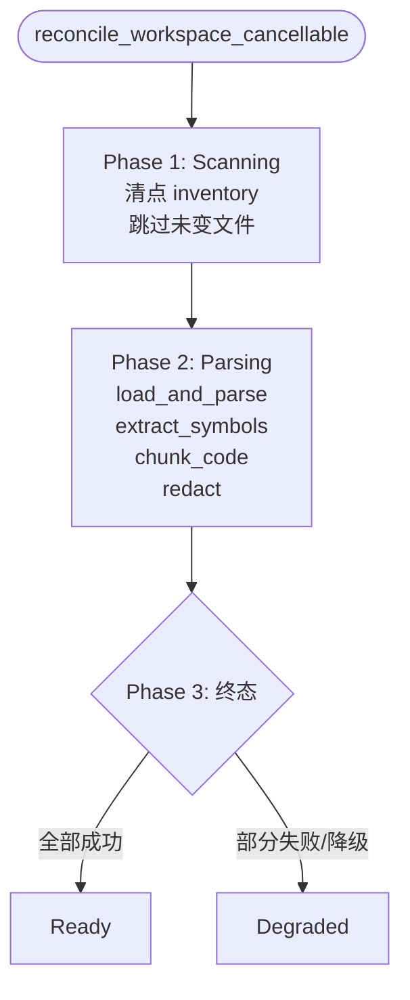
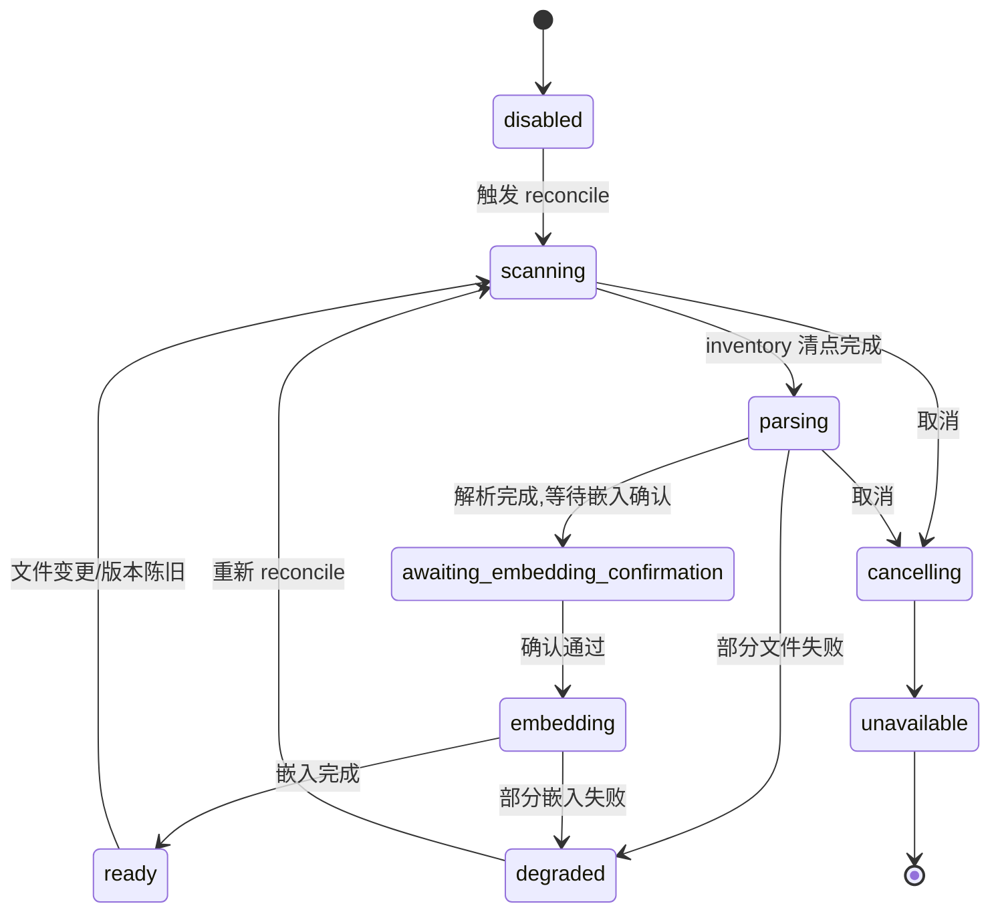

# Tree-sitter 代码索引

工作区代码会被 Tree-sitter 解析成有边界的、带类型的 chunk 与 symbol。这是 `retrieval` bounded context 的本地那一半——它无需任何外部服务即可运行,并在 embedding 被确认之前就使 FTS 可用。共享的宿主级内存池是另一个独立的关注点,见 [检索与向量搜索](retrieval.md)。

## 准入代码与错误容忍

只有准入了的代码会被解析,每种语言使用各自选定的 Tree-sitter grammar。解析是容忍错误的:当某个文件包含语法错误时,系统只会索引从错误周围的有效具名子树派生出的、有边界的 chunk。错误子树不会被索引。

## 有边界的带类型 chunk

每个 chunk 持久化时附带:工作区 id、归一化的相对路径、语言、行范围、symbol 名称、symbol 种类、chunk key 与索引版本。symbol 定义元数据(例如函数或类定义的名称、种类和定义范围)在同一文件事务中持久化,因此某个 symbol 可连同其 chunk 一起被发现。

## Chunk 预算与拆分

单个大于所配置 chunk 预算的 symbol 会被拆分成多个 chunk。拆分后的每个 chunk 仍然能归属到其源 symbol 与文件范围。

## 持久化前的脱敏

统一的敏感信息策略会在任何 chunk 文本被持久化、embedding、记录日志、审计或从 `search_code` 返回之前,应用于已准入的代码。原始代码内容不会被复制到检索存储中。包含敏感值的 chunk 会带上一个脱敏标记,而不是带上该值本身。

## 索引版本与陈旧

一个代码索引版本涵盖 grammar 兼容性、Tree-sitter 查询、chunk 拆分与脱敏策略。版本不匹配会把受影响的工作区文件标记为陈旧,并以有边界的批次重建。native worker 执行元数据优先的核对,只读取或解析新增或变更的文件。

## 索引构建管线

工作区代码索引由 `reconcile_workspace_cancellable` 驱动,整体分为三个 phase。每个 phase 都可被取消,取消后会过渡到 `cancelling` 并最终落到 `unavailable` 或重新开始。

各 phase 的关键细节:

- **Scanning(清点 inventory)**:按 manifest 驱动做选择性协调——只读取或解析新增或变更的文件,未变文件直接跳过。manifest 记录了每个文件的路径、hash、语言与索引版本。
- **Parsing(load_and_parse + extract_symbols + chunk_code + redact)**:用对应语言的 Tree-sitter grammar 解析,容忍语法错误——只从错误周围的有效具名子树派生 chunk。然后用 `.scm` 查询提取 symbol 定义元数据(名称、种类、定义范围),按预算切块,最后对 chunk 文本做脱敏。
- **Ready / Degraded**:全部文件成功解析并入库后进入 `Ready`;若部分文件因语法错误或 IO 失败被跳过,但仍产出了可用索引,则进入 `Degraded`。

切块与脱敏的几条硬规则:

- **grammar 支持**:内置 JS、TS、TSX、Python、Rust、Go、Java、C、C++ 的 grammar;不在此清单内的文件不被解析,也不产生 chunk。
- **切块规则**:默认预算 `DEFAULT_MAX_CHUNK_BYTES=6KB`,在具名子节点边界上切,因此切出的每个 chunk 仍能归属到其源 symbol 与文件范围。
- **符号提取**:每种语言一组 `.scm` 查询,提取函数、类、方法等定义元数据,在同一文件事务中与 chunk 一起持久化。
- **脱敏**:统一策略在持久化、embedding、日志、审计、`search_code` 返回之前,对六类敏感模式按正则替换为 `[REDACTED]`,原始代码内容不进入检索存储。
- **强制敏感路径 denylist**:`.env*`、私钥文件、`.ssh/` 等路径在准入阶段即被拒绝,根本不进入解析流程。
- **manifest 驱动选择性协调**:未变文件跳过,只处理新增或变更的文件;`CODE_INDEX_VERSION` 标记当前 grammar、查询、切块与脱敏策略的版本,版本不匹配的文件被标记为陈旧并重建。

索引 phase 本身也是一个状态机:

## 关键常量与准入

### 切块与版本常量

- `DEFAULT_MAX_FILE_BYTES=100KB` —— 单文件准入上限,超出不解析;
- `DEFAULT_MAX_CHUNK_BYTES=6KB` —— 单 chunk 字节预算,超出即在命名子节点边界切;
- `CODE_INDEX_VERSION="1"` —— 当前 grammar 兼容性、Tree-sitter 查询、chunk 拆分与脱敏策略的版本标记。

### grammar 支持

内置九种语言的 Tree-sitter grammar:JS、TS、TSX、Python、Rust、Go、Java、C、C++。不在此清单内的文件不被解析,也不产生 chunk。

### 切块规则

切块在命名子节点边界上切(`named_child_cut_points`/`split_range`),每块带 structural context(归属的 symbol、文件范围),因此切出的每个 chunk 仍能回溯到其源 symbol 与文件位置。

### 脱敏六类

统一策略在持久化、embedding、日志、审计、`search_code` 返回之前,对六类敏感模式按正则替换为 `[REDACTED]`:私钥(PEM 块等)、`api_key=` 形式的赋值、`token=` 形式的赋值、`bearer`/`Authorization: Bearer` 头、provider token 前缀(`sk-`、`ghp_`、`github_pat_`、`ssh-connection` 等)、内部 URL。命中即替换为 `[REDACTED]`,并累计 `redaction_count` 写入 chunk 元数据。原始代码内容不进入检索存储。

### 强制敏感路径 denylist

`is_mandatory_sensitive_path` 在准入阶段即拒绝一批强制敏感路径,用户配置不能覆盖。覆盖 `.env*`、`id_rsa` 与私钥文件、`.ssh/`、`.aws/`、`.azure/`、`.kube/`、`secrets/`、`*.key`、`*.pem` 等。

### CodeIndexPhase 状态机

phase 本身是状态机,可达状态:`disabled` → `scanning` → `parsing` → `awaiting_embedding_confirmation` → `embedding` → `ready`/`degraded`;取消时进入 `cancelling` 并最终落到 `unavailable`。

### manifest 驱动选择性协调

manifest 记录每个文件的路径、hash、语言与索引版本;未变文件直接跳过,只处理新增或变更的文件。`reconcile_paths` 支持三种变更语义:`Upsert`/`Delete`/`Rename`,据此对索引做增量更新。

## 设计所在

本章用于为贡献者定向。权威的需求位于规范中。

- [openspec/specs/workspace-code-indexing](../../../../openspec/specs/workspace-code-indexing/spec.md)

拥有此部分的 `retrieval` bounded context 在 [Native bounded context](native-contexts.md) 中描述;共享内存池那一半在 [检索与向量搜索](retrieval.md) 中。
