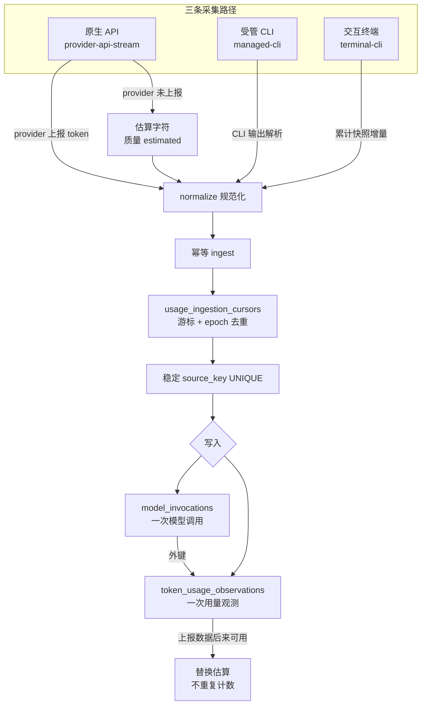

# 使用统计

VaneHub 为 VaneHub 管理的助手响应记录逐响应的使用量，并在设置中心对其汇总。不存在外部计费集成；这是第一版的本地使用量核算。

## 上报 token 与估算字符

两类数据被严格区分：

- **上报 token** —— fresh-input、output、cache-read、cache-creation 和 total，取自 provider 上报的使用量。上报的 total 等于上述四类之和。
- **估算字符** —— input、output 和 total，在 provider 上报使用量不可用时由字符计数推导而来。估算字符绝不会加到任何上报 token 总数中。

统计还会返回上报/估算/总计的已计数响应数、已计数会话数、每日趋势点、按稳定 Agent id 索引的每 Agent 分项行，以及由上报使用量支撑的已计数响应百分比。没有记录的时间范围会返回零值总计和空数组，而不是失败。

## 时间范围

支持的范围包括：今天、最近七天、最近三十天和全部时间，基于当前运行时的用户本地日历计算。

## 采集路径与会计质量

使用量从三条来源路径进入系统，每条路径都有不同的可信度，必须严格区分而不得互相加总。

- **原生 API**（`provider-api-stream`）：直接消费 provider 的流式响应，优先取 provider 上报的 token；若 provider 未上报，则按字符计数估算字符，并以 `estimated` 质量标记，绝不与 `reported` token 相加。
- **受管 CLI**（`managed-cli`）：解析各 CLI 的输出抽取使用量，按 message/step 粒度归并。
- **交互终端**（`terminal-cli`）：从终端累计快照的增量推导，使用稳定 `source_key` 做幂等去重。

会计质量约束：

- **四维 + 权威总数**：维度为 `input`/`output`/`cached_input`/`cache_write_input`，外加独立的 `reasoning_output`；`provider_total` 是权威总数，应等于前述四类之和。`reasoning_output` 不并入 `output`，单独列报。
- **估算字符永不与 Token 相加**：`estimated` 质量的字符计数永远独立成行，不会混入任何 `reported`/`reported-derived` 的 token 总数。数据库的 `CHECK` 约束强制 `(quality IN ('reported','reported-derived') AND unit = 'tokens')` 的一致性。
- **上报数据替换估算**：当 provider 上报数据在事后可用时，新的 `reported` 观测会替换之前的 `estimated` 观测，而不是叠加——靠稳定 `source_key` 的 `UPSERT` 语义实现幂等，避免重复计数。
- **游标去重**：`usage_ingestion_cursors` 记录每条来源的摄入游标与 `epoch`，同一来源的同一 `source_key` 只会被计入一次，跨重启重放也不会翻倍。
- **退化为零值**：当某时间范围没有任何记录时，返回零值总计与空数组，而不是失败；上报/估算/总计的已计数响应数、已计数会话数、每日趋势点、按稳定 Agent id 索引的每 Agent 分项行，以及由上报使用量支撑的已计数响应百分比都遵循这一规则。
- **OnePiece 走不同路径**：OnePiece 内置 Agent 有独立的请求与用量归并路径（含子 Agent 花费归并到父轮次），不与通用 provider-api-stream 路径混用。

使用量持久化位于 `sessions` 限界上下文，由 `model_invocations` 与 `token_usage_observations` 两张表承载。规范真源见 `openspec/specs/usage-statistics/spec.md`。

## 设计所在之处

本章用于引导贡献者。权威需求位于 spec 中。

- [openspec/specs/usage-statistics](../../../../openspec/specs/usage-statistics/spec.md)

使用量持久化位于 `sessions` 限界上下文中；见 [Native bounded contexts](native-contexts.md)。
