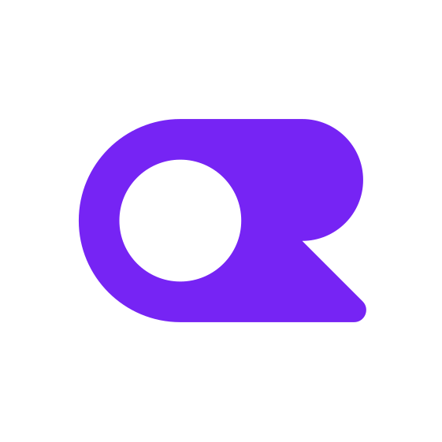

# 内置模型提供商目录

VaneHub AI 内置 **25 家模型提供商**的配置模板。选一家、填 API Key、选模型即可，不必手查端点地址和协议格式；目录里没有的厂商，可以填自定义兼容端点。

**这份目录同时服务两类 Agent**：

- **原生 Agent OnePiece** —— 直接用目录里的条目建配置。
- **外部 CLI Agent**（Claude Code、Codex CLI、OpenCode）—— 在**设置 → Agent 配置**里，由同一份目录派生出各 CLI 的预设，把它指向第三方端点。

> **目录只是模板，不是承诺**。它提供的是端点地址、协议格式和推荐模型 id 这些非机密字段。厂商随时可能调整端点与模型，保存前每个值都可以改；VaneHub AI 后续更新目录也不会覆盖你已保存的配置。

## 目录

| | 提供商 | 目录 id | 端点协议 | 默认模型 |
| --- | --- | --- | --- | --- |
|  | [Anthropic](https://console.anthropic.com/settings/keys) | `anthropic` | Anthropic Messages | `claude-sonnet-4-6` |
| <picture><source media="(prefers-color-scheme: dark)" srcset="../src/assets/provider-icons/cherry/dark/openai.svg"></picture> | [OpenAI](https://platform.openai.com/api-keys) | `openai` | OpenAI Chat Completions、OpenAI Responses | `gpt-5.4` |
| <picture><source media="(prefers-color-scheme: dark)" srcset="../src/assets/provider-icons/cherry/dark/openrouter.svg"></picture> | [OpenRouter](https://openrouter.ai/settings/keys) | `openrouter` | Anthropic Messages、OpenAI Chat Completions、OpenAI Responses | `anthropic/claude-sonnet-4.6` |
|  | [DeepSeek](https://platform.deepseek.com/api_keys) | `deepseek` | Anthropic Messages、OpenAI Chat Completions、OpenAI Responses | `deepseek-chat` |
|  | [Zhipu GLM](https://open.bigmodel.cn/apikey/platform) | `zhipu-glm` | Anthropic Messages、OpenAI Chat Completions | `glm-4.7` |
| <picture><source media="(prefers-color-scheme: dark)" srcset="../src/assets/provider-icons/cherry/dark/moonshot.svg"></picture> | [Kimi / Moonshot](https://platform.moonshot.cn/console/api-keys) | `kimi` | Anthropic Messages、OpenAI Chat Completions | `kimi-k2.5` |
|  | [SiliconFlow](https://cloud.siliconflow.cn/account/ak) | `siliconflow` | Anthropic Messages、OpenAI Chat Completions | `deepseek-ai/DeepSeek-V3.2` |
|  | [Alibaba Bailian](https://bailian.console.aliyun.com/?apiKey=1) | `bailian` | Anthropic Messages、OpenAI Chat Completions、OpenAI Responses | `qwen3.5-plus` |
|  | [Volcengine Ark](https://console.volcengine.com/ark/region:ark+cn-beijing/apiKey) | `volcengine-ark` | Anthropic Messages、OpenAI Chat Completions、OpenAI Responses | `ark-code-latest` |
|  | [Groq](https://console.groq.com/keys) | `groq` | OpenAI Chat Completions | `llama-3.3-70b-versatile` |
| <picture><source media="(prefers-color-scheme: dark)" srcset="../src/assets/provider-icons/cherry/dark/grok.svg"></picture> | [xAI](https://console.x.ai/) | `xai` | OpenAI Chat Completions、OpenAI Responses | `grok-4-1-fast-reasoning` |
|  | [Mistral AI](https://console.mistral.ai/api-keys/) | `mistral` | OpenAI Chat Completions | `mistral-large-latest` |
|  | [Together AI](https://api.together.ai/settings/api-keys) | `together-ai` | OpenAI Chat Completions | `meta-llama/Llama-3.3-70B-Instruct-Turbo` |
|  | [Fireworks AI](https://fireworks.ai/account/api-keys) | `fireworks` | Anthropic Messages、OpenAI Chat Completions、OpenAI Responses | `accounts/fireworks/models/llama-v3p3-70b-instruct` |
|  | [NVIDIA NIM](https://build.nvidia.com/settings/api-keys) | `nvidia-nim` | OpenAI Chat Completions | `meta/llama-3.3-70b-instruct` |
| <picture><source media="(prefers-color-scheme: dark)" srcset="../src/assets/provider-icons/cherry/dark/cerebras.svg"></picture> | [Cerebras](https://cloud.cerebras.ai/platform/apikeys) | `cerebras` | OpenAI Chat Completions | `gpt-oss-120b` |
| <picture><source media="(prefers-color-scheme: dark)" srcset="../src/assets/provider-icons/cherry/dark/minimax.svg"></picture> | [MiniMax](https://platform.minimaxi.com/user-center/basic-information/interface-key) | `minimax` | Anthropic Messages、OpenAI Chat Completions | `MiniMax-M2.5` |
| <picture><source media="(prefers-color-scheme: dark)" srcset="../src/assets/provider-icons/cherry/dark/minimax.svg"></picture> | [MiniMax Global](https://www.minimax.io/platform/user-center/basic-information/interface-key) | `minimax-global` | Anthropic Messages、OpenAI Chat Completions | `MiniMax-M2.5` |
|  | [StepFun](https://platform.stepfun.com/interface-key) | `stepfun` | Anthropic Messages、OpenAI Chat Completions | `step-3.5-flash` |
|  | [Baichuan AI](https://platform.baichuan-ai.com/console/apikey) | `baichuan` | OpenAI Chat Completions | `Baichuan4-Turbo` |
|  | [PPIO](https://ppinfra.com/settings/key-management) | `ppio` | OpenAI Chat Completions | `deepseek/deepseek-v3.2` |
|  | [Qiniu AI](https://portal.qiniu.com/ai-inference/api-key) | `qiniu` | Anthropic Messages、OpenAI Chat Completions | `deepseek-v3.2` |
|  | [ModelScope](https://modelscope.cn/my/myaccesstoken) | `modelscope` | Anthropic Messages、OpenAI Chat Completions | `Qwen/Qwen3-Coder-480B-A35B-Instruct` |
| <picture><source media="(prefers-color-scheme: dark)" srcset="../src/assets/provider-icons/cherry/dark/xiaomimimo.svg"></picture> | [Xiaomi MiMo](https://platform.xiaomimimo.com/) | `xiaomi-mimo` | Anthropic Messages、OpenAI Chat Completions、OpenAI Responses | `mimo-v2-flash` |
| <picture><source media="(prefers-color-scheme: dark)" srcset="../src/assets/provider-icons/cherry/dark/zai.svg"></picture> | [Z.AI](https://z.ai/manage-apikey/apikey-list) | `zai` | Anthropic Messages、OpenAI Chat Completions | `glm-4.7` |

提供商名称链接到各家的 API Key 申请页。

## 端点协议决定哪个 Agent 能用它

这是整张表里最容易被忽略、却最影响选择的一列。**一家提供商能不能给某个 CLI 用，取决于它是否提供该 CLI 需要的协议**：

| 端点协议 | 提供商数 | 可用于 |
| --- | --- | --- |
| **Anthropic Messages** | 16 | OnePiece、**Claude Code** |
| **OpenAI Chat Completions** | 24 | OnePiece、**Codex CLI**、**OpenCode** |
| **OpenAI Responses** | 8 | OnePiece、**Codex CLI**（协议选 Responses 时） |

举例：**Groq 只提供 OpenAI Chat Completions**，所以它能配给 Codex CLI 和 OpenCode，但**配不了 Claude Code**——后者要的是 Anthropic Messages 协议。反过来，**Anthropic 官方只提供 Anthropic Messages**，配不了 Codex CLI。

同时提供两三种协议的（OpenRouter、DeepSeek、百炼、火山方舟、Fireworks、小米 MiMo 等），三个 CLI 都能配。

> **Gemini CLI 与 Antigravity CLI 不在此列**。Gemini CLI 的端点可以改，但目录里只有 Google 官方预设；Antigravity CLI 只接受 Google 登录，不收任何第三方端点。

## 分类

目录分两类，仅影响界面上的分组展示，不影响能力：

- **官方**（`official`）—— Anthropic、OpenAI
- **常用**（`common`）—— 其余 23 家兼容端点

## 目录之外

目录里没有你要的厂商时，选**自定义**填兼容端点即可，需要提供 base URL、协议格式与模型 id。任何遵循 Anthropic Messages 或 OpenAI Chat Completions/Responses 协议的服务都能接。

## 关于模型列表

表里的**默认模型**是目录内置的推荐值，另有一份备选模型清单作为兜底。

**实际可用模型以在线发现为准**：填好 Key 之后，OnePiece 会调用该提供商的模型列表接口拉取真实可用的模型，再由你选定。内置清单只在发现失败时兜底。

> **模型 id 会变**。厂商上下线模型的节奏比本项目发版快，表中的默认模型 id 只反映目录当前版本。以界面里发现到的列表为准。

## 凭据怎么存

- **OnePiece 的 API Key** 由 VaneHub AI 保管，**保存前会实际调用一次校验，不通过不保存**。
- **CLI 配置的 API Key** 存在操作系统的凭据服务里，按 Agent/配置分账，不落 SQLite，界面上只回显「已配置」。只有在你显式点「应用」时，才会写进那个 CLI 要求明文的配置文件。

完整语义见[Agent 与 CLI 配置](user-guide/zh-CN/src/agent-configuration.md#agent-配置)与[原生 API Agent](user-guide/zh-CN/src/native-agent.md)。

## 图标来源

厂商图标取自 [Cherry Studio](https://github.com/CherryHQ/cherry-studio) 的 provider 图标集，随应用一同分发。其中 8 家的标识是纯黑图形，另带一份浅色变体，本页用 `<picture>` 按主题切换，否则它们在深色背景上会消失。

**Zhipu GLM 用的是[智谱开放平台](https://bigmodel.cn/)的官方图标**（`docs/assets/provider-icons/zhipu-glm.png`），不走 Cherry Studio 那份——后者同样是纯黑图形却没有浅色变体，深色主题下整个看不见。

**商标归各自权利人所有**，此处仅用于标识对应服务。
