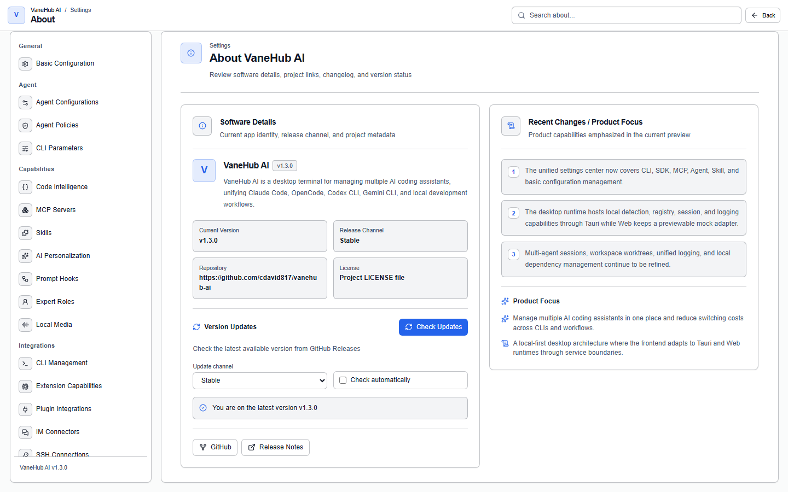

# Application updates: signature verification and release channels

## Overview

The desktop application checks GitHub Releases for a new version and verifies signatures before and after downloading. **If verification does not pass, nothing is installed.**

The entry point is **Settings → About VaneHub AI → version update**.

## Check and install

| State | What the interface shows |
| --- | --- |
| Not checked yet | Never checked for updates |
| Checking | Checking |
| Already current | You are on the latest version v… |
| Update available | New version v… found |
| Downloading | Downloaded X / Y bytes |
| Installed | Update verified; you can restart the application |
| Failed | Update check failed: … |

The flow is **Check for updates** → **Download and install** → **Restart now**.

When a new version is found, the surface shows the installed version, the new version, and the release notes together.

## Release channels

Two channels, decided by semantic-version precedence:

| Channel | Behavior |
| --- | --- |
| **Stable** | **Accepts no prerelease version at all** |
| **Preview** | Accepts a greater compatible version on its configured channel |

**With no preference ever set, the channel is derived from the installed version**: a prerelease build defaults to `preview`, anything else to `stable`.

## Automatic checks

**Automatic update checks are off by default.** Once enabled, application startup schedules a non-blocking check that uses **exactly the same signed path as a manual check** — automatic does not mean relaxed.

## Security design

This is the heart of the feature, and each of these is a hard constraint:

**The update source cannot be overridden by runtime configuration.** The application uses the trusted HTTPS endpoint and public verification key embedded at build time. **Even if ordinary application configuration contains a different update URL or verification key, the build-time pair is still what gets used.**

**A TLS certificate error always fails the update and is never ignored.** If the endpoint cannot pass platform TLS validation, nothing is downloaded and nothing is installed.

**Both the updater metadata and the installable artifact must be signed by the release updater key**, and the desktop runtime verifies the signature before applying an update. **Only the public key** is included in source code and client bundles.

**Tampered content is rejected before installation.** If a metadata document, a signature, or the downloaded artifact differs from the signed content, the update is rejected and **the current application is preserved**.

## Downgrades are refused

**Every ordinary client rejects an update whose version is equal to or lower than the installed one** — even one whose signature is perfectly valid — and it is rejected before download or installation.

A downgrade is only possible in an explicitly compiled development or desktop-test flow, and **ordinary runtime configuration cannot enable that path**.

## What happens on failure

**If checking, downloading, verification, or installation fails, the running installed version stays usable**, and you can retry explicitly afterwards.

An interrupted download is the same: the current installation keeps running and you can start over.

A failure enters a clearly failed terminal state with a safe, recoverable error, rather than getting stuck halfway.

## It never restarts by itself

**The application only restarts when the updater reports a verified ready state and you explicitly select restart.**

When a verified update is ready but you have not selected restart, **the application keeps running normally**. It will not restart on your behalf, and it will not quietly swap out the version you are using in the background.

## The update process is observable

Checking and downloading are asynchronous, running through the frontend service boundary and backend-managed operations:

- Starting an action **returns a stable operation id immediately**, without waiting for network access to finish
- The interface stays responsive and **retains the previous update snapshot**, so starting a check does not clear what you already knew
- Download progress is bounded byte progress, readable until a terminal state
- It is associated with redacted unified logging

## Notes and limits

- **Automatic checks are off by default** and must be turned on.
- **The stable channel cannot see preview releases**; to try them you have to switch channel explicitly.
- **Downgrades are always refused**, including validly signed ones.
- **The update endpoint and verification key cannot be changed.** That is deliberate, not a missing setting.
- **It never restarts on its own**; restarting always requires you.

## Related

- Version, channel, licence, and other details → Settings → About VaneHub AI
- The health of local CLI installations is a separate matter → [Install and authenticate a CLI](getting-started.md)
- Where to find logs when an update fails → [Observability](observability.md)
