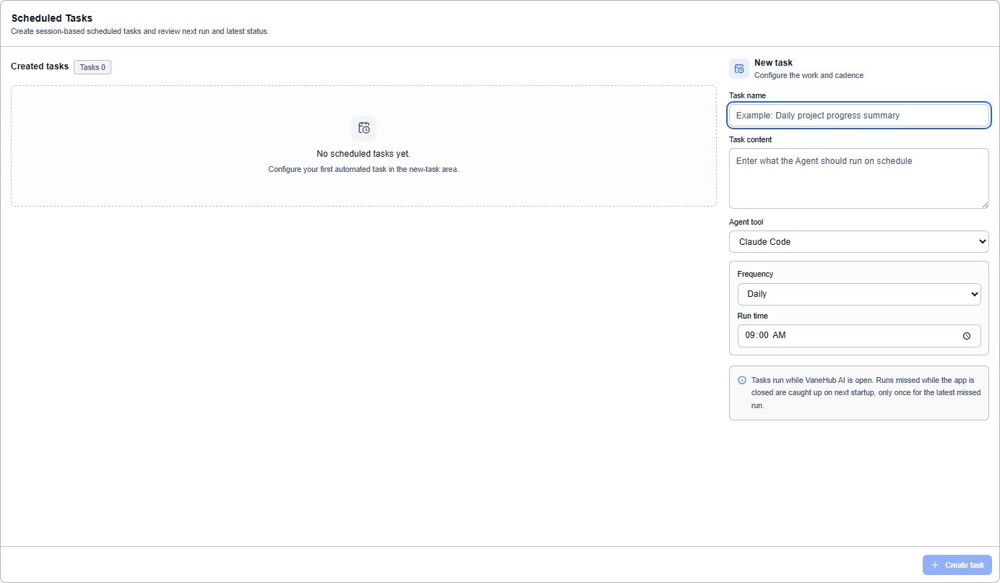
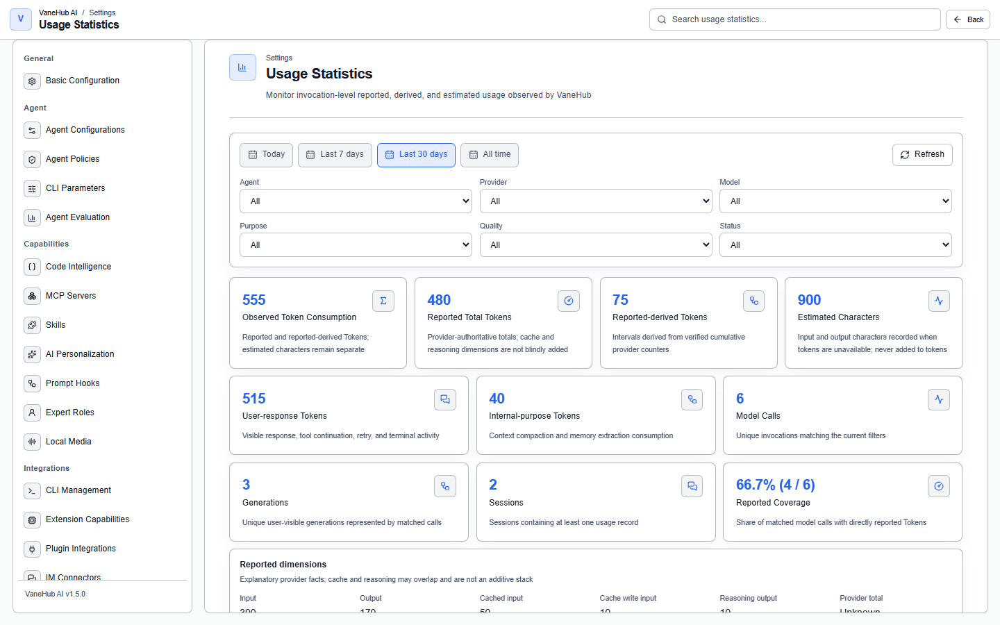

# Scheduled and usage

## Scheduled tasks

### Overview

Turn repetitive work into a recurring task that automatically creates a session and runs when it is due.

### Create one

Select **Runs** in the activity bar, then switch to the **Scheduled tasks** tab. Existing tasks are on the left, the new-task form on the right:

| Field | Notes |
| --- | --- |
| **Task name** | For example "daily project progress summary" |
| **Task content** | What you want the Agent to do on schedule |
| **Agent tool** | Which Agent runs it |
| **Frequency** | See the table below |

**Five frequencies:**

| Frequency | Parameter |
| --- | --- |
| By minute | Interval in minutes |
| By hour | Interval in hours |
| Daily | Time of day |
| Weekly | Day of week + time |
| Monthly | Day of month + time |

The interval must be positive. A task card shows its **next run time**, and can be **enabled or disabled** at any time without deleting it.

### How the time is computed

"9 am daily" computes the next run time in **your local time zone**; the due check uses absolute time, which avoids double runs and skipped runs across a daylight-saving transition.

### What happens while the application is closed

**The scheduler runs inside the application; it is not a system-level service** — nothing fires while the application is not open. But it is **not simply discarded**, and the interface explains:

> Tasks run while VaneHub AI is open. A run missed because the application was closed is **made up at the next launch, and only the most recent one is made up**.

In other words: a once-daily task with the application closed for three days makes up **one** run on restart, not three.

Runs triggered by a scheduled task are marked in the [trace](observability.md) with their source and task identifier, so they can be traced back.

## Long-running operation tracking

Time-consuming operations such as installing an SDK, connecting an MCP server, or installing an extension have explicit queueing and state: **queued → running → succeeded / failed / cancelled**, with output recorded line by line.

That output is **both** shown in the interface and written to the unified log directory.

## Notifications

Notifications come in four kinds: success, error, warning, and info.

There are two scopes:

- **Global** — application-level notices
- **Session-scoped** — relevant only to one session

Session-scoped notifications do not drown in the global notice stream; they are the most relevant context when you switch to that session.

## Usage statistics

### Where to look

**Settings → Usage Statistics**, filterable by time range and Agent, showing a summary, trends, and a per-Agent breakdown.

### Four dimensions

Four cards at the top of the page:

| Card | Meaning |
| --- | --- |
| **Real total tokens** | The sum of input, output, and cache tokens the CLI reported |
| **Input tokens** | Input tokens excluding cache reads |
| **Output tokens** | Including reasoning output the CLI reported |
| **Cache tokens** | The sum of cache-read and cache-creation tokens |

The underlying data records **cache reads** and **cache writes** separately (both visible in the session info panel); the interface's "cache tokens" is their sum.

Three auxiliary metrics are also shown: **estimated total characters** (a substitute measure when there is no real token record, and not added to token counts), **real-data coverage** (the proportion of assistant responses with real CLI token counts), and **session count**.

**"Real-data coverage" is worth watching** — it tells you directly how many responses got real measurement, and when the proportion is low, so is the reference value of the trend chart.

### What the numbers mean

> **Usage data comes from each CLI's own reporting; VaneHub AI does not meter tokens independently.**

The page has a dedicated section explaining the measure, and you should read it before using this data for cost accounting.

The four CLIs each report usage in a different format, and the system handles each one separately. Collection is idempotent — it samples periodically while the terminal is open and once more on exit, and repeated collection does not double count.

## Notes and limits

- **All of this is desktop only.**
- **Scheduled tasks need the application running**; a missed run is made up only once, never in a backlog.
- **OnePiece's usage does not go through the terminal collection path**, so its measure differs from that of the four CLIs.
