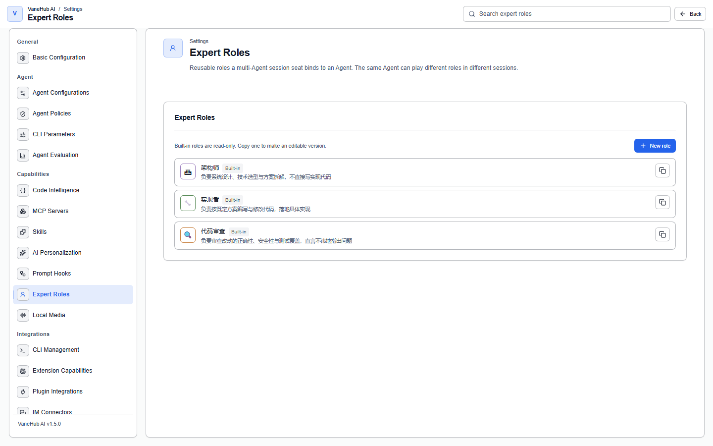

# Expert roles

## Overview

**An expert role describes "a job," not "an Agent."** A role is reusable; it's a *seat* that binds a role to an Agent, and that binding only holds for the one session it's in.

This distinction is deliberate: the same installed copy of Claude Code can be a reviewer in this session and an architect in the next. A role isn't a property of an Agent, so switching its job doesn't require reinstalling or reconfiguring the CLI.

Managed under **Settings → Expert roles**.

## The three built-in roles

The built-in roles form one typical collaboration chain: **the architect proposes → the implementer builds it → code review signs off**.

| Role | Avatar | Responsibility |
| --- | --- | --- |
| **Architect** | 🏛 | Owns system design, technology choices, and breaking a plan into steps; does not write implementation code directly |
| **Implementer** | 🔧 | Writes and modifies code to match an established plan, turning it into a concrete implementation |
| **Code review** | 🔍 | Reviews changes for correctness, security, and test coverage, and says so plainly when something's wrong |

Their instructions all cover the same three angles: **what to do, what not to do, and who to hand off to when done.**

- The **architect** is instructed to "explain trade-offs and rejected alternatives, not just conclusions," and to hand off to the implementer once it's time to build.
- The **implementer** is instructed to "raise plan-level disagreements rather than silently changing the design," and to explain which files it touched and why once done.
- **Code review** is instructed to "state problems directly, not softened for tone," and to **separate "must fix" from "could be improved"** — and to say what it checked even when there's nothing wrong.

> **Built-in roles are read-only** and cannot be edited or deleted directly. To adjust one, click the copy button on the card to get an editable version.

## Role fields

| Field | Description |
| --- | --- |
| **Display name** | The name shown on the seat and every message it speaks |
| **Avatar** | An emoji or short glyph, shown on the seat and every message it speaks |
| **Color** | A hex color used for the speaker band, so seats are distinguishable at a glance |
| **Responsibility** | **Required**, see below |
| **Instruction** | The role's behavioral instruction, injected through each CLI's native system-prompt channel |
| **Bound Skills** | Ids of existing Skills this role depends on. A role **references** Skills; it never replaces them |
| **Review policy** | See below |
| **Preferred provider** | **A soft preference only** — a role never locks itself to a specific Agent |

### Why responsibility is required

**Responsibility isn't decorative text for humans.** It's published to the seat roster, and other Agents use it to decide "who should get this."

Leave it empty and other seats can only guess at handoff time. That's also why all three built-in roles' responsibilities are written as one complete, judgeable sentence — they're written for other Agents to read.

The seat roster and the mechanics of `@` handoff are covered in [Multi-Agent group chat](multi-agent-workflow.md).

## Review policy

Two toggles:

- **Eligible to be recommended as a peer reviewer** — whether this role's seat can show up in review recommendations
- **Prefer a seat from a different model family when recommending** — whether recommendations favor a different model family

Of the three built-in roles, **only "Code review" has both toggles on**; the architect and implementer have both off.

**The point of the second toggle**: two instances from the same model family tend to make correlated mistakes, and are more likely to agree with each other. Drawing the reviewer from a different family raises the odds of catching a real problem.

> **OpenCode has no fixed model family** — it drives whichever model you configured, so this policy doesn't apply to it.

The full semantics of model family and cross-family review are covered in [Multi-Agent group chat → Model families and cross-family review](multi-agent-workflow.md#model-families-and-cross-family-review).

## Putting it to use

1. In **Settings → Expert roles**, settle on which roles you want to use (the three built-in ones work as-is; copy one first if you need to adjust it).
2. When creating a session, choose **Multi-Agent** and assign an Agent and a role to each seat.
3. In the conversation, use `@` to hand off to the corresponding seat.

For a full "architect → implementer → reviewer" relay, see the [Group chat collaboration case](../../../developer-guide/src/multi-agent-acceptance.md).

## Notes and limits

- **Desktop only.**
- **Built-in roles are read-only**; copy one and edit the copy when you need to adjust it.
- **A role never rewrites any CLI's own configuration file.** Instructions are injected through the CLI's native system-prompt channel, and nothing touches files like `CLAUDE.md` or `AGENTS.md`.
- **Preferred provider is only a soft preference**, not a binding; which Agent actually gets used is decided by seat assignment.
- **A role references Skills rather than replacing them**; a bound Skill needs to already be installed in [Skill management](skill-management.md).
- **OnePiece's own core instructions cannot be edited**; express custom needs through a role's instruction or Custom Instructions instead.

## Related

- Cross-session personal preferences and memory → [Personalization](personalization.md)
- Seats, `@` handoff, and turn bounds → [Multi-Agent group chat](multi-agent-workflow.md)
- Installing and binding capability packages → [Skill management](skill-management.md)
