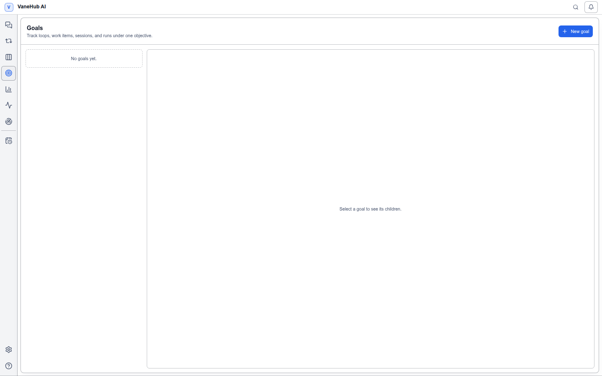

# Goal management: track scattered work in one place

## Overview

One piece of work often spans a few [Loops](loop-engineering.md), board items, sessions, and execution runs. They live in different surfaces, and nowhere else can answer "how far along is this overall".

Goals are that consolidating layer. You attach the relevant Loops and board items to one goal and read the whole picture from a single `finished/counted` progress figure and one status label. Sessions and runs may be linked as context but do not count toward progress.

**A goal does not modify what it links to.** The link exists only on the goal's side, and unlinking does not touch the linked object.

## Create a goal

1. Select **Goal Center** in the activity bar.
2. Select **New goal** at the top right.
3. Fill in the fields:

| Field | Required | Notes |
| --- | --- | --- |
| **Title** | Yes | Whitespace-only titles are rejected |
| **Description** | No | Background |
| **How you will judge this goal** | No | Acceptance notes |
| **Project path** | No | The associated repository location |

**"How you will judge this goal" is purely for humans.** The system never uses it for any machine judgement — it does not parse it, match against it, or change any state because of it. It is there so that you (or you in a few days) have something to go on before pressing accept.

A new goal is a **Draft**; select **Start** to move it to In progress.

The interface has two columns: the goal list on the left, where each entry shows the title, a `finished/counted` progress figure, and a status badge; the detail of the selected goal on the right.

## The five states

| State | Meaning | Where it comes from |
| --- | --- | --- |
| **Draft** | Just created, not started | Stored |
| **In progress** | Started and running | Stored |
| **Awaiting acceptance** | All children finished, waiting on you | **Derived** |
| **Achieved** | You confirmed it | Stored |
| **Abandoned** | Dropped | Stored |

**"Awaiting acceptance" is not stored.** It is computed on every read from the children's current states, which is why a goal **automatically returns to In progress when a child is reopened — with no action from you**.

Three conditions must hold simultaneously to enter awaiting acceptance: the goal is In progress, the number of counted children is greater than zero, and all counted children have finished.

State transitions are constrained: **an abandoned goal can be started again, and an achieved goal can be reopened.** But a goal that is already In progress cannot be started again.

## Link work to a goal

Select **Link** in the goal detail, then choose a kind and an id:

| Kind | Counts toward progress | Notes |
| --- | --- | --- |
| **Loops** | Yes | Judged by run state |
| **Work items** | Yes | Judged by its stage |
| **Sessions** | **No** | A session has no notion of "finished" |
| **Runs** | **No** | Execution evidence; takes no part in the derivation |

**Sessions and runs are not in the denominator.** A goal linked only to sessions never enters awaiting acceptance — because a session has no concept of being done; it can stay open indefinitely.

Sessions are also **never attached automatically**: even with an active goal, creating a session does not link it for you. It has to be explicit.

**At most one link may exist between a goal and a given object.** A duplicate link is rejected with a message and creates no duplicate record.

## What counts as "finished"

Counted children use these terminal rules:

| Child | Counts as finished | Does not count |
| --- | --- | --- |
| **Loop** | Succeeded, **failed**, cancelled | Awaiting acceptance |
| **Work item** | Done stage, archived | Any other stage |

One additional rule is important:

- **A child sitting at "awaiting acceptance" does not count as finished.** When a Loop is itself waiting on human confirmation, the goal does not follow it into awaiting acceptance — otherwise you would be nesting the same gate.

## Acceptance

**Only a human can mark a goal achieved; the system never sets one to achieved by itself.** This is the same safety design as [the Loop's mandatory manual acceptance](loop-engineering.md).

**The accept action is only available in awaiting acceptance.** Pressing accept while children are unfinished is rejected and the state does not change. The detail says exactly what is blocking:

| Message | Meaning |
| --- | --- |
| Every child has finished. This goal is ready for you to accept. | You can press **Accept** |
| Some children are still running. | Wait for them |
| Link a loop or work item before this goal can be accepted. | There are no counted children |
| Only a goal in progress can be accepted. | The goal is still a Draft or Abandoned |

After accepting you can still **Reopen**, returning the goal to active.

## When a linked object is deleted

If the object a child points at is deleted, or its state cannot be queried, the child is marked **Missing**:

- **It leaves the denominator** — a deleted linked item cannot strand a goal one item short forever
- **It does not fail the whole goal query** — the other children display normally
- It is listed explicitly in the detail: "N linked items no longer exist and are left out of the count."

**This is deliberate degradation rather than concealment.** The blocking reason is always visible to you; you never face a progress bar that has simply stopped moving with no explanation.

## Notes and limits

- **Acceptance notes take no part in any machine judgement**; they are for humans to read.
- **Sessions and runs never advance a goal**; a goal linked only to those does not enter awaiting acceptance.
- **Unlinking does not affect the linked object**; it only removes it from this goal's child list.
- Deleting a goal deletes only the goal itself and its links; Loops and board items are unaffected.

## Related

- Automatic cycles under a goal → [Loop Engineering](loop-engineering.md)
- Multi-Agent collaboration → [Multi-Agent group chat](multi-agent-workflow.md)
