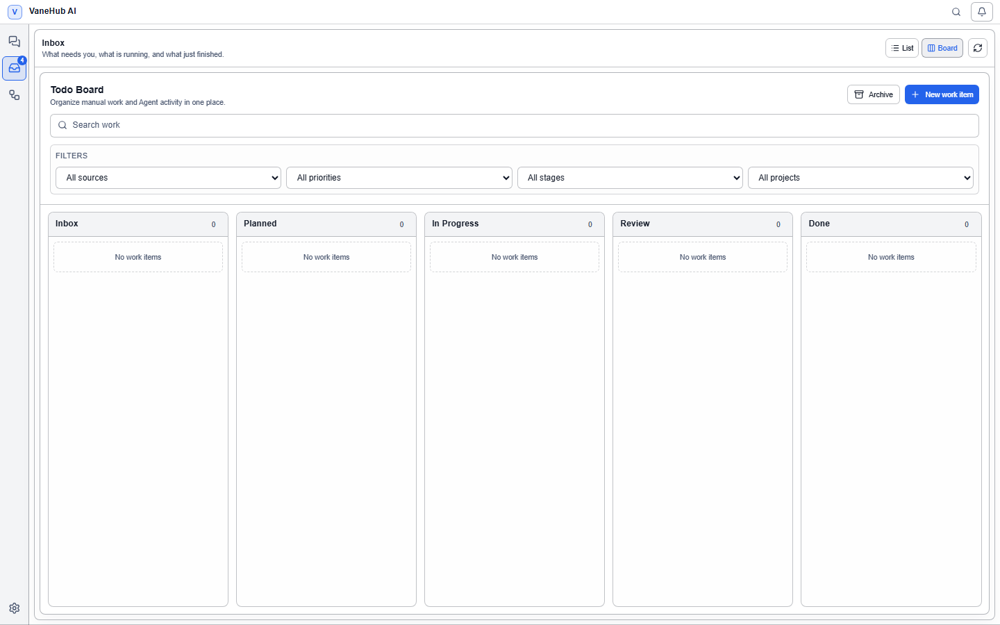

# Goals and the work board

**Goals** gather scattered units of execution into one place to track; the **work board** puts manual to-dos and Agent-produced work items in one panel. They share a source and state model, so they share a chapter.

## Goals

### Overview

One piece of work often spans a few [Loops](loop-engineering.md), board items, sessions, and execution runs. They live in different surfaces, and nowhere else can answer "how far along is this overall".

Goals are that consolidating layer. You attach the relevant Loops and board items to one goal and read the whole picture from a single `finished/counted` progress figure and one status label. Sessions and runs may be linked as context but do not count toward progress.

**A goal does not modify what it links to.** The link exists only on the goal's side, and unlinking does not touch the linked object.

### Create a goal

1. Select **Goal Center** in the activity bar.
2. Select **New goal** at the top right.
3. Fill in the fields:

| Field | Required | Notes |
| --- | --- | --- |
| **Title** | Yes | Whitespace-only titles are rejected |
| **Description** | No | Background |
| **How you will judge this goal** | No | Acceptance notes |
| **Project path** | No | The associated repository location |

**"How you will judge this goal" is purely for humans.** The system never uses it for any machine judgement — it does not parse it, match against it, or change any state because of it. It is there so that you (or you in a few days) have something to go on before pressing accept.

A new goal is a **Draft**; select **Start** to move it to In progress.

The interface has two columns: the goal list on the left, where each entry shows the title, a `finished/counted` progress figure, and a status badge; the detail of the selected goal on the right.

### The five states

| State | Meaning | Where it comes from |
| --- | --- | --- |
| **Draft** | Just created, not started | Stored |
| **In progress** | Started and running | Stored |
| **Awaiting acceptance** | All children finished, waiting on you | **Derived** |
| **Achieved** | You confirmed it | Stored |
| **Abandoned** | Dropped | Stored |

**"Awaiting acceptance" is not stored.** It is computed on every read from the children's current states, which is why a goal **automatically returns to In progress when a child is reopened — with no action from you**.

Three conditions must hold simultaneously to enter awaiting acceptance: the goal is In progress, the number of counted children is greater than zero, and all counted children have finished.

State transitions are constrained: **an abandoned goal can be started again, and an achieved goal can be reopened.** But a goal that is already In progress cannot be started again.

### Link work to a goal

Select **Link** in the goal detail, then choose a kind and an id:

| Kind | Counts toward progress | Notes |
| --- | --- | --- |
| **Loops** | Yes | Judged by run state |
| **Work items** | Yes | Judged by its stage |
| **Sessions** | **No** | A session has no notion of "finished" |
| **Runs** | **No** | Execution evidence; takes no part in the derivation |

**Sessions and runs are not in the denominator.** A goal linked only to sessions never enters awaiting acceptance — because a session has no concept of being done; it can stay open indefinitely.

Sessions are also **never attached automatically**: even with an active goal, creating a session does not link it for you. It has to be explicit.

**At most one link may exist between a goal and a given object.** A duplicate link is rejected with a message and creates no duplicate record.

### What counts as "finished"

Counted children use these terminal rules:

| Child | Counts as finished | Does not count |
| --- | --- | --- |
| **Loop** | Succeeded, **failed**, cancelled | Awaiting acceptance |
| **Work item** | Done stage, archived | Any other stage |

One additional rule is important:

- **A child sitting at "awaiting acceptance" does not count as finished.** When a Loop is itself waiting on human confirmation, the goal does not follow it into awaiting acceptance — otherwise you would be nesting the same gate.

### Acceptance

**Only a human can mark a goal achieved; the system never sets one to achieved by itself.** This is the same safety design as [the Loop's mandatory manual acceptance](loop-engineering.md).

**The accept action is only available in awaiting acceptance.** Pressing accept while children are unfinished is rejected and the state does not change. The detail says exactly what is blocking:

| Message | Meaning |
| --- | --- |
| Every child has finished. This goal is ready for you to accept. | You can press **Accept** |
| Some children are still running. | Wait for them |
| Link a loop or work item before this goal can be accepted. | There are no counted children |
| Only a goal in progress can be accepted. | The goal is still a Draft or Abandoned |

After accepting you can still **Reopen**, returning the goal to active.

### When a linked object is deleted

If the object a child points at is deleted, or its state cannot be queried, the child is marked **Missing**:

- **It leaves the denominator** — a deleted linked item cannot strand a goal one item short forever
- **It does not fail the whole goal query** — the other children display normally
- It is listed explicitly in the detail: "N linked items no longer exist and are left out of the count."

**This is deliberate degradation rather than concealment.** The blocking reason is always visible to you; you never face a progress bar that has simply stopped moving with no explanation.

## Work board

### Overview

Sessions and scheduled tasks each have their own list, and manual to-dos have nowhere to live at all. The Todo Board collects them into one board: **what you wrote down by hand and what the Agents produced sit side by side**, organized by the same stages, priorities, and filters.

The key design is that **the board stage and the source status are kept completely separate**: which column a card is in is your decision, while how far the source has got is projected by the runtime. Neither disturbs the other — a scheduled task finishing does not move its card to "Done" by itself.

### Open the board

Select **Todo Board** in the activity bar. There are two views at the top, **Active board** and **Archive**; you land on the active board, where archived items are not shown.

### The five stages

| Stage | Purpose |
| --- | --- |
| **Inbox** | Where new work items land by default |
| **Planned** | Scheduled to be done |
| **In Progress** | Being worked on |
| **Review** | Done, awaiting confirmation |
| **Done** | Finished |

**Stages are entirely under your control.** Nothing moves a card automatically.

There are two ways to move a card: drag it, or use the **Move to previous stage** / **Move to next stage** buttons on the card. **Both paths produce exactly the same persisted result** — the explicit buttons are not a degraded substitute for dragging, they are an equivalent operation. Keyboard and screen-reader users can work the whole board, and nothing gets clipped on a narrow screen.

### Create a manual to-do

Select **New work item** and fill in:

| Field | Notes |
| --- | --- |
| **Title** | Required |
| **Description** | Optional |
| **Project path** | Optional; used for filtering by project |
| **Priority** | No priority / Low / Medium / High / Urgent |
| **Due date** | Optional; shown on the card as "Due …" |

A work item created without a source lands in the **Inbox** and survives a restart.

### Sources and automatic reconciliation

Beyond hand-written to-dos, the board **reconciles** existing and future execution objects into work items automatically:

| Source | Notes |
| --- | --- |
| **Session** | Top-level sessions |
| **Scheduled task** | A scheduled task |

Reconciliation is **idempotent**: the first time you open the board after an upgrade, every eligible unlinked source gets **exactly one** work item; sources created later are picked up on the next reconciliation. Repeated reconciliation does not produce duplicate cards.

Three rules are easy to miss:

- **A child session does not get its own card.** A session created for a scheduled task run appears as activity under the owning work item and does **not** become an independent top-level card.
- **An archived work item is not recreated by reconciliation.** What you archived stays recognized on the next pass; no replacement card appears.
- **One card can carry several sources.** A card linked to both a session and a scheduled task matches both source filters, but **it remains one card** and is never split into two by filtering.

When a source is deleted or cannot be resolved, **the work item is still there**, marked **Unavailable** — the card does not disappear with it.

### Search and filters

The top of the board offers a search box and four filters, which **combine**:

| Filter | Options |
| --- | --- |
| **Filter by source** | All sources / Session / Scheduled task |
| **Filter by stage** | All stages / one of the five stages |
| **Filter by priority** | All priorities / No priority / Low / Medium / High / Urgent |
| **Filter by project** | All projects / each project path |

When a filter matches nothing you get "No items match the current filters", which is a different message from "No work items" shown when the board itself is empty.

### Archive and delete

| Action | Effect | Effect on sources |
| --- | --- | --- |
| **Archive work item** | Leaves the active board | None |
| **Restore** | Returns to its stage and ordering position | None |
| **Delete permanently** | Deletes the work item and its source links | None |

**None of the three touch the source.** Deleting permanently removes only the work item itself and its link records; linked sessions and scheduled tasks are **left exactly as they were**. The board is an organizing layer, not the owner of those things.

Restoring returns the item to **the stage and ordering position it had before archiving**, not to the Inbox.

## Notes and limits

Goals:

- **The acceptance note takes part in no machine judgement**; it is there for a person to read.
- **Sessions and runs never advance a goal**; a goal that only links them never reaches pending acceptance.
- **Unlinking does not affect the linked object**, it only removes it from this goal's child list.
- Deleting a goal deletes the goal and its links; loops and board items are untouched.

Work board:

- **Stages do not advance on their own.** A source state change updates the card's source projection; it does not move the card.
- **Reconciliation is not live sync**; a new source appears at the next board reconciliation.
- **Archiving is not deleting.** An archived item stays in the archive view and protects itself from being rebuilt by reconciliation.
- Deleting a work item cannot be undone, but **it affects no linked unit of execution**.

## Related

- Automatic loops under a goal, and one of the card sources → [Loop engineering](loop-engineering.md)
- Multi-Agent collaboration → [Multi-Agent group chat](multi-agent-workflow.md)
- Configuring the scheduled tasks themselves → [Scheduled tasks and notifications](scheduled-tasks.md)
