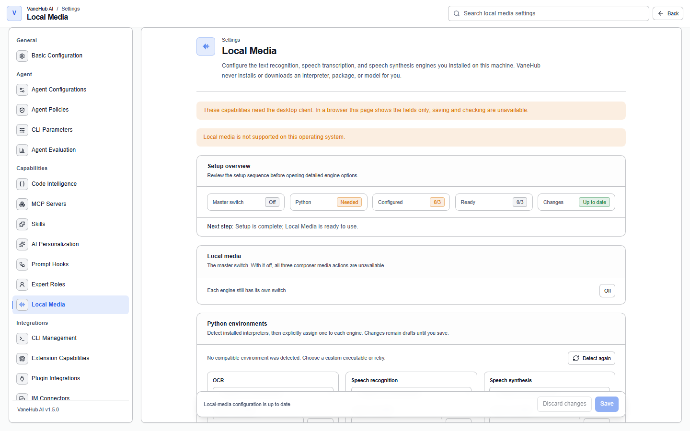

# Local media: OCR, speech recognition, and speech synthesis

VaneHub AI can read text out of an image, turn what you say into text, and read text back to you — **entirely on your own machine**. There is no cloud OCR, no hosted transcription, and no hosted voice. The entry point is **Settings → Local Media**.

This chapter covers configuring the three engines and using them. Installing the frameworks themselves is covered under [Tools and extensions → Extension capabilities](tooling.md#extension-capabilities).

## What you supply, and what the application will not do

**VaneHub AI never downloads, copies, moves, or renames a model on your behalf.** You install the Python environment and the model files; you point the profile at them; the application loads them read-only from exactly the paths you gave.

That is a deliberate constraint rather than a missing feature. Three consequences follow from it:

- **There is no automatic install.** An engine with no configured model stays **Not configured** until you configure it.
- **There is no cloud fallback.** If a local engine cannot run, the operation fails with a reason. Nothing is quietly sent anywhere.
- **When a path is wrong, you move the files.** The application tells you which field is affected and stops there. It will not relocate, copy, hard-link, junction, short-path, rename, or download anything to work around it.

## The three engines

Each engine is configured and enabled independently. Turning on speech recognition does not turn on OCR.

| Capability | Engine | What it needs from you |
| --- | --- | --- |
| **OCR** — text out of images and PDFs | PaddleOCR | A Python environment and the PaddleOCR model directories |
| **Speech recognition** — your voice to text | faster-whisper | A Python environment and a faster-whisper model |
| **Speech synthesis** — text read aloud | sherpa-onnx | A sherpa-onnx voice model |

The profile is **disabled and unconfigured by default**, and every save is versioned. An operation always runs against an immutable snapshot of the profile it started with, so changing a setting mid-flight cannot change the meaning of a result that is already running.

## Readiness states

Each engine reports its own readiness, independently of the other two:

| State | What it means |
| --- | --- |
| **Off** | You have not turned this engine on |
| **Not configured** | Turned on, but a required path or model is not set |
| **Checking** | A probe is running right now |
| **Ready** | A real inference succeeded; the engine works |
| **Unavailable** | The probe failed, with a classifying reason |
| **Needs another check** | A saved profile change stopped the worker that used the old revision; readiness is re-established by checking again |

**Ready means an inference actually ran, not that a model loaded.** The probe executes a minimal real inference and reports **Unavailable** if the model loads and then fails to execute. That distinction matters: a runtime that accepts a model but cannot execute its graph looks perfectly healthy to a load-only check, and the failure would otherwise surface much later as a broken operation in the middle of your work.

## Using it

**Speech to text.** Hold the microphone control in the composer, speak, and release. Releasing finalizes the recording and starts one local transcription; the transcript lands in the composer for you to edit before sending. Only one recording can be active in the whole application at a time, and audio never leaves the native side — the bytes are captured in Rust and are never carried through the interface layer.

**OCR.** Choose a supported image or PDF from the composer. Page and reading order are preserved, and the result comes back as structured text with its provenance rather than as one undifferentiated blob.

**Text to speech.** Synthesis plays through a native output device. Only one local-media playback is active at a time, so a second request replaces rather than overlaps the first.

## Model paths outside ASCII

**This is the trap most likely to catch you on Windows.** A path containing non-ASCII characters — which is what you get if your Windows user name is not written in ASCII — can be resolved perfectly by the host and still be unopenable by the engine's own native code, because the engine reads it through the active code page.

VaneHub AI does not reject such paths categorically; they work wherever the underlying runtime supports them. What it does instead is record, per field, whether a path contains spaces or non-ASCII characters, and **verify any non-ASCII path with a real canary inference before reporting that engine Ready**. So an engine that cannot open your model directory tells you at configuration time rather than at use time.

If a path turns out to be incompatible, the fix is to move the model files to an ASCII path yourself. The application will name the affected field and will not move anything for you.

## Acceleration, and why nothing degrades silently

CPU acceleration for PaddleOCR is explicitly controllable. When an operation fails with `PADDLE_ONEDNN_MODEL_INCOMPATIBLE`, the application offers to disable acceleration and probe again — **and applies that change only after you confirm it**. It does not retry automatically, does not degrade automatically, and does not edit your saved profile without asking.

The same principle governs execution providers generally: **a failed inference is never retried under a different provider, device, or acceleration mode** without an explicit saved profile change. Every result is attributable to the mode recorded in its own operation snapshot, which is what makes a result reproducible instead of merely plausible.

## Privacy

- **Nothing sensitive reaches the logs.** Raw media, OCR text, transcripts, synthesis text, full local paths, protocol frames, and raw Python tracebacks are all excluded from logs, operation labels, telemetry, and crash reports.
- **Working files are ephemeral.** Staged inputs, recordings, admitted OCR files, and generated speech live under opaque names in an application-owned local-media directory and are deleted on success, failure, and cancellation alike.
- **Workers are offline-only.** They receive explicit local model paths and an offline environment configuration; there is no adapter that could reach a network service even if one were configured.

## Notes and limits

- **Desktop only**, and it depends on a local Python environment for OCR and speech recognition.
- **The engines are independent.** OCR reporting **Unavailable** says nothing about speech recognition.
- **Cancellation is bounded and isolated** — cancelling one operation does not disturb another that is already running.
- **Transcription returns the final transcript only** in this version, with bounded language and duration metadata; there is no partial or streaming transcript.
- **Model acquisition is yours.** See [Tools and extensions](tooling.md#extension-capabilities) for the framework install path and its disk footprint.

## Related

- Installing the frameworks → [Tools and extensions](tooling.md#extension-capabilities)
- Where operation failures are recorded → [Observability](observability.md)
- Something reports **Unavailable** and you cannot tell why → [Troubleshooting](troubleshooting.md)
