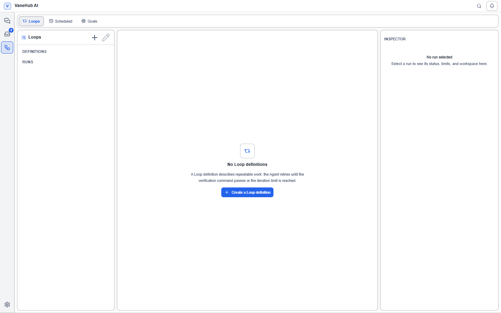

# Loop Engineering: let the Agent iterate until it gets there

## What Loop Engineering is

**It is a change–verify–decide loop machine, driven by the runtime.**

You give it a goal and a set of objective must-pass checks. It then repeatedly has one Agent make changes, runs the checks, and has a second Agent review the result — until every check passes or one of your limits is hit, **and then it stops and waits for you, never declaring its own success**.

What it solves is the back-and-forth cost of "I changed something, now run the tests, paste the failures back, change it again". You pay for one configuration and get unattended iteration.

Three words separate it from the other mechanisms:

| | Who advances it | How it stops |
| --- | --- | --- |
| **Loop (this chapter)** | The runtime, through fixed phases | Checks all pass / a limit is hit / no progress |
| [Multi-Agent group chat](multi-agent-workflow.md) | The Agent, by `@`-ing the next one | Mentions exhausted / depth limit |
| An ordinary session | You, by sending each message | You stop sending |

**A Loop's advance is held by the runtime, not by the Agent.** That is the precondition for being able to enforce limits and mandatory human acceptance — if the Agent decided when to stop, those limits would only be suggestions.

## What a Loop is made of

### One definition

A definition is persisted configuration, kept across restarts and carrying a version. The creation wizard has **four steps**:

| Step | What you fill in |
| --- | --- |
| **Goal and scope** | Name, project path, base branch, **goal**, **acceptance criteria** (one per line), **allowed paths**, **protected paths** |
| **Role Agents** | The **Worker Agent** and the **Verifier Agent** |
| **Verification and limits** | **Verification commands** and the limits |
| **Review** | Check it over and save |

**Allowed paths and protected paths decide what it may touch.** These are scope constraints rather than hints — a definition with an unsafe path scope is rejected outright.

**Acceptance criteria are the basis the Verifier reads**, and are not the same thing as verification commands: the criteria are subjective standards written in prose, the commands are objective checks that must exit zero.

### Two roles, two Agents, two sessions

This is the part of a Loop most easily missed: **it is not one Agent going in circles, it is two roles with a division of labour.**

| Role | Responsibility | Constraint |
| --- | --- | --- |
| **Worker Agent** | Changes the code toward the goal | Works in a separate Git worktree |
| **Verifier Agent** | Reviews what this round produced | **Read-only** |

The Verifier receives four things **in a new session each round**: the immutable goal, the acceptance criteria, a bounded Git diff, and the check evidence. It returns a structured conclusion — **Passed**, revise for another round, or **Blocked** — along with findings.

**A Verifier write is denied.** If it tries to write files, run a command that would mutate the project, or change run state, the runtime refuses the action and records a redacted diagnostic. The point of that constraint: a reviewer must not be able to quietly fix what it found, or "review passed" stops meaning anything independent.

Both roles need an Agent, and it cannot be saved with one missing — the interface says "Select both Worker and Verifier Agents." **There is an eligibility rule for who can hold a role:**

- An Agent that supports CLI interaction is usable directly.
- **An Agent that only supports API interaction must have tool-use trust enabled**, otherwise the definition is rejected with an error saying exactly that.

### Verification commands are structured records, not shell strings

Each verification command is five fields rather than a line of command text:

| Field | Notes |
| --- | --- |
| **Verification program** | The executable |
| **Arguments** | One per line |
| **Relative working directory** | Relative to the run worktree root |
| **Command timeout (seconds)** | The per-command limit |
| **Required check** | Whether it must pass |

**This exists so that no shell is concatenated.** A command that resolves outside the run root, uses a disallowed executable, or carries invalid structured arguments is refused and fails the verification phase — rather than being assembled into a string and handed to a shell to take its chances.

Each command persists its exit status, duration, summary, and associated operation id as evidence.

### Limits

| Limit | Constraint |
| --- | --- |
| **Maximum iterations** | Must be between 1 and 20; **hard-capped at 20** |
| **Step timeout (seconds)** / **Total timeout (seconds)** | The total must not be lower than the step value |
| **Runtime error limit** | How many consecutive runtime errors to tolerate |
| **No-progress limit** | How many rounds of spinning in place to tolerate |

## What it can and cannot do

**It can:**

- Change code repeatedly in a separate Git worktree until a set of objective checks all pass
- Have a second Agent review each round independently, instead of letting the author mark its own work
- Stop with a stated reason the moment any limit is hit, rather than running forever
- Keep every round's actions, check evidence, and diff summary for you to review afterwards
- Resume from a durable phase boundary after a pause

**It cannot:**

- **Declare its own success** — you must accept or reject in the end
- **Run in a remote workspace** — it depends on worktrees, and remotes do not support them
- **Run against a non-Git project** — the definition is rejected outright
- **Commit, merge, or push by itself** — it only leaves its result in the worktree
- **Exceed the 20-iteration cap** — no setting opens that up

A definition is validated at save time: **a non-Git project, a remote workspace, a missing Agent, an unsafe path scope, or an invalid limit** each cause rejection, and **no Agent is started and no worktree is created**. It fails while you are configuring it, not halfway through a run.

## Create a Loop

The interface has three columns: **definitions** and **run records** on the left, the main area in the middle, and the **inspector** on the right. On first entry the middle says there are no Loop definitions yet.

1. Select **Loops** in the activity bar.
2. Select **+** in the left column to create a definition, and work through the four wizard steps above.
3. Save and start.

## The five phases of one iteration

Every round advances in a fixed order: **Preparing → Acting → Verifying → Deciding → Finalizing**.

The Deciding phase short-circuits in strict priority order:

| Order | Condition | Result |
| --- | --- | --- |
| 1 | A hard termination reason is hit | Awaiting acceptance / Cancelled / Failed, by reason |
| 2 | The Verifier returns **Blocked** | Failed |
| 3 | **Not all required checks passed** | Next round |
| 4 | The Verifier asks for another round | Next round |
| 5 | None of the above | Moves to **Awaiting acceptance** |

**Required checks rank above the Verifier's opinion.** An objective, deterministic check beats a subjective judgement — if the Verifier says "this looks fine" while lint is still failing, it still has to be fixed.

The reverse holds too: **if any required check fails or times out, that round does not enter awaiting acceptance.**

## Manual acceptance is mandatory

**This is the Loop's most important safety design: an automatic cycle never declares its own success.**

Even when it judges the goal met, the run only moves to **Awaiting acceptance**. Until you confirm, it stays there.

The same applies when the iteration cap is reached; the interface says "The maximum iteration count has been reached; accept or reject this result."

You have three choices:

| Action | Effect |
| --- | --- |
| **Accept result** | Finishes; the run is marked Succeeded |
| **Reject result** | The run is cancelled, but **its evidence and worktree remain available for review** |
| **Continue with feedback** | Write feedback for the next iteration and run another round |

The third is the one you will actually use most: you read the output, say what is wrong, and let it iterate again carrying your feedback.

## No-progress detection

A Loop compares the goal state across rounds to recognize spinning in place. **Any one of the following counts as progress:**

- The code changes are substantively different
- A different set of checks is failing
- **A check that previously failed now passes**

The third is especially useful: suppose a round only fixed lint and touched nothing else — the code change may look the same as the previous round, but "a check that newly passes" is recognized as real progress.

Only when **all three dimensions are unchanged**, for as many consecutive rounds as your configured tolerance, does it terminate with no progress.

## Run state and controls

A run has seven states: **Queued**, **Running**, **Paused**, **Awaiting acceptance**, **Succeeded**, **Failed**, and **Cancelled**.

The inspector on the right shows the current **Phase**, **Status**, and **Project**. **Run controls** offer:

| Action | Behavior |
| --- | --- |
| **Pause** | **The active step finishes or reconciles first**, and only then does it pause — nothing is cut mid-way |
| **Resume** | Continues from the durable phase boundary |
| **Stop** | The active process is cancelled immediately; **existing evidence and the worktree are retained** |

**Pause does not take effect instantly.** After requesting it the interface says "Pause requested; the current step will reconcile before execution pauses" — so that an action part-way through writing a file is not severed.

## Inspect the execution

| What you want to see | Where |
| --- | --- |
| Phase transitions per round | The timeline view |
| One round's actions and check results | The iteration detail |
| What the Worker did this round | **Worker summary** |
| The Verifier's conclusion and findings | **Verifier review** |
| Overall run state | The run control bar |

Evidence is attributed by role as **Worker** or **Verifier**, with states **Pending**, **Passed**, **Failed**, **Blocked**, and **Cancelled**.

## Notes and limits

- **Desktop only**, because it depends on local processes to run the verification commands and Git.
- **Maximum iterations is hard-capped at 20** and cannot be raised by configuration.
- **Manual acceptance is required** — with nobody to confirm, a run sits in awaiting acceptance indefinitely.
- **A Loop works in its own Git worktree**, so it does not pollute your main working copy — which also means it **does not work with a remote workspace**, since remotes do not support worktrees.
- **The Verifier is read-only** and cannot quietly fix what it finds.
- **An API-only Agent needs tool-use trust enabled** before it can hold a role.
- **No-progress detection can be defeated by fake changes**: if every round produces a meaningless but different code change, the detection never fires.
- A running Loop does not continue after the application exits completely; on restart, interrupted runs are reconciled.

## Related

- Track several Loops under one objective → [Goal management](goals-and-work-board.md)
- The other multi-Agent mechanism → [Multi-Agent group chat](multi-agent-workflow.md)
- Open the loop center quickly with `/loops` → [Slash commands](slash-commands.md)
