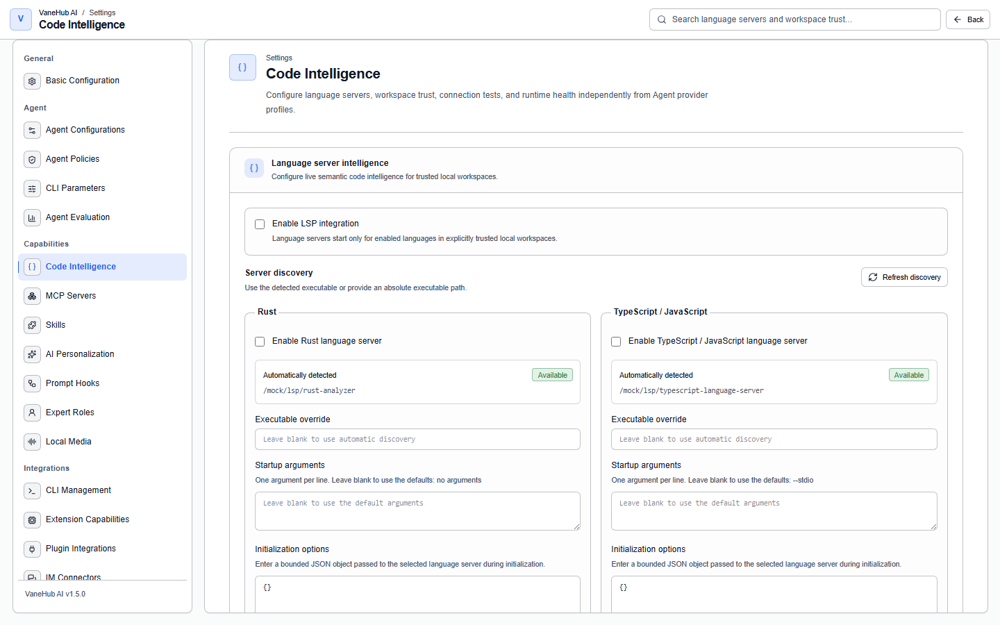

# LSP code intelligence

Language Server Protocol (LSP) integration lets the native API Agent ask a local language server for definitions, references, hover information, and current diagnostics. It is disabled by default and requires both language enablement and explicit trust for each local workspace. The entry point is **Settings → Code Intelligence**.



## What LSP is

Before LSP, every editor that wanted "intelligence" — completion, go-to-definition, error highlighting — had to write a plugin per language. That is the classic **M×N problem**: M editors × N languages = M×N separate implementations. Microsoft proposed LSP in 2016 and turned it into **M+N**:

- Each language implements **one** language server that understands its syntax and type system.
- Each editor implements **one** LSP client that understands how to talk to any language server.

The two sides speak through one protocol and stay indifferent to each other's internals. VaneHub AI plays the client side — it talks to the language servers you have installed locally, on the Agent's behalf.

**How they communicate**: the transport is usually stdio over a child-process pipe; the message format is JSON-RPC 2.0, each message carrying a `Content-Length` header and a JSON body. Messages come in two kinds — request/response (a question and its answer, such as "where is this symbol defined") and notification (one-way, needing no reply, such as "this file's content changed").

**Lifecycle**: the client starts the server as a child process → sends `initialize` declaring which capabilities it supports → the server replies with its own, completing the handshake → normal work → `shutdown` → `exit` for a graceful close. That **capability negotiation** matters: either side may implement only a subset of the protocol, and the capabilities field is how each learns what the other can do.

### What LSP covers

The protocol itself covers far more than the tools VaneHub AI exposes to an Agent:

| Capability | Method | What it does |
| --- | --- | --- |
| Go to definition | `textDocument/definition` | Go to Definition |
| Find references | `textDocument/references` | Find All References |
| Hover | `textDocument/hover` | Shows type and documentation |
| Diagnostics | `textDocument/publishDiagnostics` | Live syntax and type errors (**pushed by the server**) |
| Completion | `textDocument/completion` | Candidates at the cursor |
| Rename | `textDocument/rename` | Safe rename across files |
| Code actions | `textDocument/codeAction` | Quick fixes and refactoring suggestions |
| Formatting | `textDocument/formatting` | Code formatting |
| Semantic highlighting | `textDocument/semanticTokens` | More accurate colouring than regex highlighting |
| Document symbols | `textDocument/documentSymbol` | The file's structure tree |

For document synchronization, the client reports file state to the server with `didOpen`, `didChange`, and `didClose`, and the server maintains a document snapshot for incremental analysis. **VaneHub AI exposes only read-only capabilities to an Agent** — rename, code actions, and formatting all modify files and are not offered. See [Limits and result states](#limits-and-result-states) below.

## Why an Agent needs LSP

- **Precise context extraction** — compared with handing a whole file to the model or grepping for text, LSP returns **semantic** information: every call site of a function, a type's complete definition, symbol resolution across files. That beats AST or regex work, because a language server has done real type checking and cross-module resolution.
- **Lower risk of hallucinated edits** — an Agent can confirm the blast radius with definition and references before changing code, instead of guessing.
- **A diagnostic loop** — after an edit, the compiler's or type checker's errors come straight back, closing an edit → verify → correct loop without you running a build by hand.
- **The cost trade-off** — starting a language server carries real time and memory cost, particularly rust-analyzer's first index of a large workspace. That is exactly why VaneHub AI makes LSP **disabled by default, enabled per language, and trusted per workspace**, rather than spinning up an instance for every session.

## Supported servers and tools

| Language | Server | Default startup arguments | Project-root markers |
| --- | --- | --- | --- |
| Rust | `rust-analyzer` | none | nearest `Cargo.toml` |
| TypeScript and JavaScript | `typescript-language-server` | `--stdio` | nearest `tsconfig.json`, `jsconfig.json`, or `package.json` |
| Go | `gopls` | none | nearest `go.mod` |
| Python | `basedpyright-langserver`, else `pyright-langserver` | `--stdio` | nearest `pyproject.toml`, `setup.py`, `setup.cfg`, or `requirements.txt` |
| C and C++ | `clangd` | none | nearest `compile_commands.json`, or `build/compile_commands.json` |
| Java | `jdtls` through a JVM | none | nearest `pom.xml`, `build.gradle`, `build.gradle.kts`, or `settings.gradle` |

C and C++ is the one language that will not fall back. Every other language treats the workspace root as its project root when no marker is found; `clangd` without a compilation database assumes default compiler flags and then answers definitions and diagnostics that are confidently wrong, so VaneHub AI reports the request as unavailable instead.

Python prefers `basedpyright-langserver` when both are installed. Installing the fork is a deliberate act in a way that installing the upstream server is not, and the discovery panel names the one it selected.

Which languages exist is decided by the desktop build, not by the settings page. The page renders one card per language the running build registers, so a language your build does not know about cannot be configured, and a language your build knows but cannot run on this operating system is shown as unsupported rather than as merely undetected.

The Agent can use nine read-only tools:

| Tool | Result | Every server offers it? |
| --- | --- | --- |
| `find_definition` | Workspace-relative definition locations and bounded previews | Yes, in practice |
| `find_references` | Deterministically sorted references, at most 50 returned | Yes, in practice |
| `get_hover` | Bounded type signature and documentation | Yes, in practice |
| `get_diagnostics` | Current or explicitly stale version-aware diagnostics | Always |
| `find_type_definition` | Where the *type* of the symbol is declared, at most 20 locations | No |
| `find_implementations` | Implementations of an interface, trait, or abstract member, at most 20 | No |
| `find_workspace_symbols` | Symbols matching a name across one project, at most 50 | No |
| `get_document_symbols` | A file's declarations, flattened, each naming what encloses it | No |
| `find_call_hierarchy` | Callers of, or calls made by, a function, at most 50 | No |

The last five are worth knowing about because a server may simply not offer them. The tool is still there and still answers — with an `unavailable` status rather than silence — because whether a server supports a method is discovered when it starts, not when the session begins. `gopls` and `rust-analyzer` offer all nine; older or smaller servers often stop at the first four. The runtime status card lists what the running server actually negotiated.

`find_workspace_symbols` takes a file path as well as a query. The path is not a filter: it says which project's index to search. A repository can hold several projects of the same language, and a language server indexes one of them at a time.

These tools are available in normal and Plan Mode sessions when the current local workspace is eligible.

## Install a server

### Rust

Install `rust-analyzer` with the current stable Rust toolchain:

```bash
rustup component add rust-analyzer
rustup component add rust-src
rust-analyzer --version
```

See the upstream [rust-analyzer installation guide](https://rust-analyzer.github.io/book/rust_analyzer_binary.html) for platform-specific alternatives.

### TypeScript and JavaScript

Install the language server and TypeScript runtime with npm:

```bash
npm install -g typescript-language-server typescript
typescript-language-server --version
```

VaneHub AI supplies `--stdio` as this server's default startup argument; you can replace it under **Startup arguments** if your installation needs something else. See the upstream [TypeScript Language Server project](https://github.com/typescript-language-server/typescript-language-server#installing) for its current prerequisites.

### Go

```bash
go install golang.org/x/tools/gopls@latest
gopls version
```

`gopls` installs into `$(go env GOPATH)/bin`, which is not always on the `PATH` a desktop application inherits. See the upstream [gopls installation guide](https://pkg.go.dev/golang.org/x/tools/gopls#section-readme).

### Python

```bash
npm install -g basedpyright   # or: npm install -g pyright
basedpyright-langserver --help
```

Either server works; VaneHub AI supplies `--stdio`. See [basedpyright](https://docs.basedpyright.com/) or [pyright](https://microsoft.github.io/pyright/#/installation) for their current prerequisites.

### C and C++

`clangd` ships with LLVM. Install it through your platform's package manager, then generate a compilation database for each project:

```bash
clangd --version
# CMake, in the project you want served:
cmake -S . -B build -DCMAKE_EXPORT_COMPILE_COMMANDS=ON
```

The generated `build/compile_commands.json` is what makes the project detectable. See the upstream [clangd installation guide](https://clangd.llvm.org/installation) for other build systems, including `bear` for Make-based projects.

### Java

Java is the one language you point at a **directory** rather than an executable, because `jdtls` is not an executable — it is an Eclipse application VaneHub AI starts through a JVM.

Two things have to be in place:

1. **A JDK, version 17 or newer**, with `java` on your `PATH`. Install it however you normally would; VaneHub AI does not install it for you.
2. **`jdtls` itself.** Press **Install server** on the Java card and VaneHub AI downloads and unpacks it — or point the **Server install directory** field at a copy you extracted yourself.

#### Letting VaneHub AI install it

**Install server** fetches the Eclipse JDT Language Server over HTTPS from `download.eclipse.org`, unpacks it into VaneHub AI's own application data directory, and reports the result on the card. **Remove server** deletes that copy and nothing else.

Before you press it, the card says the download is **not checksum-verified**, and that is worth understanding rather than dismissing. VaneHub AI does check that the address is on its allow-list, that the connection is HTTPS with no redirect off that list, and that neither the download nor the unpacked archive exceeds a size and time limit. What it does not do is compare the bytes against a digest Eclipse published, because the project does not publish one in a form VaneHub AI can locate for the `latest` archive. So you are trusting Eclipse's own host and your TLS connection to it — the same trust you extend when you download it in a browser, no more and no less. If that is not a trust you want to extend, extract a copy yourself and use the directory field instead; nothing on this page treats one route as more legitimate than the other.

Two more things follow from `latest` rather than a pinned version: what you get changes over time, and there is no upgrade button. Reinstalling replaces what is there.

#### Pointing at your own copy

The directory has to be the one containing `plugins/` and `config_win`, `config_mac`, or `config_linux`. VaneHub AI finds the versioned launcher inside `plugins/` itself, so you never type a version number.

**A directory you name always wins over the one VaneHub AI installed.** Having both is fine — installing does not retarget you, and removing VaneHub AI's copy does not touch yours.

If Java shows as unavailable, the reason says which of these to fix:

| What it says | What to do |
| --- | --- |
| The runtime this server needs is not installed | Install a JDK 17+ and make sure `java` runs from your shell |
| No server install directory is configured | Press **Install server**, or fill in the Server install directory field |
| That directory holds no server launcher | You pointed at the wrong level, or the archive did not extract fully |
| That directory holds more than one server launcher | Two `jdtls` versions are mixed in one directory; extract a clean copy |
| The download or the archive was refused by a safety limit | The archive was larger than the limit, or contained an entry VaneHub AI will not unpack; install it yourself instead |
| The download or the unpacking failed | Usually the network or a proxy. Retrying is safe — a failed install leaves nothing behind |
| The download took longer than its time limit | The archive is around 50 MB and the budget is ten minutes, so a slow or throttled link can run out. Retry, or install it yourself |

`jdtls` also keeps an index per workspace. VaneHub AI gives each trusted workspace its own directory for that, and deletes it when you revoke trust for the workspace.

Java startup is noticeably slower than the other servers, and it reports progress for a while after it starts answering. That is normal; the runtime status card distinguishes "ready" from "still indexing".

## Enable LSP for a workspace

Use the desktop application for these steps:

1. Open **Settings > Code Intelligence** and find **Language server intelligence**.
2. Turn on **Enable LSP integration**, then enable the languages you want.
3. Select **Refresh discovery**. If the desktop process cannot see the executable, enter its absolute path in **Executable override**.
4. Leave **Startup arguments** blank to use the defaults in the table above. To pass your own, enter one argument per line — the list you enter replaces the defaults rather than adding to them, so a server that needs `--stdio` must still list it. An entered-but-empty list means "start this server with no arguments at all", which is not the same as leaving the field blank.
5. Keep initialization options as `{}` unless you need server-specific settings. The value must be a bounded JSON object.
6. Save the configuration.
7. Under **Test language server**, run the isolated test. Review the discovery, process start, initialization, and cleanup phases.
8. Read the trust disclosure, enter the absolute local workspace path under **Trusted workspaces**, and select **Trust workspace**.
9. Open a native API Agent session for that local workspace. The nine LSP tools listed above become eligible without requiring a code index.

Changing startup arguments changes the command line a server runs under, so any server already running for that configuration is drained and restarted before the next request. Testing a server uses an isolated minimal project; it does not grant workspace trust. Enabling a Tree-sitter code index also does not grant LSP trust.

## Understand workspace trust

A language server is a local executable running with your operating-system account permissions. Workspace trust controls VaneHub AI's automatic activation and filters Agent-visible results to the current workspace, but it is not an operating-system sandbox. Trust only repositories and executable paths you understand.

Revoking trust rejects new requests and stops language-server processes owned by that workspace. Remote and SSH workspaces are not eligible for local LSP activation.

## Read lifecycle status

| State | Meaning |
| --- | --- |
| **Not running** | No active process exists; an eligible tool call may start one on demand. |
| **Starting** | The executable is being launched. |
| **Initializing** | LSP capabilities and document behavior are being negotiated. |
| **Ready** | Protocol requests are allowed; background project indexing may still continue. |
| **Waiting to restart** | An unexpected exit triggered bounded exponential backoff. |
| **Failed** | The restart budget was exhausted or a terminal safety failure occurred. |
| **Stopping** | VaneHub AI is performing protocol shutdown and process cleanup. |

A ready server with no requests or document leases is closed after ten minutes of inactivity. Configuration or trust changes drain affected processes before replacement. Desktop shutdown sends `shutdown`, then `exit`, and forcibly terminates a process only if bounded cleanup cannot complete.

## Choose `search_code` or LSP

| Need | Tree-sitter `search_code` | Live LSP tools |
| --- | --- | --- |
| Discover code by name, text, or meaning | Best fit | Requires an exact file position or diagnostic target |
| Compiler-aware definitions and references | No | Yes |
| Current types, hover docs, and diagnostics | No | Yes |
| Works without an external server process | Yes | No |
| Persists an index across sessions | Yes | No |
| Initial language coverage | Eight language families | Rust and TypeScript/JavaScript |

The capabilities are complementary. A successful Agent file edit invalidates an open LSP document and also queues targeted reconciliation when a code index is enabled.

## Limits and result states

- Disk content is authoritative; VaneHub AI does not maintain unsaved editor buffers.
- There is no filesystem watcher in this foundation. Agent writes invalidate exact paths immediately, while shell, Git, or external-editor changes are detected before the next semantic query.
- Definitions are capped at 20 and references at 50. Results preserve `total` and `truncated` metadata.
- Hover text, previews, diagnostics, protocol frames, queues, and complete tool output have hard limits.
- `ready` with an empty result means the server found nothing. `warming`, `timeout`, `unavailable`, `failed`, and stale diagnostics are distinct degraded states.
- Completion, rename, formatting, code actions, workspace edits, call/type hierarchy, and persistent LSP enrichment are not included.
- Portable process memory and indexed-file counts are not reported because LSP servers do not standardize them.

## Troubleshooting

### The executable is not discovered

Run the version command in a regular terminal. Desktop applications may receive a different `PATH` than interactive shells, especially when launched from an icon. Restart VaneHub AI after changing `PATH`, or configure an absolute executable override.

### The isolated server test fails

Use the failed phase to narrow the cause:

- **Discovery:** the executable is absent or the manual override is invalid.
- **Process start:** dependencies, permissions, or the executable itself prevented launch.
- **Initialization:** the server rejected the minimal project, returned malformed capabilities, or timed out.
- **Cleanup:** graceful shutdown failed and forced cleanup could not finish.

### A C or C++ request reports a missing project marker

`clangd` is installed and discovery shows it as available, but the workspace has no compilation database, so there is nothing to serve the request with. Generate one — `cmake -DCMAKE_EXPORT_COMPILE_COMMANDS=ON`, `bear -- make`, or your build system's equivalent — and place it at the project root or in its `build` directory. This is deliberately distinct from an installation problem: the server is fine, the project is what cannot be read.

### A language is shown as unsupported on this operating system

That is different from an undiscovered executable. The running build registers the language but declares that its server does not run on this platform, so there is no executable to install and the enablement switch and isolated test are unavailable. An undiscovered executable, by contrast, reports **Unavailable** with a reason and can be fixed by installing the server or setting an override.

### The Agent does not receive LSP tools

Confirm that you are using the desktop runtime, the master and matching language switches are enabled, discovery is available, the current canonical local workspace is trusted, and the session file uses a supported language. A remote session cannot activate native LSP tools.

### Results are warming, stale, or truncated

`warming` usually means the process is still starting or the project is indexing. A stale diagnostic belongs to an older disk document version; request diagnostics again after analysis catches up. A truncated result is valid but bounded—use a narrower symbol or inspect the reported `total`.

### The server repeatedly enters backoff or failed

Review the safe reason shown in **Runtime status**, fix the executable, project, or initialization options, then use the isolated test again. Revoking and re-granting trust stops old processes; it does not repair an invalid server installation.

## Related

- How the persistent index and live LSP divide the work → [Code indexing](code-indexing.md)
- The settings page holding the language-server toggles → [Tools and extensions](tooling.md#agent-configurations)
- The LSP protocol itself: layering and lifecycle, capability negotiation, the text synchronization model → [LSP technical architecture](../../../agent-infrastructure/protocols/lsp.md) (Simplified Chinese)
