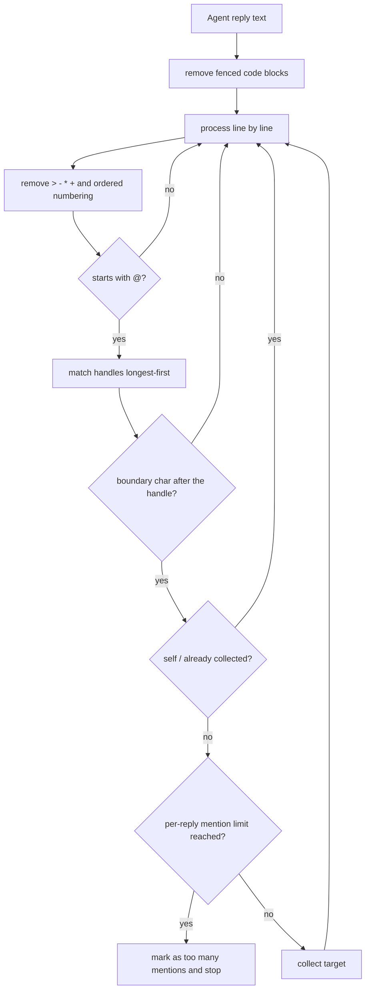
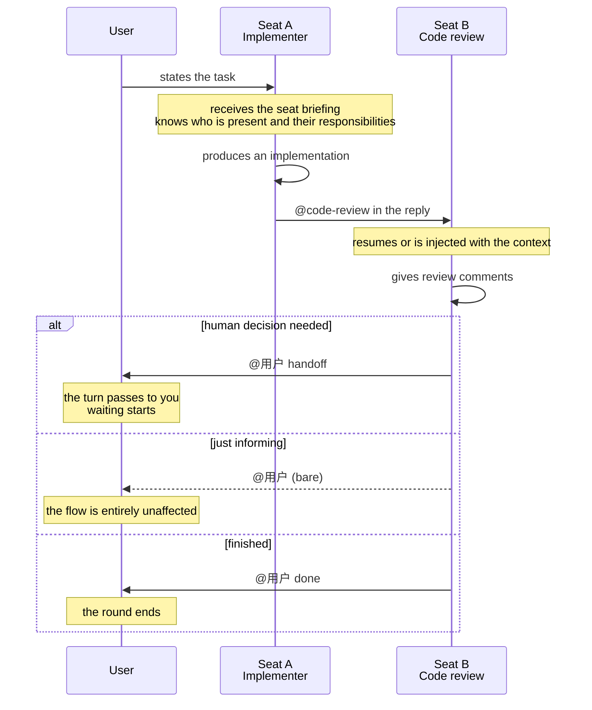

# Multi-Agent group chat

**Status: Implemented — desktop runtime; seat assignment is visible in the normal create-session dialog.**

## Overview

One session can hold several Agent **seats**. Each seat is one Agent plus one expert role, and every seat reads the same shared conversation thread. An Agent names the next speaker with `@` in its reply, handing the turn over — or hands it back to you.

This solves the problem of having to carry context by hand between Agents that are collaborating.

To walk a reproducible acceptance flow directly, use [Group chat collaboration case](multi-agent-testing-tutorial.md).

## Capabilities and runtime boundaries

| Capability | Notes | Runtime |
|---|---|---|
| Seat assignment | Bind several "Agent + role" seats when creating a session | Desktop / Web (simulated) |
| Automatic handle derivation | Generates a unique `@` handle from the role name, adding a suffix on collision | **Desktop only** |
| `@` handoff | Naming a seat in a reply hands the turn to it | **Desktop only** |
| Code-block exemption | An `@` inside a fenced code block does not trigger a handoff | **Desktop only** |
| Hand back to a human | `@用户` carries three intents: handoff / FYI / done | **Desktop only** |
| Seat briefing | Every seat knows who else is present and what each is responsible for | **Desktop only** |
| Context delivery | Per seat, either resume its own session or inject the history | **Desktop only** |
| Runaway chain protection | Terminates with a stated reason when there are too many mentions or the depth limit is hit | **Desktop only** |
| Model-family identification | Determines the model family by stable id, supporting cross-family review | **Desktop only** |
| Seat switching view | Switch between seats in the interface | Desktop / Web (simulated) |
| Speaker attribution | Messages are attributed to the seat that produced them | Desktop / Web (simulated) |

## Seats and handles

**One seat = one Agent + one optional expert role.** Seat identity is stable and not derived from ordering, so a running session can gain and lose seats without affecting the identity or history of anyone who has already joined. A newly added seat becomes addressable from the next turn and receives the preceding thread within its context budget.

**Handles are generated automatically from the role name**, by three rules:

| Rule | Handling | Reason |
|---|---|---|
| Whitespace collapses to `-` | `代码 审查` → `代码-审查` | The handle is typed after `@`, and **whitespace would truncate the token** |
| Empty-name fallback | The nth seat → `席位n` | It must remain addressable when the role name is missing |
| Collision suffix | A second `评审` → `评审-2` | **Two "reviewers" in one session is a reasonable line-up**; a collision should be distinguished, not rejected |

## How an `@` handoff is recognized

### Five defenses

**1. An `@` inside a fenced code block does not count.** An Agent pasting sample code containing `@reviewer` should not actually trigger a handoff.

**2. Quote and list markers do not affect recognition**: `>`, `-`, `*`, `+`, and ordered-list numbering are all stripped — **an Agent writing a checklist is still addressing someone**.

**3. Longer handles match first**: if both `opus` and `opus-45` exist as handles, the shorter one would match first and swallow the longer. Matching in descending length order removes the ambiguity.

**4. A boundary character must follow the handle**: `@opus45` does not match `opus`. Boundary characters cover both Latin and CJK punctuation.

**5. Self-mentions and duplicate mentions are skipped**: an Agent cannot hand the turn to itself, and naming the same target twice counts once.

### Two hard limits

| Limit | Value | What it governs |
|---|---|---|
| Handoff chain depth | **15** | How many hops one chain may take |
| Mentions per reply | **2** | How many seats one reply may mention |

**Two mentions per reply is a tight limit** — it rules out broadcast-style naming outright. The `handoff 1/15` shown in the session interface is that chain-depth counter.

When either limit is hit the chain terminates and **states explicitly which one it was**, rather than stopping quietly.

**A normal ending is not a failure**: a chain that simply runs out of mentions reports no termination reason at all. Conflating the two would make every normal ending look like an error.

## Handing back to a human

**The handle is `@用户`**, and the intent is decided by the word after it, case-insensitively:

| Form | Intent | Effect |
|---|---|---|
| `@用户 handoff …` | You need to take over | The turn passes to you and waiting starts; the round does **not** end |
| `@用户 done …` | The task is finished | The turn passes to you and the round **ends** |
| `@用户` (anything else) | Just letting you know | **The turn does not move, the round does not end, nothing waits** |

**A bare `@用户` defaults to "FYI" rather than "interrupt".** The reason is direct: an intentless bare mention is informational, not blocking. **Blocking by default would punish the Agent for the act of mentioning a human at all, and it would learn to stop mentioning you** — which is exactly the loss of visibility the three intents exist to avoid.

The difference between handoff and done is whether the round ends: the first passes you the ball while the conversation continues, the second calls it finished.

> **`@用户` is not localized with the interface.** With the interface set to English, 日本語, or 한국어, handing back to a human **still requires writing `@用户`** — `@user` is not recognized. The intent keywords are English (`handoff` / `done`), so the complete form is the mixed `@用户 handoff`.

## Seat briefing

**Every seat receives a roster of who else is present before it speaks**, listing each one's handle, role name, Agent name, model family, responsibility, and instruction.

**This briefing is the only channel through which an Agent learns the collaboration rules**, so it is worded as behavior rather than documentation: an Agent that does not know the line-start rule will write a handle mid-sentence, and **a mid-sentence mention does not route**.

Within it, **responsibility is required** — it is what other Agents use to judge who to hand the turn to. See [expert roles under Personalization](personalization.md).

## Model families and cross-family review

| Agent | Model family |
|---|---|
| Claude Code | Anthropic |
| Codex CLI | OpenAI |
| Gemini CLI | Google |
| Antigravity CLI | Google |
| **OpenCode** | **Unknown** |

The determination uses the **stable agent id rather than the display name**, so renaming something does not change the result.

**OpenCode is explicitly "Unknown" rather than a guess**: it drives whatever model you configured, so it has no fixed model family. **Claiming it belongs to one would build the cross-family review check on a false premise.** This bears directly on an expert role's "prefer a different model family for review" policy — see [review policy under Personalization](personalization.md).

## How a seat receives the preceding context

Two ways:

| Way | Meaning |
|---|---|
| Resume | That Agent's own session already holds the history, so **nothing is injected** |
| Inject | The prior shared thread is injected into it |

**Resuming avoids double injection**: a CLI Agent's own session file already contains the history, and injecting it again both wastes tokens and risks confusing the context. When injecting, the **most recent turns** are kept — the latest exchange is what the seat is being asked to act on, and the oldest can usually be recovered from the project itself.

## One handoff round

## How to use it

### Assign seats

1. Open VaneHub AI and select **New**.
2. Set **Session Type** to **Multi Agent** and add one seat for each Agent that should take part.
3. Give each seat an **expert role**. The role name derives the **handle** other seats use to `@` it.
4. Choose the project directory, fill in the session title, and create the session.

Three built-in expert roles are ready to use, and you can create your own under **Settings → Expert Roles**.

### Hand off during the conversation

Typing `@` triggers seat completion; pick the target seat's handle. Who currently holds the turn is shown in the **turn status bar**. **Pasting code is safe** — an `@` inside a fenced code block is skipped.

### View and switch seats

The **Session members** area of the info panel on the right lists the current line-up and anyone who has left; the session workspace provides a seat switcher; and every message is labeled "role name · Agent name".

## Group chat versus Loop Engineering

VaneHub AI has two forms of multi-Agent collaboration, and **they do not share orchestration logic**:

| Dimension | Group chat (this chapter) | [Loop Engineering](loop-engineering.md) |
|---|---|---|
| Who decides who is next | The Agent itself, with `@` | The runtime, advancing by phase |
| How it is triggered | A line-initial `@` in a reply | A goal-driven automatic cycle |
| Termination | Mentions exhausted / depth limit / `@用户 done` | Phase completion / no-progress detection |
| Suits | Exploratory, role-divided collaboration | Tasks with a clear goal that can iterate automatically |

## Group chat versus a single-Agent session

A single-Agent session's seat has no role assigned, derives no handle, and takes no part in handoffs. Group chat is a superset of a single-Agent session — a "group chat" with exactly one seat behaves identically to a single-Agent session.

## Why peer-to-peer handoff

| Pattern | Who drives the turn | Typical examples | VaneHub's choice |
|---|---|---|---|
| **Supervisor / orchestrator** | A central scheduling Agent decides who speaks | AutoGen GroupChat (manager), CrewAI | No |
| **Dependency-graph coordination** | A predefined DAG decides the execution order | Early LangGraph | **Removed** |
| **Peer-to-peer handoff** | The Agent currently speaking names the next one | This chapter | **Yes** |

The supervisor pattern requires one Agent to act as scheduler, which costs tokens and introduces a single point; the dependency-graph pattern requires the collaboration flow to be defined in advance, which does not suit exploratory tasks. Peer-to-peer handoff lets every Agent read the same context and decide for itself who to hand to, which is closer to how a real team works — you `@` whoever is good at this.

**The cost is predictability**: the path a chain takes is decided by the Agents, which is why the depth and mention limits exist as hard backstops.

## Boundaries and limits

- **Multi-Agent execution requires the desktop runtime.** Seat controls render in the browser preview, but no CLI process is started.
- **A shared thread is not a shared session.** Each Agent still keeps its own history in its own session, and VaneHub AI does not merge their native session files.
- **OpenCode has no fixed model family.** Policies like "the reviewer must come from a different model family" do not apply to it.
- **Handles come from role names.** A seat with no role assigned has no stable handle to be `@`-ed by.
- **`@用户` is not localized with the interface.** Switching to the English or Japanese interface still requires writing `@用户`.
- **Group chat and Loop are two mechanisms** and share no orchestration logic.

## Related

- Implementation detail, source locations, and design trade-offs → [the Developer Guide's multi-Agent group chat chapter](../../developer/multi-agent-group-chat.html)
- Walk an acceptance flow → [Group chat collaboration case](multi-agent-testing-tutorial.md)
- Expert roles and review policy → [Personalization](personalization.md)
