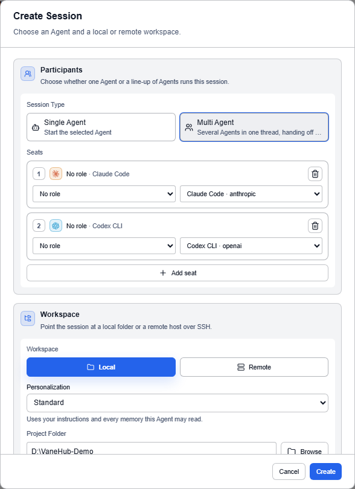
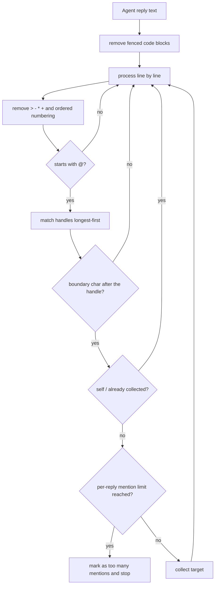
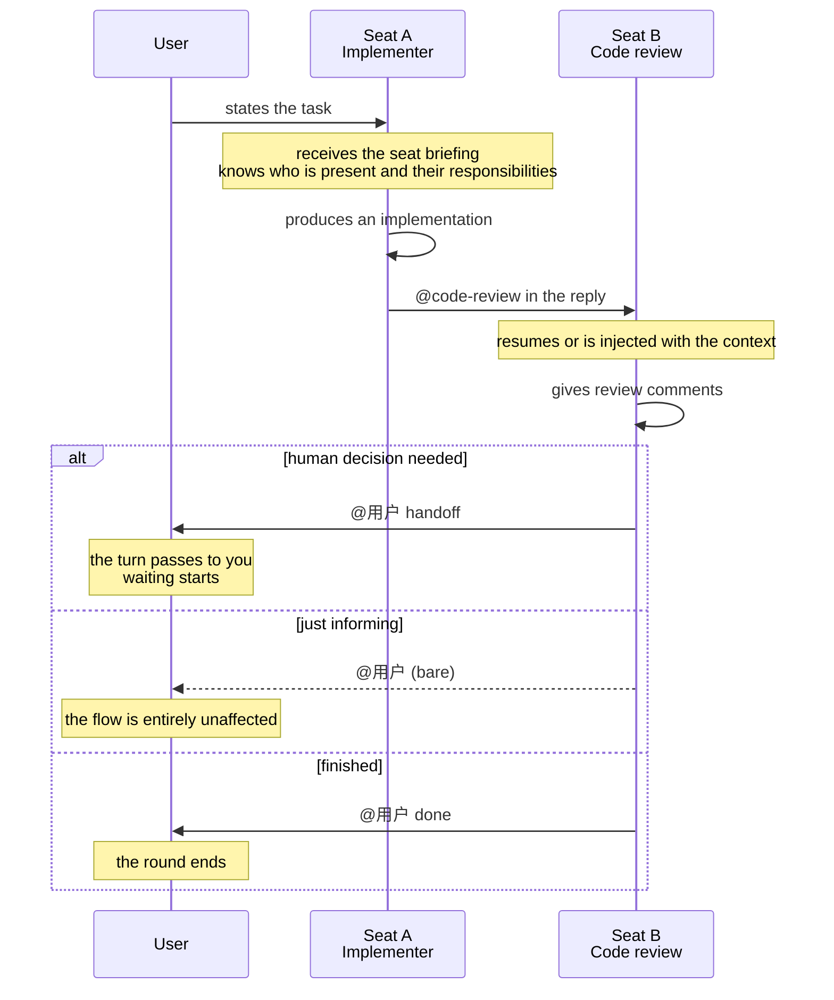

# Multi-Agent group chat

## What is Multi-Agent

A **single-Agent session** has one execution actor: you ask, it does. A **Multi-Agent session** (group chat) puts several execution actors in one session, sharing the same conversation thread and handing the turn to each other as needed.

One session can hold several Agent **seats**. Each seat is one Agent plus one expert role, and every seat reads the same shared conversation thread. An Agent names the next speaker with `@` in its reply, handing the turn over — or hands it back to you.

**It solves the problem** of having to carry context by hand between Agents that are collaborating.

**What it's good for**:

- **Role division** — different Agents each own their part (the architect settles the plan, the implementer writes the code, the reviewer signs off) without you shuttling context by hand
- **Cross-model-family collaboration** — Agents from Anthropic, OpenAI, Google, and others relay on one task, covering each other's blind spots
- **Multi-perspective review** — one Agent produces, another from a different model family reviews, avoiding a single model's blind spots
- **Handing back to a human** — an Agent hands you the decision at a key point with `@用户`

**How it differs from single-Agent**: single-Agent is one actor working start to finish; Multi-Agent is several actors relaying within the same context. Group chat is a superset of a single-Agent session — a "group chat" with exactly one seat behaves identically to a single-Agent session.

> **Multi-Agent runtime capabilities are desktop only.** Seat assignment and speaker attribution are display-layer concerns, but handle derivation, `@` handoff, code-block exemption, seat briefing, runaway-chain protection, and model-family identification all depend on the desktop runtime.

> **On the A2A protocol**: the industry has Google's A2A (Agent-to-Agent) cross-network standard protocol (JSON-RPC, AgentCard). VaneHub AI **does not implement A2A** — "Agent handoff" here is peer-to-peer, in-process, based on an `@` mention in reply text (OpenAI Swarm style), not a cross-Agent network protocol. Both happen to be called "handoff," but the mechanisms are entirely different.

## Getting started

### 1. Assign seats

1. Open VaneHub AI and select **New**.
2. Set **Session Type** to **Multi Agent** and add one seat for each Agent that should take part.
3. Give each seat an **expert role**. The role name derives the **handle** other seats use to `@` it.
4. Choose the project directory, fill in the session title, and create the session.

Three built-in expert roles are ready to use, and you can create your own under **Settings → Expert roles** — see [Expert roles](expert-roles.md).

### 2. Hand off during the conversation

Typing `@` triggers seat completion; pick the target seat's handle. Who currently holds the turn is shown in the **turn status bar**.

**Two things to remember up front**, and the rest of the mechanics can be picked up as you go:

- **`@` has to be at the start of a line** — a mid-sentence mention does not route.
- **Pasting code is safe** — an `@` inside a fenced code block is skipped.

### 3. View and switch seats

The **Session members** area of the info panel on the right lists the current line-up and anyone who has left; the session workspace provides a seat switcher; and every message is labeled "role name · Agent name".

To walk a reproducible acceptance flow directly, use [Group chat collaboration case](multi-agent-testing-tutorial.md).

## Seats and handles

**One seat = one Agent + one optional expert role.** Seat identity is stable and not derived from ordering, so a running session can gain and lose seats without affecting the identity or history of anyone who has already joined. A newly added seat becomes addressable from the next turn and receives the preceding thread within its context budget.

**Handles are generated automatically from the role name**, by three rules:

| Rule | Handling | Reason |
|---|---|---|
| Whitespace collapses to `-` | `代码 审查` → `代码-审查` | The handle is typed after `@`, and **whitespace would truncate the token** |
| Empty-name fallback | The nth seat → `席位n` | It must remain addressable when the role name is missing |
| Collision suffix | A second `评审` → `评审-2` | **Two "reviewers" in one session is a reasonable line-up**; a collision should be distinguished, not rejected |

## How an `@` handoff is recognized

### Five defenses

**1. An `@` inside a fenced code block does not count.** An Agent pasting sample code containing `@reviewer` should not actually trigger a handoff.

**2. Quote and list markers do not affect recognition**: `>`, `-`, `*`, `+`, and ordered-list numbering are all stripped — **an Agent writing a checklist is still addressing someone**.

**3. Longer handles match first**: if both `opus` and `opus-45` exist as handles, the shorter one would match first and swallow the longer. Matching in descending length order removes the ambiguity.

**4. A boundary character must follow the handle**: `@opus45` does not match `opus`. Boundary characters cover both Latin and CJK punctuation.

**5. Self-mentions and duplicate mentions are skipped**: an Agent cannot hand the turn to itself, and naming the same target twice counts once.

### Two hard limits

| Limit | Value | What it governs |
|---|---|---|
| Handoff chain depth | **15** | How many hops one chain may take |
| Mentions per reply | **2** | How many seats one reply may mention |

**Two mentions per reply is a tight limit** — it rules out broadcast-style naming outright. The `handoff 1/15` shown in the session interface is that chain-depth counter.

When either limit is hit the chain terminates and **states explicitly which one it was**, rather than stopping quietly.

**A normal ending is not a failure**: a chain that simply runs out of mentions reports no termination reason at all. Conflating the two would make every normal ending look like an error.

## Handing back to a human

**The handle is `@用户`**, and the intent is decided by the word after it, case-insensitively:

| Form | Intent | Effect |
|---|---|---|
| `@用户 handoff …` | You need to take over | The turn passes to you and waiting starts; the round does **not** end |
| `@用户 done …` | The task is finished | The turn passes to you and the round **ends** |
| `@用户` (anything else) | Just letting you know | **The turn does not move, the round does not end, nothing waits** |

**A bare `@用户` defaults to "FYI" rather than "interrupt".** The reason is direct: an intentless bare mention is informational, not blocking. **Blocking by default would punish the Agent for the act of mentioning a human at all, and it would learn to stop mentioning you** — which is exactly the loss of visibility the three intents exist to avoid.

The difference between handoff and done is whether the round ends: the first passes you the ball while the conversation continues, the second calls it finished.

> **`@用户` is not localized with the interface.** With the interface set to English, 日本語, or 한국어, handing back to a human **still requires writing `@用户`** — `@user` is not recognized. The intent keywords are English (`handoff` / `done`), so the complete form is the mixed `@用户 handoff`.

## Seat briefing

**Every seat receives a roster of who else is present before it speaks**, listing each one's handle, role name, Agent name, model family, responsibility, and instruction.

**This briefing is the only channel through which an Agent learns the collaboration rules**, so it is worded as behavior rather than documentation: an Agent that does not know the line-start rule will write a handle mid-sentence, and **a mid-sentence mention does not route**.

Within it, **responsibility is required** — it is what other Agents use to judge who to hand the turn to. See [Expert roles](expert-roles.md).

## Model families and cross-family review

| Agent | Model family |
|---|---|
| Claude Code | Anthropic |
| Codex CLI | OpenAI |
| Gemini CLI | Google |
| Antigravity CLI | Google |
| **OpenCode** | **Unknown** |

The determination uses the **stable agent id rather than the display name**, so renaming something does not change the result.

**OpenCode is explicitly "Unknown" rather than a guess**: it drives whatever model you configured, so it has no fixed model family. **Claiming it belongs to one would build the cross-family review check on a false premise.** This bears directly on an expert role's "prefer a different model family for review" policy — see [Expert roles → Review policy](expert-roles.md#review-policy).

## How a seat receives the preceding context

Two ways:

| Way | Meaning |
|---|---|
| Resume | That Agent's own session already holds the history, so **nothing is injected** |
| Inject | The prior shared thread is injected into it |

**Resuming avoids double injection**: a CLI Agent's own session file already contains the history, and injecting it again both wastes tokens and risks confusing the context. When injecting, the **most recent turns** are kept — the latest exchange is what the seat is being asked to act on, and the oldest can usually be recovered from the project itself.

## One handoff round

## Case: an architect → implementer → reviewer relay

A typical cross-model-family collaboration flow, walking through one handoff round.

**Goal**: add unit tests for a module and get them passing.

1. **Create a Multi-Agent session** and assign three seats:
   - **Architect** (Claude Code) — settles the test strategy and coverage scope
   - **Implementer** (Codex CLI) — writes the tests per the strategy
   - **Reviewer** (Gemini CLI, a different model family from the implementer) — reviews and runs the tests
2. You start the task: "Add unit tests for `src/auth`, covering the login-failure branch."
3. The **architect** produces a test strategy and hands off with a line-initial `@Implementer`.
4. The **implementer** writes the tests per the strategy and hands off with `@Reviewer` for a review.
5. The **reviewer** reviews and raises changes; if it doesn't pass, it `@`-s the implementer to fix and hand back.
6. Once the tests are all green, the **reviewer** ends the round with a line-initial `@用户 done`, handing back to you.
7. You accept the result.

**What happened in this chain**: three Agents from different model families relayed within one shared context, and nobody had to copy-paste the previous conversation for you — the shared thread plus the seat briefing let every participant know what came before. The chain-depth counter `handoff 1/15` updates live, and hitting the limit terminates explicitly rather than running away.

> To walk a reproducible flow with acceptance checks, see [Group chat collaboration case](multi-agent-testing-tutorial.md).

## Group chat versus Loop Engineering

VaneHub AI has two forms of multi-Agent collaboration, and **they do not share orchestration logic**:

| Dimension | Group chat (this chapter) | [Loop Engineering](loop-engineering.md) |
|---|---|---|
| Who decides who is next | The Agent itself, with `@` | The runtime, advancing by phase |
| How it is triggered | A line-initial `@` in a reply | A goal-driven automatic cycle |
| Termination | Mentions exhausted / depth limit / `@用户 done` | Phase completion / no-progress detection |
| Suits | Exploratory, role-divided collaboration | Tasks with a clear goal that can iterate automatically |

## Multi-Agent topologies: where VaneHub sits

Multi-Agent systems are classified by **who decides what happens next**. The seven mainstream topologies:

| Topology | Structure | Control | Typical examples | VaneHub |
|---|---|---|---|---|
| **Sequential / Pipeline** | Chain | Static | Plan→Code→Review, ETL-style flows | **[Loop](loop-engineering.md) uses this** |
| **Parallel / Fan-out-Fan-in** | Star concurrency | Static | Multi-source retrieval, parallel subtasks, Best-of-N | Not implemented |
| **Supervisor / Orchestrator-Worker** | Centralized, single layer | A central node routes | LangGraph Supervisor, CrewAI | **Deliberately not used** |
| **Hierarchical** | Multi-layer tree | Decomposed layer by layer | Supervisor of Supervisors | Not implemented |
| **Network / Peer-to-peer (handoff)** | Decentralized graph | Agents hand off themselves | OpenAI Swarm, Agents SDK handoff | **Group chat uses this** |
| **Group Chat / Blackboard** | Shared message pool | A turn scheduler | AutoGen GroupChat, the blackboard model | **Partly** — see below |
| **Market / Contract Net** | Bid matching | Tender–bid–award | Classical MAS; rare with LLMs | Not implemented |

### Group chat is a hybrid of shared message pool and peer handoff

It borrows from two rows at once, but **without the scheduler**:

- **Like a blackboard**: every seat reads one shared conversation thread, with no private channels
- **Like peer-to-peer**: the next speaker is named by **the Agent currently speaking, with `@`** — there is no central node deciding who speaks

So strictly it is not a textbook Group Chat: AutoGen's GroupChat has a manager that selects the next speaker, and there is none here. **What is shared is the context, not the right to schedule.**

Loop sits in the Pipeline row instead: its phase order is fixed (Preparing → Acting → Verifying → Deciding → Finalizing), its role split is fixed (Worker → Verifier), and it is **advanced statically by the runtime**. It is not free collaboration among Agents; it is two roles running one pipeline. **That is the underlying reason the product's two multi-Agent mechanisms share no orchestration logic** — on this classification axis they are not even in the same row.

### Why not Supervisor

The supervisor pattern requires one Agent to act as scheduler, which costs tokens and introduces a single point of failure; the dependency-graph (DAG) pattern requires the collaboration flow to be defined in advance, which does not suit exploratory tasks.

Peer-to-peer handoff lets every Agent read the same context and decide for itself who to hand to, which is closer to how a real team works — you `@` whoever is good at this.

**The cost is predictability**: the path a chain takes is decided by the Agents, which is why the depth and mention limits exist as hard backstops. That is a different controllability trade-off from the supervisor pattern, where the scheduler decides when to stop — **you gain flexibility and pay for it with the need for external limits.**

> The **dependency-graph (DAG) coordination runtime** of an earlier design **has been removed** and replaced by peer-to-peer handoff group chat.

## Boundaries and limits

- **Multi-Agent execution requires the desktop runtime.**
- **A shared thread is not a shared session.** Each Agent still keeps its own history in its own session, and VaneHub AI does not merge their native session files.
- **OpenCode has no fixed model family.** Policies like "the reviewer must come from a different model family" do not apply to it.
- **Handles come from role names.** A seat with no role assigned has no stable handle to be `@`-ed by.
- **`@` has to be at the start of a line**; a mid-sentence mention does not route.
- **`@用户` is not localized with the interface.** Switching to the English or Japanese interface still requires writing `@用户`.
- **Group chat and Loop are two mechanisms** and share no orchestration logic.

## Related

- Implementation detail, source locations, and design trade-offs → [the Developer Guide's multi-Agent group chat chapter](../../../developer-guide/src/multi-agent-group-chat.md)
- Walk an acceptance flow → [Group chat collaboration case](multi-agent-testing-tutorial.md)
- Expert roles and review policy → [Expert roles](expert-roles.md)
- Technical overview of orchestration topologies, context management, and failure modes → [Multi-Agent systems technical architecture](../../../agent-infrastructure/multi-agent-architecture.md) (Simplified Chinese)
- What the A2A protocol mentioned above actually is → [A2A technical architecture](../../../agent-infrastructure/a2a-architecture.md) (Simplified Chinese)
