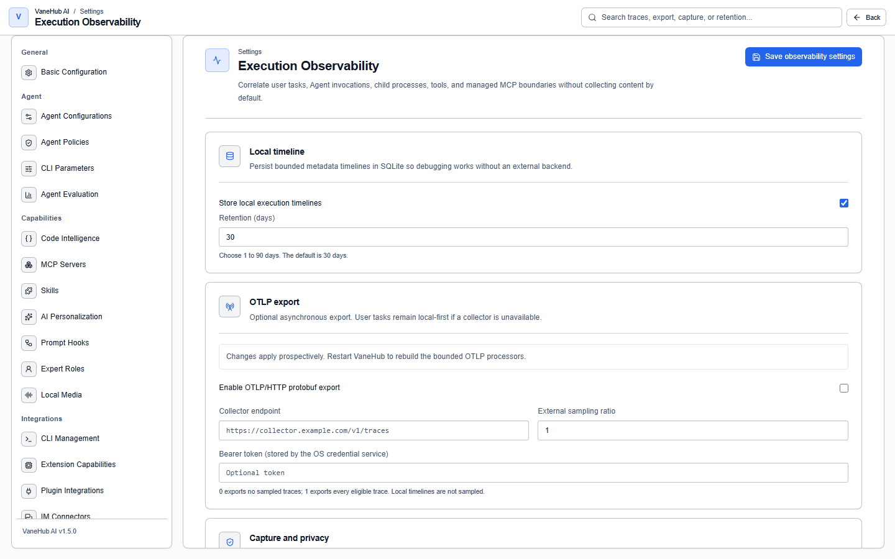
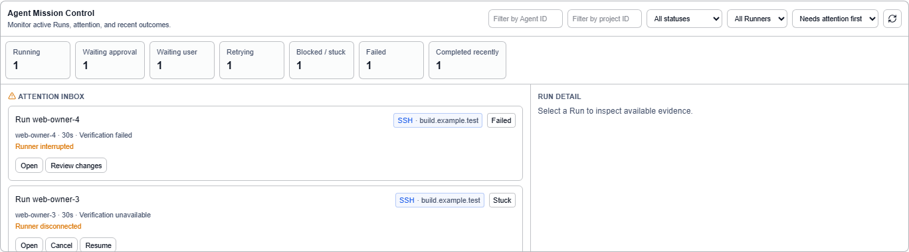

# Observability

## Overview

This answers "what actually happened in that run". The **Traces** tab shows the whole task as a span tree, and the **Logs** tab provides searchable, time-seekable redacted logs.

## Read the execution trace

Open the session's **Traces** tab. Every accepted task is assigned its own identifier before execution begins, so **a failed run is just as traceable**.

The span tree has four layers:

```text
session
 └─ Agent
     ├─ tool / MCP boundary
     └─ process execution
```

### Fidelity: why some nodes do not expand

Every node in the **trace topology** carries a fidelity badge:

| Badge | Meaning |
| --- | --- |
| **Native** | A first-hand record from the runtime; the most complete |
| **Relayed** | Observed through the relay layer (calls that went through the MCP relay) |
| **Inferred** | Derived from other signals |
| **Opaque** | Only the boundary is known; the inside is unknowable |

**Opaque and incomplete nodes carry an explicit notice:**

> Observation gap — this boundary is incomplete or opaque, and success state and duration are not inferred.

**This is deliberate honesty.** What happens inside an external CLI is a black box, so the system keeps one boundary node and **does not invent child nodes or fabricate durations to make the timeline look tidy** — otherwise you would draw conclusions from a structure that is not real.

For a fully expandable call chain, use [OnePiece](native-agent.md).


### Safe correlation identifiers

The top of the timeline lists this run's **Run**, **Trace**, **session**, **operation**, and **Agent** identifiers, which you use to line records up across places while investigating.

### Execution source

The trace records how the run was triggered:

| Source | Situation |
| --- | --- |
| Desktop | You started it by hand in the interface |
| IM connector | Triggered from Feishu, DingTalk, and so on, carrying the connector identifier |
| Scheduled task | Triggered on schedule, carrying the task identifier |

So you can work backwards to "which scheduled task produced this run".

## Read the session logs

Open the session's **Logs** tab:

| Action | Notes |
| --- | --- |
| Search | Search within the redacted logs |
| Seek | Enter a timestamp to jump; if the target is earlier still, it prompts you to seek again |
| Load more | Paged loading |
| Export | Export to a local file |

Logs have four levels: **error / warn / info / debug**.


## Collection policy and redaction

Configure this under **Settings → Execution Observability**. The page describes itself as correlating user tasks, Agent calls, subprocesses, tools, and managed MCP boundaries, **with content collection off by default**.



### Local timeline

On by default, it writes a bounded metadata timeline locally, so **you can debug without any external backend**.

**Retention is configurable from 1 to 90 days, defaulting to 30.**

### OTLP export (optional)

Off by default. It is an **asynchronous export, and an unavailable collector does not affect user tasks**.

| Setting | Notes |
| --- | --- |
| Collector address | The export endpoint |
| External sampling ratio | **0 exports nothing; 1 exports every eligible trace** |
| Bearer token | **Stored by the operating system credential service** |

> **The local timeline is never sampled** — the sampling ratio only affects external export. Settings take effect for subsequent runs, and the processor is rebuilt from the new settings after a restart.

### Collection policies

| Policy | Effect |
| --- | --- |
| Metadata only | A sensitive field is **dropped entirely**, key included |
| Redacted content | A sensitive field's value is replaced with a redaction marker |

**Under "metadata only" a sensitive attribute disappears completely** rather than being left empty — during analysis you have to be able to tell "this attribute never existed" from "policy dropped it".

Even when a field name looks harmless, its string value goes through another token-by-token redaction pass that recognizes and replaces private paths, bearer tokens, provider keys, and the like.

> **File paths and command arguments are treated as sensitive**, because they leak directory structure and invocation detail. That does leave some investigations short of information, and switching temporarily to the "redacted content" policy is the answer when it does.

## Logs and traces are separate

**Logs contain no execution identifiers at all** — run, trace, span, session, and message ids are never written into them.

This is a deliberate privacy design, and the cost is that **you cannot search the logs by a trace id**; the two have to be read separately.

## Mission Control

A trace answers "what happened inside this one run". **Mission Control answers the other question: which runs need you right now.** It lives under **Runs** in the left activity bar — it is that domain's default landing tab (Attention inbox / Active Runs / Recently completed).



The top of the page carries summary counts across seven states:

| Count | What it means |
| --- | --- |
| Running | Currently executing |
| Waiting approval | Halted at a permission gate, waiting for your decision |
| Waiting user | Halted on a question addressed to you |
| Retrying | Failed and being retried automatically |
| Blocked or stuck | Not progressing, with a stated reason |
| Failed | Ended unsuccessfully |
| Recently completed | Finished, kept visible for a while |

Below the counts are three bounded sections — **attention**, **active**, and **recent completions**. Each row shows the run and its owner, the Agent, a safe title, its state, elapsed time, workspace, phase, why it needs attention, and its verification summary.

Two behaviours are worth knowing because they are deliberate:

- **A completed run's elapsed time stops.** It is taken from the terminal timestamp, so refreshing the page does not keep the clock running on something that already ended.
- **Token and cost figures appear only when their provenance is reliable.** With no reported usage, no explicitly classified estimate, or no matching price, Mission Control marks the value unavailable rather than showing zero. A blank here means "not known", not "nothing was spent".

The sections are bounded pages rather than the whole history: the view stays the same size whether you have ten runs or ten thousand. For the detail behind any row — logs, diffs, prompts, tool payloads — open the run itself.

## Notes and limits

- **Desktop only.**
- **History is cleaned up.** Retention is configurable from 1 to 90 days (default 30), and records past that are deleted; for long-term retention, export them yourself or configure OTLP.
- **The system does not offer raw content collection.** Correlation identifiers and content collection are independent, and content is not collected by default.
- **Every node within one run shares one collection policy**; an individual node cannot be relaxed on its own.
- A retry is recorded as its own run, linked to the original by correlation, and **does not reuse the original identifiers** — two runs are never recorded as one.
