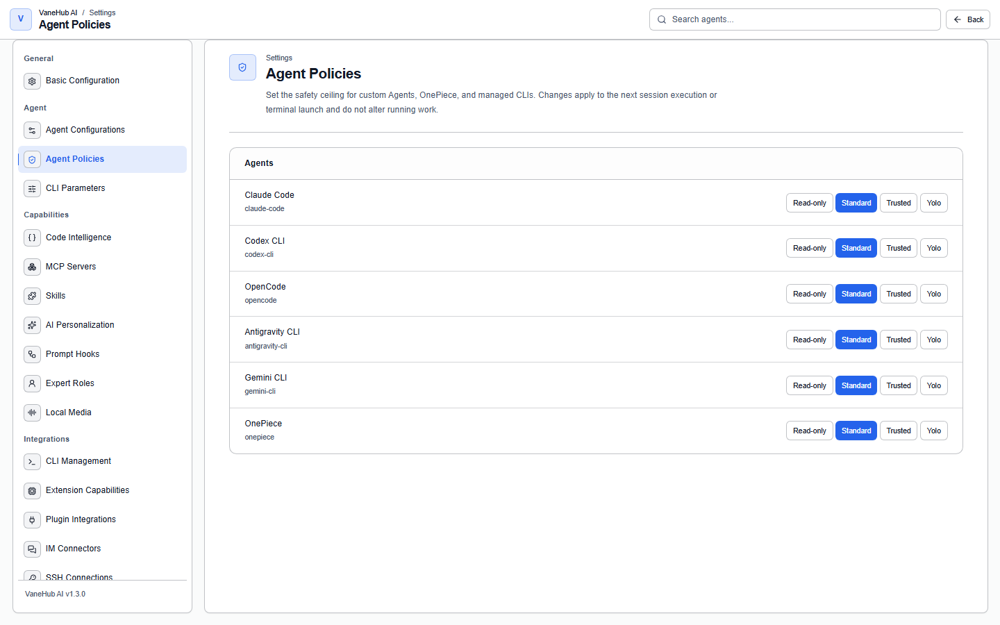

# Permission approvals

## Overview

When an Agent wants to run a command, write a file, call a tool, or write a memory, the operation passes through a gate first. When the verdict is "ask", execution pauses and an approval appears; your decision can be remembered by scope so you are not interrupted repeatedly.

What it solves is that each CLI has its own confirmation mechanism, and they are hard to bring under one roof.

## The four policy templates

Choose a template under **Settings → Agent Policies**. **A template affects only two kinds of action:**

| Action | Read-only | Standard | Trusted | Yolo |
| --- | --- | --- | --- | --- |
| Read files | Allow | Allow | Allow | Allow |
| Write memories | Allow | Allow | Allow | Allow |
| **Run commands** | Deny | **Ask** | Allow | Allow |
| **Write files** | Deny | **Ask** | Allow | Allow |

**Each Agent gets its own row**, so different Agents can run under different templates. The default is **Standard**.

Two things are easy to misread:

- **"Read-only" does not forbid everything** — reading files and writing memories are still allowed.
- **"Trusted" and "Yolo" have identical policy in practice**; they differ only in how firmly you have to confirm when granting them.

## Raising privilege needs confirmation

Switching to **Trusted** or **Yolo** requires one explicit confirmation; switching back to **Standard** or **Read-only** does not.

The test is whether that template automatically allows running commands and writing files — not the name itself.

## Handling an approval

**An approval is not a modal dialog.** When "ask" is hit, the corresponding **tool call block** in the conversation stops at `awaiting_approval` and a notification appears at the bottom right telling you approval is needed.

**Tool call blocks are collapsed by default** — you have to expand one to see the approval area, which reads "This tool call needs your approval before it runs" and shows the risk level (for example **High risk**).

Expanded, it lists three pieces of information:

| Field | Meaning |
| --- | --- |
| **Agent** | Which Agent initiated it |
| **Action** | For example `shell.exec` |
| **Resource** | What it acts on |

Then pick a scope under **Remember my choice:** and select **Approve** or **Deny**:

| Scope | Effect |
| --- | --- |
| **Just once** | Not remembered; you are asked again next time |
| **This session** | No longer asked within the current session |
| **This project** | No longer asked within the current project |
| **Always** | Never asked again |

With any scope other than "Just once", equivalent actions are allowed outright within that scope.

## Decision priority

The system resolves in a fixed order and returns on the first match:

1. **The MCP tool floor** — unconditional, highest priority, unaffected by templates
2. **An authorization you remembered earlier**
3. **The rules of that Agent's template**
4. Nothing matched → **ask**

**An action that matches no rule falls through to "ask", not to allow.** Any internal error also falls back to "ask" — the system does not allow something because it failed.

## What is special about Claude Code

Claude Code does not express permissions through launch flags. It uses a **separate permission hook** that decides dynamically on each call, which is more precise than flags fixed at launch.

When the hook is unavailable it falls back to an offline decision based on risk classification, rather than failing the whole chain.

The other three CLIs each have their own mechanism — OpenCode uses environment variables, Codex CLI uses command-line options. You do not need to care about these differences; configuring the template is enough.

## Notes and limits

- **Desktop only.**
- **Templates are action-level and do not distinguish paths or command content.** There is no way to configure a rule like "may only write files under `src/`".
- **Each CLI's own confirmation mechanism still exists.** VaneHub AI's gate is an additional layer; it does not replace a CLI's own sandbox or confirmation logic.
- **Desktop is authoritative for approval state.** On reload the interface actively fetches the pending-approval list and reconciles, rather than depending on events not being lost.
- Every resolved decision is written to an audit record, including those allowed or denied outright.
