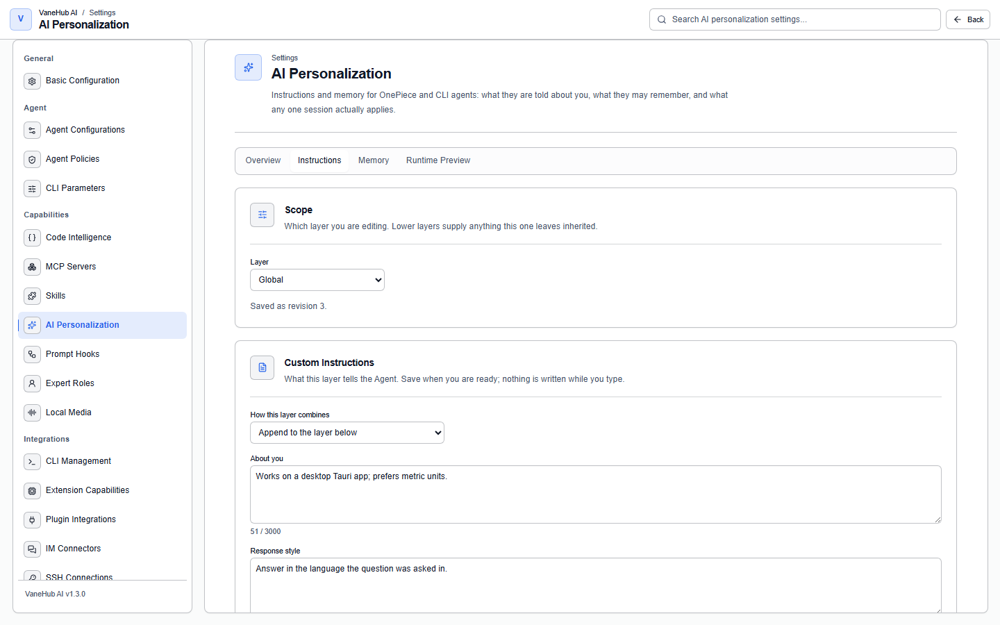

# Personalization

## Overview

Store "facts about you", "style preferences", and "knowledge accumulated in a project" in one place, and have them injected automatically before an Agent runs, instead of explaining it all again in every new session.

Everything is managed on one page, **Settings → AI Personalization**, rather than scattered across several. The page has four views:

| View | What it shows |
| --- | --- |
| **Overview** | What each registered Agent ends up with, and which layer each part came from |
| **Instructions** | Pick a layer, edit its custom instructions, and see how it combines with the layers below |
| **Memory** | Saved memories, pending proposals, creation, reset, and store health |
| **Runtime preview** | For one Agent, one workspace, and one session mode: what this run would actually use |

**Expert roles** are still managed under **Settings → Expert roles**: a role describes a job, not facts about you.

## Scope: four layers, each overriding the ones below

The same instruction can be written at different layers. The higher the layer, the higher its precedence:

| Layer | Applies to | Precedence |
| --- | --- | --- |
| **Global** | Every Agent, every workspace | Lowest |
| **A single Agent** | One Agent, any workspace | ↑ |
| **A single workspace** | Every Agent in one workspace | ↑ |
| **A single Agent in one workspace** | One Agent in one workspace | Highest |

**The workspace layer outranks the per-Agent layer**, because project guidance should normally win over a personal preference about one Agent; when you genuinely need the exception, write it at the top layer.

Each layer decides for itself **how it combines with the layer below**:

| Combination | Result |
| --- | --- |
| **Inherit the next layer** | This layer contributes nothing and the layer below applies as-is |
| **Append after the next layer** | The layer below is kept, and this layer's text follows it |
| **Replace the next layer** | Only this layer applies; the layers below are not injected |
| **Apply no instructions here** | Nothing from this layer down is injected |

While you edit, the **Inherited from below** panel states what saving would do to the layers underneath, so you do not have to save first and then work it out.

> Edits are written only when you press **Save**; leaving a field does not save it, and **Discard** puts the text back the way it is stored.
>
> If the layer changed between the moment you opened the editor and the moment you saved — another window, another machine syncing in — the save is refused and you are shown both sides: your text on one side, the stored text on the other, and you choose which to keep. **Neither side is ever silently overwritten.**

## Agent coverage

The **Overview** view lists every currently registered Agent one by one, along with what it actually receives: whether instructions apply, which layer they came from, whether it can read memories, and whether it can extract them automatically.

There is no hard-coded list of Agents here — register a new one and it appears in the table on its own. Where an Agent does not support a capability, that cell reads **not supported by this Agent** rather than "off"; the difference matters, because "off" is something you can turn on and "not supported" is not.

Memory delivery has three levels, also shown in the table: **no memory**, **index only**, and **index with selected bodies**.

## Custom Instructions

Fill in two fields under **Settings → AI Personalization → Instructions**:

| Field | What to write | Limit |
| --- | --- | --- |
| **About you** | Identity, background, long-term preferences | 3000 characters |
| **Response style** | Output format, language, level of detail | 3000 characters |

For example, put "Always answer in Chinese. Lead with the conclusion." under **Response style**, and "I'm a backend engineer working mainly in Rust and TypeScript." under **About you**.

## Agent memory

Project conventions an Agent discovers during a session are recorded and are available the next time you open a session.

Two switches:

| Switch | What it does |
| --- | --- |
| **Enable memory** | The master switch. **Turning it off also stops using memories already saved**, not just adding new ones |
| **Remember from tool-assisted chats** | Controls whether OnePiece extracts automatically in sessions that used shell, file, or MCP tools. Explicitly asking it to remember something is never affected |

> **The second switch does not affect CLI Agents.** The interface says so explicitly: Claude Code, Codex CLI, Gemini CLI, OpenCode, and Antigravity CLI extract memories independently of this toggle.

### Scope, source, and audience of a single memory

Saved memories are listed a page at a time, with names and metadata only; a body is read when you open that memory. You can filter by:

- **Scope**: whether the memory is global or belongs to one workspace
- **Recorded by**: `you asked for it`, `extracted by OnePiece`, `extracted by a CLI Agent`, `proposed by the model's tool`, `migrated from an older version`, or `edited outside VaneHub`
- **Readable by**: every Agent by default; it can also be narrowed to only the Agents you name, in which case the list marks it **restricted audience**

**"Recorded by" and "readable by" are two different things**: something one Agent recorded can be readable only by another, or by none. This is also the answer to the old limitation that memory could only be switched on and off as a whole, with no way to isolate it per Agent.

From a memory's detail view you can also mark it **sensitive**, **archive** it (no longer injected, still kept), or **delete** it (the file goes too, and that is not reversible).

### Pending review: automatic extraction only proposes

Automatic extraction **never writes an active memory directly**. It produces proposals, listed under **Pending review**, and nothing there is stored until you decide.

Each proposal can be **approved**, **edited then approved**, **merged into an existing memory**, **marked sensitive and archived**, or **rejected**. On approval you can keep the proposed scope and audience or change them.

A memory you write yourself under **New memory** skips that queue — you are the author, so it becomes active directly. You can also record one straight from a message in a session.

### When memories are extracted

Extraction rides on **context compaction** — when a conversation grows long enough to trigger compaction, extraction happens alongside it. It is best-effort and does not guarantee that every valuable fact is recorded.

**Memory extraction for CLI Agents is performed by OnePiece.** This constraint is invisible in the interface but will affect you in practice:

> **With no provider configured for OnePiece, Claude Code, Codex CLI, Gemini CLI, OpenCode, and Antigravity CLI produce no memory extraction at all.**

The reason is that those CLIs expose no reusable model credentials, so the extraction has to go through OnePiece's provider. **So: even if you mainly use Claude Code, you must configure OnePiece before memory works.** See [Native API Agent](native-agent.md) for how.

## Session modes: how much personalization one session may use

When you create a session you pick a mode beside the workspace. The choice is fixed at creation and does not move afterwards when settings change:

| Mode | Meaning |
| --- | --- |
| **Standard** | Uses custom instructions and every memory this Agent is allowed to read |
| **This project only** | Uses only memories from the current workspace; new memories need review |
| **Temporary** | Uses no memory, and nothing from this session is remembered. Instructions still apply |

**This project only** requires a project to be "only" about, so without one it is offered as disabled with the reason stated.

A session created as **this project only** or **temporary** carries a badge at the top of the conversation for as long as it is open, stating the trade-off in force. It is not a transient toast, because the fact stays true for the whole session.

## Reset and repair

### Resetting memories

**Reset memories**, in the **Memory** view, shows counts before it does anything: how many memories match, how many of them are global, how many belong to a workspace, and how many pending proposals and unreadable files go with them. **What is deleted is what the counts say, and nothing outside the chosen scope is touched.**

Confirmation requires typing a phrase by hand. Afterwards the result is reported per storage surface (files, index rows, retrieval entries, quarantined entries); **if one surface could not be cleaned, the page says so outright** — until it is repaired, that memory may still be recalled.

### Store health and rebuild

The **Store health** panel shows the store's current state: `ready`, `migrating`, `rebuilding derived views`, `another process holds the store`, `repair required`, or `failed`.

**Rebuild derived views** regenerates the index and retrieval entries from the files, and quarantines files it cannot read. It does not modify the files themselves. The panel records when the last rebuild ran.

When you upgrade from an older version, existing memories are migrated across intact; individual corrupted entries are quarantined rather than discarded. Until migration finishes, reads return nothing rather than half — half the data is more dangerous than none.

## Runtime preview

**Runtime preview** answers one concrete question: given this Agent, this workspace, and this session mode, what would this run actually use?

It lists the **instructions that apply**, **what was excluded and why**, and how many memories were judged eligible. **It does not show the core prompt, memory bodies, or file paths** — those are either not yours to change, or belong in the memory's own detail view.

## Notes and limits

- **Desktop only**; both memory and settings depend on local storage.
- **It does not rewrite any CLI's own configuration files** — it does not touch `CLAUDE.md`, `AGENTS.md`, or the like, and it does not take over those CLIs' own memory files.
- **It does not take over any CLI's internal context compaction.** How Claude Code, Codex CLI, Gemini CLI, OpenCode, and Antigravity CLI compact context inside their own processes is theirs; what is governed here is what VaneHub injects, not how they trim.
- **OnePiece's own core instructions cannot be edited**; express customization through custom instructions or an expert role instead.
- When the personalization configuration cannot be read, it **gives way in the most conservative direction**: generation proceeds, but no custom instructions are injected and no long-term memory is used. A transient error will not hand you a session that treats "configuration unreadable" as "allow everything".
