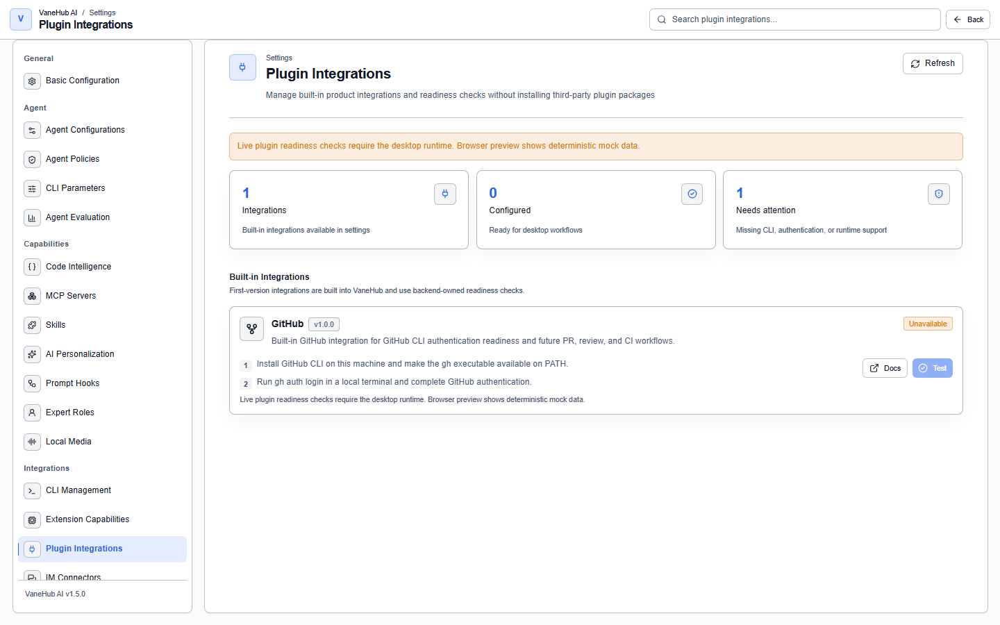

# Plugin integration

## Overview

**Settings → Plugin Integrations** manages VaneHub AI's built-in product integrations and runs a **readiness check** on each one — confirming the external tool it depends on is installed, authenticated, and usable right now.



The point most likely to be misunderstood, first:

> **This does not install third-party plugin packages.** The page's own description is "manage built-in product integrations and readiness checks, not install third-party plugin packages." Integrations ship built into VaneHub AI by version; you cannot add, upload, or download a new one here.

Its division of labor with neighboring pages:

| Page | What it manages |
| --- | --- |
| **Plugin integration** | Readiness checks for built-in product integrations (currently GitHub only) |
| [Extensions](tooling.md#extension-capabilities) | Installing and toggling local multi-modal AI capabilities (OCR, speech recognition, speech synthesis) |
| [MCP servers](mcp.md) | Wiring external tools to an Agent through the MCP protocol |
| [Skill management](skill-management.md) | Installing and binding Skills |

If you want to give an Agent a new tool, MCP servers or Skill management is most likely where you should go — not here.

## The currently built-in integration

**The first version has only GitHub**, which is why the "Integrations" count at the top of the page reads 1.

| Field | Value |
| --- | --- |
| Name | GitHub |
| Provider | GitHub |
| Version | 1.0.0 |
| Dependency | The local GitHub CLI (`gh`) |
| Official docs | <https://cli.github.com/manual/gh_auth_login> |

What it does is **check the GitHub CLI's authentication readiness**, and reserve an entry point for future PR, review, and CI workflows.

> **It doesn't file PRs for you yet.** The first version delivers the readiness check itself; wiring GitHub actions into a session is a later capability. A passing check means only "`gh` on this machine is authenticated."

## Enabling the GitHub integration

Two steps, both done outside VaneHub AI:

### 1. Install the GitHub CLI

Install `gh` and make sure it resolves from `PATH`. See the [GitHub CLI website](https://cli.github.com/) for install instructions.

Verify it in a terminal afterward:

```bash
gh --version
```

### 2. Authenticate in the terminal

```bash
gh auth login
```

Follow the prompts through browser or token authentication. Verify:

```bash
gh auth status
```

### 3. Back in VaneHub AI, click "Test"

Open **Settings → Plugin integration** and click **Test** on the GitHub card. VaneHub AI actually runs `gh auth status` once (**10-second timeout**) and updates the status and "last checked" time based on the result.

The card also has a **Docs** button that opens the official authentication documentation above.

## Reading the five statuses

The top of the page shows three counts: **Integrations**, **Configured** (ready for desktop workflows), and **Needs attention** (missing CLI, authentication, or runtime support). Each integration has five possible statuses:

| Status | UI description | Trigger condition | What to do |
| --- | --- | --- | --- |
| **Configured** | GitHub CLI authentication is available | `gh auth status` exits successfully | Nothing needed |
| **Not configured** | GitHub CLI is installed but not yet authenticated | The command ran, but its output contains signs of being logged out/unauthenticated | Run `gh auth login` |
| **Missing CLI** | GitHub CLI was not found on PATH | The executable couldn't be resolved at all | Install `gh`, or fix `PATH` |
| **Unavailable** | The current runtime doesn't support live GitHub readiness checks | Not running in the desktop client | See the Web-mode note below |
| **Error** | The GitHub readiness check failed | The command failed to launch, timed out, or failed for a reason other than "not logged in" | Run `gh auth status` manually in a terminal to see the real error |

Before it's ever tested, a card reads "GitHub readiness has not been checked yet."

**"Not configured" and "Missing CLI" are kept clearly separate**, deliberately: the former means installed but not logged in, the latter means not installed at all — the fixes are completely different. **"Error" is the catch-all** — it means the command really ran but the result was neither a success nor recognizably "not authenticated"; in that case going straight to the terminal to see the raw output is fastest.

## Desktop only

**Live readiness checks require the desktop runtime**, which runs `gh` on your machine and reads its result.

## Notes and limits

- **Does not install third-party plugin packages** — integrations are built into VaneHub AI and cannot be added by users.
- **Only the desktop can run the real check.**
- **Authentication happens in the terminal**; VaneHub AI only checks the result — it does not custody GitHub credentials, and doesn't go through `gh`'s own login flow.
- **The check has a 10-second timeout**, so a network hiccup is more likely to land on "Error" than to hang for a long time.
- **The check is a one-time snapshot**, not continuous monitoring. After logging in again from the terminal, you need to come back and click **Test** once more to refresh it.

## Related

- Other ways to hook up a tool → [MCP servers](mcp.md), [Skill management](skill-management.md)
- Local multi-modal capabilities → [Tools and extensions](tooling.md#extension-capabilities)
- The code review workflow → [Code review](code-review.md)
