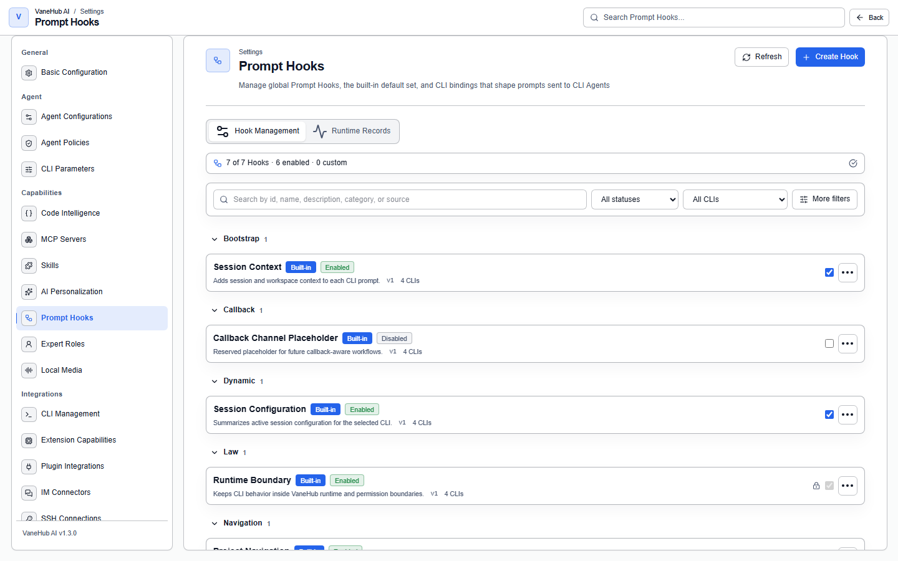

# Prompt Hooks: insert content into the prompt assembly pipeline

## What a Prompt Hook is

**It is a pluggable slot on the prompt assembly pipeline.**

Before each request to a CLI Agent, the system assembles a number of fragments into the final prompt, ordered by category and execution order. A Hook is one slot on that line: you put a template in it, and it is rendered in at the point you specify.

What it solves is "I want every session to carry a particular convention, without typing it each time and without editing each CLI's own configuration files".

**It is not a prompt editor.** What you change is not the input to one conversation but **the slot that every assembly passes through**.

## What it can do

- Inject once **at session initialization**, or **on every turn**
- Control where a fragment lands in the final prompt, by category and execution order
- **Bind to specific CLI Agents**, so different Agents receive different fragments
- **Preview the assembled result** before it takes effect
- Manage edits through **draft / publish / rollback**, so live assembly always uses the version you selected
- See a per-version **evaluation of how it actually performed**

What it cannot do: **it does not apply to OnePiece** (the native Agent has its own core-instruction mechanism), **it cannot edit a built-in Hook's content**, and **it cannot execute anything in a template** — see the variable constraints below.

## Built-in and user Hooks

| Source | What you can do | What you cannot |
| --- | --- | --- |
| **Built-in** | Preview, enable/disable (where allowed), bind | **Edit the template body or immutable manifest fields** |
| **User** | Create, edit, delete, enable/disable, bind, preview | — |

User Hooks behave **identically to built-in Hooks in listing, preview, binding, and pipeline behavior** — they are not second-class.

A built-in Hook carries a "disableable" flag: **a built-in Hook marked not disableable cannot be turned off.** Attempting it is rejected with a readable error and the Hook stays enabled. Those carry constraints that are not meant to be bypassed.

There are three governance markings: **Immutable**, **Human Gated**, and **Auto Evolve**.

The page opens in **Hook Management**. Compact Hook rows are grouped by category; search, enabled state, and CLI are primary filters, while source, stage, and category live under **More filters**. Selecting a row opens one detail workflow with **Overview**, **Content & publication**, and **Version history**, so there is no separate edit-versus-advanced choice. Assembled-prompt preview and safe Hook traces live under **Runtime Records**.

## What a Hook is made of

| Field | Notes |
| --- | --- |
| **Category** | One of `Bootstrap`, `Callback`, `Dynamic`, `Law`, `Navigation`, `Routing`, `Static` |
| **Stage** | **Session Init** (once) or **Per Turn** |
| **Execution order** | Ordering within the same stage |
| Name, description | Interface identity |
| Template body | The content rendered into the prompt |
| CLI bindings | Which Agents it applies to |
| Version | The published version number, for a user Hook |

**The category set is closed**, validated on load and on save; a value outside those seven is not accepted.

## Template variables: an allowlist, treated as inert text

A template may reference variables, but **only those in the backend-owned allowlist**:

| Variable | Meaning |
| --- | --- |
| `{{agent_id}}` | The stable Agent identifier |
| `{{agent_name}}` | The Agent display name |
| `{{current_time}}` | RFC 3339 UTC time |
| `{{sample_input}}` | Sample input |
| `{{session_id}}` | The session identifier |

The compatibility aliases `{{agentId}}` and `{{sampleInput}}` still resolve to the same values.

**`current_time` takes one clock snapshot for a complete assembly**, so several references to it within one assembly get the same instant rather than drifting by milliseconds.

Two constraints matter:

**1. Unknown variables are caught at publication.** If a draft contains a variable outside the allowlist and compatibility aliases, **publication is rejected and the unknown variable names are listed**, and the currently published version is unchanged. The error surfaces when you publish rather than during some later live assembly.

**2. Substitutions are inert text, not executable expressions.** When a template or a replacement value contains shell syntax, command substitutions, markup, or script-like text, the renderer **preserves it as literal prompt text** — it does not execute it, and does not use it to read environment, filesystem, process, or credential data.

## Draft, publish, and rollback

**A user Hook's draft is separate from its published versions, and live assembly uses only the published version you selected.**

| Action | Effect |
| --- | --- |
| **Save draft** | The current published version is unchanged; **an unpublished new Hook takes no part in live assembly** |
| **Publish** | Atomically appends the next monotonically increasing immutable version and selects it |
| **Roll back** | Appends the historical content as a **new version**, carrying a `rollback_from_version` reference |

Three rules are easy to trip over:

- **Publication carries a version expectation.** Publishing with a stale draft revision or a stale published-version expectation is rejected, and **the draft, the version history, and the selected version are all left unchanged**.
- **Rollback is not "going back", it is "publishing the old content again".** History is never deleted or rewritten, so you can see the whole publication chain, including which version was rolled back from which.
- **Rollback does not touch an unpublished draft.** Rolling back a published version while a draft exists leaves the draft exactly as it was — neither silently discarded nor silently published.

Version history is listed **newest first**, with version number, publication timestamp, content hash, publication kind, and rollback source. **The full template body is returned only on an explicit version-detail or preview request**, never in the list.

## Preview and evaluation

**Preview** shows you the assembled result before it takes effect. Select a Hook row: **Content & publication** owns template drafts, preview, and publication, while **Version history** owns immutable versions, rollback, and operational outcomes. Previewing the complete assembled prompt lives under **Runtime Records**.

Evaluation shows a **success rate**, **succeeded / failed** counts, and **average time**. With no evaluated live runs yet it says "No evaluated live executions yet." — **it does not compute a flattering percentage out of zero data.**

Hook execution appears in the execution trace as a summary; see [Observability](observability.md).

## Notes and limits

- **Applies to the four external CLI Agents only**; OnePiece is unaffected by Prompt Hooks.
- **A built-in Hook's content cannot be edited**; create your own when you need a change.
- **Some built-in Hooks cannot be disabled**, which is a deliberate hard constraint.
- **An unpublished draft takes no part in live assembly** — publish it after editing.
- **Variables must be on the allowlist**; unknown ones are rejected at publication.
- **Template content is never executed**; shell syntax in it is just text.
- Version history is immutable, and rollback appends a new version rather than deleting history.

## Related

- The rest of the tool and extension configuration → [Tools and extensions](tooling.md)
- The other layer of personal content in a prompt → [Personalization](personalization.md)
- How Hook execution appears in a trace → [Observability](observability.md)
