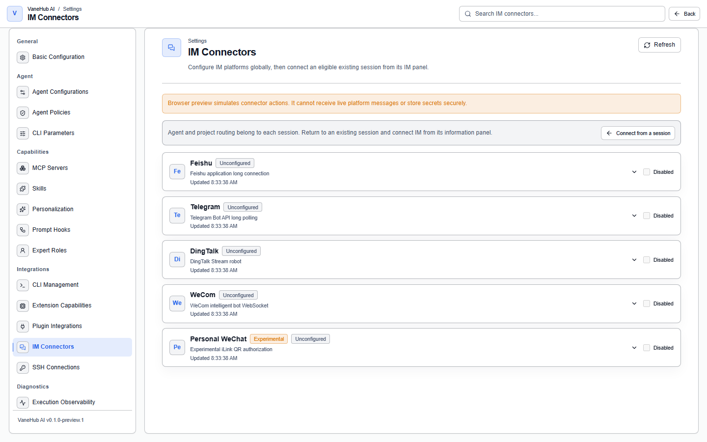
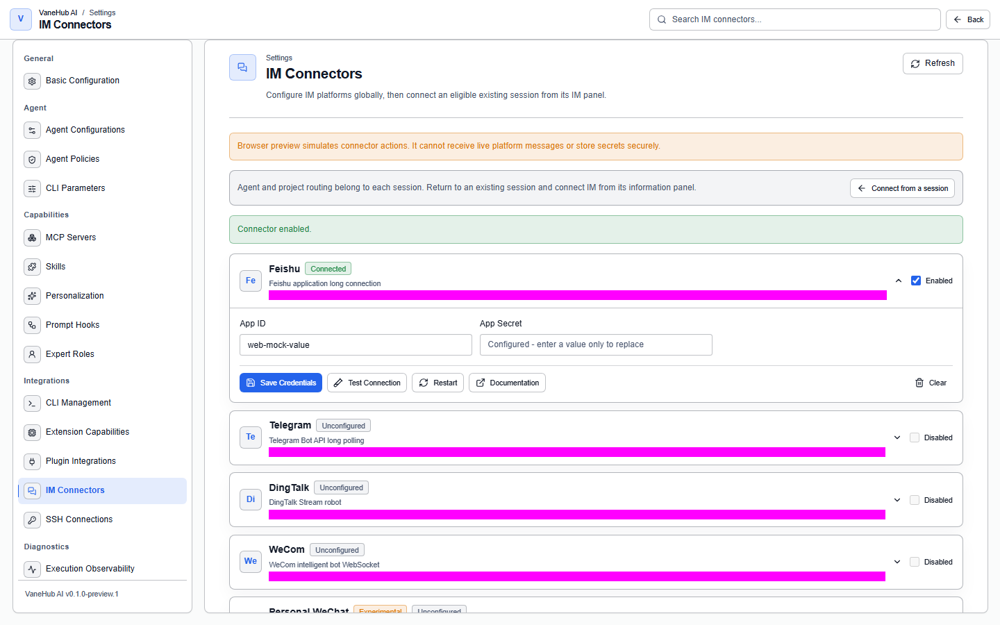

# Remote and IM

**Status: Implemented — desktop only.**

## Overview

**SSH connections** move the execution environment to a remote host; **IM connectors** move the control surface to your phone. Between them they solve the problem of not being at your computer.

## SSH remote workspace

### Configure a connection

Add the host, port, user, and authentication details under **Settings → SSH Connections**. Credentials are handed to the operating system keychain.

### The first connection asks you to confirm the host key

The first time you connect to a host, a host-key confirmation appears. Once confirmed, the system remembers that fingerprint.

> **If you are later told the key has "changed", stop and find out why.** It could be a server reinstall, or it could be a man-in-the-middle attack. The system does not accept a change automatically.

### Use it in a session

When creating a session, set **Workspace** to **Remote** and fill in the host, port, user, and remote path to have the Agent work in a remote directory.

The session workspace's **Terminal** and **Shell** tabs connect to the remote host.

### Limits

- **Remote hosts do not support Git worktrees** — you can only point at a path that already exists there, which also means [Loop Engineering](loop-engineering.md) does not apply to a remote workspace.
- **The concurrent remote terminal limit is 8**; beyond that you wait for one to be released, and an idle terminal is reclaimed after 5 minutes.
- When closing a connection, unread output gets a brief window before disconnect, so the last few lines are not lost — which is usually exactly where the error is.

## IM connectors

### Supported platforms

Five connectors can be configured under **Settings → IM Connectors**:

| Connector | How it connects | Status |
| --- | --- | --- |
| **Feishu** | Feishu app long connection | — |
| **Telegram** | Telegram Bot API long polling | — |
| **DingTalk** | DingTalk Stream bot | — |
| **WeCom** | WeCom smart bot WebSocket | — |
| **Personal WeChat** | iLink QR authorization | **Experimental** |

Before configuring, you need to create an application on the corresponding open platform and obtain its credentials.

### Configure the default route first

**This is a precondition for enabling any connector**, and the interface says so directly: **"This must be configured before any connector can be enabled."**

Set two values in the **default route** section and save:

| Field | Notes |
| --- | --- |
| **Default Agent** | Chosen from the available CLI Agents |
| **Default project** | The project directory |

New external chats create their own sessions using these two defaults; **existing bindings are unaffected**. Try to enable a connector before configuring it and the interface tells you to configure and save first.

### Configure a connector

Enter the application credentials. **Fields marked secret are not echoed back after saving** — they live in the system keychain, and the interface keeps only a reference.

WeChat goes through a QR authorization flow, with the interface showing a QR code and polling the state. The states are: awaiting scan → scanned → confirmed. **"Scanned" and "confirmed" are separate**, and the interface tells you when you have scanned the code but not confirmed on your phone.

### Connection state

Once enabled successfully, a connector shows a **connected** badge and an update time.

Connectors have seven states, two of which are easy to confuse:

- **Authorization expired** — an expected, normal condition; re-authorize
- **Error** — a network or configuration fault

They are displayed separately and never conflated.

### Sessions triggered from IM

A session created by a connector is marked with its source, distinguishing it from sessions you created by hand on the desktop. The execution trace also records which connector triggered it.

## Notes and limits

- **All of this is desktop only**, depending on the native network stack and system credential storage. The browser preview states plainly that it only simulates connector operations, cannot receive real-time platform messages, and does not store credentials securely.
- **The default route must be configured first**, or no connector can be enabled.
- **Personal WeChat is marked experimental** — it goes through iLink QR authorization, and its stability is expected to be lower than the other four.
- **Connectors need each platform's application credentials**, so you must create an application on the corresponding open platform first.
- **What IM can do is limited by its form** — desktop-only views such as file browsing and terminal interaction are not usable from IM.
- A connector session **cannot be activated as the current desktop session**.
