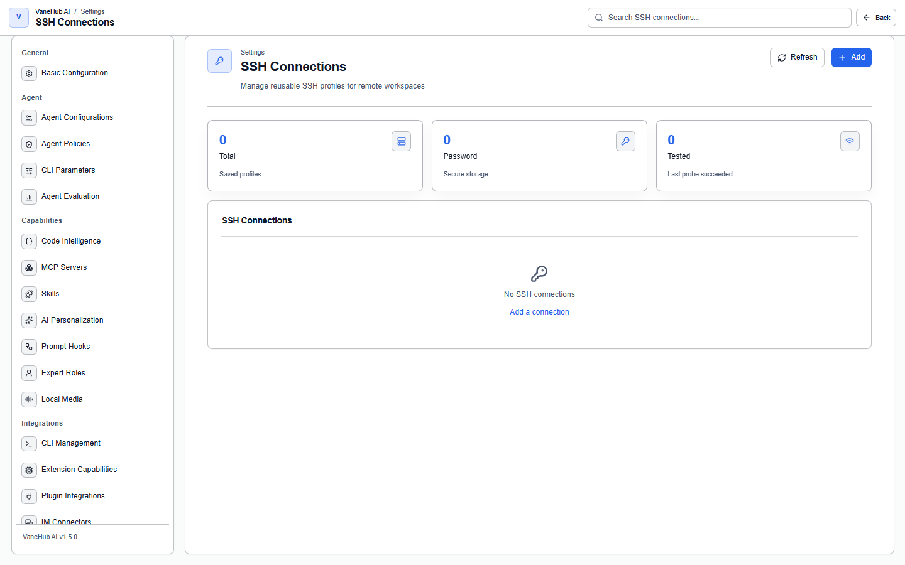

# Remote workspaces and SSH

Using a directory on a remote host as a workspace: configuring the connection, confirming the host key, working in a session, and where remote differs from local.

Triggering a session from a chat app is a separate subject — see [IM connectors](im-connectors.md).

## Configure a connection

Add the host, port, user, and authentication details under **Settings → SSH Connections**. Credentials are handed to the operating system keychain.

## The first connection asks you to confirm the host key

The first time you connect to a host, a host-key confirmation appears. Once confirmed, the system remembers that fingerprint.

> **If you are later told the key has "changed", stop and find out why.** It could be a server reinstall, or it could be a man-in-the-middle attack. The system does not accept a change automatically.

## Use it in a session

When creating a session, set **Workspace** to **Remote** and fill in the host, port, user, and remote path to have the Agent work in a remote directory.

The session workspace's **Terminal** and **Shell** tabs connect to the remote host.

## Limits

- **Remote hosts do not support Git worktrees** — you can only point at a path that already exists there, which also means [Loop Engineering](loop-engineering.md) does not apply to a remote workspace.
- **The concurrent remote terminal limit is 8**; beyond that you wait for one to be released, and an idle terminal is reclaimed after 5 minutes.
- When closing a connection, unread output gets a brief window before disconnect, so the last few lines are not lost — which is usually exactly where the error is.

## Notes and limits

- **Desktop only**, and it depends on the native network stack and the system credential store.
- **A remote workspace does not support Git worktrees**, so Loop is unavailable there. That is a capability boundary, not a configuration problem.
