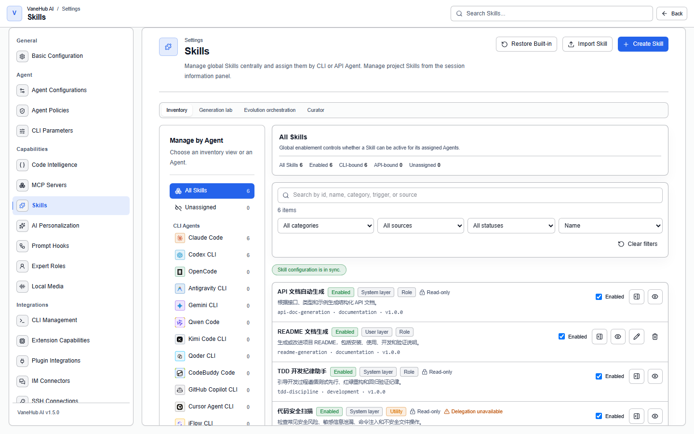

# Skill management

**Status: Implemented — desktop and Web/mock UI.** Desktop performs local persistence, CLI Skill mounting, and API Agent prompt binding. Web/mock only simulates the same UI and state transitions; it does not change local files or runtime configuration.

## What a Skill is

**A Skill is a reusable capability package** — a document telling an Agent how to approach a class of task, plus the supporting files it needs.

It is not the same thing as the custom instructions under [Personalization](personalization.md): custom instructions describe **you** (identity, preferences, response style) and apply globally; a Skill describes **how a class of task is done** and is loaded on demand for specific Agents.

Nor is it MCP: [MCP](mcp.md) connects external **tools** to an Agent (things it can call), while a Skill supplies **method** (how to go about it).

## What it can do

- Capture "this project's conventions" or "the right way to make this kind of change" as a package, and give it to the Agents that need it
- **Assign per Agent**, so different Agents receive different capability packages
- Use an **Overlay** to customize content without rewriting the base package, keeping full version and rollback history
- Use **evolution evidence** to accumulate signals about which Skills actually help at runtime
- Select one effective definition across four content layers (Project / User / Registry / System)

What it cannot do: **a System package's content cannot be edited directly** (only customized through an Overlay), and **Utility delegation, bundled script execution, and remote package installation are not open in the current runtime version**.

## Two independent dimensions: enabled and assigned

This is the easiest thing to conflate, and it is the premise for the next section: **"enabled" and "which Agent it is assigned to" are independent.**

Enabling is the Skill-level master switch; assignment is the relationship between a Skill and one specific Agent. **Enabling a Skill that is not assigned does not make any Agent use it**; disabling an assigned Skill pauses it for every Agent it was assigned to, without deleting those assignments.

## Understand views and states

Enablement and Agent assignment are two independent dimensions.

| View or state | Meaning |
| --- | --- |
| All Skills | One effective row per canonical Skill id in the current management context, regardless of enablement or assignment |
| Unassigned | Skills assigned to no CLI Agent or API Agent; enablement does not affect this classification |
| Agent page | Manages the selected Agent's Assigned and Available Skills |
| Enabled | A Skill-wide master switch that allows Agents already assigned that Skill to use it |
| Assigned | A relationship between the Skill and one specific Agent; each Agent is assigned independently |

“Enabled” does not mean “assigned to every CLI.” Enabling a Skill that has no assignments does not make any Agent use it and does not remove it from Unassigned.

Disabling a Skill pauses it for every assigned Agent without deleting those assignments. When the Skill is enabled again, only the previously assigned Agents resume using it; unassigned Agents remain unaffected.

## Understand effective definitions

Global and Workspace are management scopes for enablement, assignment, drift, and deletion intent. The content used at runtime comes from one effective layer selected in this order: Project, User, Registry, then System. Lower-priority definitions with the same canonical id appear under Runtime details as shadowed definitions; they are not separate active Skills.

Each row identifies its Role or Utility type, eager or on-demand delivery, effective layer, origin, version, availability, usage summary, and compatibility state. Existing Skills without explicit type or delivery remain compatible as eager Role Skills.

System packages are read-only. You can preview, enable, disable, and assign them, but you cannot directly edit or delete their content. An Overlay can customize effective content without rewriting the base package; it does not change the base layer or mutability. Utility delegation, bundled-script execution, and remote package installation are not available in this runtime version.

For native API Agents, on-demand Role Skills can be discovered through fixed read-only Skill tools. Resource references use bounded `skill://` identifiers rather than local filesystem paths. Utility Skills remain visible but unavailable until delegated execution is implemented.

## Customize a Skill with an Overlay

Open Overlay in Skill details to compare base and final effective content and inspect scopes, trust, revisions, conflicts, resource shadowing, and history. An Overlay is a customization record above the base package, not another active Skill row.

Overlay scopes and Skill content layers are separate concepts. System, User, and Project Overlays replay in that order, while the base package remains the one effective definition selected from Project, User, Registry, then System. A Project Overlay belongs only to its canonical workspace and is omitted without an active workspace. A higher-scope resource can shadow a lower resource at the same logical path without deleting the original file.

The common workflow is:

1. Choose an exact patch, learned guidance, or supporting file. Supporting files must be under `references`, `templates`, or `assets` and cannot be scripts or executables.
2. Run Preview and review the match count, scan result, complete diff, and revision witnesses.
3. Confirm the commit. If the base package or Overlay revision changed, the dialog retains your input and requires a reload and new preview.
4. Use Disable to exclude a mutation temporarily, or Revert to create a new revision that undoes it. Audit history is retained.

A locally created Overlay is eligible for replay after validation. An imported package starts in untrusted quarantine and cannot affect an Agent until you review and promote its exact revision, content hash, scan result, and diff. Private keys, credential structures, prompt-authority overrides, script markup, and disguised executable content are hard refusals with no force-trust option.

When the base package changes, the Overlay reports that reconciliation is required. Until you approve the new complete diff, Agents use the last healthy lower-scope result or base content. A conflicted scope never applies partially, and dependent higher scopes remain blocked. You can edit a conflicting mutation or ignore and disable it.

Pinning a Skill preserves healthy Overlays that were already effective, but creation, import, promotion, disable, revert, and reconciliation become read-only. Explicitly unpin the Skill before changing it.

Default limits include 1 MiB per supporting file, an 8 MiB import package, 32 MiB expanded content, 512 archive entries, and 256 mutations. Resource paths are limited to 240 characters and eight components; history rolls into linked 4 MiB segments. Desktop commits manifests, resources, history, and counters in one recoverable transaction, so interruption restores either the complete old revision or the complete new revision. Do not edit Overlay storage or history files manually.

## Evolution evidence

**Evolution evidence** in the Skill detail turns an Agent's structured run outcomes into attributable Skill-improvement signals.

The interface states its current boundary: **read-only evidence; target selection and Skill modification are not active**. It only accumulates evidence and candidate seeds for you to review; it changes no Skill content on its own.

### Where the evidence comes from

Six deterministic extractors, **none of which call an LLM**:

| Extractor | Triggered by |
| --- | --- |
| Explicit user feedback | The helpful / correction feedback on a message |
| Execution and tool failure | Agent, provider, process, tool, permission, timeout, limit, and sandbox events |
| Verification outcome | Test, build, lint, type, security, specification, and acceptance verification |
| Retry and recovery delta | A retry or repair attempt against the same task fingerprint after a failure |
| Delegated Utility outcome | A Utility delegation reaching a terminal state |
| Usage and lifecycle anomaly | Repeated load refusal, missing dependency, conflict, and so on, only once its deterministic threshold is reached |

One classification is worth calling out on its own: **a user cancelling a run is classified as neutral lifecycle evidence by default and is never automatically treated as a Skill defect.**

### What you see

The list presents signals and candidate seeds, filterable by category, extractor, attribution, and fidelity, and shows the category distribution, Skill revisions, source Agents, occurrence time, and the number of independent runs. Ready entries are marked **Ready for review**, and a candidate seed offers **Inspect lineage** to trace where it came from.

Lineage is bounded, and anything beyond the bound is stated — "N bounded lineage entries were omitted" — rather than silently truncated.

### Privacy and retention

**Only metadata evidence is stored, and it is sanitized before storage.** The interface's own wording: raw prompts, conversations, reasoning, commands, tool results, file contents, credentials, and full paths are not copied.

Sanitization covers twelve classes of sensitive content, including private-key blocks, tokens of every kind, authorization headers and cookies, password and credential assignments, credential-bearing URLs and connection strings, secret environment-variable values, user-home paths, email addresses, phone numbers, IP addresses and internal hostnames, and cloud and tenant identifiers.

Two technical details determine how strong that is:

- **Sanitization runs before fingerprint computation**, so task fingerprints and deduplication keys are not derived from a secret.
- **A redaction marker carries only its class and an installation-scoped non-reversible correlation token** — not the original value, not a reversible encoding, and not a globally comparable unsalted hash. The same marker cannot be compared against markers from another installation.

Evidence has a retention period and a signal quota, and the interface shows the current values along with how many entries have expired.

### Collection failures do not affect the Agent

Collection status is one of **Collection healthy**, **Collection degraded**, or **Collection disabled**. **None of the three affects the Agent getting its work done:**

- Degraded says "Agent operations were not failed by this pipeline"
- Disabled says "Existing Agent operations continue normally"
- A failure to load evidence says "Agent operation is unaffected"

### Purge evidence

**Purge this Skill's evidence** removes only three things: the sanitized signals associated with this Skill and workspace, the dependent candidate seeds and lineage, and the evidence-only feedback projections linked to removed signals.

**Source conversations, traces, logs, usage, Skills, and Overlays remain unchanged.**

## Typical outcomes

| Configuration | Result |
| --- | --- |
| Skill A is enabled but unassigned | No Agent uses it, and it remains in Unassigned |
| Skill B is enabled and assigned only to Codex | Codex can use it; other Agents cannot |
| Skill C is disabled and assigned to Codex and Claude | Both Agents pause it, but their assignments remain |
| Skill C is enabled again | Codex and Claude resume using it; other Agents do not receive it automatically |

## Enable and assign a Skill

1. Open Skills in Settings.
2. Find the Skill under All Skills and make sure Enabled is on.
3. Select a CLI Agent or API Agent in the left navigation.
4. Find the Skill in Available and choose Assign.
5. Confirm that the Skill moves to Assigned for the selected Agent.

If several Agents need the same Skill, open each Agent page and assign it separately. Turning off Enabled under All Skills pauses every assigned Agent; it is not a per-Agent switch.

## Runtime differences

- **Desktop:** Assigning a Skill to a CLI Agent may perform filesystem work in its Skill mount directory; assigning to an API Agent stores a prompt binding. If an operation fails, the error stays on the affected Skill row and the assignment does not move optimistically.
- **Web/mock:** You can verify filtering, assignment, removal, and responsive UI behavior, but every result is an in-memory simulation and is not evidence of changed local files or native configuration.
