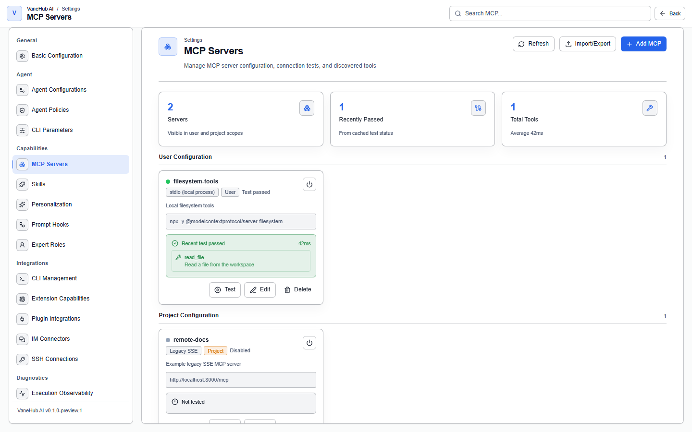

# Tools and extensions

**Status: Implemented — desktop only.**

## Overview

MCP servers, prompt hooks, local extensions, plugin integrations, SDK dependencies, and CLI parameters are all configured centrally in the settings center and then handed to each Agent, rather than being configured separately inside every CLI.

Skill management has its own chapter: [Manage Skills](skill-management.md).

## MCP servers

Register them under **Settings → MCP Servers**, using **Add MCP** to create one. There are three **transports**:

| Transport | Required |
| --- | --- |
| **stdio (local process)** | The launch command |
| **Legacy SSE** | A URL |
| **Streamable HTTP** | A URL |

Configuration is displayed in two groups by scope, **User configuration** and **Project configuration**. There are four states: **Test passed**, **Test failed**, **Not tested**, and **Disabled** — note that "Disabled" is something you turned off deliberately, which is not the same thing as "Test failed"; and "Not tested" does not mean unusable, only unverified.

Each server card can **test** its connection, and a passing test lists the tools it discovered along with the elapsed time.

**Import/Export** is supported. The type-inference rules on import are stated in the interface: an explicit `type=sse` imports as Legacy SSE; `type=http`, `streamable_http`, and a URL with no declared type import as Streamable HTTP.

### Relay: let external CLIs use the same MCP servers

VaneHub AI can forward centrally registered MCP servers to external CLIs, so you do not have to configure them again inside the CLI.

> **Relay is currently enabled only for Claude Code and Codex CLI.** Gemini CLI, OpenCode, and Antigravity CLI need their own configuration, and their MCP calls do not appear in the execution trace.

Calls that go through the relay appear in the [trace](observability.md) with "relayed" fidelity.

## Prompt hooks

Configure them under **Settings → Prompt Hooks** to insert custom content into the prompt lifecycle.

There are two execution points: **once at session initialization**, and **on every turn**.

> **Prompt hooks can only be bound to the four external CLI Agents and do not apply to OnePiece** — the native Agent has its own core-instruction mechanism.

## Extension capabilities

What **Settings → Extension Capabilities** installs is **local multimodal AI capability**, not general-purpose plugins. The first release provides one built-in allowlisted framework per capability:

| Capability | Framework | Runtime | Local port | Estimated disk |
| --- | --- | --- | --- | --- |
| **OCR** | PaddleOCR | Python 3.10+ | 9875 | **~1800 MB** |
| **Speech Recognition** | faster-whisper | Python 3.10+ | 9876 | **~900 MB** |
| **Speech Synthesis** | sherpa-onnx | Python 3.10+ | — | — |

**Check two things before installing**: you need Python 3.10+ on the machine, and **the disk footprint is not small** — PaddleOCR is close to 1.8 GB. Every framework card has an expandable "installation requirements" section.

The top of the page has three counters, **Installed / Running / Errors**; when something errors, check the operation logs for the reason.

## Plugin integrations

**Settings → Plugin Integrations** is for integration configuration of third-party plugins.

## SDK dependencies

**There are only two managed SDKs**: the Claude Code SDK and the Codex SDK, each corresponding to one npm package and carrying three alternative versions — so you can fall back when a version misbehaves.

Gemini CLI, OpenCode, and Antigravity CLI have no corresponding managed SDK.

## CLI management and parameters

### CLI management

**Settings → CLI Management** collects the installation status of the CLIs in one place, with **Installed / Not Installed** counters at the top and three actions: **Diagnose Conflicts**, refresh detection, and **Upgrade All**.

**The same CLI may come from several sources** (npm, winget, Homebrew, Volta, Bun, and others), which is exactly where conflicts come from. There are four:

| Conflict | Meaning |
| --- | --- |
| Multiple installations detected | More than one copy is installed |
| Version mismatch | The copies are at different versions |
| **What actually runs is not what you expect** | **`PATH` order decides which copy really runs** |
| No conflict | Normal |

The third is the most insidious — you believe you are using A while B is what runs.

**Whether VaneHub AI can upgrade for you depends on the install source**: with a manual installation or an unrecognized source, all it can do is tell you to handle it yourself.

### CLI parameters

**Settings → CLI Parameters** configures launch flags per CLI. Parameters carry two annotations:

- **Risk annotation** — dangerous flags are marked prominently
- **Launch scenario** — distinguishing "interactive terminal" from "conversation", because the same CLI needs different parameters in the two cases

> **A policy template overrides the choices you save here.** For example, while the Read-only template is active, a permissive option ticked in the parameters still yields to the template. Security policy takes precedence over convenience configuration.

## Notes and limits

- **All of this is desktop only**; the browser preview shows mock data.
- **Drift is reported but not auto-repaired** — when configuration is detected as changed externally, you decide how to handle it.
- **It does not rewrite any CLI's own configuration files**; tool binding is achieved through launch flags and the relay.
