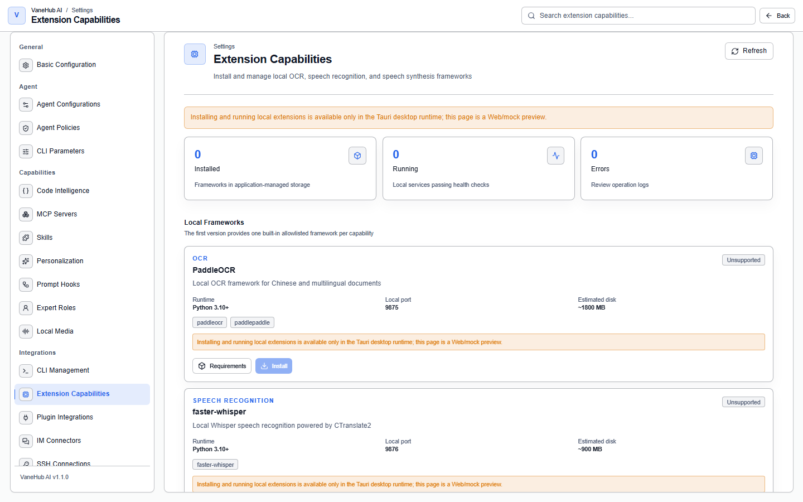
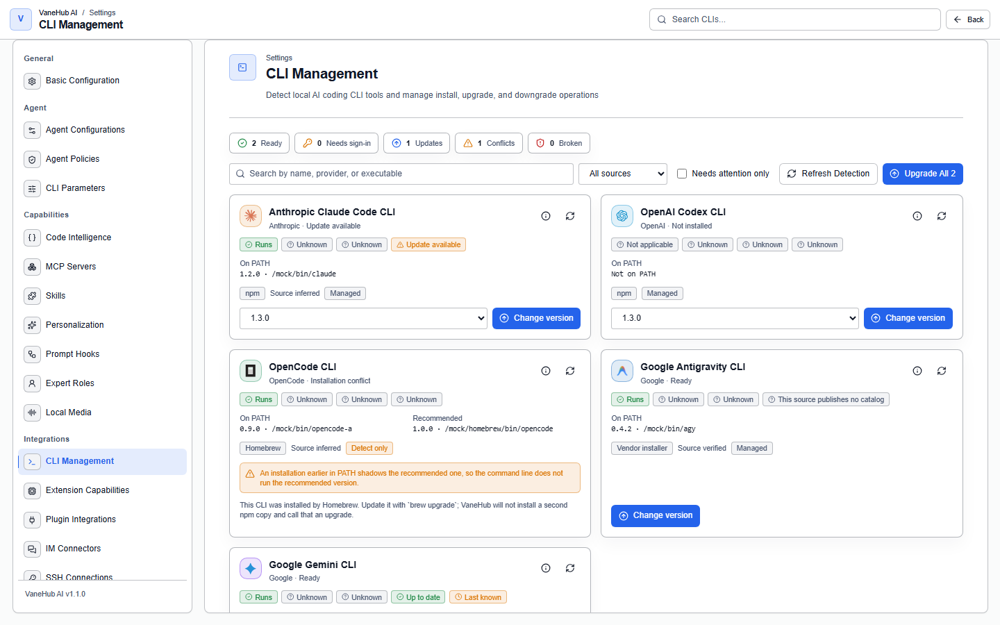
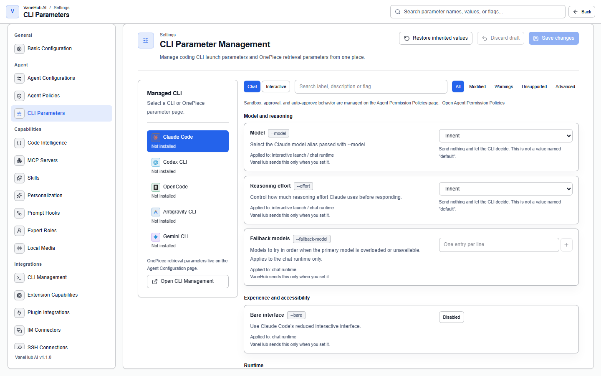
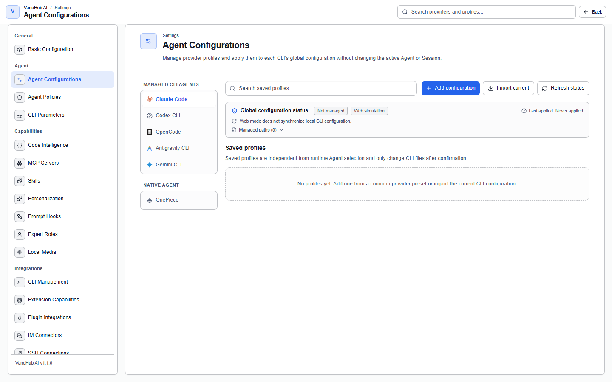

# Tools and extensions

**Status: Implemented — desktop only.**

## Overview

MCP servers, prompt hooks, local extensions, plugin integrations, SDK dependencies, CLI management and parameters, and Agent configurations are all configured centrally in the settings center and then handed to each Agent, rather than being configured separately inside every CLI.

Skill management has its own chapter: [Manage Skills](skill-management.md).

## MCP servers

An MCP server connects external tools to an Agent, registered centrally under **Settings → MCP Servers**. The three transports, the naming rules, connection testing and status caching, Claude Desktop import and export, the relay's scope, per-call tool approval, and the resource limits are all in [MCP servers](mcp.md).

## Prompt Hooks

A Prompt Hook inserts content into the prompt assembly pipeline, configured under **Settings → Prompt Hooks**. The seven categories, the two execution stages, the template variable allowlist, draft/publish/rollback, and evaluation are all in [Prompt Hooks](prompt-hooks.md).

> **Prompt Hooks can only be bound to the five external CLI Agents and do not apply to OnePiece** — the native Agent has its own core-instruction mechanism.

## Extension capabilities

What **Settings → Extension Capabilities** installs is **local multimodal AI capability**, not general-purpose plugins. The first release provides one built-in allowlisted framework per capability:

| Capability | Framework | Runtime | Local port | Estimated disk |
| --- | --- | --- | --- | --- |
| **OCR** | PaddleOCR | Python 3.10+ | 9875 | **~1800 MB** |
| **Speech Recognition** | faster-whisper | Python 3.10+ | 9876 | **~900 MB** |
| **Speech Synthesis** | sherpa-onnx | Python 3.10+ | — | — |

**Check two things before installing**: you need Python 3.10+ on the machine, and **the disk footprint is not small** — PaddleOCR is close to 1.8 GB. Every framework card has an expandable "installation requirements" section.

The top of the page has three counters, **Installed / Running / Errors**; when something errors, check the operation logs for the reason.

## Plugin integration

**Settings → Plugin Integration** manages built-in product integrations and their readiness checks — note that it **does not install third-party plugin packages**. The first release ships one built-in integration, GitHub, which checks the local `gh` CLI's authentication status. The five statuses, how to enable it, and the Web-mode limitation are all in [Plugin integration](plugin-integration.md).

## SDK dependencies

**There are only two managed SDKs**: the Claude Code SDK and the Codex SDK, each corresponding to one npm package and carrying three alternative versions — so you can fall back when a version misbehaves.

Gemini CLI, OpenCode, and Antigravity CLI have no corresponding managed SDK.

## CLI management and parameters

### CLI management

**Settings → CLI Management** is where VaneHub AI reports what is installed on this machine and, for the sources it can drive, changes it. The summary bar counts every tool into exactly one bucket — **Ready**, **Needs sign-in**, **Updates**, **Conflicts**, **Broken** — and each count is also the filter for it. Search, a source filter, and a "needs attention only" toggle narrow the list further.

#### What runs, and what VaneHub would act on

The same CLI can be installed several times over, from several sources. The page reports two identities per tool rather than one:

- **On PATH** — the copy your shell reaches, decided by `PATH` order alone.
- **Recommended** — the copy VaneHub would act on, decided by what actually ran when it was probed.

They differ exactly when something is wrong, and that is the point: a broken launcher earlier in `PATH` means the version you see in a terminal is not the version the page reports as usable. The Details drawer's **Installations** tab lists every copy with its full path, source, source confidence, `PATH` position, and whether it is shadowed.

Conflicts are structured, not free text. Each one names its kind, its severity, the installations involved, and whether it blocks changing the tool, launching it, or both. The nine kinds cover duplicate launcher aliases, `PATH` shadowing, a broken entry taking precedence, several installation sources at once, diverging versions, ambiguous ownership, an environment/`PATH` divergence, an architecture mismatch, and a launcher pointing at a target that no longer exists. When a conflict blocks changes, VaneHub withholds the action rather than picking a copy for you.

**VaneHub never repairs `PATH`, never deletes a duplicate installation, and never migrates a tool from one source to another.** All three are changes to your machine that you did not ask for, and any of them can break something outside VaneHub.

#### Sources, and what each one can do

A source is where a copy came from and, when VaneHub can drive it, how a change would be made. Capability is per source and per action, and it comes from the backend rather than being guessed from a name:

| Source | VaneHub can | Notes |
| --- | --- | --- |
| **npm** | install, upgrade, downgrade, reinstall, uninstall, at an exact version | The version you pick is the version installed |
| **WinGet** | install, upgrade, uninstall | Windows only. Downgrade and reinstall stay disabled until each is separately verified |
| **Vendor installer** | install and upgrade to latest | Audited per CLI, HTTPS only, no exact-version pinning |
| **Homebrew, Bun, Volta, desktop bundle, system package, manual, unknown** | nothing — **detect-only** | Reported, explained, and left alone |

**Detect-only is a statement about VaneHub, not about your installation.** A Homebrew-installed CLI that runs perfectly is healthy *and* detect-only at the same time; the page says which tool does own it — "update it with `brew upgrade`" — instead of showing an unexplained missing button. VaneHub will not install a second npm copy alongside it and call that an upgrade.

**Version lists are never borrowed between sources.** A WinGet installation's update state is decided by WinGet's own catalog, never by npm's.

#### Reviewing a change before it runs

Choosing a version does not start anything. VaneHub prepares an **action plan** and shows it to you first:

- the action, the source, and the channel
- the exact version transition, from what to what
- **the exact command, as a structured argument list** — never a shell string, and never a script piped into an interpreter
- whether it needs the network or elevated privileges
- its preconditions and any warnings
- when the plan expires, and an explicit statement that a failure will **not** silently fall back to another source

Confirming submits the plan's id and the revision you were shown — nothing else. There is no field on that call a command could be rebuilt from, which is what makes "the version you reviewed is the version that runs" a property of the design rather than a promise.

A plan is single use and valid for ten minutes. If it expires, if it has already run, or if the environment moved underneath it, VaneHub refuses it and offers to prepare a new one. **Selecting the version you already have offers no action at all** — there is nothing to run.

#### After it runs

A package manager is an external effect. It cannot be undone by writing an older row into a database, so VaneHub reports what it actually knows:

| Result | Meaning |
| --- | --- |
| **Verified** | The command succeeded and a fresh check confirmed the new version |
| **Applied, unverified** | The command succeeded; the check afterwards could not confirm it. Refresh detection before relying on the version shown — do not run it again |
| **Changed, then failed** | The command failed, but the check shows this host changed anyway. **Nothing was rolled back**, because rolling back an external install is not something VaneHub can do |
| **Failed, nothing changed** | The command failed and nothing was observed to change. Retrying is safe |
| **Cancelled** | You stopped it. Cancelling never implies an already-applied change was undone |

While an operation runs, only the tool it touches is busy. Every other CLI stays readable and actionable, and cached information stays on screen — a page that blanked itself during a refresh would read as "nothing is installed" for as long as the probes take. Data older than the current environment is labelled stale rather than discarded.

**Upgrade all** previews before it runs, in two lists: what will run, and what will not with a reason for each — already current, detect-only source, catalog unavailable, sign-in required, a blocking conflict, and so on. When it finishes, every tool it knew about carries its own result from the table above. One failing item does not hide the others.

#### Diagnostics and sign-in

The Details drawer's **Diagnostics** tab shows what each probe concluded: the version probe, the tool's own doctor command, its sign-in check, and compatibility. **`unknown` is reported as `unknown`** — "this CLI publishes no documented non-interactive check" and "the check failed" are different facts, and reporting the first as the second is what made working CLIs look broken.

**VaneHub never captures a provider credential.** Signing in to Claude Code, Codex CLI, or any other CLI happens in that CLI, through that vendor, and the credentials stay wherever that vendor puts them. VaneHub runs the documented status command, reads a normalized answer out of it — signed in, sign-in required, expired, unknown — and stores nothing else. Raw probe output is truncated and redacted before it reaches an operation log, this page, or a log file.

### CLI parameters

**Settings → CLI Parameters** configures launch flags per CLI.

The rail on the left lists the five external CLIs. Each entry shows the **detected version or installation state** plus counts of unsaved edits, warnings and errors. OnePiece is not here — it does not launch through an external CLI, and its configuration lives under **Settings → Agent configurations**.

**"Inherit" is its own state, not a value named `default`.** While a parameter is inherited VaneHub sends nothing and the CLI decides; only an explicit choice appears in the launch command. The distinction is necessary: in Gemini CLI's `--approval-mode default`, `default` is the real "ask every time" mode, not the absence of a setting.

Parameters carry these annotations:

- **Risk annotation** — dangerous flags are marked prominently
- **Launch scope** — a Chat / Interactive switch at the top. The same CLI needs different parameters in the two cases, and the page lists only the ones that actually apply to the selected scope
- **Maturity and compatibility** — preview, experimental and deprecated states, plus verdicts such as "the installed version does not support this value"
- **Dependencies and conflicts** — OpenCode's `--variant` depends on `--model` being set, for instance, and says so when it is not

**Filtering and search**: filter by All / Modified / Warnings / Unsupported / Advanced. Search matches the label, the description, the option text and the literal flag.

**The preview is tokenized and grouped into global and invocation options.** It deliberately does not join into a pasteable command line: a value containing a space is one argv entry here and two after a shell splits it, so a joined string would misinform. Use **Copy argv JSON** when you need the exact content.

**Saving and concurrency**: the page remembers the revision it opened. If the same profile changed elsewhere, saving is refused with a prompt to reload rather than silently overwriting the other change. **Discard draft** returns to the last saved state and **Restore inherited values** clears every parameter for that CLI back to inherited. Switching CLIs does not lose a draft.

**Repairing older data**: on upgrade, a historical value that cannot be read unambiguously is quarantined — it is neither sent nor deleted. The page says so, and re-selecting it repairs it.

**Web preview limits**: the browser Web/mock adapter has no CLI to detect, so every CLI reports "not installed" and it never claims a version. It can demonstrate editing and previewing, but it launches nothing.

**When changes take effect**: parameters are read at the **next launch**. Conversations and terminals that are already running are unaffected, and saving does not interrupt them.

> **A policy template overrides the choices you save here.** For example, while the Read-only template is active, a permissive option ticked in the parameters still yields to the template. Security policy takes precedence over convenience configuration. Approval, auto-approval, sandbox and dangerous-bypass parameters are not on this page at all — they belong to [Permissions and approvals](permissions.md).

#### Common parameter reference across CLIs

Each of the five external CLIs has its own command-line parameters, listed here for reference when debugging launch parameters in VaneHub AI or scripting a call. CLIs update quickly and `--help` often lags what's actually supported; treat the corresponding official CLI reference as authoritative for a complete list.

| Capability | Claude Code | OpenCode | Codex CLI | Gemini CLI | Antigravity CLI |
| --- | --- | --- | --- | --- | --- |
| Non-interactive / one-shot | `-p, --print` | `run "<prompt>"` | `exec "<prompt>"` | `-p, --prompt` | No separate subcommand, interactive-first |
| Specify a model | `--model` | `-m, --model provider/model` | `-m, --model`/`--profile` | `-m, --model` | Not needed, auto-routed |
| Continue the latest session | `-c, --continue` | `-c, --continue` | `resume --last` | `-r "latest"` | `-c` |
| Resume a session by ID | `-r, --resume` | `-s, --session <id>` | `resume <id>` | `-r "<id>"` | `--conversation <id>` |
| Skip permission confirmation (high risk) | `--dangerously-skip-permissions` | `--dangerously-skip-permissions` | `--dangerously-bypass-approvals-and-sandbox` | `--yolo`/`--approval-mode yolo` | `--dangerously-skip-permissions` |
| Sandbox / permission mode | `--permission-mode` | the agent's `permissions` config | `--sandbox`, `--ask-for-approval` | `--sandbox`, `--approval-mode` | Built-in approval mode |
| Output format (for scripting) | `--output-format json/stream-json` | `--format json` | `--json`, `--output-schema` | `-o, --output-format json` | — |
| Additional working directory | `--add-dir` | `--dir` | `--cd` | `--include-directories` | — |
| Version / help | `-v/--version`, `--help` | `-v/--version`, `-h/--help` | `codex --version` | `-v/--version`, `-h/--help` | `agy --version` |

High-frequency parameters for each CLI:

- **Claude Code** — `--model <alias|id>` (aliases like sonnet/opus/haiku), `--permission-mode <default|acceptEdits|plan|bypassPermissions>`, `--allowedTools`/`--disallowedTools`, `--add-dir`, `--max-turns`/`--max-budget-usd` (`-p` only), `--mcp-config`/`--strict-mcp-config`, `--worktree`/`--session-id`, `--verbose`.
- **OpenCode** — `-m, --model <provider/model>` (a fixed format like `anthropic/claude-sonnet-4-6`), `--fork` (fork from a session), `--format json`, `--attach <server-url>` (connect to a running `opencode serve`), `--agent <name>`, `serve --port --hostname` (a headless HTTP backend).
- **Codex CLI** — `--profile <name>` (a predefined profile in config.toml), `--sandbox <read-only|workspace-write|danger-full-access>`, `--ask-for-approval`, `--json`/`--output-schema`, `--ephemeral` (no rollout persisted to disk), `--skip-git-repo-check`, `--image` (multimodal).
- **Gemini CLI** — `-m, --model` (aliases auto/pro/flash/flash-lite), `--sandbox`/`-s`, `--approval-mode <default|auto_edit|yolo|plan>`, `--checkpointing` (snapshot before edits, revertible with `/restore`), `--include-directories`, `--extensions`, `--worktree`.
- **Antigravity CLI** — `agy -c` (continue the last one), `agy --conversation <id>` (resume a specific conversation), `agy --dangerously-skip-permissions` ("Turbo mode"). No `--model` needed (auto-routed by default). MCP/permission configuration lives at `~/.gemini/antigravity-cli/settings.json`.

> **Permission parameters are the ones that matter most.** All five CLIs have a "skip confirmation / auto-approve" class of parameter. VaneHub's permission templates (Read-only/Standard/Trusted/Yolo) decide whether these high-risk parameters get attached — **security policy takes precedence over convenience configuration** — see [Permission approvals](permissions.md) for the details.

The table above only lists the high-frequency items. The **complete matrix, generated from the registry and updated with the code** — every parameter's literal flag, argument slot, launch scope, control type, ownership, minimum version and verification state — is the [CLI parameter matrix](../../../agent-infrastructure/cli-parameter-matrix.md). For the **complete reference per parameter family** — invocation shapes, session management, model selection, permissions and sandboxing, output formats, configuration injection, and the matrix projecting a host task model onto each CLI's parameters — see the [AI coding CLI parameter reference](../../../agent-infrastructure/builtin-cli-reference.md) (Simplified Chinese).

#### OnePiece's equivalent configuration

OnePiece doesn't go through an external CLI and has none of the command-line parameters above, so it is not a tab on the CLI Parameters page. Everything it *does* have lives under **Settings → Agent configurations**: the **provider configuration** — pick an entry from the provider catalog, fill in an API key (validated before saving), discover and select a model, or configure a custom compatible endpoint — and, below it, OnePiece's retrieval, context-compaction and context-health parameters. See the next section and [Native API Agent](native-agent.md).

## Agent configurations

**Settings → Agent configurations** does something different from every section above: it **decides which vendor and which model each Agent calls**. It's the only feature on this page that actively rewrites any CLI's own configuration file.

The tabs across the top of the page split by Agent: **Claude Code / Codex CLI / OpenCode / Antigravity CLI / Gemini CLI / OnePiece**. The same page also carries the language-server toggles from [LSP code intelligence](lsp-code-intelligence.md) further down.

### What it solves

VaneHub AI cannot manage an external CLI's official subscription login (OAuth) — that has to happen in the terminal. But **switching to a third-party compatible endpoint** — DeepSeek, OpenRouter, Zhipu GLM, and the like — used to mean hand-editing `~/.claude/settings.json` or `~/.codex/config.toml`; now it's configured and applied right on this page.

The built-in catalog holds **25 providers** (official Anthropic and OpenAI, plus OpenRouter, DeepSeek, Zhipu GLM, Kimi, Moonshot, SiliconFlow, Alibaba Bailian, Volcengine Ark, Groq, xAI, Mistral, Together, Fireworks, NVIDIA NIM, Cerebras, MiniMax, StepFun, Baichuan, PPIO, Qiniu, ModelScope, Xiaomi MiMo, Z.AI, and more), and you can also fill in a custom compatible endpoint.

### How far each CLI can be configured

| Agent | Third-party endpoint | Managed configuration file | Configurable fields |
| --- | --- | --- | --- |
| **Claude Code** | Supported | `~/.claude/settings.json` | Endpoint, authentication mode, primary model, and the haiku/sonnet/opus tier mapping |
| **Codex CLI** | Supported | `~/.codex/config.toml` (`auth.json` needs a separate confirmation) | provider id, endpoint, model, protocol (Responses/Chat), reasoning effort |
| **OpenCode** | Supported | `~/.config/opencode/opencode.json` | provider definition, endpoint, npm adapter package, model list and default model |
| **Gemini CLI** | The endpoint can be changed, but the catalog only ships Google's official preset | `~/.gemini/.env` | Endpoint, model, authentication mode |
| **Antigravity CLI** | **Not supported** | `~/.gemini/antigravity-cli/settings.json` | Model, tool approval mode, verbosity, terminal sandbox |

> **Antigravity CLI does not accept a custom endpoint.** It only goes through Google sign-in, with credentials stored in the system keychain — the configuration panel has no endpoint or key field at all. What you can adjust is the model and approval behavior.

Claude Code and Codex are **exclusive mode**: many configurations can be saved, but only one is "applied" at any given moment. OpenCode is **additive mode**: provider definitions are kept stacked, and switching only changes the global default `provider/model`.

### What applying actually changes

- **Only the fields VaneHub owns are replaced.** Hooks, permissions, and plugins in `~/.claude/settings.json` are preserved as-is; projects, MCP servers, comments, and unrelated providers in `config.toml` are untouched too.
- **The full result is validated and built in memory first, then swapped in atomically.** When Codex touches multiple files, any single step failing rolls back every file already changed.
- **Configurations are read back before switching.** When you leave a configuration, VaneHub reads the managed fields out of the currently applied file and writes them back into that configuration, so your manual tweaks to the live file aren't silently discarded.
- **Running CLI processes are never restarted automatically after applying.** VaneHub doesn't claim hot reload — you'll need to reopen the session or terminal yourself.

### Credentials and drift

**The API key is stored in the operating system's credential service**, scoped per Agent/configuration, never in SQLite; the UI only ever echoes back "configured." Plaintext is only written into a file the CLI requires plaintext for when you explicitly click "Apply."

After a successful apply, VaneHub keeps a fingerprint for the managed fragment. **If the file is changed externally, drift is only reported, never silently overwritten**; if concurrent modification is detected mid-apply, the write is aborted rather than forced through. OpenCode's external edits are only picked up on the next startup or a manual import.

A sync runs on startup: when Claude Code or Codex has no configuration at all, a `default` is imported from the resolvable existing file (without writing back to it); once any configuration exists, subsequent startups skip this.

### OnePiece

The native Agent OnePiece is configured on the same page, but its key is held directly by VaneHub AI, and **it's actually called once to validate before saving — a failed validation is not saved** — with the available model list fetched only after validation passes. See [Native API Agent](native-agent.md).

## Notes and limits

- **All of this is desktop only.**
- **Drift is reported but not auto-repaired** — when configuration is detected as changed externally, you decide how to handle it.
- **MCP, Prompt Hooks, Extension capabilities, and CLI parameters never rewrite any CLI's own configuration file**; binding is achieved through launch flags and the relay. **Agent configurations is the one exception** — it explicitly rewrites managed fields under the semantics described above.
