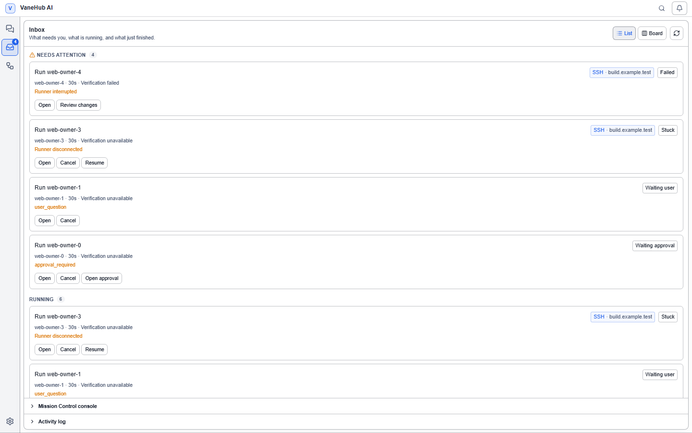

# User interface

The main window's layout and navigation, and the entry points that sit around a session: the session list, Agent selection, the conversation area, the floating assistant, the loop centre, notifications, and the system tray.

The nine workspace tabs inside a session are in [Session workspace](session-workspace.md); settings are in [Settings](settings.md).

## Session management

### Create a session

Select **New** to open the create-session dialog, then choose the session type (Single Agent / Multi Agent), the Agent, the workspace (Local/Remote), the project folder, and the session name. A Git project is marked **Git** and can create a worktree. For Multi Agent, assign seats — see [Multi-Agent group chat](multi-agent-workflow.md).

### Session list

The session list on the left supports three display modes: **list / by category / by project**. You can search by name or content, filter by Agent, select in bulk, reorder by dragging, and filter favorites. **Right-click a session** to rename, delete, archive, export, pin, or assign a category.

### Focus mode

**Focus mode** in the top bar collapses the session list on the left and the info panel on the right so the workspace fills the window; select it again to restore. The top bar also has **global search**, which searches messages and content across sessions.

### Activity bar navigation

The activity bar to the left of the session list has four entries: **Sessions**, **Inbox**, and **Automations** in the top group, and **Settings** at the bottom. `Ctrl+1` to `Ctrl+4` (`⌘1` to `⌘4` on macOS) switch between them while no text field has focus.

- **Inbox** is the one place that answers "what needs me right now": **Needs attention**, **Running**, and **Recently finished** combine Mission Control runs with unread system activity, and it carries the only unread badge. A **List / Board** toggle at the top swaps the sections for the Todo Board, and two disclosures at the bottom open the full **Mission Control console** and the **Activity log** timeline.
- **Automations** hosts everything that runs without you watching as three tabs: **Loops**, **Scheduled**, and **Goals**. The entry reopens the tab you used last.
- **Settings** opens the settings centre; **Documentation** is pinned at the bottom of its sidebar, and **Agent Evaluation** lives under the Agent group there.

Older links to `/workspace/loops`, `/workspace/work-board`, `/workspace/mission-control`, and the other retired destinations still work: they open the new host. **Global search** in the top bar also lists Board, Loops, Scheduled, Goals, and Agent Evaluation as places you can jump to.

## Agent types

VaneHub AI works with six Agents, in two categories.

### External CLI Agents

The first five are **external CLIs** — VaneHub AI starts their process and manages everything around it (launch parameters, permission interception, output capture), while the actual code generation is done by the CLI itself. **Each vendor's own subscription login is self-managed by that CLI**, and VaneHub AI never stores credentials it produces; but to switch one to a third-party compatible endpoint, you can configure that under [Settings → Agent configurations](agent-configuration.md#agent-configurations).

| Agent | Provider | Command | Notes |
| --- | --- | --- | --- |
| Claude Code | Anthropic | `claude` | Anthropic's official CLI, needs an Anthropic subscription or API credentials |
| Codex CLI | OpenAI | `codex` | OpenAI's official CLI, needs an OpenAI account |
| Gemini CLI | Google | `gemini` | Google's official CLI, authenticates with a Google account |
| Antigravity CLI | Google | `agy` | Google's official CLI, goes through Google sign-in and stores credentials in the system keychain |
| OpenCode | OpenCode | `opencode` | An open-source CLI supporting many providers |

Installation, authentication, and availability detection are covered in [Install and authenticate a CLI](getting-started.md).

### The VaneHub native Agent: OnePiece

**OnePiece** is different: it calls a model provider directly over HTTP, runs entirely inside the application, and **depends on no external CLI at all**. Its API key is stored by VaneHub AI, and it supports 25 providers (Anthropic, OpenAI, and other official catalog entries, plus common compatible endpoints), or a custom compatible endpoint.

- Usable without installing any CLI — see [Native API Agent](native-agent.md)
- Even if you mainly use an external CLI, memory extraction is still done by OnePiece, so it's usually worth configuring OnePiece too

## Conversation

### Send a message

Write your task in the input box at the bottom of the workspace: **Enter sends, Shift+Enter inserts a newline.** A row of selectors and switches sits above the input box:

| Control | What it does |
| --- | --- |
| Provider / Model / Agent dropdowns | Switch among the options you have configured |
| Interaction mode / reasoning depth / configuration | Adjust parameters for this conversation |
| Streaming switch | Whether replies stream |
| Chain-of-thought switch | Whether thinking content is shown |
| Enhance button | Runs an enhancement pass over the prompt |
| File references / attachments | Attach files to the Agent as context |

### Read replies

Agent replies render rich content: code blocks with syntax highlighting, Mermaid diagrams rendered inline, thinking blocks shown collapsed, tool calls showing the tool name with its arguments and result, and images, audio, cards, checklists, and diffs rendered by type. In a long conversation a **back to bottom** button jumps to the latest message; a **welcome screen** appears the first time you enter.

### Turn status

A **turn status bar** sits at the top of the conversation area: who currently holds the turn, how long it has been waiting on a human, turn completion, and chain-depth notices. During a multi-Agent handoff it shows `handoff 1/15`. See [Multi-Agent group chat](multi-agent-workflow.md) for detail.

## Floating assistant

Once the floating assistant is enabled in settings, a separate floating window sits on the desktop: start a session or assistant from it without opening the main window, a status badge shows the run state, and a main action menu starts tasks quickly.

## Loop center

**Automations → Loops** manages Loop engineering: the run list and inspector, run controls (pause/resume/cancel/accept/reject), the verification command editor, and the timeline. For the concept and how to create one, see [Loop Engineering](loop-engineering.md).

## Notifications

The bell icon in the top bar opens the **notification center**: unread badge, mark all read, clear notifications. For notification scope (global/session) and the four notification kinds, see [Scheduled tasks and notifications](scheduled-tasks.md).

## System tray

On desktop there is a system tray icon: show/hide the main window, with the launch-at-login switch under **Settings → Basic Configuration**, and tray notifications tied to system notifications.

## Related

- Unfamiliar terms → [Core concepts](core-concepts.md)
- First time here → [Create your first session](first-session.md)
- Tabs inside a session → [Session workspace](session-workspace.md)
- Configuration → [Settings](settings.md)
