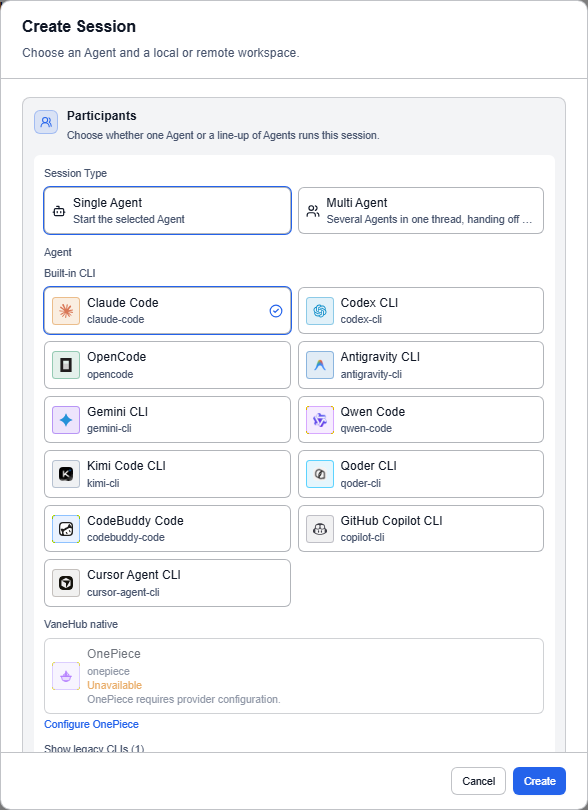
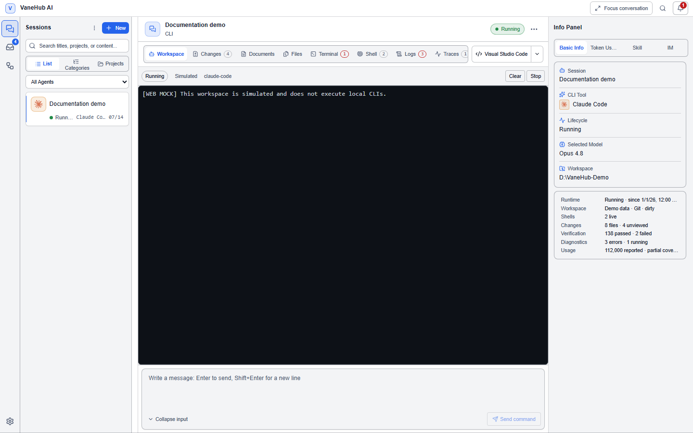
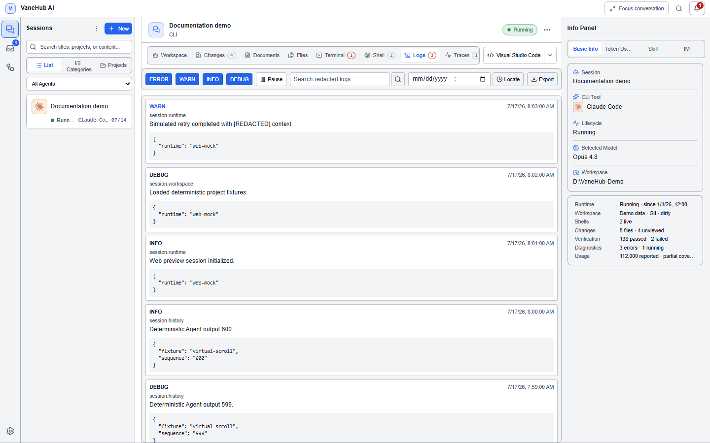
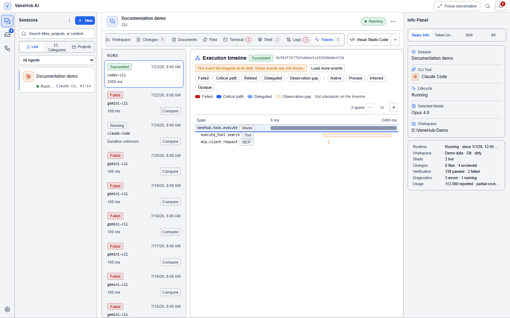
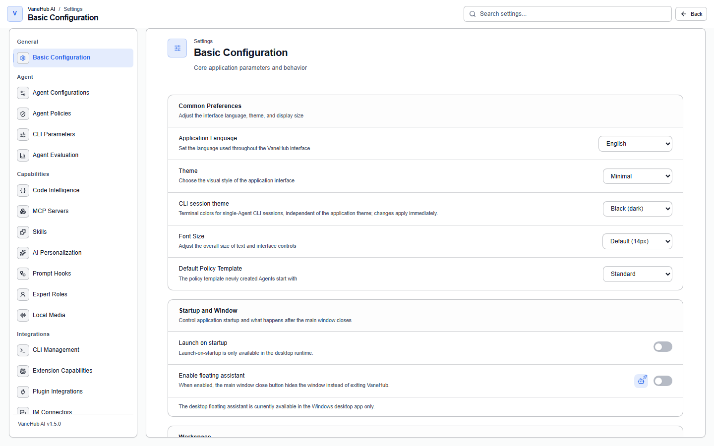

# User interface

**Status: Implemented — the interface is identical on desktop and in Web/mock; execution-type operations are desktop only.**

VaneHub AI's interface is one React codebase serving two runtimes: the desktop application and the browser preview. **They look the same**, so you cannot tell which runtime you are in by appearance — see [Runtime and feature labels](runtime-labels.md). Anything involving execution (starting a CLI, writing files, connecting over SSH) only really happens on desktop; in the browser preview it is simulated.

This chapter walks the interface feature by feature: what each one is and how to use it.

## Session management

### Create a session

Select **New** to open the create-session dialog, then choose the session type (Single Agent / Multi Agent), the Agent, the workspace (Local/Remote), the project folder, and the session name. A Git project is marked **Git** and can create a worktree. For Multi Agent, assign seats — see [Multi-Agent group chat](multi-agent-workflow.md).

### Session list

The session list on the left supports three display modes: **list / by category / by project**. You can search by name or content, filter by Agent, select in bulk, reorder by dragging, and filter favorites. **Right-click a session** to rename, delete, archive, export, pin, or assign a category.

### Focus mode

**Focus mode** in the top bar collapses the session list on the left and the info panel on the right so the workspace fills the window; select it again to restore. The top bar also has **global search**, which searches messages and content across sessions.

### Activity bar navigation

The activity bar to the left of the session list switches between the main destinations: **Sessions / Loops / Goal Center / Todo Board / Agent evaluation / Scheduled tasks / Settings / Help**.

## Agent types

VaneHub AI ships six built-in Agents, in two categories.

### External CLI Agents

The first five are **external CLIs** — VaneHub AI starts their process and manages everything around it (launch parameters, permission interception, output capture), while the actual code generation is done by the CLI itself. **Each vendor's own subscription login is self-managed by that CLI**, and VaneHub AI never stores credentials it produces; but to switch one to a third-party compatible endpoint, you can configure that under [Settings → Agent configurations](tooling.md#agent-configurations).

| Agent | Provider | Command | Notes |
| --- | --- | --- | --- |
| Claude Code | Anthropic | `claude` | Anthropic's official CLI, needs an Anthropic subscription or API credentials |
| Codex CLI | OpenAI | `codex` | OpenAI's official CLI, needs an OpenAI account |
| Gemini CLI | Google | `gemini` | Google's official CLI, authenticates with a Google account |
| Antigravity CLI | Google | `agy` | Google's official CLI, goes through Google sign-in and stores credentials in the system keychain |
| OpenCode | OpenCode | `opencode` | An open-source CLI supporting many providers |

Installation, authentication, and availability detection are covered in [Install and authenticate a CLI](getting-started.md).

### The VaneHub native Agent: OnePiece

**OnePiece** is different: it calls a model provider directly over HTTP, runs entirely inside the application, and **depends on no external CLI at all**. Its API key is stored by VaneHub AI, and it supports 25 providers (Anthropic, OpenAI, and other official catalog entries, plus common compatible endpoints), or a custom compatible endpoint.

- Usable without installing any CLI — see [Native API Agent](native-agent.md)
- Even if you mainly use an external CLI, memory extraction is still done by OnePiece, so it's usually worth configuring OnePiece too

## Conversation

### Send a message

Write your task in the input box at the bottom of the workspace: **Enter sends, Shift+Enter inserts a newline.** A row of selectors and switches sits above the input box:

| Control | What it does |
| --- | --- |
| Provider / Model / Agent dropdowns | Switch among the options you have configured |
| Interaction mode / reasoning depth / configuration | Adjust parameters for this conversation |
| Streaming switch | Whether replies stream |
| Chain-of-thought switch | Whether thinking content is shown |
| Enhance button | Runs an enhancement pass over the prompt |
| File references / attachments | Attach files to the Agent as context |

### Read replies

Agent replies render rich content: code blocks with syntax highlighting, Mermaid diagrams rendered inline, thinking blocks shown collapsed, tool calls showing the tool name with its arguments and result, and images, audio, cards, checklists, and diffs rendered by type. In a long conversation a **back to bottom** button jumps to the latest message; a **welcome screen** appears the first time you enter.

### Turn status

A **turn status bar** sits at the top of the conversation area: who currently holds the turn, how long it has been waiting on a human, turn completion, and chain-depth notices. During a multi-Agent handoff it shows `handoff 1/15`. See [Multi-Agent group chat](multi-agent-workflow.md) for detail.

## Workspace tabs

Once a session is open, nine tabs sit across the top of the workspace:

| Tab | What it does |
| --- | --- |
| **Workspace** | The conversation with the Agent; the default tab |
| **Changes** | Which files the Agent changed, with a diff view (unified/split toggle, per-file review, Git status) |
| **Documents** | Browse documents inside the workspace |
| **Files** | Browse workspace files |
| **Terminal** | Commands the Agent ran, and their output |
| **Shell** | An interactive terminal for your own use |
| **Logs** | Logs for this session; searchable and seekable by time |
| **Traces** | Execution tracing (run list + span tree + per-seat tracing) — see [Observability](observability.md) |
| **Report** | Token usage (input/output/character count), a token distribution bar, and counts by message state |

**The Terminal tab and the Shell tab are not the same thing**: the first records what the Agent did, the second is a terminal for you to type in. The Agent also has a **dedicated terminal** separate from your Shell. The numeric badge on a tab is the record count; when there is a lot of data, loading is bounded and only part of the results may be shown, which the interface tells you.

The **Logs** tab is searchable and seekable by time:

The **Traces** tab shows this execution's span tree, answering "what exactly did this step call, and how long did it take":

## See what the Agent changed

The **Changes** tab shows the Agent's file edits:

- A file list with Git status (added/modified/deleted)
- Select a file to see its diff
- Toggle between **unified** and **split** diff views
- Review file by file

## Session information and run state

The info panel on the right of the workspace is the session's "dashboard" — a glance tells you what state the session is in, who's driving it, and what it has cost. Field by field:

| Field | Meaning |
| --- | --- |
| **Session info** | Session title, type (Single Agent / Multi Agent), category, pinned and archived state |
| **CLI tool** | Which CLI (or OnePiece) the session's bound Agent uses, and its availability status |
| **Run state** | Five states: **Idle / Starting / Running / Failed / Stopped**; the interface disables repeat submission during `Starting`/`Running` so a double-click can't open two tasks |
| **Model for this run** | The model actually used in this round of conversation; shows "No model configured" when none is set |
| **Token usage** | Input / output / cache read / cache write / total; the two cache figures are recorded separately, and the panel's total is their sum |
| **Workspace path** | The current workspace directory (a local path, a worktree, or a remote SSH path) |

The info panel also carries two in-place tabs, so you do not have to jump to the settings center:

- **Skill** — view and manage the Skills bound to this session, in the session
- **Code Index** — view the workspace code index status, in the session

> Token usage is reported by each CLI itself; VaneHub AI does not meter it independently. Read the [Usage statistics](automation.md) page's methodology note before using these numbers for cost accounting.

## Show and hide panels

The **overflow menu** (⋯) at the top right of the workspace toggles panel visibility: the session list, the info panel, and the display switch for each workspace tab.

## Session recovery

When you reopen a session after a crash or an abnormal exit, a **recovery banner** appears at the top explaining that the session was reconciled, quarantined, or needs your explicit acknowledgement.

## Settings center

**Settings** in the activity bar opens the settings center: navigation on the left, the configuration page on the right. There are 18 settings pages:

| Settings page | What it holds |
| --- | --- |
| **Basic Configuration** | See [the next section](#basic-configuration) |
| **CLI Management** | Install detection, conflict diagnostics, and upgrades for each CLI — see [Install and authenticate a CLI](getting-started.md) |
| **CLI Parameters** | Launch flags per CLI Agent — see [Tools and extensions](tooling.md#cli-parameters) |
| **SDK Dependencies** | Version management for the managed SDKs — see [Tools and extensions](tooling.md#sdk-dependencies) |
| **Extension Capabilities** | Installing and enabling local multimodal capabilities — see [Tools and extensions](tooling.md#extension-capabilities) |
| **Plugin Integration** | Built-in product integrations and readiness checks — see [Plugin integration](plugin-integration.md) |
| **MCP Servers** | MCP server configuration and per-Agent binding — see [MCP servers](mcp.md) |
| **Agent Configurations** | Provider, endpoint, and model per Agent, including OnePiece — see [Tools and extensions](tooling.md#agent-configurations) |
| **Agent Policies** | Permission policy and approval templates — see [Permission approvals](permissions.md) |
| **Expert Roles** | Role fields, responsibilities, and review policy — see [Expert roles](expert-roles.md) |
| **Personalization** | Custom instructions and cross-session memory — see [Personalization](personalization.md) |
| **Skills** | Skill installation and binding — see [Manage Skills](skill-management.md) |
| **Prompt Hooks** | Hook management — see [Prompt Hooks](prompt-hooks.md) |
| **IM Connectors** | IM connector configuration — see [Remote and IM](remote-and-im.md#im-connectors) |
| **SSH Connections** | Saved SSH connections — see [Remote and IM](remote-and-im.md#ssh-remote-workspace) |
| **Execution Observability** | Execution tracing and log collection policy — see [Observability](observability.md) |
| **Usage Statistics** | Token usage statistics — see [Scheduled and usage](automation.md) |
| **About** | Version, update check, changelog, and repository links — see [Application updates](app-updates.md) |

### Basic configuration

**Settings → Basic Configuration** is the default landing page of the settings center, governing the application's own behavior — nothing here is specific to a given Agent.

| Group | Item | Notes |
| --- | --- | --- |
| **Appearance** | Interface language | The client defaults to following the host system's locale |
| | Theme, font size | Affects global rendering |
| **Security** | Default policy template | The default template for new sessions; see [Permission approvals](permissions.md) for the semantics |
| **Startup** | Launch at login | Tied to the [system tray](#system-tray) |
| | Floating assistant switch | The [floating assistant](#floating-assistant) window only exists once this is on |
| **Network** | Node info, network proxy | The proxy supports authentication |
| **Storage** | Data directory, log directory | Changing either requires a restart and rebuilds under the new directory; see [Troubleshooting](troubleshooting.md) for log-path details |
| | Folder opener | Decides what "Open in file manager" actually invokes |

> **Be careful changing the data directory.** When multiple worktrees share the same database, migration version numbers can collide across branches — see [Troubleshooting](troubleshooting.md).

## Floating assistant

Once the floating assistant is enabled in settings, a separate floating window sits on the desktop: start a session or assistant from it without opening the main window, a status badge shows the run state, and a main action menu starts tasks quickly.

## Loop center

**Loops** in the activity bar manages Loop engineering: the run list and inspector, run controls (pause/resume/cancel/accept/reject), the verification command editor, and the timeline. For the concept and how to create one, see [Loop Engineering](loop-engineering.md).

## OnePiece Plan mode

OnePiece sessions expose **Plan** and **Agent** in the conversation bar. Plan mode is for read-only exploration and planning: it can inspect project context but cannot run shell commands, write files, call effectful MCP tools, or delegate work.

When the plan is ready, OnePiece can request `exit_plan_mode`. Approving the request changes the session to Agent mode for a later turn; declining keeps Plan mode active. The left activity bar has no separate Plan execution destination, and planning does not create a task graph or worktree.

Use **Loop** when you need durable autonomous iteration with verification and acceptance controls. Goal-level tracking is covered in [Goal management](goal-management.md).

## Notifications

The bell icon in the top bar opens the **notification center**: unread badge, mark all read, clear notifications. For notification scope (global/session) and the four notification kinds, see [Scheduled and usage](automation.md).

## System tray

On desktop there is a system tray icon: show/hide the main window, with the launch-at-login switch under **Settings → Basic Configuration**, and tray notifications tied to system notifications.

## Related

- Unfamiliar terminology → [Core concepts](core-concepts.md)
- First time using it → [Create your first session](first-session.md)
- Desktop versus browser preview → [Runtime and feature labels](runtime-labels.md)
