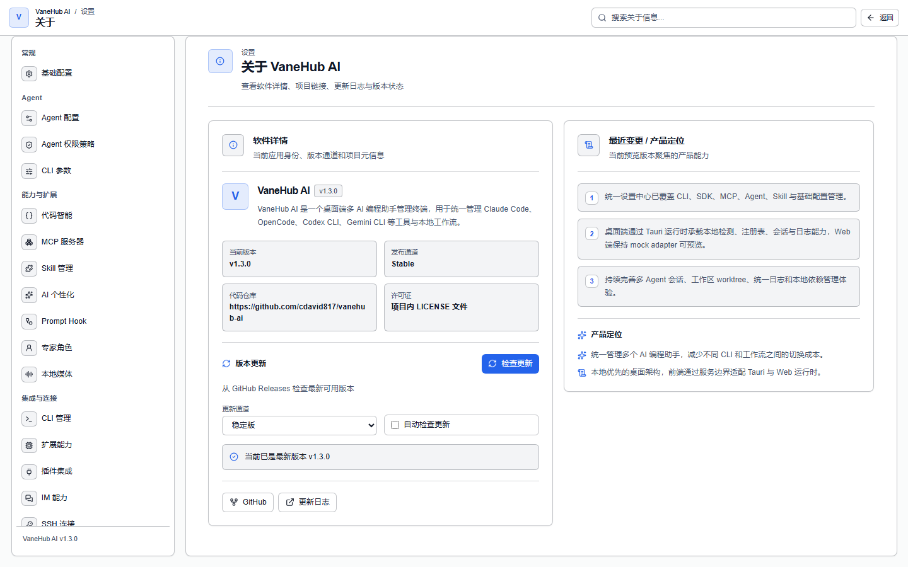

# 版本更新：签名校验与发布通道

## 功能概述

桌面端从 GitHub Releases 检查新版本，下载前后都做签名校验，**验证不通过就不装**。

入口在**设置 → 关于 VaneHub AI → 版本更新**。

## 检查与安装

| 状态 | 界面显示 |
| --- | --- |
| 还没查过 | 尚未检查更新 |
| 查询中 | 检查中 |
| 已是最新 | 当前已是最新版本 v… |
| 有新版本 | 发现新版本 v… |
| 下载中 | 已下载 X / Y 字节 |
| 装好了 | 已验证更新，可重启应用 |
| 失败 | 检查更新失败：… |

流程是：**检查更新** → **下载并安装** → **立即重启**。

发现新版本时，界面会同时显示已装版本、新版本和更新日志。

## 发布通道

两个通道，按语义版本优先级判定：

| 通道 | 行为 |
| --- | --- |
| **稳定版** | **不接受任何预发布版本** |
| **预览版** | 接受配置通道里更高的兼容版本 |

**没有设置过偏好时，通道按已安装版本推导**：预发布构建默认 `preview`，其余默认 `stable`。

## 自动检查

**自动检查更新默认关闭**。打开后，应用启动时会安排一次非阻塞的检查，走的是**和手动检查完全相同的签名校验路径**——自动不等于放宽。

## 安全设计

这部分是这个功能的重点，几条都是硬约束：

**更新源不可被运行时配置改写**。应用使用构建时内置的可信 HTTPS 端点和公开验证密钥。**即使普通应用配置里写了另一个更新地址或验证密钥，也仍然使用构建时那一套**。

**TLS 证书错误一定导致更新失败，绝不忽略**。端点过不了平台的 TLS 校验时，不会下载也不会安装任何文件。

**元数据和安装包都必须由发布密钥签名**，桌面运行时在应用更新前验证签名。源码和客户端包里**只包含公钥**。

**内容被篡改就在安装前拒绝**。元数据、签名或已下载的安装包与签名内容不符时，更新被拒绝，**当前应用保持原样**。

## 拒绝降级

**任何普通客户端都会拒绝版本号相同或更低的更新**，哪怕它的签名完全有效——在下载和安装之前就拒掉。

降级只可能出现在显式编译的开发或桌面测试流程里，**普通运行时配置开不出这条路径**。

## 失败了会怎样

**检查、下载、验证、安装这四个环节里任何一个失败，正在运行的已安装版本都保持可用**，之后可以显式重试。

下载中断同样如此：当前安装可继续运行，你可以重来一次。

失败会进入一个明确的失败终态，带安全的可恢复错误信息，而不是卡在中间状态。

## 不会自动重启

**只有在更新器报告「已验证就绪」且你显式点了重启，应用才会重启**。

验证过的更新已经就绪但你没点重启时，**应用继续正常运行**，不会替你重启，也不会在后台悄悄换掉正在用的版本。

## 更新过程可观测

检查和下载是异步的，走前端服务边界和后端管理的操作：

- 动作发起后**立即返回一个稳定的操作 id**，不等网络访问完成
- 界面保持响应，并**保留上一次的更新快照**，不会因为发起检查就清空已有信息
- 下载进度是有界的字节进度，直到终态一直可读
- 关联脱敏后的统一日志

## 注意事项与限制

- **自动检查默认关闭**，需要手动打开。
- **稳定版通道拿不到预览版**，想尝鲜要显式切到预览版通道。
- **降级一律被拒**，包括签名有效的降级请求。
- **更新地址和验证密钥改不了**，这是刻意的，不是配置项缺失。
- **不会自动重启**，重启永远需要你点。

## 相关

- 版本、通道、许可证等信息 → 设置 → 关于 VaneHub AI
- 本机 CLI 的安装健康度是另一回事 → [安装并认证 CLI](getting-started.md)
- 更新失败时的日志在哪 → [可观测性](observability.md)
