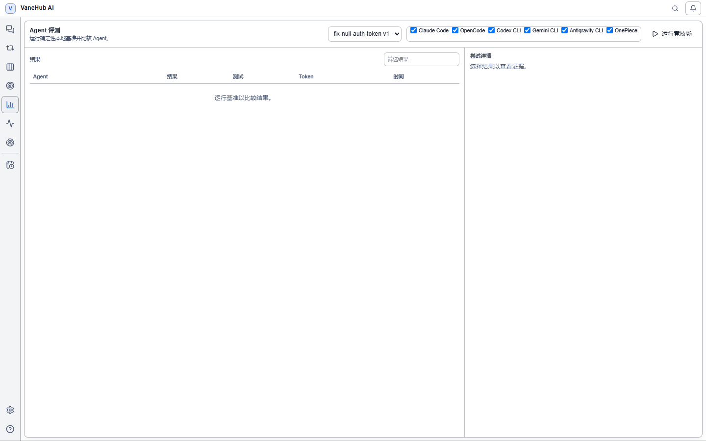

# Agent 评测

## 功能概述

左侧活动栏的 **Agent 评测**在**同一道题、同一份初始代码**上跑多个 Agent，然后把结果并排摆出来比。

它回答的是「**这个任务该派谁去**」——不是靠感觉，而是靠同题对照：同样的提示词、同样的项目、同样的验证命令，谁通过了、烧了多少 token、花了多久。

**跑的是本地基准，不是你的项目**。每次尝试都在一份从内置样例复制出来的独立目录里进行，不碰你的工作区，也不产生任何提交。

## 一次评测的结构

| 概念 | 是什么 |
| --- | --- |
| **基准任务** | 一道题：提示词 + 一份初始项目 + 一组验收规则 |
| **竞技场（Arena）** | 一次运行：一道题 × 你勾选的若干 Agent |
| **尝试（Attempt）** | 竞技场里的一格：某个 Agent 做这道题的这一次 |

一个竞技场**最多 8 个尝试**，至少 1 个。

## 三个内置基准任务

首版内置三道题，覆盖三类典型工作：

| 任务 | 类别 | 要求 | 超时 | 验证方式 |
| --- | --- | --- | --- | --- |
| `fix-null-auth-token` | 缺陷修复 | 修好 null 认证令牌的处理，且保持既有行为 | 120 秒 | `npm test`、静态文件检查、差异规则 |
| `add-parser-test` | 测试 | 给有界解析器的边界情况补确定性测试 | 120 秒 | `npm test`、差异规则 |
| `refactor-search` | 重构 | 重构 search，且不改变其公开结果顺序 | 180 秒 | `cargo test`、差异规则 |

**每道题都带一条禁则**，触发即判失败：

- `fix-null-auth-token` 禁止出现 `eval(`
- `add-parser-test` 禁止出现 `.only(`——用它跳过其余测试就能让测试"全绿"
- `refactor-search` 禁止出现 `unsafe {`

**这三条禁则针对的是同一类作弊**：满足字面要求但绕开了题目的真实意图。

## 怎么跑一次

1. 打开左侧活动栏的 **Agent 评测**。
2. 顶部下拉选**基准任务**（显示为 `任务 id v版本号`）。
3. 勾选要参赛的 **Agent**。
4. 点**运行竞技场**。

运行中列表每秒刷新一次，直到所有尝试进入终态。选中某一行后可以**取消**——只对还没进终态的尝试有效。

> **目前只能选 onepiece 和 codex-cli 两个 Agent**。界面上的 Agent 勾选框是固定的这两项，其余三个 CLI 还不能参赛。

## 读结果表

结果表五列：

| 列 | 含义 |
| --- | --- |
| **Agent** | 哪个 Agent 的尝试 |
| **结果** | 九种终态之一，见下 |
| **测试** | `通过数/总数`，指验收检查而非项目自身的测试用例数 |
| **Token** | 输入 token |
| **时间** | 耗时 |

### 九种结果

| 结果 | 含义 |
| --- | --- |
| **已排队** / **运行中** | 尚未进入终态 |
| **通过** | 全部检查通过，且重复验证的结果一致 |
| **任务失败** | Agent 跑完了，但没达到验收要求 |
| **Agent 失败** | Agent 自己出错了，不是题没做对 |
| **超时** | 超过该任务的时限 |
| **卡住** | 没有进展 |
| **已取消** | 你手动取消的 |
| **基准错误** | 评测框架本身出错，与 Agent 无关 |

**「任务失败」和「Agent 失败」必须分开看**：前者说明这个 Agent 做不对这道题，后者说明它根本没能好好跑起来——后者不构成能力判断的证据。**「基准错误」更不能算到 Agent 头上**。

## 证据面板

选中一行后，右侧展示这次尝试的全部证据：

| 区块 | 内容 |
| --- | --- |
| **身份** | provider / 模型，以及**配置指纹** |
| **验证** | 每条检查的 `PASS`/`FAIL` 与说明 |
| **受限差异工件** | 这次尝试改动的文件（最多列 20 个） |
| **指标与来源** | 每项指标的值、单位、**质量**与**来源** |
| **上下文与工具时间线** | 生命周期、工具调用、上下文、验证四类事件 |

**配置指纹是可比性的前提**。同一个 Agent 换了模型或改了参数，指纹就变了——拿指纹不同的两次尝试比高下是没有意义的，这也是它被摆在最显眼位置的原因。

### 指标质量：三挡，别混着用

每项指标都标注了质量，**这不是修饰而是口径声明**：

| 质量 | 含义 |
| --- | --- |
| **reported** | Agent 自己上报的真实值 |
| **estimated** | 估算出来的 |
| **unavailable** | 这次拿不到 |

拿 `estimated` 的 token 数去做成本核算会得到错的结论。判断口径前先看这一列。

## 判定规则

两条硬规则决定了结果表可不可信：

**1. 重复验证不一致就判失败**。评测会重跑一遍检查，两次结果不一致即标记为 flaky，**直接判「任务失败」而不是「通过」**。一次侥幸通过不算通过。

**2. Judge 永远不能翻案**。即使配了模型 judge 给出好评，**它也无法把确定性检查的失败或 flaky 结果改成通过**。judge 的意见只是附加信息，确定性检查说了算。

## 导出

每个竞技场行尾有**导出 JSON**，导出内容含 schema 版本与整个竞技场的全部尝试、检查、指标与时间线，可用于离线对比或留档。

## 注意事项与限制

- **仅桌面端可用**。
- **只能跑三个内置基准任务**，不能自定义题目，也不能导入自己的项目当基准。
- **参赛 Agent 目前固定为 onepiece 与 codex-cli 两个**。
- **单个竞技场最多 8 个尝试**。
- **样例复制有上限**：超过 2000 个文件或 32 MB 就会失败。
- **每次尝试用独立的复制目录**，互不干扰，评测结束后清理；**你的真实工作区不受影响**。
- **评测结果只说明「在这三道题上的表现」**。它不是对 Agent 的整体能力评级，更不能外推到你的实际代码库。
- **取消只对未进入终态的尝试有效**。

## 相关

- 活动栏与主界面导航 → [用户界面](user-interface.md)
- 让多个 Agent 在一个会话里协作，而不是比拼 → [多 Agent 群聊](multi-agent-workflow.md)
- 执行链路与日志的完整语义 → [可观测性](observability.md)
- Token 用量的统计口径 → [定时任务与用量统计](automation.md)
- 评估方法论本身 → [多 Agent 系统技术架构](../../../agent-infrastructure/multi-agent-architecture.md)
