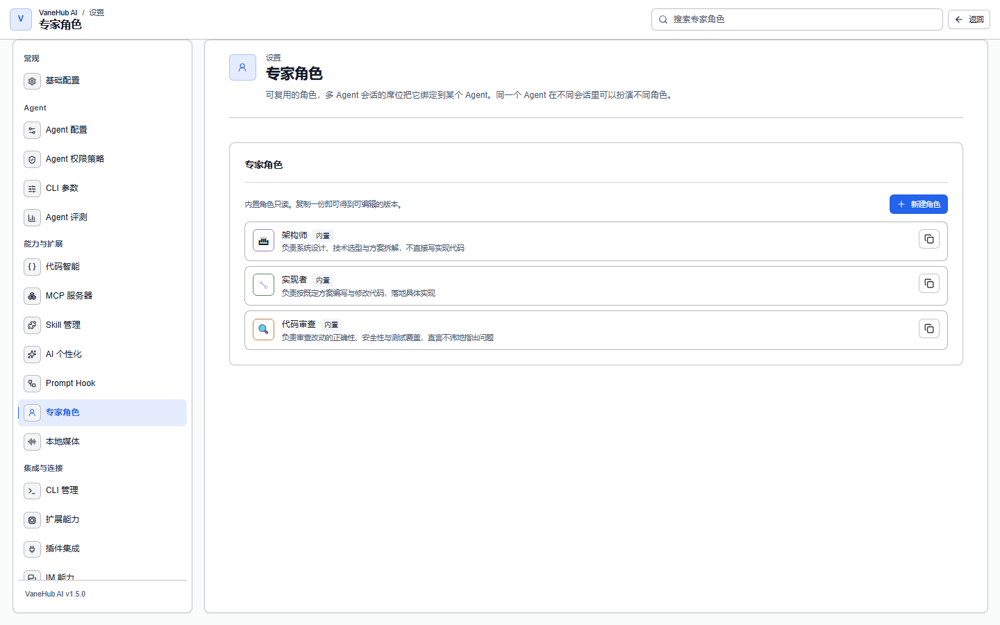

# 专家角色

## 功能概述

**专家角色描述的是「一份工作」，不是「一个 Agent」**。角色可复用，席位才把某个角色绑到某个 Agent 上、且只在这一个会话里生效。

这个区分是刻意的：同一份装好的 Claude Code，可以在这个会话里当审查者，在另一个会话里当架构师。角色不是 Agent 的属性，因此不需要为了换个分工去重装或重配 CLI。

在**设置 → 专家角色**中管理。

## 内置的三个角色

内置角色对应一条典型协作链：**架构师出方案 → 实现者落地 → 代码审查把关**。

| 角色 | 头像 | 职责 |
| --- | --- | --- |
| **架构师** | 🏛 | 负责系统设计、技术选型与方案拆解，不直接写实现代码 |
| **实现者** | 🔧 | 负责按既定方案编写与修改代码，落地具体实现 |
| **代码审查** | 🔍 | 负责审查改动的正确性、安全性与测试覆盖，直言不讳地指出问题 |

它们的指令都写了同一件事的三个面：**做什么、不做什么、做完交给谁**。

- **架构师**被要求「说明取舍与被否决的替代方案，不要只给结论」，需要落地时交给实现者。
- **实现者**被要求「遇到方案层面的分歧先提出来而不是自行改设计」，改完说明动了哪些文件、为什么。
- **代码审查**被要求「直接指出问题，不要为了缓和语气而弱化结论」，并且**区分「必须修」和「可以改进」**；没有问题时也要说明检查了什么。

> **内置角色只读**，无法直接编辑或删除。要基于它们调整，点卡片右侧的复制按钮得到一份可编辑的版本。

## 角色的字段

| 字段 | 说明 |
| --- | --- |
| **显示名** | 席位与发言上的名字 |
| **头像** | Emoji 或短字形，出现在席位和它说的每一条消息上 |
| **配色** | 十六进制颜色，用于发言人色带，让人一眼分得清席位 |
| **职责** | **必填**，见下 |
| **指令** | 角色的行为指令，通过各 CLI 原生的 system prompt 通道注入 |
| **绑定的 Skill** | 该角色依赖的既有 Skill 的 id。角色**引用** Skill，不取代 Skill |
| **评审策略** | 见下 |
| **偏好 provider** | **仅是软偏好**，角色不会把自己绑死在某个 Agent 上 |

### 为什么职责必填

**职责不是给人看的装饰**。它会被发布到席位名册里，其他 Agent 靠它决定「该把话交给谁」。

职责为空，同场其他席位交接时就只能瞎猜。这也是三个内置角色的职责都写成一句完整、可判断的话的原因——它们是写给别的 Agent 读的。

席位名册与 `@` 交接的机制见[多 Agent 群聊](multi-agent-workflow.md)。

## 评审策略

两个开关：

- **可作为同行评审被推荐**——这个角色的席位是否会出现在评审推荐里
- **推荐时优先选择不同模型族的席位**——推荐时是否偏好跨模型族

三个内置角色里，**只有「代码审查」两个开关都开**，架构师和实现者都关。

**第二个开关的用意**：同一模型族的两个实例会犯相关联的错误，也更容易互相认同。让评审来自不同族，能提高发现问题的概率。

> **OpenCode 没有固定模型族**——它驱动的是你自己配置的模型，因此这条策略对它不生效。

模型族与跨族评审的完整语义见[多 Agent 群聊 → 模型族与跨族评审](multi-agent-workflow.md#模型族与跨族评审)。

## 怎么用起来

1. 在**设置 → 专家角色**里确认要用的角色（内置三个直接可用；要改就先复制一份）。
2. 创建会话时选**多 Agent**，给每个席位分配 Agent 与角色。
3. 在对话中用 `@` 把话交给对应席位。

一条完整的「架构师 → 实现者 → 审查者」接力见[群聊协作案例](multi-agent-testing-tutorial.md)。

## 注意事项与限制

- **仅桌面端可用**。
- **内置角色只读**，需要调整时复制一份再改。
- **角色不改写各 CLI 自己的配置文件**，指令通过 CLI 原生的 system prompt 通道注入，不会去动 `CLAUDE.md`、`AGENTS.md` 之类。
- **偏好 provider 只是软偏好**，不构成绑定；实际用哪个 Agent 由席位分配决定。
- **角色引用 Skill 而非取代 Skill**，绑定的 Skill 需要先在 [Skill 管理](skill-management.md)里装好。
- **OnePiece 自带的核心指令不可编辑**，自定义需求通过角色指令或 Custom Instructions 表达。

## 相关

- 跨会话的个人偏好与记忆 → [个性化](personalization.md)
- 席位、`@` 交接与轮次边界 → [多 Agent 群聊](multi-agent-workflow.md)
- 能力包的安装与绑定 → [Skill 管理](skill-management.md)
