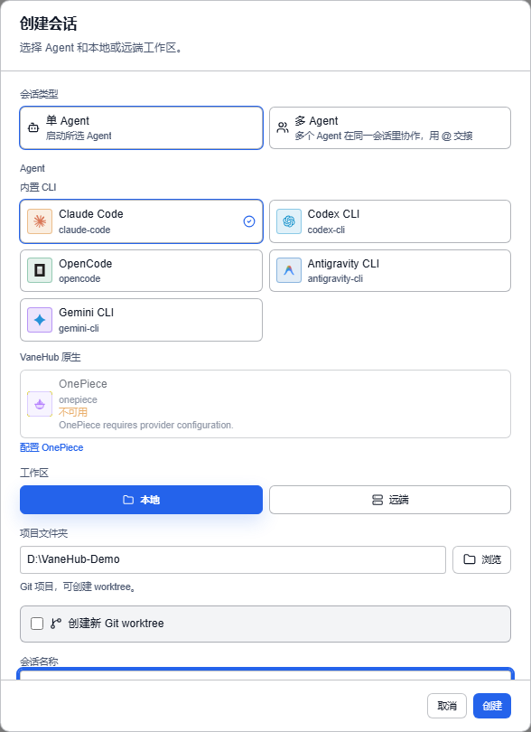

# 创建第一个会话

**状态：已实现——桌面端与 Web/mock 的 side effect 不同。**

会话是 VaneHub AI 的基本工作单元：它绑定一个工作区和一个或多个 Agent，承载对话、终端、文件变更与执行链路。

## 创建

1. 打开 VaneHub AI，选择**新建**。
2. **会话类型**选**单 Agent**（多个 Agent 协作见下）。
3. **Agent** 区选一个可用的 Agent。
4. **工作区**选**本地**或**远端**。
5. **项目文件夹**里浏览选择目录，或从**最近打开项目**里挑。
6. 填**会话名称**（留空则用「新会话」）。
7. 选择**创建**。

## 选目录时的两种情况

**选中的目录是不是 Git 仓库，决定了你有没有 worktree 这个选项**。界面会标出来：

| 标记 | 含义 |
| --- | --- |
| **Git** | Git 项目，可创建 worktree |
| **文件夹** | 普通文件夹，将禁用 worktree |

勾选**创建新 Git worktree** 后填一个 **Worktree 名称**，VaneHub AI 按固定规则生成路径和分支：

> 默认路径：项目同级目录 + `项目名-worktreeName`；分支：`vanehub/worktreeName`

**为什么要用 worktree**：让 Agent 在独立的工作副本里改代码，不动你当前的分支。

## 远端工作区

**工作区**切到**远端**后，填**主机**、**端口**、**用户**、**远端路径**，也可以直接选一个已保存的 **SSH 连接**。

勾选**保存为 SSH 连接**可以把这次填的信息存下来复用。首次连接会要求你确认主机密钥，细节见[远程执行与 IM 接入](remote-and-im.md)。

## 多个 Agent 协作

**会话类型**选**多 Agent** 就能分配席位：

> 多个 Agent 在同一会话里协作，用 @ 交接

每个**席位**是「一个 Agent + 一个角色」。**角色**可以选**不指定角色**。用**添加席位**加、**删除席位**减。

如果没有不同模型家族的 Agent 可用，界面会说明并改为展示同家族选项。完整机制见[多 Agent 群聊与 `@` 交接](multi-agent-workflow.md)。

## 会话工作区的九个标签页

创建后进入会话工作区，顶部有九个标签：

| 标签 | 内容 |
| --- | --- |
| **工作区** | 与 Agent 的对话，默认停在这里 |
| **变更** | Agent 改了哪些文件 |
| **文档** | 工作区内的文档 |
| **文件** | 工作区文件浏览 |
| **终端记录** | Agent 执行过的命令与输出 |
| **Shell** | 你自己用的交互式终端 |
| **日志** | 本次会话的日志 |
| **链路** | 执行链路追踪，见[可观测性与日志](observability.md) |
| **报告** | 会话报告 |

**「终端记录」和「Shell」不是一回事**：前者是 Agent 干了什么的记录，后者是给你自己敲命令的终端。

标签页上的数字角标表示记录条数。首版采用有界加载，数据量大时可能只显示部分结果，界面会提示。

## 在消息里引用文件

不想把代码粘进对话框时，可以直接引用工作区里的文件。

在文件预览里**点击一行，再点击另一行**即可选中范围，然后：

| 操作 | 效果 |
| --- | --- |
| **引用所选范围** | 只带上选中的那几行，标注为「第 N–M 行」 |
| **引用整个文件** | 带上整个文件 |

引用会以条目形式挂在输入框上，点**移除文件引用**可以撤掉。

**一条消息最多引用 5 个文件**。超出时提示「已达引用上限」，多出来的不会被静默丢弃。

**被引用的内容会随消息一起发送给 Agent**，因此它同样计入本次请求的 Token。引用整个大文件之前值得先看一眼体量。

三种预览不了的情况会明确告诉你，而不是给一个空白：**该文件是二进制文件，无法预览**、**该文件过大，无法预览**、**该文件不可用**。

## 运行状态

右侧信息面板的**运行状态**有五种：**空闲**、**启动中**、**运行中**、**失败**、**已停止**。

信息面板还会显示 **CLI 工具**、**本次模型**、**工作区**，以及本次会话的 **Token 使用**（输入 / 输出 / 缓存读取 / 缓存写入 / 总计）。没配模型时显示「未配置模型」。

## 桌面端与浏览器预览的区别

**桌面端**：项目路径对应真实目录，Agent 执行使用你已安装的 CLI，消息与终端输出写入本地 SQLite。

**Web/mock**：同一套界面用合成状态和模拟终端，**不会启动本地进程，不会修改文件，不会写数据库**。适合看界面长什么样，不能当作执行证据。

## 创建失败时

对话框会给出四类错误：**Agent 不可用**、**项目不可用**、**Git worktree 创建失败**、**命令失败**。

「Agent 不可用」通常是 CLI 没装好或没认证，回[安装并认证 CLI](getting-started.md) 检查。其余见[故障排查](troubleshooting.md)。

## 下一步

- 术语不熟 → [核心概念](core-concepts.md)
- 想看完整场景 → [使用案例](use-cases.md)
- 担心 Agent 乱改文件 → [权限审批](permissions.md)
