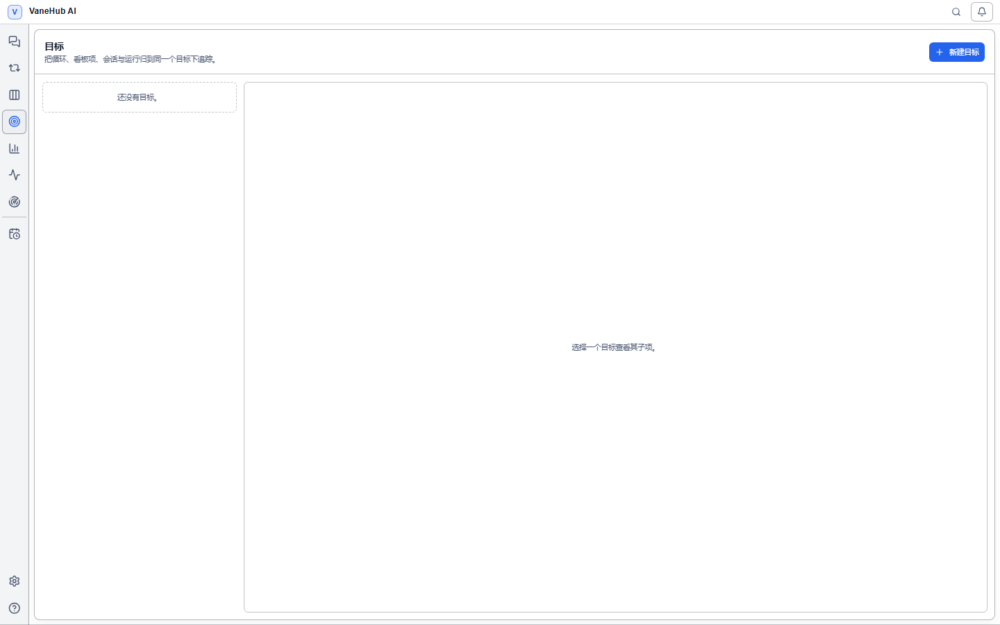

# 目标与任务看板

**目标**把分散的执行体归到一处追踪；**任务看板**把人工待办和 Agent 产生的工作项放在同一个面板里。两者共用一套来源与状态语义，所以放在一章。

## 目标

### 功能概述

一件事往往横跨几个 [Loop](loop-engineering.md)、看板项、会话和执行运行。它们分散在不同界面里，没有其他地方能回答「这件事整体推进到哪一步了」。

目标就是这个归拢层。你把相关的循环和看板项挂到同一个目标下，用一个 `已结束/计入数` 的进度和一个状态标签看全局。会话和运行可以作为上下文关联，但不计入进度。

**目标不改变被关联对象**。关联关系只存在目标这一侧，解除关联不会修改被关联对象。

### 新建一个目标

1. 在左侧活动栏选择**计划**，切到**目标中心**标签。
2. 点右上角的 **新建目标**。
3. 填写字段：

| 字段 | 必填 | 说明 |
| --- | --- | --- |
| **标题** | 是 | 只有空白字符会被拒绝 |
| **描述** | 否 | 补充背景 |
| **你将如何判定这个目标** | 否 | 验收说明 |
| **项目路径** | 否 | 关联的代码库位置 |

**「你将如何判定这个目标」纯粹写给人看**。系统绝不会拿它做任何机器判定——它不解析、不匹配、不据此改变任何状态。写在这里是为了让你（或几天后的你）在按下验收前有据可依。

新建的目标是**草稿**状态，点**启用**才进入进行中。

界面分两栏：左侧是目标列表，每项显示标题、`已结束/计入数` 进度和状态徽标；右侧是选中目标的详情。

### 五种状态

| 状态 | 含义 | 怎么来的 |
| --- | --- | --- |
| **草稿** | 刚建好，还没启用 | 落库 |
| **进行中** | 已启用，正在推进 | 落库 |
| **待验收** | 子项全部结束，等你确认 | **推导** |
| **已达成** | 你确认过了 | 落库 |
| **已放弃** | 中止 | 落库 |

**「待验收」不落库**。它在每次读取目标时按子项当前状态现算，所以子项被重开后，目标会**自动退回进行中，不需要你做任何操作**。

进入待验收的条件是三个同时成立：目标处于进行中、计入的子项数大于零、且计入的子项全部已结束。

状态之间的流转有限制：**已放弃的目标可以重新启用；已达成的目标可以重开**。但正在进行中的目标不能再次「启用」。

### 关联执行体

先选类型（循环、看板项、会话或运行），再按标题搜索并从结果中选择真实对象——每条结果在关联前都会显示自己的标题、项目和状态。如果搜索找不到你要的对象（例如要为一个已失效或已删除的对象记录一条追踪关联），可以展开搜索框下方的**手动输入 ID**，改用原始 ID 关联。

| 类型 | 计入进度 | 说明 |
| --- | --- | --- |
| **循环** | 是 | 按运行状态判定 |
| **看板项** | 是 | 按所处阶段判定 |
| **会话** | **否** | 会话没有「完成」语义 |
| **运行** | **否** | 作为执行证据，不参与达成判定 |

**会话和运行不计入分母**。一个只关联了会话的目标永远不会进入待验收——因为会话不存在「做完了」这个概念，它可以一直开着。

会话也**不会被自动挂载**：即使你有正在进行的目标，新建会话时系统也不会替你关联，必须显式操作。

同一个目标与同一个对象之间**最多只能有一条关联**，重复关联会被拒绝并提示，不会产生重复记录。

### 什么算「已结束」

计入进度的子项按以下规则判断是否结束：

| 子项 | 算已结束 | 不算已结束 |
| --- | --- | --- |
| **循环** | 已成功、**已失败**、已取消 | 待验收 |
| **看板项** | 完成阶段、已归档 | 其余阶段 |

另有一条容易忽略的规则：

- **停在「待验收」的子项不算结束**。循环自己停在待人工确认时，目标不会跟着进入待验收——否则就成了套娃。

### 验收

**目标达成只能由人工确认，系统永远不会自动把目标置为已达成**。这和 [Loop 的强制人工验收](loop-engineering.md)是同一条安全设计。

**验收按钮只在待验收时可用**。目标还有子项没结束时点验收会被拒绝，状态不变。详情里会直接说明卡在哪：

| 提示 | 含义 |
| --- | --- |
| 全部子项已结束，可以验收了。 | 可以按验收 |
| 还有子项在进行中。 | 等子项跑完 |
| 先关联循环或看板项，目标才能验收。 | 一个计入的子项都没有 |
| 只有进行中的目标才能验收。 | 目标还在草稿或已放弃 |

验收之后仍可**重开**，目标回到进行中。

### 关联对象被删除了怎么办

子项指向的对象被删除、或状态查询失败时，该子项标记为**已失效**：

- **不计入分母**——一个被删掉的关联对象不会把目标永远卡在差一项的状态
- **不会让整个目标查询失败**——其余子项照常显示
- 在详情里显式列出，并提示「有 N 个关联对象已不存在，不计入进度」

**这是有意的降级而不是隐藏**。阻塞原因始终对你可见，你不会遇到「进度条停住但看不出为什么」的情况。

## 任务看板

### 功能概述

会话、定时任务各有各的列表，人工待办则根本没地方记。任务看板把它们收进同一块看板：**你手写的待办和 Agent 产生的工作并排排列**，用同一套阶段、优先级和筛选来组织。

关键设计是**看板阶段与来源状态彻底分开**：卡片在哪一列由你决定，来源跑到哪一步由运行时投影。两者互不干扰——一个定时任务跑完了，卡片不会自己跳到「已完成」。

### 打开看板

在左侧活动栏选择**任务看板**。顶部有两个视图：**当前看板**与**归档**，默认进入当前看板，归档项不显示。

### 五个阶段

| 阶段 | 用途 |
| --- | --- |
| **收件箱** | 新建工作项的默认落点 |
| **已计划** | 排上日程 |
| **进行中** | 正在做 |
| **待审核** | 做完待确认 |
| **已完成** | 结束 |

**阶段完全由你控制**。没有任何自动流转会替你移动卡片。

移动卡片有两种方式：拖拽，或者用卡片上的**移至上一阶段**／**移至下一阶段**按钮。**这两条路径产生完全相同的持久化结果**——显式按钮不是拖拽的降级替代，而是等价操作。键盘和读屏用户可以完整操作看板，窄屏下也不会有控件被裁掉。

### 新建人工待办

点**新建工作项**，填写：

| 字段 | 说明 |
| --- | --- |
| **标题** | 必填 |
| **描述** | 可选 |
| **项目路径** | 可选，用于按项目筛选 |
| **优先级** | 无优先级 / 低 / 中 / 高 / 紧急 |
| **截止日期** | 可选，卡片上显示为「截止 …」 |

不带来源新建的工作项进入**收件箱**，并跨重启保留。

### 来源与自动对账

除了手写待办，看板会把已有的和之后新建的执行体**自动对账**成工作项：

| 来源 | 说明 |
| --- | --- |
| **会话** | 顶层会话 |
| **定时任务** | 计划任务 |

对账是**幂等**的：升级后首次打开看板，每个符合条件、尚未关联的来源会得到**恰好一个**工作项；之后新建的来源在下一次对账时补上。不会因为多次对账产生重复卡片。

三条容易被忽略的规则：

- **子会话不单独建卡**。为定时任务运行创建的会话会作为所属工作项下的活动出现，而**不会**变成一张独立的顶层卡片。
- **归档过的工作项不会被对账重建**。你归档掉的东西，下次对账仍然认它，不会冒出一张替代卡。
- **一张卡可以挂多个来源**。同时关联了会话和定时任务的卡片会同时命中两个来源筛选，但**它始终只是一张卡**，不会被筛成两份。

来源被删除或解析不了时，**工作项本身仍然在**，只是标注**来源不可用**——卡片不会跟着消失。

### 搜索与筛选

顶部提供搜索框和四个筛选器，**可以叠加使用**：

| 筛选 | 选项 |
| --- | --- |
| **按来源** | 全部来源 / 会话 / 定时任务 |
| **按阶段** | 全部阶段 / 五个阶段之一 |
| **按优先级** | 全部优先级 / 无优先级 / 低 / 中 / 高 / 紧急 |
| **按项目** | 全部项目 / 各项目路径 |

筛选后无结果时显示「没有符合筛选条件的事项」，与看板本身为空时的「暂无工作项」是两种不同提示。

### 归档与删除

| 操作 | 效果 | 对来源的影响 |
| --- | --- | --- |
| **归档工作项** | 离开当前看板 | 无 |
| **恢复** | 回到原来的阶段和排序位置 | 无 |
| **永久删除** | 删除工作项及其来源关联 | 无 |

**这三个操作都不动来源**。永久删除只删掉工作项本身和它的关联记录，被关联的会话和定时任务**原封不动**。看板是组织层，不是这些东西的所有者。

恢复时会回到**归档前的阶段和排序位置**，不会掉回收件箱。

## 注意事项与限制

目标：

- **验收说明不参与任何机器判定**，它只是给人读的。
- **会话和运行永远不推动目标达成**，只关联它们的目标不会进入待验收。
- **解除关联不影响被关联对象**，只是把它从这个目标的子项列表里移走。
- 删除目标只删目标本身与其关联关系，循环和看板项都不受影响。

任务看板：

- **阶段不会自动流转**。来源状态变化只更新卡片上的来源投影，不移动卡片。
- **对账不是实时同步**，新来源在下一次看板对账时出现。
- **归档不等于删除**，归档项仍在「归档」视图里，且会保护自己不被对账重建。
- 删除工作项不可撤销，但**不会影响任何被关联的执行体**。

## 相关

- 目标下挂的自动循环、卡片来源之一 → [Loop Engineering 工程](loop-engineering.md)
- 多 Agent 协作 → [多 Agent 群聊](multi-agent-workflow.md)
- 定时任务本身怎么配 → [定时任务与通知](scheduled-tasks.md)
