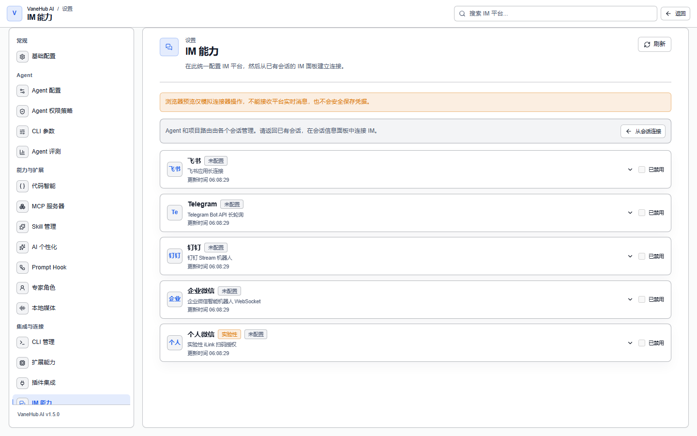
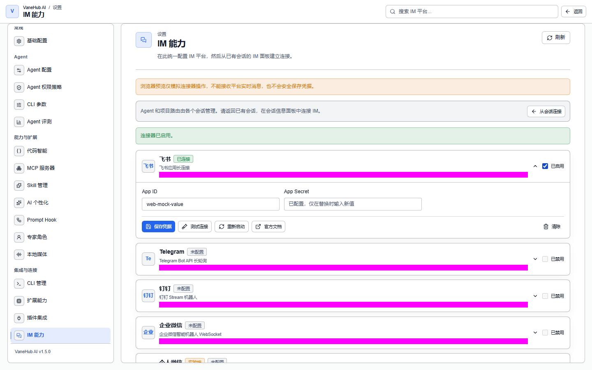

# IM 连接器

把 VaneHub AI 接到飞书、Telegram、钉钉、企业微信或个人微信，从聊天里触发会话。

**首版只有文本单聊能触发执行**——群组消息与非文本内容会被确认，但不会创建会话，也不会触发 Agent 生成。

SSH 远程工作区见[远程工作区与 SSH](remote-workspaces.md)。

## 支持的平台

**设置 → IM 能力**中可配置五种连接器：

| 连接器 | 接入方式 | 状态 |
| --- | --- | --- |
| **飞书** | 飞书应用长连接 | — |
| **Telegram** | Telegram Bot API 长轮询 | — |
| **钉钉** | 钉钉 Stream 机器人 | — |
| **企业微信** | 企业微信智能机器人 WebSocket | — |
| **个人微信** | iLink 扫码授权 | **实验性** |

配置前需要先在对应开放平台创建应用并获取凭据。

## 先配默认路由

**这是启用任何连接器的前置条件**，界面上写得很直接：**「启用任意连接器前必须完成此配置。」**

在**默认路由**区设置两项并保存：

| 字段 | 说明 |
| --- | --- |
| **默认 Agent** | 从可用的 CLI Agent 中选 |
| **默认项目** | 项目目录 |

新的外部聊天会用这两个默认值创建独立会话；**已有的绑定不受影响**。没配好就去启用连接器，界面会提示你先配置并保存。

## 配置连接器

填入应用凭据即可。**标记为机密的字段保存后不再回显**——它们存在系统密钥链里，界面上只保留引用。

微信需要走扫码授权流程，界面会展示二维码并轮询状态。状态包括：等待扫码 → 已扫码 → 已确认。**「已扫码」与「已确认」是分开的**，扫了码但没在手机上点确认时界面会提示你。

## 连接状态

启用成功后，连接器会显示**已连接**徽标与更新时间。

连接器有七种状态，其中两种容易混淆：

- **授权已过期**——可预期的正常情况，重新授权即可
- **错误**——网络或配置故障

两者分开显示，不会混为一谈。

## 从 IM 触发的会话

**首版只有文本单聊能触发执行。** 每个连接器只接受文本形式的直接消息（私聊）；群组消息与非文本内容会被确认或消费，但不会创建会话，也不会触发 Agent 生成。所以在群里 @ 机器人不会让它干活——需要在与机器人的单聊里发文本。

由连接器创建的会话会被标记来源，与你在桌面手工创建的会话区分开。执行追踪里也会记录是哪个连接器触发的。

## 注意事项与限制

- **仅桌面端可用**，依赖原生网络栈与系统凭据存储。
- **必须先配置默认路由**，否则任何连接器都无法启用。
- **个人微信标注为实验性**——走 iLink 扫码授权，稳定性预期低于其余四个。
- **连接器需要各平台的应用凭据**，需先在对应开放平台创建应用。
- **IM 侧能力受形态限制**——文件浏览、终端交互这类桌面专属视图在 IM 里用不了。
- 连接器会话**不能被激活为当前桌面会话**。
