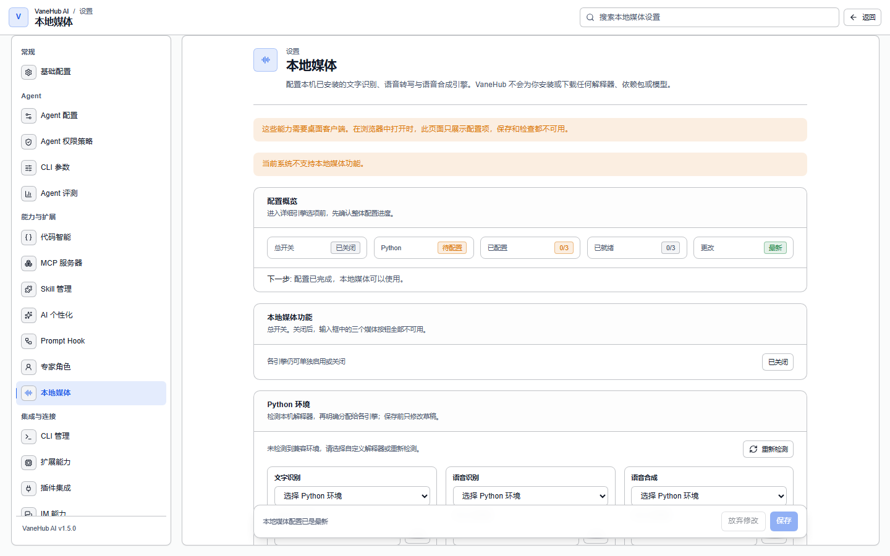

# 本地媒体:OCR、语音识别与语音合成

VaneHub AI 能从图片里读出文字、把你说的话转成文本、再把文本读出来——**全部在你自己的机器上完成**。没有云端 OCR,没有托管转写,也没有托管语音。入口在**设置 → 本地媒体**。

本章讲三个引擎的配置与使用。框架本身的安装见[工具与扩展 → 扩展能力](tooling.md#扩展能力)。

## 哪些由你提供,以及应用不会做什么

**VaneHub AI 绝不替你下载、复制、移动或重命名任何模型**。Python 环境和模型文件由你安装,你把配置指向它们,应用只按你给的路径只读加载。

这是刻意的约束,不是功能缺失。由此有三条推论:

- **没有自动安装**。没配模型的引擎会一直停在「待配置」,直到你去配。
- **没有云端兜底**。本地引擎跑不起来时,操作直接失败并给出原因,不会把任何东西悄悄发到别处。
- **路径不对时由你去搬文件**。应用会告诉你是哪个字段出问题,然后就停在那里。它不会为了绕开问题去移动、复制、硬链接、junction、转短路径、重命名或下载任何东西。

## 三个引擎

每个引擎各自独立配置与启用。打开语音识别不会连带打开 OCR。

| 能力 | 引擎 | 需要你提供什么 |
| --- | --- | --- |
| **OCR** —— 从图片与 PDF 中提取文字 | PaddleOCR | 一个 Python 环境与 PaddleOCR 模型目录 |
| **语音识别** —— 把你的声音转成文字 | faster-whisper | 一个 Python 环境与一个 faster-whisper 模型 |
| **语音合成** —— 把文本读出来 | sherpa-onnx | 一个 sherpa-onnx 语音模型 |

配置**默认关闭且未配置**,每次保存都带版本。一次操作始终针对它启动时那份不可变的配置快照运行,所以中途改设置不会改变一个已经在跑的结果的含义。

## 就绪状态

每个引擎独立报告自己的就绪状态,与另外两个无关:

| 状态 | 含义 |
| --- | --- |
| **已关闭** | 你还没打开这个引擎 |
| **待配置** | 已打开,但某个必需的路径或模型还没设置 |
| **检查中** | 正在跑探测 |
| **可用** | 一次真实推理成功,引擎确实能跑 |
| **不可用** | 探测失败,附带分类过的原因 |
| **需重新检查** | 配置改动已停掉用旧版本的 worker,要再检查一次才能重建就绪 |

**「可用」意味着真的跑过一次推理,而不是模型加载成功**。探测会执行一次最小的真实推理;如果模型加载成功却执行失败,它报告的是「不可用」。这个区分很要紧:一个能接受模型却跑不动计算图的运行时,在只做加载的检查里看起来完全健康,而这种失败原本会拖到你工作到一半时才以操作失败的形式暴露出来。

## 怎么用

**语音转文字**。在输入栏按住麦克风控件,说话,松开。松开即结束录音并启动一次本地转写,转写结果落到输入栏,发送前你还可以编辑。全应用同时只允许一路录音,而且音频始终不离开原生侧——采样在 Rust 里完成,字节从不经过界面层。

**OCR**。在输入栏选择一个受支持的图片或 PDF。页序与阅读顺序会被保留,结果以带来源信息的结构化文本返回,而不是一整团不分段的文字。

**文字转语音**。合成结果通过原生输出设备播放。同时只有一路本地媒体播放,所以第二次请求会替换而不是叠加第一次。

## ASCII 之外的模型路径

**这是 Windows 上最容易踩的一个坑**。含非 ASCII 字符的路径——如果你的 Windows 用户名不是 ASCII,拿到的就是这种路径——宿主完全能正确解析,而引擎自己的原生代码却可能打不开它,因为引擎是按活动代码页去读的。

VaneHub AI 不会一刀切地拒绝这类路径;底层运行时支持到哪里,它就支持到哪里。它做的是:**逐字段**记录路径是否含空格、是否含非 ASCII 字符,并且**在把该引擎报成「可用」之前,用一次真实的 canary 推理去验证任何非 ASCII 路径**。这样,打不开你模型目录的引擎会在配置时就告诉你,而不是等到使用时。

如果某个路径确实不兼容,解决办法是你自己把模型文件挪到 ASCII 路径下。应用会指明是哪个字段,但不会替你挪任何东西。

## 加速,以及为什么不会静默降级

PaddleOCR 的 CPU 加速是可显式控制的。当操作以 `PADDLE_ONEDNN_MODEL_INCOMPATIBLE` 失败时,应用会提议关闭加速并重新探测——**并且只有在你确认之后才应用这个改动**。它不会自动重试,不会自动降级,也不会不问就改你已保存的配置。

同一条原则也管着执行提供者:**失败的推理绝不会在没有显式保存配置变更的情况下,换一个提供者、设备或加速模式重试**。每个结果都可归因到它自己操作快照里记录的那个模式——这才是结果可复现,而不只是看起来合理。

## 隐私

- **敏感内容不进日志**。原始媒体、OCR 文本、转写结果、合成文本、完整本地路径、协议帧与原始 Python traceback,都被排除在日志、操作标签、遥测与崩溃报告之外。
- **工作文件是临时的**。暂存的输入、录音、准入的 OCR 文件与生成的语音,都以不透明的文件名存放在应用自有的本地媒体目录下,并在成功、失败、取消三种情况下一律删除。
- **worker 只在离线运行**。它们拿到的是显式的本地模型路径与离线环境配置;这里根本不存在能连到网络服务的适配器,即使配了也没有。

## 注意事项与限制

- **仅桌面端可用**,且 OCR 与语音识别依赖本地 Python 环境。
- **引擎彼此独立**。OCR 显示「不可用」并不说明语音识别有问题。
- **取消是有界且隔离的**——取消一个操作不会干扰另一个正在跑的操作。
- **本版本的转写只返回最终结果**,附带有界的语言与时长元数据,没有部分结果或流式转写。
- **模型获取归你负责**。框架安装路径与磁盘占用见[工具与扩展](tooling.md#扩展能力)。

## 相关

- 安装框架 → [工具与扩展](tooling.md#扩展能力)
- 操作失败记录在哪 → [可观测性](observability.md)
- 某个引擎报「不可用」但看不出原因 → [故障排查](troubleshooting.md)
