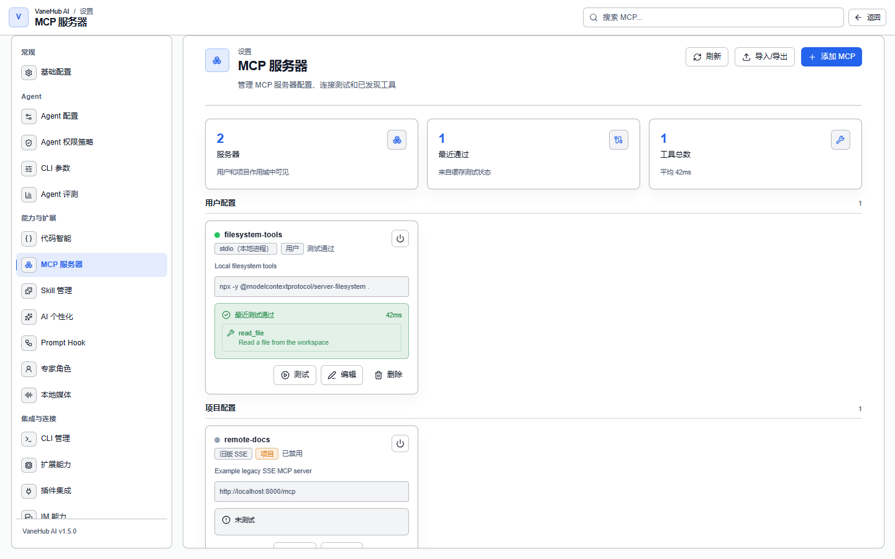

# MCP 服务器：给 Agent 接上外部工具

**状态：已实现——仅桌面端真实连接；Web/mock 通过同一套服务与事件契约模拟，不建立真实连接。**

## 什么是 MCP

**MCP（Model Context Protocol）是让 Agent 调用外部工具的标准协议。**

Agent 本身只有内置的那几样能力——跑命令、读写文件、搜索、记忆。想让它查数据库、调内部 API、操作设计稿，就得接一个 MCP 服务器进来，由那个服务器把自己的工具暴露给 Agent。

**在 VaneHub AI 里注册一次，就能按 Agent 下发**，不必在每个 CLI 的配置文件里各写一遍。这是它存在的主要理由：五个 Agent 各有各的配置格式和位置，手工同步迟早漂移。

## 它能做什么

- **集中注册**外部工具服务器，按用户或项目作用域隔离
- **测试连接**并列出发现到的工具，验证配好了再交给 Agent
- **把统一注册的服务器转发给外部 CLI**（中继），省掉重复配置
- **导入导出** Claude Desktop 格式的配置，迁移已有设置
- 让 MCP 工具调用**逐次经过你的批准**，而不是配好就放开

它不能做的：**不能替你写各 CLI 自己的配置文件**（绑定通过启动参数与中继实现），**不能保证所有 Agent 都能用同一套**（见下面的中继范围）。

## 一个服务器配置由什么组成

| 字段 | 说明 |
| --- | --- |
| **名称** | **全局唯一的 kebab-case**，见下面的命名规则 |
| **传输方式** | `stdio`、旧版 `sse`、或 `streamable_http` |
| 传输相关字段 | stdio 要启动命令；两种 URL 传输要 URL |
| 描述 | 可选说明 |
| 启用标志 | 是否参与下发 |
| 作用域 | 用户配置 / 项目配置 |
| 项目路径 | 项目作用域时的归属目录 |

### 三种传输方式

| 传输方式 | 必填 | 适用 |
| --- | --- | --- |
| **stdio（本地进程）** | 启动命令 | 本机可执行的服务器 |
| **旧版 SSE** | URL | 早期 MCP 的 SSE 端点 |
| **Streamable HTTP** | URL | 当前的 HTTP 流式协议 |

**传输方式必须显式声明**。配置、导入条目或数据库行里出现无法识别的传输值时会被拒绝，**绝不会被悄悄当成 `stdio`** ——那样会用错协议连上去，症状是连得上却什么都不对。

### 命名规则比你以为的严格

名称必须是 kebab-case，下列情形一律被拒绝：**空名、大写字母、空格、下划线、首尾连字符**。

**重名判定跨所有作用域**：一个名字在任何作用域里已被占用，就不能在别处再用——创建、导入、重命名都一样，且**不会覆盖已有配置**，而是拒绝或跳过。

## 注册与测试

在**设置 → MCP 服务器**中点**添加 MCP** 新建。配置按作用域分成**用户配置**与**项目配置**两组展示。

每个服务器卡片可**测试**连接。测试通过后会列出发现到的工具与耗时。状态有四种：

| 状态 | 含义 |
| --- | --- |
| **测试通过** | 最近一次测试连上了 |
| **测试失败** | 最近一次测试失败，附错误信息 |
| **未测试** | 还没测过——**不代表不可用** |
| **已禁用** | 你主动关的，与测试失败是两回事 |

**这四种状态读的是缓存，不是实时连接**。测试结果（状态、发现的工具、错误信息、连接时间、耗时）持久化在本地数据库里；界面查状态时**不会启动进程、不会开网络连接**。所以你看到的是「上次测试的结论」，不是「此刻通不通」。

禁用一个服务器时，**上次的测试详情仍然保留**供你查看。

## 导入导出

支持 Claude Desktop 格式的**导入/导出**。导入时的类型判定规则界面上有说明：

- 显式 `type=sse` → 导入为旧版 SSE
- `type=http`、`streamable_http`、以及**未声明类型的 URL** → 导入为 Streamable HTTP

## 中继：让外部 CLI 也用上同一套 MCP

VaneHub AI 可以把统一注册的 MCP 服务器转发给外部 CLI，这样你不用在 CLI 里重复配置。

> **中继目前只对 Claude Code 与 Codex CLI 启用**。Gemini CLI、OpenCode 与 Antigravity CLI 需要各自配置，且它们的 MCP 调用不会出现在执行链路中。

中继是**显式开启、按次调用生效**的：它转发 MCP 协议而**不改写你的全局 provider 配置**，并记录关联的代理请求生命周期。

关闭中继或 provider 不支持按次配置时，Agent 照常沿既有路径执行，只是 MCP 可见度会降为**推断**或**不可见**，而不是**代理**。换句话说：**中继换来的是可观测性，不是能力**——见[可观测性](observability.md)里的保真度说明。

## 每一次 MCP 工具调用都要你批准

**这是 MCP 最重要的一条安全设计：MCP 来源的工具调用一律需要显式批准，没有自动放行的路径。**

模型请求任何 MCP 工具时——不论哪个服务器、哪个工具——工具循环会暂停，等你批准或拒绝。

你拒绝时，系统**不会连接那台 MCP 服务器、不会调用那个工具**，并把「被拒绝」作为工具结果回报给模型，与被拒绝的 shell / 文件调用一致。

另有一条调用时的复核：**目标服务器的可见性在连接前会重新校验**。即使它出现在本次生成早先给出的工具目录里，只要此刻对当前会话的工作区不可见或未启用（比如它是另一个项目的项目作用域服务器），调用就会以错误告终，**不会尝试连接**。

## 资源上限

上限在前端契约校验与原生运行时**两侧同时执行**，以后端为准。

| 对象 | 上限 |
| --- | --- |
| 单个服务器配置 | 128 个参数 / 128 个环境变量 / 128 个 header；序列化传输配置 256 KiB |
| 单帧协议输入 | JSON-RPC 帧、SSE 事件、HTTP 响应体各 2 MiB |
| 单服务器工具目录 | 128 个工具 / 2 MiB 序列化数据；工具名 256 字节；描述 8 KiB；单个输入 schema 128 KiB 且不超过 32 层 |

超限一律以安全码 `limit_exceeded` 拒绝，且**在持久化或启动服务器之前**就拒掉。协议输入超限时传输层会在「上限加一」处停止读取并做有界清理。

**工具目录超限时不会覆盖该服务器已缓存的目录**——宁可用旧的，也不让一个畸形响应把好数据冲掉。

某个服务器的缓存目录损坏或超限时，**只排除那一个服务器的工具**并发一条有界诊断，其余服务器照常处理，而不是让整个可见目录失败。

## 注意事项与限制

- **环境变量与 header 以明文存储**。它们以明文 JSON 落在本地数据库里，**导出时也是明文**。请据此判断要不要把长期凭据放进来。
- **状态是缓存的**，不代表此刻的连通性；要确认请重新测试。
- **中继只覆盖 Claude Code 与 Codex CLI**，其余三个 CLI 需各自配置且调用不进执行链路。
- **每次 MCP 工具调用都要批准**，没有「信任此服务器」这类免批开关。
- **名称全局唯一且格式受限**，重名不会覆盖而是被拒。
- **Web/mock 不建立真实连接**，它用同一套事件契约模拟至少一次 MCP 工具调用与结果，超限时返回相同的 `limit_exceeded`，且不会声称启动了进程或网络连接。

## 相关

- 其余工具与扩展配置 → [工具与扩展](tooling.md)
- 批准流程与作用域记忆 → [权限审批](permissions.md)
- 中继调用在链路里的保真度 → [可观测性](observability.md)
