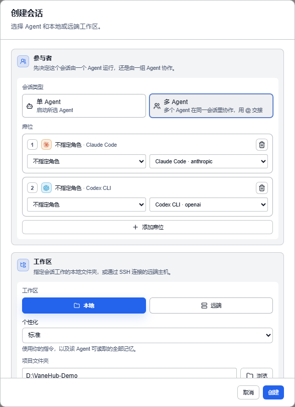
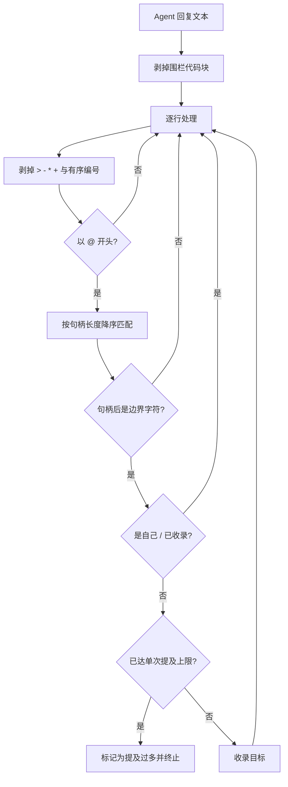
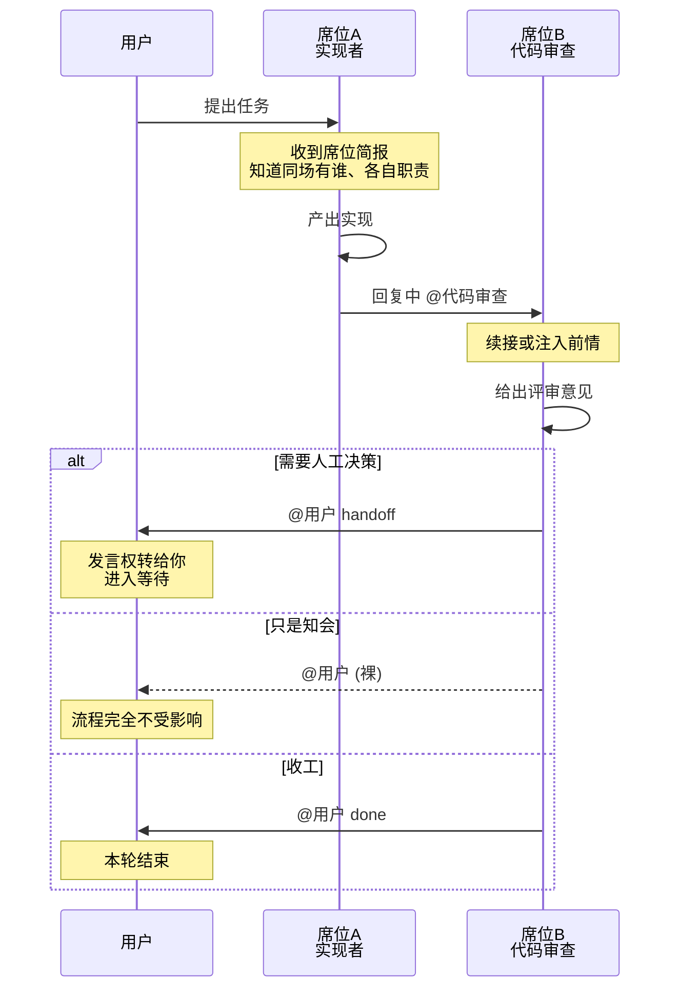

# 多 Agent 群聊

## 什么是多 Agent

**单 Agent 会话**里只有一个执行主体：你提需求，它干。**多 Agent 会话**（群聊）在一个会话里放进多个执行主体，它们共享同一条对话线索，按需把发言权交给同伴。

一个会话可以容纳多个 **席位（Seat）**。每个席位是「一个 Agent + 一个专家角色」的组合，所有席位读同一条共享对话线索。Agent 在回复中用 `@` 点名，把发言权交给下一位，也可以交还给你。

**它解决的是**「多个 Agent 协作时，上下文要手工搬来搬去」的问题。

**能做什么**：

- **角色分工**——让不同 Agent 各司其职（架构师定方案、实现者写代码、审查者把关），上下文不用你手工搬
- **跨模型族协作**——让 Anthropic、OpenAI、Google 等不同厂商的 Agent 在一个任务里接力，互相补盲区
- **多视角评审**——一个 Agent 产出，另一个不同模型族的 Agent 复审，避开单一模型的盲点
- **交还人类**——Agent 在关键节点用 `@用户` 把决定权交回给你

**群聊是单 Agent 会话的超集**：单 Agent 会话的席位没有分配角色，不派生句柄、不参与交接；一个只有一个席位的「群聊」在行为上等同于单 Agent 会话。

> **多 Agent 的运行时能力仅桌面端可用**。席位分配、发言人标注这类展示层在两种运行时里都有，但句柄派生、`@` 交接、代码块豁免、席位简报、链路防失控、模型族识别全部依赖桌面运行时。Web/mock 里看到的不构成本机事实。

> **关于 A2A 协议**：业界有 Google 提出的 A2A（Agent-to-Agent）跨网络标准协议（JSON-RPC、AgentCard）。VaneHub AI **没有实现 A2A 协议**——这里的"Agent 交接"是同进程内基于回复文本中 `@` 提及的对等交接（OpenAI Swarm 风格），不涉及跨 Agent 的网络协议。两者只是都叫"交接"，机制完全不同。

## 快速上手

### 1. 分配席位

1. 打开 VaneHub AI，选择**新建**。
2. **会话类型**选**多 Agent**，在席位区为每个要参与的 Agent 添加一个席位。
3. 为每个席位指定**专家角色**。角色名会派生出其他席位 `@` 时使用的**句柄**。
4. 选择项目目录，填写会话标题，创建会话。

内置三个专家角色可直接使用，也可以在**设置 → 专家角色**中自建，见[专家角色](expert-roles.md)。

### 2. 在对话中交接

输入 `@` 触发席位补全，选择目标席位句柄。当前发言权归属显示在**轮次状态栏**。

**两件事先记住**，其余机制可以边用边看：

- **`@` 必须写在行首**——句中提及不路由。
- **贴代码不必担心误触发**，围栏代码块内的 `@` 会被跳过。

### 3. 查看与切换席位

右侧信息面板的**会话成员**区列出当前阵容与已离席成员；会话工作区提供席位切换器；每条消息标注「角色名 · Agent 名称」。

想直接走一遍可复现的验收流程，见[群聊协作案例](multi-agent-testing-tutorial.md)。

## 席位与句柄

**一个席位 = 一个 Agent + 一个可选的专家角色**。席位身份是稳定的，不由排列顺序决定，所以运行中的会话可以增删席位而不影响已参与者的身份和历史。新加入的席位从下一轮起可被点名，并在其上下文预算内拿到此前的线索。

**句柄由角色名自动生成**，三条规则：

| 规则 | 处理 | 理由 |
|---|---|---|
| 空白折叠为 `-` | `代码 审查` → `代码-审查` | 句柄跟在 `@` 后输入，**空白会截断 token** |
| 空名兜底 | 第 n 个席位 → `席位n` | 角色名缺失时仍要可寻址 |
| 重名加后缀 | 第二个 `评审` → `评审-2` | **一个会话坐两个「评审」是合理阵容**，重名该区分而不是拒绝 |

## `@` 交接怎么被识别

### 五条防御

**1. 围栏代码块内的 `@` 不算数**。Agent 贴一段含 `@reviewer` 的示例代码，不应该真的触发交接。

**2. 引用与列表标记不影响识别**：`>`、`-`、`*`、`+` 以及有序列表编号都会被剥掉——**Agent 写清单时仍然是在对人说话**。

**3. 长句柄优先匹配**：若同时存在 `opus` 与 `opus-45` 两个句柄，短的会先匹配上、把长的吃掉。降序匹配消除了这个歧义。

**4. 句柄后必须是边界字符**：`@opus45` 不会匹配到 `opus`。边界字符涵盖中英文标点。

**5. 自我提及与重复提及被跳过**：Agent 不能把发言权交给自己，同一目标提两次只算一次。

### 两个硬上限

| 上限 | 值 | 管的是 |
|---|---|---|
| 交接链深度 | **15** | 一条交接链最多传几手 |
| 单次回复提及数 | **2** | 单次回复最多提及几个席位 |

**每回复 2 个提及是很紧的限制**——它把「广播式点名」直接排除掉了。会话界面上的 `交接 1/15` 显示的就是链深计数。

触及任一上限时会终止，并**显式说明是哪一种原因**，不会让链路悄悄停下。

**正常结束不是失败**：链路自然耗尽提及而结束时不会报告任何终止原因。把两者混为一谈会让每一次正常结束都看起来像出错。

## 交回人类

**句柄是 `@用户`**，意图由后面的词决定，大小写不敏感：

| 写法 | 意图 | 效果 |
|---|---|---|
| `@用户 handoff …` | 需要你接手 | 发言权转给你，进入等待，本轮**不结束** |
| `@用户 done …` | 任务完成 | 发言权转给你，本轮**结束** |
| `@用户`（其余任何形式） | 只是知会 | **发言权不转移、本轮不结束、不进入等待** |

**裸 `@用户` 默认是「知会」而非「打断」**。理由很直接：一个不带意图的裸提及是信息性的，不是阻塞性的。**默认阻塞会惩罚 Agent「提到人类」这个行为本身，它会学会不再提**——而这恰恰是三种意图想避免的可见性损失。

`Handoff` 与 `Done` 的差别在于本轮是否结束：前者把球交给你但对话继续，后者宣告收工。

> **`@用户` 不随界面语言本地化**。界面切到 English / 日本語 / 한국어 时，交回人类**仍然要写 `@用户`**——`@user` 不会被识别。而意图关键词又是英文的（`handoff` / `done`），所以完整写法是中英混合的 `@用户 handoff`。

## 席位简报

**每个席位在发言前拿到一份同场名单**，包含每位的句柄、角色名、Agent 名、模型族、职责与指令。

**这份简报是 Agent 学习协作规则的唯一渠道**，所以它的措辞是行为而非文档：Agent 不知道「行首规则」就会把句柄写在句中，而**句中提及不路由**。

其中**职责是必填的**——它就是其他 Agent 判断「该把话交给谁」的依据，见[专家角色](expert-roles.md)。

## 模型族与跨族评审

| Agent | 模型族 |
|---|---|
| Claude Code | Anthropic |
| Codex CLI | OpenAI |
| Gemini CLI | Google |
| Antigravity CLI | Google |
| **OpenCode** | **未知** |

判定依据是**稳定的 agent 标识而非显示名称**，改个显示名不会改变结果。

**OpenCode 被明确判为「未知」而不是猜一个**：它驱动的是你自己配置的任意模型，因此没有固定的模型族。**声称它属于某一族，会让跨族评审检查建立在错误前提上**。这直接关系到专家角色的「推荐时优先选择不同模型族的席位」策略，见[专家角色 → 评审策略](expert-roles.md#评审策略)。

## 席位怎么拿到前情

两种方式：

| 方式 | 含义 |
|---|---|
| 续接 | 该 Agent 自己的会话已经持有历史，**不注入任何内容** |
| 注入 | 把此前的共享线索注入给它 |

**续接避免了重复注入**：CLI Agent 自己的会话文件里已有历史，再注入一遍既浪费 token 又可能造成上下文错乱。注入时保留**最近的轮次**——最新的交换是席位被要求处理的内容，最旧的往往能从项目本身恢复。

## 一轮交接的流转

## 案例：架构师 → 实现者 → 审查者接力

一个跨模型族协作的典型流程，走完一轮交接。

**目标**：给一个模块加单元测试并保证通过。

1. **创建多 Agent 会话**，分配三个席位：
   - **架构师**（Claude Code）——定测试策略与覆盖范围
   - **实现者**（Codex CLI）——按策略补测试代码
   - **审查者**（Gemini CLI，与实现者不同模型族）——复审并跑测试
2. 你发起任务：「为 `src/auth` 补充单元测试，覆盖登录失败分支」。
3. **架构师**产出测试策略，行首 `@实现者` 把发言权交出去。
4. **实现者**按策略写测试，行首 `@审查者` 请其复审。
5. **审查者**复审并提出修改意见；若不通过，`@实现者` 让其修改后再交回。
6. 测试全绿后，**审查者**行首 `@用户 done` 交还给你并结束本轮。
7. 你验收结果。

**这条链里发生了什么**：三个不同模型族的 Agent 在同一上下文里接力，没人需要你把上一轮对话复制粘贴过去——共享对话线索加席位简报，让每个在场者都知道前面发生了什么。链深计数 `交接 1/15` 实时显示，触顶会显式终止而非失控。

> 想走一遍带验收检查的可复现流程，见[群聊协作案例](multi-agent-testing-tutorial.md)。

## 群聊 vs Loop 工程化

VaneHub AI 里有两种多 Agent 协作形态，**不共用编排逻辑**：

| 维度 | 群聊（本章） | [Loop 工程化](loop-engineering.md) |
|---|---|---|
| 谁决定下一位 | Agent 自己 `@` | 运行时按阶段推进 |
| 触发方式 | 回复中的行首 `@` | 目标驱动的自动循环 |
| 终止 | 提及耗尽 / 深度上限 / `@用户 done` | 阶段完成 / 无进展检测 |
| 适合 | 探索性、角色分工的协作 | 目标明确、可自动迭代的任务 |

## 多 Agent 拓扑：VaneHub 落在哪一格

多 Agent 系统按**谁决定下一步**分类，业界主流的七种拓扑：

| 拓扑 | 结构 | 控制方式 | 典型代表 | VaneHub |
|---|---|---|---|---|
| **Sequential / Pipeline** | 链式 | 静态 | Plan→Code→Review、ETL 式流程 | **[Loop](loop-engineering.md) 采用** |
| **Parallel / Fan-out-Fan-in** | 星型并发 | 静态 | 多源检索、并行子任务、Best-of-N | 未实现 |
| **Supervisor / Orchestrator-Worker** | 中心化单层 | 中心节点路由 | LangGraph Supervisor、CrewAI | **明确不采用** |
| **Hierarchical** | 树状多层 | 逐层分解 | Supervisor of Supervisors | 未实现 |
| **Network / Peer-to-peer（Handoff）** | 图状去中心 | Agent 自行移交 | OpenAI Swarm、Agents SDK handoff | **群聊采用** |
| **Group Chat / Blackboard** | 共享消息池 | 发言权调度器 | AutoGen GroupChat、黑板模型 | **部分采用**，见下 |
| **Market / Contract Net** | 竞价撮合 | 招标-投标-中标 | 经典 MAS，LLM 领域少见 | 未实现 |

### 群聊是「共享消息池 + 对等交接」的混合

它同时借了两格的东西，但**去掉了调度器**：

- **像 Blackboard**：所有席位读同一条共享对话线索，没有私有信道
- **像 Peer-to-peer**：下一位由**当前发言的 Agent 自己 `@`**，不存在一个决定谁发言的中心节点

所以严格说它不是教科书式的 Group Chat——AutoGen 的 GroupChat 有一个 manager 负责选下一个发言者，而这里没有。**共享的是上下文，不是调度权**。

Loop 则落在 Pipeline 那一格：阶段顺序固定（准备 → 执行 → 验证 → 决策 → 收尾），角色分工固定（执行者 → 验证者），**由运行时静态推进**。它不是多 Agent 自由协作，而是两个角色跑一条流水线。**这就是两套机制不共用编排逻辑的根本原因**——它们在分类轴上根本不是同一格。

### 为什么不做 Supervisor

Supervisor 模式要求一个 Agent 充当调度器，它会消耗 token 且引入单点故障；依赖图（DAG）模式需要预先定义协作流程，不适合探索性任务。

对等交接让每个 Agent 读同一份上下文后自行判断该交给谁，更接近真实团队里「谁擅长这个就 @ 谁」的协作方式。

**代价是可预测性**：链路走向由 Agent 自主决定，所以需要深度与提及数两道硬上限兜底。这与 Supervisor 模式「调度器决定何时停」是不同的可控性取舍——**换来的是灵活性，付出的是需要外部限额兜底**。

> 早期设计的**依赖图协调（DAG）运行时已被移除**，由对等交接群聊取代。

## 边界与限制

- **多 Agent 执行依赖桌面端运行时**。
- **共享线索不等于共享会话**。各 Agent 在自己的会话里仍保有各自历史，VaneHub AI 不会合并它们的原生会话文件。
- **OpenCode 没有固定的模型族**。「要求评审来自不同模型族」这类策略对它不生效。
- **句柄来自角色名**。未分配角色的席位不具备可被 `@` 的稳定句柄。
- **`@` 必须在行首**，句中提及不路由。
- **`@用户` 不随界面语言本地化**。切到英文/日文界面仍需写 `@用户`。
- **群聊与 Loop 是两套机制**，不共用编排逻辑。

## 相关

- 实现细节、源码位置与设计取舍 → [《开发者指南》的多 Agent 群聊一章](../../../developer-guide/zh-CN/src/multi-agent-group-chat.md)
- 走一遍验收流程 → [群聊协作案例](multi-agent-testing-tutorial.md)
- 专家角色与评审策略 → [专家角色](expert-roles.md)
